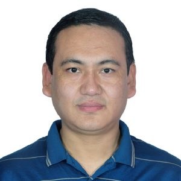

# Large Language Models : A Hands on Approach

Jan - May, 2026 @ [Center for Continuing Education](https://cce.iisc.ac.in/), [Indian Institute of Science](https://iisc.ac.in/)

## Logistics

- **Duration**: 18 weeks (Jan - May 2026)
- **Format**: Online, Tue and Thu, 7:00 - 8:30 PM IST
- **Contact**: [Yoginder Negi](https://yknegi.github.io), Senior Scientific Officer (yoginder@iisc.ac.in)

## Registration

To register please visit [**CCE Webpage for the course**](https://cce.iisc.ac.in/cce-proficience/large-language-modelsa-hands-on-approach-jm-2026/).

## Course Description

    
LLMs have become mainstay of NLP and are transforming every domain, from software development, research, and business intelligence to education. However, deploying them efficiently remains a specialized engineering challenge.

    
This course provides an <strong>engineering-focused exploration</strong> of Large Language Models (LLMs). Participants will go from understanding transformer architectures and GPU internals to mastering fine-tuning, inference optimization, and large-scale deployment across GPUs, clusters, and edge devices. Through a theory-to-practice approach, including case studies, hands-on labs, and projects, learners will cover key topics such as model architecture, fine-tuning techniques, inference optimization, serving strategies, and applications in retrieval-augmented generation (RAG) and agentic systems.

## Learning Outcomes

    
By the end of this course, participants will be able to:

    <ul>
        <li><strong>Understand LLM Architecture</strong>: Master transformer architectures, attention mechanisms, and modern LLM variants (GPT-OSS, Qwen, Gemma, etc.).</li>
        <li><strong>Optimize Inference</strong>: Implement efficient inference strategies including quantization, KV caching, and serving via inference engines like vLLM.</li>
        <li><strong>Fine-tune Models</strong>: Apply various fine-tuning techniques including instruction tuning, PEFT techniques like LoRA, QLoRA etc and preference alignment.</li>
        <li><strong>Build RAG Systems</strong>: Design and implement Retrieval-Augmented Generation pipelines.</li>
        <li><strong>Develop AI Agents</strong>: Create tool-using agents with the ReAct framework.</li>
        <li><strong>Deploy at Scale</strong>: Set up production-ready LLM serving infrastructure with cost optimization.</li>
        <li><strong>Multimodal Models</strong>: Work with vision-language models and speech.</li>
        <li><strong>Evaluation</strong>: Understand evaluation strategies for LLMs and RAG systems.</li>
    </ul>

## Prerequisites
- Proficiency in **Python** and familiarity with any deep learning framework (PyTorch preferred).  
- Basic understanding of neural networks.
- Optional but recommended: experience with **GPU computing**.

## Instructors

    
    
<a href="https://yknegi.github.io"><strong>Yoginder Negi</strong></a> - Senior Scientific Officer, SERC, IISc.

    
    
<strong>Bhuthesh R</strong> - Senior Data Scientist, <a href="https://moleculeai.com/team">Molecule AI Pvt Ltd</a>.

## Course Navigation

- [**Weekly Schedule**](schedule.md)

- [**Assignments and Labs**](assignments.md)
