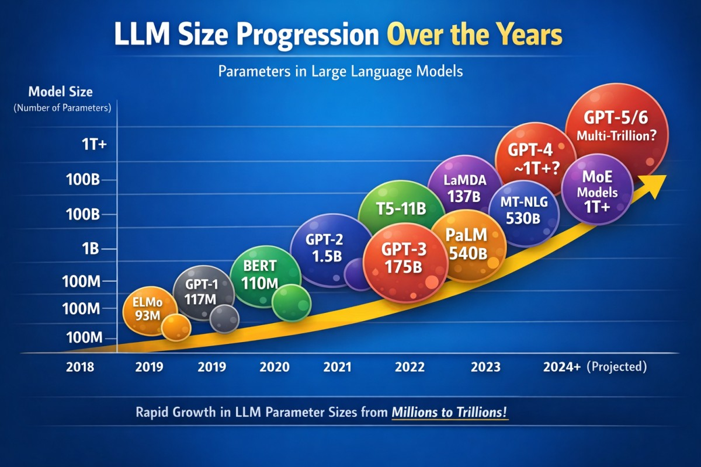
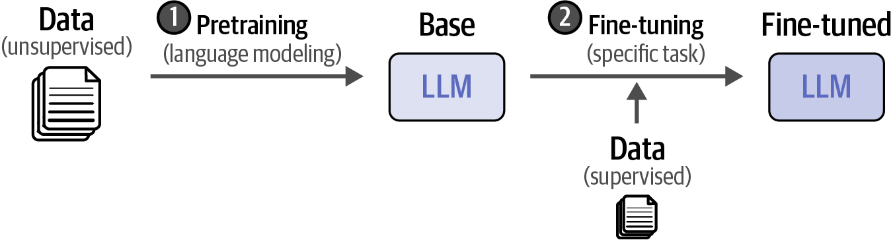

## Large Language Models : A Hands on Approach
### LLM Basics

---

## What is a Large Language Model (LLM)?

A deep neural network trained on extensive text datasets from books, articles, websites—sometimes encompassing large portions of the entire publicly available internet.

---

## LLM Capabilities

- Understanding and generating human language
- Code generation and debugging
- Multimodal data processing (text, images, audio)
- Reasoning and common sense understanding

---

## Language Modeling

A language model predicts the next word given preceding words.

[Image source][1]

---

## Mathematical Definition

Joint probability of a sequence using chain rule:

$$
P(w_1, w_2, \dots, w_T) = \prod_{t=1}^{T} P(w_t \mid w_1, \dots, w_{t-1})
$$

Core objective: learn the conditional probability:

$$
P(w_t \mid w_{<t})
$$

**where**
- $w_t$ — token to be predicted at step $t$
- $w_{<t} = (w_1, \dots, w_{t-1})$ — context of preceding tokens
- $P(w_t \mid w_{<t})$ — probability of next word conditioned on previous words

---

## What Makes LLMs "Large"?

| Aspect | Scale |
|--------|-------|
| **Parameters** | >1B (GPT-3: 175B, Llama 3: 8B-405B) [2] |
| **Training Data** | Trillions of tokens (Llama 3: 15T) [3] |
| **Compute** | Thousands of GPU-hours |

---

## Applications of LLMs

1. **Chatbots & Virtual Assistants** - conversational agents
2. **NLP Tasks** — sentiment analysis, NER, classification
3. **Content Generation** — summarization, translation
4. **Code Generation** — snippets, debugging, automation
5. **Education & Tutoring** — personalized learning
6. **Creative Writing** — ideas, plot twists, poetry
7. **Research Assistance** — paper summarization, literature reviews

---

## Why Build Your Own LLM?

1. **Domain-specific models** — outperform general models (law, medical)
2. **Cost-effectiveness** — cheaper than cloud APIs at scale
3. **Data Privacy** — control over sensitive data
4. **Custom Deployment** — on-premise or edge devices
5. **Autonomy** — control behavior, updates, fixes

---

## Building LLMs: Overview

1. **Data Collection and Preprocessing**
2. **Pretraining**   
3. **Fine-tuning**
4. **Inference**
---

## Course Focus

We will focus on:
- Fine-tuning existing models
- Inference optimization
- Building applications with LLMs

Using state of the art open source models available openly.

---

## Demo

- [Text Generation](https://colab.research.google.com/drive/11p1Tu535Lh3fXZ7m0K-GbX97d1Hm9pmf)
- [Vision-Language Model](https://colab.research.google.com/drive/1jnXR6aKOIyoXMiYeBC_lHxejAvilR64q)

---

## Warm Up Exercise

1. Login to Google Colab
2. Run shared notebooks
3. Explore HuggingFace:
   - Trending models
   - Spaces
   - Datasets

**Reference:** [HuggingFace Tutorial](https://huggingface.co/blog/proflead/hugging-face-tutorial)

---

## References

1. [The Illustrated GPT-2](https://jalammar.github.io/illustrated-gpt2/) - Jay Alammar
2. [GPT-3 Paper](https://arxiv.org/abs/2005.14165) - Brown et al., 2020
3. [Llama 3 Report](https://arxiv.org/abs/2407.21783) - Meta AI, 2024

---

## Thank You

Questions?
