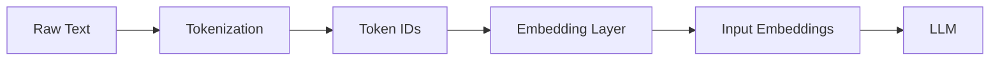
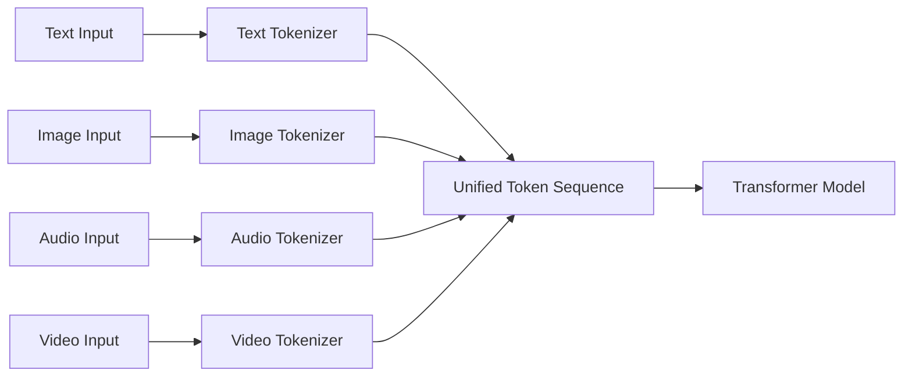

## Large Language Models: A Hands on Approach
### Tokenization

---

## Topics Covered

- Preprocessing text data for LLMs
- Tokenization techniques
- Byte Pair Encoding (BPE)
- Converting tokens into vectors

---

## Models of the Week
### [TranslateGemma](https://blog.google/innovation-and-ai/technology/developers-tools/translategemma/)
- SOTA Open weights multilingual translation model
- Multimodal capabilities: text + images for context
- 4B, 12B and 27B versions

### [MedGemma](https://deepmind.google/models/gemma/medgemma/)
- SOTA Open weights medical imaging and document understanding model
- CT/MRI/Histopathology Processing, Medical Document Understanding, Multi-domain Classification

### [GLM-4.7-Flash](https://huggingface.co/zai-org/GLM-4.7-Flash)
- Coding, Tool use and Reasoning abilities
- 30B-A3B MoE model

---

## Motivation

Why does tokenization matter?

- **Cost**: Billing is per token, not per word
- **Context limits**: Tokenization decides what fits vs what gets truncated
- **Reasoning failures**: Try "Say Nameeee" vs "Say Name eee" in DeepSeek
- **Multilingual bias**: Some languages need more tokens for same meaning

---

## Data Preprocessing Pipeline

 - Cannot feed raw text directly into LLMs. 
 - Need numerical representations.



---

## The Full Pipeline

**Unified Architecture**


---

## What Is Tokenization?

Tokenization breaks text into smaller units called **tokens**.

Tokens can be words, subwords, or characters.

**Example:** "The transformer architecture is revolutionary."

| Approach | Tokens | Count |
|----------|--------|-------|
| Words | `["The", "transformer", "architecture", "is", "revolutionary", "."]` | 6 |
| Characters | `["T", "h", "e", " ", "t", "r", "a", ...]` | 45 |
| Subwords | `["The", " transform", "er", " architecture", " is", " revolution", "ary", "."]` | 8 |

---

## Real World Example: GPT-2 Tokenizer

[Try it yourself](https://platform.openai.com/tokenizer)


---

## Tokenization Pipeline


---

## Tokenization Spectrum

```
Bytes → Characters → Subwords → Words
  ↑                              ↑
 256 tokens                     Millions of tokens
 Long sequences                 Short sequences
```

Trade-off between vocabulary size and sequence length.

---

## Word-Level Tokenization

Split text into words based on spaces and punctuation.

```python
import re
text = "Hello, world. This, is a test."
result = re.split(r'(\s)', text)
# ['Hello,', ' ', 'world.', ' ', 'This,', ' ', 'is', ' ', 'a', ' ', 'test.']
```


---

## Word-Level: Pros and Cons

**Advantages:**
- Short sequences (one token per word)
- Linguistically intuitive
- Fast attention (fewer tokens)

**Disadvantages:**
- Huge vocabulary (English needs 100K+ words)
- OOV problem: Unknown words → `[UNK]`
- Morphological blindness: "run", "runs", "running" are unrelated
- Language-specific: Some languages don't use spaces

---

## Character-Level Tokenization

Split text into individual characters.

**Advantages:**
- No OOV tokens (any text can be encoded)
- Tiny vocabulary (~100-300 tokens)
- Handles typos and neologisms

**Disadvantages:**
- Very long sequences (5-10x longer)
- Slow attention (more tokens)
- Poor semantics (characters lack meaning)
- Harder to learn word structure

---

## Subword Tokenization

The sweet spot: split rare words, keep common words whole.

| Word | Subword Tokens | Interpretation |
|------|----------------|----------------|
| the | `["the"]` | Common → single token |
| transformer | `["trans", "former"]` | Split into known pieces |
| unhappiness | `["un", "happi", "ness"]` | Morphemes preserved |
| GPT-4 | `["G", "PT", "-", "4"]` | Unknown → character fallback |

---

## Popular Subword Algorithms

1. **Byte Pair Encoding (BPE)** - Frequency-based merging
2. **WordPiece** - Probability-based merging (BERT)
3. **SentencePiece** - Unigram language model (LLaMA)

---

## Byte Pair Encoding (BPE)

*Sennrich et al. (2016)*

**Core idea:** Iteratively merge the most frequent pair of tokens.

1. Start with vocabulary of individual characters (or bytes)
2. Count all adjacent pairs in the corpus
3. Merge the most frequent pair into a new token
4. Repeat until reaching desired vocabulary size

---

## BPE Walkthrough

**Input:** "low lower lowest"

**Step 1 - Initialize tokens:**
```
['l', 'o', 'w', ' ', 'l', 'o', 'w', 'e', 'r', ' ', 'l', 'o', 'w', 'e', 's', 't']
```

**Step 2 - Count pairs:**
```
('l', 'o'): 3    ('o', 'w'): 3    ('w', ' '): 3
(' ', 'l'): 2    ('e', 'r'): 1    ('e', 's'): 1
```

--

## BPE Walkthrough (continued)

**Step 3 - Merge most frequent pair** `('l', 'o')` → `'lo'`
```
['lo', 'w', ' ', 'lo', 'w', 'e', 'r', ' ', 'lo', 'w', 'e', 's', 't']
```

**Step 4 - Count pairs again:**
```
('lo', 'w'): 3    ('w', ' '): 3    (' ', 'lo'): 2
```

**Step 5 - Merge** `('lo', 'w')` → `'low'`
```
['low', ' ', 'low', 'e', 'r', ' ', 'low', 'e', 's', 't']
```

--

## BPE Result

**Final tokenization:**
```
"low lower lowest" → ["low", " ", "low", "er", " ", "low", "est"]
```

**Can encode any word:**
```
"lowestness" → ["low", "est", "ness"]
```


---

## BPE: Pros and Cons

**Advantages:**
- Balances vocabulary size and sequence length
- Handles OOV words by breaking into subwords
- Captures morphological structure

**Disadvantages:**
- Greedy algorithm (may not find optimal tokenization)
- Training corpus dependent

---

## Byte-Level BPE (GPT-2 Style)

GPT-2 uses byte-level BPE:

- Start with **256 byte tokens** (not Unicode characters)
- All text is UTF-8 encoded first
- Merges operate on bytes, not characters
- Avoids merges beyond word boundaries

**Advantages:**
- Handles any language without special tokenization
- Works with emojis, rare scripts, binary data
- No `[UNK]` tokens ever needed

---

## Multimodal Tokenization

Modern models tokenize more than text:

- **Text**: Subword tokenization (BPE, WordPiece)
- **Images**: Patch-based (e.g., ViT) - split into 16x16 patches
- **Video**: Frame + patch tokenization
- **Audio**: Spectrogram frames



---

## Vocabulary Size Trade-offs

**Smaller Vocabulary:**
- Faster training and inference
- Lower memory usage
- Longer sequences

**Larger Vocabulary:**
- Shorter sequences
- Better semantic representation
- Higher memory usage

---

## Vocabulary Impact on Parameters

$$
\text{Embedding Matrix} = V \times E
$$

$$
\text{Output Layer} = H \times V
$$

Where $V$ = vocabulary size, $E$ = embedding dimension, $H$ = hidden dimension

---

## Model Vocabulary Comparison

| Model | Vocabulary Size | Tokenizer |
|-------|-----------------|-----------|
| GPT-2 | 50,257 | BPE |
| GPT-4 | ~100,000 | BPE variant |
| BERT | 30,522 | WordPiece |
| LLaMA | 32,000 | SentencePiece |
| Claude | ~100,000 | BPE variant |

---

## References

1. [Let's Build the GPT Tokenizer](https://www.youtube.com/watch?v=zduSFxRajkE) - Andrej Karpathy
2. [The Smol Training Playbook](https://huggingface.co/spaces/HuggingFaceTB/smol-training-playbook#the-tokenizer)
3. [Neural Machine Translation of Rare Words with Subword Units](https://arxiv.org/abs/1508.07909) - Sennrich et al., 2016

---

## Thank You

Questions?
