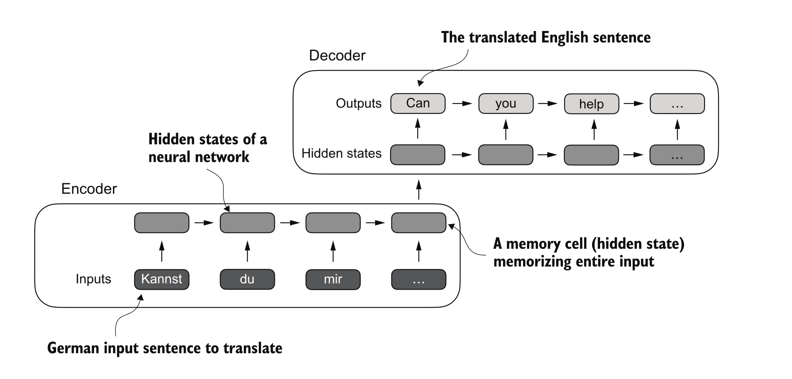
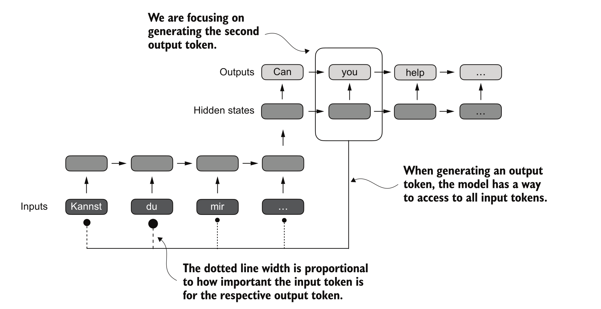
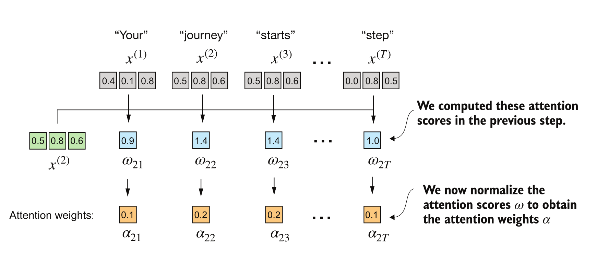
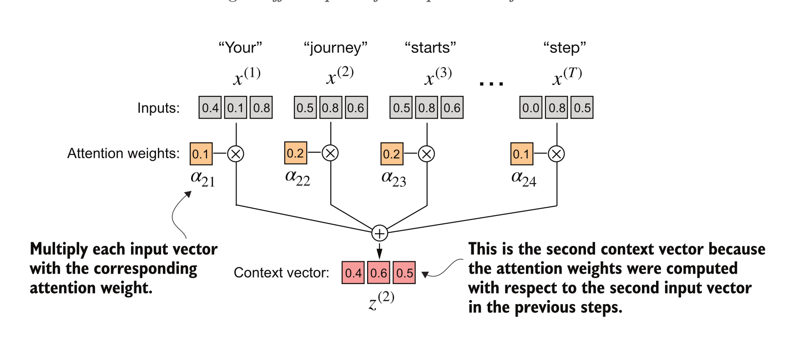
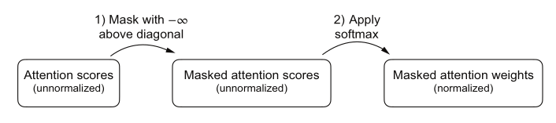
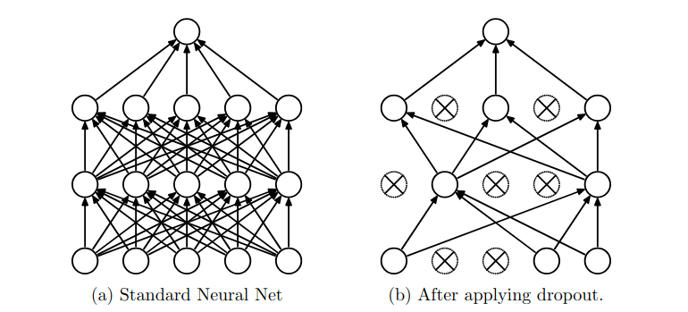
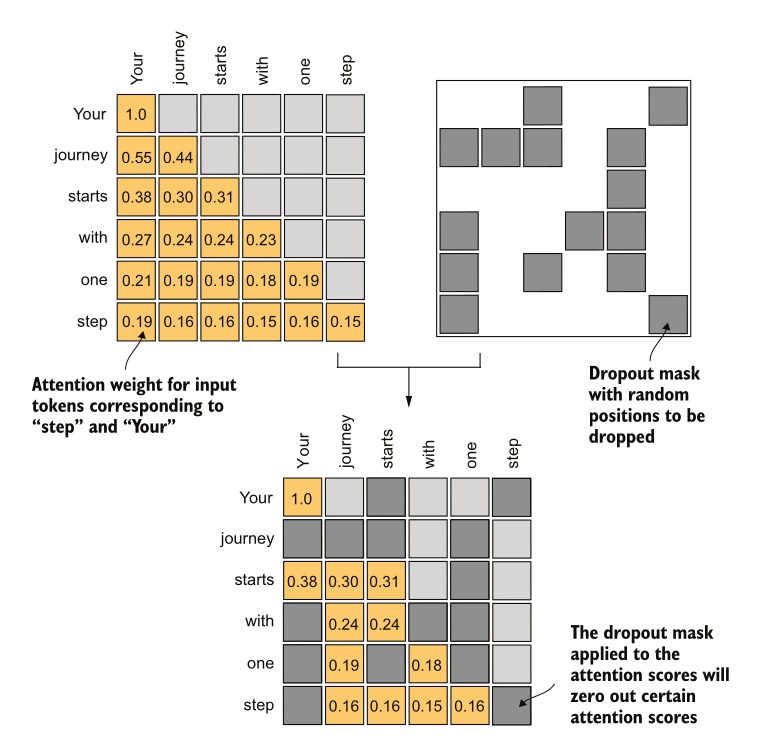

<div class="center-slide">

# Transformers - II

</div>

---


## Topics Covered

- Self-attention mechanism
- Causal Attention
- Multi-head attention

---

## RECAP

- Encoder-Decoder architectures
- Cross attention mechanism between encoder and decoder
- Simple attention mechanism

---

### Sequence Modeling

- Process all input into a hidden state, 
- Pass hidden state to decoder
- Decoder uses hidden state to generate output sequence

 

---

### RNNs + Attention

- Let Decoder access all Encoder hidden states
- Attend to relevant parts of input sequence when generating each output token [Bahdanau et al., 2015]


---

### RNNs + Attention

**Limitations**

- Sequential processing limits parallelization
- Difficulty capturing long-range dependencies

**Solution**: 

- Remove recurrence, process all input tokens simultaneously
- Allow each token in the input to focus on relevant parts of the input

---

### Parallel Processing

- **Encoder** : Process all input tokens simultaneously
- **Decoder** : Generate output tokens one by one, attending to encoder states and previous tokens


---

### Self-Attention Mechanism

- Compute attention **within** the same sequence of tokens. **Self = Same Sequence**
- Get improved representation by **mixing in information** from other tokens **that seem relevant.**


---

### Self-Attention vs Encoder–Decoder Attention

- **Encoder–Decoder**: One sequence attends to a *different* sequence (e.g., translation: output attends to the input sentence).

- **Self-attention**: Sequence attends to **itself** (tokens attending to other tokens in the same sentence).


<div style="display: flex; justify-content: space-between; align-items: center;">
    <div style="flex: 1">
        
    </div>
    <div style="flex: 1">
        
    </div>
</div>

---

###  Self-Attention : Intuition


<div style="text-align: center;">

*"Self-attention is like a group conversation where everyone can hear
everyone else simultaneously, rather than passing notes one by one (RNNs)"*

</div>


---

### Computing attention weights for a single token



Step 1:
- Calculate attention scores dot product of input vectors
- Normalize scores to get attention weights (additive normalization)

```python
attn_weights_2_tmp = attn_scores_2 / attn_scores_2.sum()

def softmax_naive(x):
    return torch.exp(x) / torch.exp(x).sum(dim=0)

attn_weights_2_naive = softmax_naive(attn_scores_2)

attn_weights_2 = torch.softmax(attn_scores_2, dim=0)

```

--

Step 2:
- Compute output vector as weighted sum of value vectors



```python
context_vec_2 = torch.zeros(inputs.shape[1])
for i, x_i in enumerate(inputs):
    context_vec_2 += attn_weights_2[i] * x_i
```

---

### Computing attention weigths for all tokens


```python

attn_scores = torch.zeros(inputs.shape[0], inputs.shape[0])

attn_scores = inputs @ inputs.T
attn_weights = torch.softmax(attn_scores, dim=-1)
output_vectors = attn_weights @ inputs

```

---

### Summary of Self-Attention Mechanism
- Input: sequence of vectors (X) (source)
- Output: sequence of vectors (Z) (context)
- Compute attention scores against all input vectors
- Normalize scores to get attention weights
- Compute output vectors as weighted sum of input vectors

```python
def self_attention(inputs):
    # Step 1: Compute attention scores
    attn_scores = inputs @ inputs.T
    # Step 2: Normalize scores to get attention weights
    attn_weights = torch.softmax(attn_scores, dim=-1)
    # Step 3: Compute output vectors as weighted sum of input vectors
    output_vectors = attn_weights @ inputs
    return output_vectors

```

<div>
</div>

<div style="text-align: center;">

<!-- .element: class="fragment" data-fragment-index="1" -->

**How to improve this basic self-attention mechanism?** <!-- .element: class="fragment" data-fragment-index="2" -->

Learn the weights used to compute attention scores! <!-- .element: class="fragment" data-fragment-index="3" -->

</div>

---

<div class="center-slide">

## Self-Attention with Learned Weights

</div>

---

### Attention as information flow

Three steps in attention mechanism:
1. **What to attend to** : Identify relevant tokens in the sequence => Identify similar information
2. **How strongly to attend**: Compute attention weights over those tokens => Determine importance
3. **Contextualize/Output**: Weighted sum of token representations => Copy relevant information

---

### Attention as information flow

Three steps in attention mechanism:
1. **What to attend to** : Identify relevant tokens in the sequence => Identify similar information
2. **How strongly to attend**: Compute attention weights over those tokens => Determine importance
3. **Contextualize/Output**: Weighted sum of token representations => Copy relevant information

<div style="text-align: center;">
   
</div>

- We look at same **token** in three different ways to achieve this.

---

### Attention as information flow

Three steps in attention mechanism:
1. **What to attend to** : Identify relevant tokens in the sequence => Identify similar information
2. **How strongly to attend**: Compute attention weights over those tokens => Determine importance
3. **Contextualize/Output**: Weighted sum of token representations => Copy relevant information

<div style="text-align: center;">
     

</div>

- We look at same **token** in three different ways to achieve this.
- The token embeddings alone are not sufficient.

---

### Attention as information flow
<div style="text-align: center;">
The token embeddings alone are not sufficient.
</div>

---

### Attention as information flow
<div style="text-align: center;">
The token embeddings alone are not sufficient.
</div>

<div style="text-align: center;">
<b>Why</b>
</div>

---

### Attention as information flow
<div style="text-align: center;">
The token embeddings alone are not sufficient.
</div>

<div style="text-align: center;">
<b>Why</b>
</div>

<video controls src="images/QKVMotivationScene.mp4" title="Title"></video>


---

### Introducing Q, K, V vectors

We transform each input token into three different vectors:

- Token embedding: x_i
- **Query (Q)**: What am I looking for?
- **Key (K)**: What do I have to offer?
- **Value (V)**: What information do I carry?


---

### Why three vectors (Q, K, V)?
- **Query (Q):** Current token we are focusing on. 
    - **Q** should get specialized to ask questions about relevance.
- **Key (K):** All other tokens in the sequence. 
    - **K** should get specialized to help determine relevance to Q.
- **Value (V):** Represents the actual information we want to copy from the input. 
    - V gets specialized to carry useful content.

--------------------------------------------

- Q and K exist to define a similarity space, while V exists to define an information space.
- Queries are optimized to ask questions
- Values are optimized to carry information

--

**Example**
Library System:

Think of each token as a book in a library. Every book has three different representations, depending on what you’re doing with it.

**Query (Q)**: the question you’re asking right now

"I'm looking for material about animal fatigue"

"I need something that explains causal negation"

*Important*:
The query is shaped by your current goal, not by what the books contain.

That’s exactly what Q does:

It encodes what this token needs from context.

--

**Key (K)**: the book’s index card

Each book has an index card (or metadata record).

Topics, Keywords, Cross-references, Classification codes

*Important*:
The system never reads the whole book to decide relevance.
It compares your query against the keys.

That’s K:
A compact representation optimized for matching, not for content.

--

**Value (V)**: the actual book content

Once relevant books are identified, you don’t copy the index cards.

You copy:
*Paragraphs, Explanations, Facts,*

That’s the Value:
The information you actually want to transfer into your answer.
| Component | Description | Example |
|-----------|-------------|---------|
| **Query (Q)** | The question you're asking | "I need info about animal fatigue" |
| **Key (K)** | Index cards with topics/keywords | Book metadata, classification codes |
| **Value (V)** | Actual content to retrieve | Paragraphs, explanations, facts to copy |

--

**Can we use Q for V?**
- Using the same vector for both querying and copying can limit expressiveness.
- Separate Q, K, V allow the model to learn different representations for querying and copying.

---

### How to get Q, K, V vectors

We project the token embedding to three learned projection spaces:

**PROJECTION === "Matrix Multiplication"**

- **Query (Q)**: $q_i = x_i W_q$
- **Key (K)**: $k_i = x_i W_k$
- **Value (V)**: $v_i = x_i W_v$


---

### Q, K, V Projections


$W_q$: projects tokens into query space

$W_k$: projects tokens into key space

$W_v$: projects tokens into value space


---

### Q, K, V Projections

$Q = X W_q$ => Turn input tokens into queries

$K = X W_k$ => Turn input tokens into keys

$V = X W_v$ => Turn input tokens into values


---

###  Self-Attention with Learned Weights

- Project input vectors to query, key, and value spaces
<div style="text-align: center;">    
$$\mathbf{queries} = X W_q$$

$$\mathbf{keys} = X W_k$$

$$\mathbf{values} = X W_v$$
</div>

- Compute Similarity : 
<div style="text-align: center;"> 
$$\mathbf{scores} = \mathbf{queries} \times \mathbf{keys}^T$$

$$\mathbf{attn\_weights} = \text{softmax}(\mathbf{scores})$$

</div>

-  Contextualization

<div style="text-align: center;"> 
$$\mathbf{context\_vec} = \mathbf{attn\_weights} \times \mathbf{values}$$
</div>

---

### Scaled Dot-Product Attention

<div style="text-align: center;">

$$
\mathbf{Attention}(Q, K, V) = \mathbf{softmax}\left(\frac{QK^{\top}}{\sqrt{d_k}}\right)V
$$

</div>

$$d_k \text{ is the dimensionality of the key vectors (used for scaling).}$$
   
Why divide by sqrt(dk)?
- Prevents large dot product values when dk is large
- Helps keep gradients stable during training
- Dot product variance is ~dk, scaling by sqrt(dk) normalizes variance to ~1


---

### Implementing Self-Attention with Learned Weights : Single Token


**Calculating self-attention step-by-step** : Single Token


--

### Implementing Self-Attention with Learned Weights : Single Token

0. Initial Step
```python
W_query = torch.nn.Parameter(torch.rand(d_in, d_out), requires_grad=False)
W_key = torch.nn.Parameter(torch.rand(d_in, d_out), requires_grad=False)
W_value = torch.nn.Parameter(torch.rand(d_in, d_out), requires_grad=False)
```

1. Compute Query, Key, Value vectors:

```python
q_2 = x_2 @ W_query  # Query for token 2
k_2 = x_2 @ W_key    # Key for token 2
v_2 = x_2 @ W_value  # Value for token 2
```


2. Compute attention weights by dot product of Query with all Key vectors:

```python
attn_scores_2 = torch.empty(inputs.shape[0])
attn_scores_2 = q_2.dot(k_2)
attn_weights_2 = torch.softmax(attn_scores_2 / (k_2.shape[-1]**0.5), dim=-1)
```

3. Calculate value vectors:
```python
context_vec_2 = torch.zeros(inputs.shape[1])
context_vec_2 = attn_weights[2] @ V
```

---

### Self-Attention with Learned Weights :  All Tokens 


```python
class SelfAttention(nn.Module):
    def __init__(self, d_in, d_out, qkv_bias=False):

        super().__init__()
        self.W_query = nn.Linear(d_in, d_out, bias=qkv_bias)
        self.W_key = nn.Linear(d_in, d_out, bias=qkv_bias)
        self.W_value = nn.Linear(d_in, d_out, bias=qkv_bias)

    def forward(self, x):
        keys = self.W_key(x)
        queries = self.W_query(x)
        values = self.W_value(x)
        attn_scores = queries @ keys.T
        attn_weights = torch.softmax(attn_scores / keys.shape[-1]**0.5, dim=-1)
        context_vec = attn_weights @ values
        return context_vec
```

---

## Attention during Training

- All tokens are available => ["cat", "sat", "on", "the", "mat"]
- For each token we predict the next token 
     - "cat" => "sat"
     - "cat sat" => "on"
     - "cat sat on" => "the"
     - "cat sat on the" => "mat"
     - "cat sat on the mat" => "\."
- We need to hide future tokens during training to prevent information leakage.

---
## Attention during Training

**Masking future tokens**

<video controls src="images/CausalMaskScene.mp4" title="Masking"></video>
---


## Causal  Attention (Masking) in Decoder-Only Models


- In decoder-only models, we predict next token based on previous tokens
- **Note** : During training, we predict all tokens in parallel
- To prevent information leakage from future tokens, we apply a causal mask to the attention scores
- At all time steps, each token can only attend to earlier tokens

---

### Masking in Causal Attention



- **Masking**


```python
sa = SelfAttention(d_in, d_out)
queries = sa.W_query(inputs)
keys = sa.W_key(inputs)
attn_scores = queries @ keys.T
```


- **Softmax Function**

$$
\mathrm{Softmax}(x) = \frac{\exp(x)}{\sum \exp(x)}
$$

- Fill with -inf where mask is True

```python
    # Step 1: Create mask shape (L, L)
    seq_len = attn_scores.shape[-1]

    # Step 2: Lower triangular = positions we CAN attend to
    causal_mask = torch.triu(torch.ones(seq_len, seq_len), diagonal=1).bool()

    # Step 3: Set positions we CAN'T attend to as -inf
    attn_scores.masked_fill_(causal_mask, float('-inf'))

```

---

## Attenion + Dropout

*Dropout* is a regularization technique that randomly sets some neuron weights to zero during training to prevent overfitting.




---

### Dropout in Attention Weights



- By applying dropout to attention weights, we randomly ignore some attention connections during training.
- Makes the model more robust by preventing it from relying too heavily on specific attention patterns.


```python
dropout = nn.Dropout(p=0.2)
attn_weights = dropout(attn_weights)
```

---

###  Putting it all together: Self-Attention Module with Masking and Dropout

```python
    keys = self.W_key(x)
    queries = self.W_query(x)
    values = self.W_value(x)

    attn_scores = queries @ keys.T
    
    mask = torch.triu(torch.ones(L, L), diagonal=1).bool()  # Upper triangular
    attn_scores.masked_fill_(mask, float('-inf'))
    
    attn_weights = torch.softmax(attn_scores / keys.shape[-1]**0.5, dim=-1)

    attn_weights = self.dropout(attn_weights)

    context_vec = attn_weights @ values

```

---

## Multi-Head Attention


### Stacking multiple attention heads


- Perform multiple self-attention calculations in parallel, with own set of learned weight matrices (Wq, Wk, Wv) and  output vector for each head.
- Concatenate all to produce one context vector for each token.
- Multiple heads -> attend to input sentence simultaneously -> different relationships and patterns in the data.

---

### Multi-Head Attention : Naive Implementation

```python

# naive version using loops

class MultiHeadAttentionWrapper(nn.Module):
    def __init__(self, d_in, d_out, context_length, dropout, num_heads, qkv_bias=False):
        super().__init__()
        self.heads = nn.ModuleList([
            CausalAttention(d_in, d_out, context_length, dropout, qkv_bias)
            for _ in range(num_heads)
        ])
    
    def forward(self, x):
        return torch.cat([head(x) for head in self.heads], dim=-1)
```

---

### Multi-Head Attention : Efficient Implementation

```python
class MultiHeadAttention(nn.Module):
  def __init__(self, d_in, d_out, context_length, dropout, num_heads, qkv_bias=False):
    super().__init__()
    self.num_heads = num_heads
    assert d_out % num_heads == 0, "d_out must be divisible by num_heads"
    self.head_dim = d_out // num_heads
    self.out_proj = nn.Linear(d_out, d_out)

  def forward(self, X):

    queries = queries.reshape(batches, num_tokens, self.num_heads, self.head_dim) # B x L x num_heads x head_dim
    keys = keys.reshape(batches, num_tokens, self.num_heads, self.head_dim) # B x L x num_heads x head_dim
    values = values.reshape(batches, num_tokens, self.num_heads, self.head_dim) # B x L x num_heads x head_dim

    queries = queries.transpose(1, 2) # B x num_heads x L x head_dim
    keys = keys.transpose(1, 2) # B x num_heads x L x head_dim
    values = values.transpose(1, 2) # B x num_heads x L x head_dim

    attn_scores = queries @ keys.transpose(2, 3) # (B x num_heads x L x head_dim) @ (B x num_heads x head_dim x L) => B x num_heads x L x L

    # mask : # L x L => (1 x 1 x L x L)
    attn_scores.masked_fill_(self.mask.bool()[:num_tokens, :num_tokens], -torch.inf) # B x num_heads x L x L

    attn_weights = torch.softmax(attn_scores / self.head_dim ** 0.5, dim=-1) 
    attn_weights = nn.Dropout(self.dropout)(attn_weights) # B x num_heads x L x L

    context_vec = attn_weights @ values # (B x num_heads x L x L) @ (B x num_heads x L x head_dim)

    context_vec = context_vec.transpose(1, 2) # B x L x num_heads x head_dim
    context_vec = context_vec.reshape(batches, num_tokens, self.d_out) # B x L x d_out

    return self.out_proj(context_vec) # (B x L x d_out) @ (d_out x d_out) => B x L x d_out
```

---

## Summary

**Journey through Attention:**

1. **Simple Attention**: Dot products between embeddings (no learning)
2. **Self-Attention**: Add learnable Q, K, V projections
3. **Causal Attention**: Mask future tokens for autoregressive generation
4. **Multi-Head**: Run multiple attention patterns in parallel

---

## What We Didn't Cover

- **Positional Encodings**: How does attention know word order?
- **Feed-Forward Networks**: The other half of each transformer block
- **Layer Normalization**: Stabilizing training
- **Residual Connections**: Enabling deep networks

→ These will be covered in the next session where we implement a full transformer block and a LLM from scratch!
