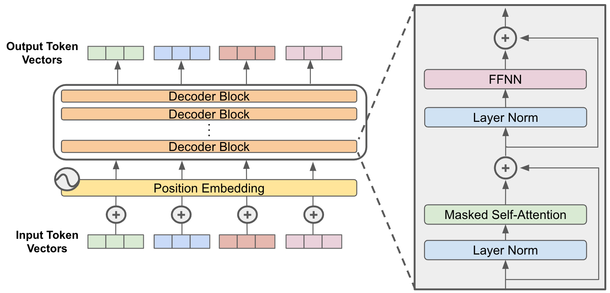
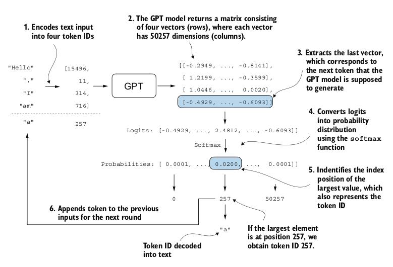

<div class="center-slide">

# LLMs : A Hands-on Approach 

### GPT - 2  : Implementation and Training

</div>

---

## Topics Covered

- **GPT-2 Architecture Review**

    - Layer Normalization
    - Self-Attention in GPT-2
    - Feed-Forward Network (FFN)
    - Residual Connections

- **Training GPT-2**

  - Text generation
  - Greedy decoding loop
  - Training loop

---

## GPT-2 Architecture


- GPT model stacks multiple transformer decoder blocks
- Each block has:
  - Masked Multi-Head Self-Attention layer
  - Feed-Forward Neural Network (FFN)
  - Layer Normalization and Residual Connections
- Final output layer



---

## GPT-2 Architecture

- 12 Transformer blocks
- 768-dimensional hidden states
- 12 attention heads
- Vocabulary size: 50,257 tokens

<div class="center-slide">


</div>

---

<div class="center-slide">

## Text Generation
</div>

---

## Autoregressive Text Generation

LLMs generate text **one token at a time** through an iterative process:

1. Start with an input context (e.g., "Hello, I am")
2. Model predicts the next token probability distribution
3. Select the next token (highest probability = greedy decoding)
4. Append token to context
5. Repeat until desired length


**Key Insight**: The model consumes its own previous outputs as future inputs - this is the **autoregressive** property.

---

## Logits to Token Selection


The GPT output is **logits**, not probabilities.

- Logits ∈ ℝ^V
- Softmax converts logits -> probability distribution
- Argmax selects most likely token

```python
probas = torch.softmax(logits, dim=-1)
token_id = torch.argmax(probas)
```


---

## Understanding the Generation Flow

**Input → Token IDs → Model → Logits → Softmax → Token Selection → Output**

| Step | Operation           | Shape Transformation                  |
| ---- | ------------------- | ------------------------------------- |
| 1    | Tokenize input      | "Hello, I am" → [15496, 11, 314, 716] |
| 2    | Model forward       | (1, 4) → (1, 4, 50257)                |
| 3    | Extract last logits | (1, 4, 50257) → (1, 50257)            |
| 4    | Softmax             | logits → probabilities                |
| 5    | Argmax              | select token ID 257 → "a"             |
| 6    | Concatenate         | extend sequence for next iteration    |



---

## Greedy Decoding Loop


Greedy decoding selects the **highest-probability token** at each step.

Properties:

- Deterministic
- Fast
- Often repetitive / dull


Greedy decoding = always take the most confident step.

- Does Greedy Decoding produce best text?
- Why not generate whole sentences?
- How different from encoder and decoder models?

---

## Why Untrained Models Generate Gibberish

Before training:

- Weights are random
- Logits are random
- Token probabilities are near-uniform

With vocab size = 50,257:

> Initial probability ≈ 1 / 50,257 ≈ 0.00002

Thus generated text is effectively random noise.

---

<div class="center-slide">

  ## Training the GPT
</div>


---

## Training Overview

- Training Loop
  - Loss Optimization
  - Data Loading
- Model Evaluation
- Using Pretrained weights

---

## Evaluating Generative Text Models

### Why Evaluation Matters

Before training, we need metrics to:

- Measure model performance quantitatively
- Track training progress
- Detect overfitting
- Compare different models

**Key Challenge**: How do we numerically assess the quality of generated text?

**Solution**: Use the model's own probability estimates vs true probabilties for the "correct" next tokens.

---

## Cross Entropy Loss for Language Modeling

The training objective: **Maximize the probability of the correct next token**

Given:

- **Inputs**: Token IDs the model sees
- **Targets**: Token IDs the model should predict (inputs shifted by 1)

```python
inputs = torch.tensor([[16833, 3626, 6100],   # ["every effort moves",
                       [40,    1107, 588]])    #  "I really like"]

targets = torch.tensor([[3626, 6100, 345  ],  # [" effort moves you",
                        [1107, 588, 11311]])  #  " really like chocolate"]
```


<div style="margin-top: 20px; margin-bottom: 20px;">
</div>

**Cross-entropy** loss measures how well the model's predicted probabilities match the true next tokens.

**Mathematical Formula:**

$$
\text{Loss} = -\frac{1}{N} \sum_{i=1}^{N} \log P(x_i^{\text{target}})
$$

Where:

- $N$ = total number of tokens
- $P(x_i^{\text{target}})$ = predicted probability for the correct token at position $i$
- The negative sign converts it to a loss (we want to maximize probability = minimize negative log probability)

---

## Calculating Cross Entropy Loss


---

## Understanding Cross Entropy Loss

**Step-by-step computation**

1. **Get logits** from model: shape `(batch, seq_len, vocab_size)`
2. **Apply softmax** to get probabilities
3. **Extract target probabilities**: probability assigned to correct tokens
4. **Apply logarithm**: log probabilities are more numerically stable
5. **Average** over all tokens
6. **Negate**: we minimize negative log-likelihood

```python
# PyTorch does all 6 steps in one function:
loss = torch.nn.functional.cross_entropy(logits_flat, targets_flat)
```

**Initial loss** (untrained model): ~10.99

**Target loss** (well-trained): approaches ~0

---

## Perplexity: Interpretable Metric

**Perplexity** = `exp(cross_entropy_loss)`

Interpretation: The effective vocabulary size the model is "uncertain" about at each step.

Interpretation:

- Effective number of equally likely tokens
- Lower is better

```python
perplexity = torch.exp(loss)
# For initial loss of 10.79: perplexity ≈ 48,725
# Meaning: model is unsure among ~48,725 tokens
```

| Loss  | Perplexity | Interpretation                       |
| ----- | ---------- | ------------------------------------ |
| 10.79 | 48,725     | Random guessing (vocab size: 50,257) |
| 5.0   | 148        | Moderate uncertainty                 |
| 2.0   | 7.4        | Low uncertainty                      |
| 0.5   | 1.65       | Very confident                       |

---

## Training vs Validation Loss

During training, split data into training and validation sets

```python
train_ratio = 0.90
split_idx = int(train_ratio * len(text_data))
train_data = text_data[:split_idx]
val_data = text_data[split_idx:]
```

**What to watch for:**

- Training loss **decreases**, Validation loss **decreases** -> Model is learning and generalizing
- Training loss **decreases**, Validation loss **increases** -> **OVERFITTING!**

---

## Processing Data for Training


- Inputs and targets are created by shifting token IDs by one position
- Given a text corpus
  - split into training and validation sets
  - for each set encode it to token IDs
  - create input-target pairs

In Pytorch

- **Dataset** Encodes all text to token IDs
- **DataLoader** handles batching and shuffling:

---

## The Training Loop

Training updates model weights to minimize loss through **backpropagation** and **gradient descent**.


---

## Core Code: Training Function

```python

    for epoch in range(num_epochs):
        model.train()  # Enable dropout

        for input_batch, target_batch in train_loader:
            optimizer.zero_grad()  # Reset gradients

            loss = calc_loss_batch(input_batch, target_batch, model, device)
            loss.backward()        # Calculate gradients
            optimizer.step()       # Update weights

```

---

# Loading and Saving Model Weights

Persistence Matters

**We must save trained models to:**

- Avoid retraining
- Share models with others
- Resume training later
- Deploy to production

---

## Core Code: Save and Load

```python
# ============ SAVE ============

torch.save(model.state_dict(), "model.pth")

# Save model + optimizer (for resuming training)
torch.save({
    "model_state_dict": model.state_dict(),
    "optimizer_state_dict": optimizer.state_dict(),
}, "model_and_optimizer.pth")


# ============ LOAD ============
# Load weights into fresh model
model = GPTModel(GPT_CONFIG_124M)
model.load_state_dict(torch.load("model.pth", map_location=device))
model.eval()  # Set to evaluation mode

# Resume training
checkpoint = torch.load("model_and_optimizer.pth", map_location=device)
model = GPTModel(GPT_CONFIG_124M)
model.load_state_dict(checkpoint["model_state_dict"])

optimizer = torch.optim.AdamW(model.parameters(), lr=5e-4, weight_decay=0.1)
optimizer.load_state_dict(checkpoint["optimizer_state_dict"])
model.train()  # Set to training mode
```

---

## Key Points

**`state_dict`**: Dictionary mapping layer names to parameter tensors

**`map_location`**: Ensures model loads on correct device (CPU/GPU)

**`model.eval()` vs `model.train()`**:

- `eval()`: Disables dropout, batch norm uses running stats
- `train()`: Enables dropout, batch norm uses batch stats

**Why save optimizer state?**

- AdamW stores momentum and adaptive learning rate history per parameter
- Without it, optimizer resets → suboptimal convergence
- Essential for resuming training

---

## LLM Loss Surfaces

LLM training optimizes a **high-dimensional non-convex loss surface** defined by:

> L(θ) = −E[log p\_θ(tokenₜ₊₁ | contextₜ)]

Key properties:

- Billions of parameters
- Extremely overparameterized
- Many equivalent minima
- Flat basins dominate

---

# Summary: Key Takeaways

## Text Generation (Section 4.7)

- Autoregressive: one token at a time
- Greedy decoding: always pick highest probability
- Context window limits how far back model "remembers"

## Evaluation (Section 5.1)

- Cross entropy loss measures prediction quality
- Perplexity = effective vocabulary uncertainty
- Training/validation split detects overfitting

## Training (Section 5.2)

- Standard PyTorch loop: zero_grad → forward → backward → step
- AdamW optimizer with weight decay
- Monitor both losses to detect overfitting

## Model Persistence (Section 5.4)

- Save `state_dict` for efficient storage
- Save optimizer state to resume training
- Use `model.eval()` for consistent inference
