<div class="center-slide">

# LLMs : A Hands-on Approach 

### GPT - 2  : Model Architecture and Implementation
</div>

---

## Topics Covered

- **Transformer Architecture Review**
    - Self-Attention Mechanism Recap
    - Causal Masking in Decoder-Only Models
    - Multi-Head Attention
- **GPT-2 Architecture**
    - Layer Normalization
    - Self-Attention in GPT-2
    - Feed-Forward Network (FFN)
    - Residual Connections
- **Implementing GPT-2 from Scratch**

---

## Models of the Week

**[stepfun-ai/Step-3.5-Flash](https://huggingface.co/stepfun-ai/Step-3.5-Flash)**

- SOTA Open Source model
- 199B parameters, Vocabulary Size - 128K, Context Length - 256K
- 45 Transformer layers
- Attention
    - num_attention_heads: 64
    - head_dim: 128
- Coding and Agentic use


**[arcee-ai/Trinity-Large-Preview](https://huggingface.co/arcee-ai/Trinity-Large-Preview)**

- ~398B parameters, Vocabulary Size - 200192, Context Length - 8192, 512K
- 60 Transformer layers
- Attention
    - num_attention_heads: 48
    - head_dim: 128

---

## Recap : Self-Attention Mechanism

 - The token embeddings alone are not sufficient.
 - We want dynamic, context-dependent representations of each token.
 - Self-attention allows each token to attend to all other tokens in the sequence to gather relevant context.

<video controls src="images/QKVMotivationScene.mp4" title="Title"></video>

---

## Recap : Self-Attention Mechanism

We project the token embedding to three learned projection spaces:

**PROJECTION === "Matrix Multiplication"**

- **Query (Q)**: $q_i = x_i W_q$
- **Key (K)**: $k_i = x_i W_k$
- **Value (V)**: $v_i = x_i W_v$

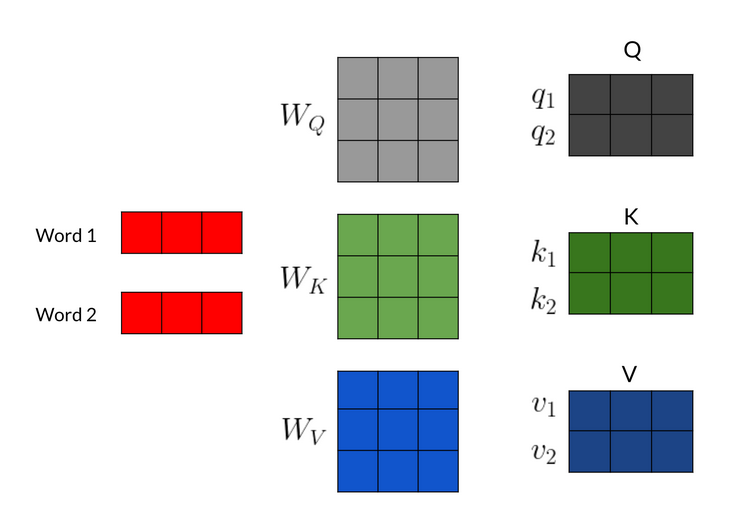

---

## Introducing Q, K, V vectors

We transform each input token into three different vectors:

- Token embedding: x_i
- **Query (Q)**: What am I looking for?
- **Key (K)**: What do I have to offer?
- **Value (V)**: What information do I carry?

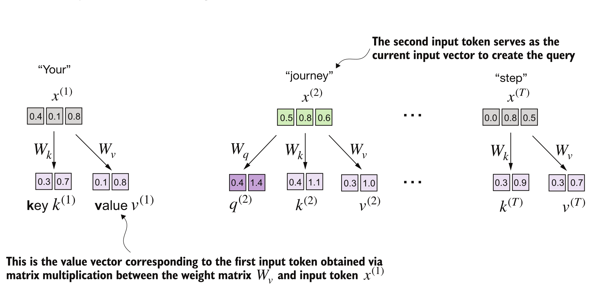

---

## Scaled Dot-Product Attention

<div style="text-align: center; padding: 20px;">

$$
\mathbf{Attention}(Q, K, V) = \mathbf{softmax}\left(\frac{QK^{\top}}{\sqrt{d_k}}\right)V
$$

</div>

- $$d_k \text{ is the dimensionality of the key vectors (used for scaling).}$$
- without $\sqrt{d_k}$, dot products grow with dimension → softmax saturates → tiny gradients.

<div> <br> </div>

<div style="display: flex; justify-content: space-between; align-items: center;">
    <div style="flex: 1; padding: 10px;">
        
    </div>
    <div style="flex: 1; padding: 10px;">
        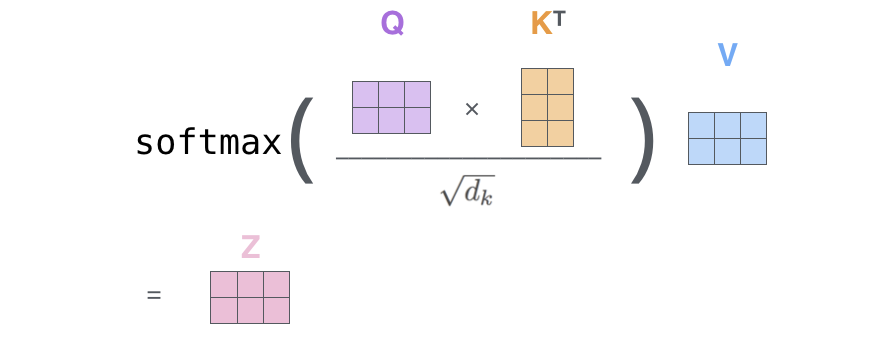
    </div>
</div>

---

## Causal  Attention (Masking) in Decoder-Only Models


- In decoder-only models, we predict next token based on previous tokens
- **Note** : During training, we predict all tokens in parallel
- To prevent information leakage from future tokens, we apply a causal mask to the attention scores
- At all time steps, each token can only attend to earlier tokens and itself

---

## Multi-Head Attention

### Stacking multiple attention heads

- Perform multiple self-attention calculations in parallel
- Independent set of learned weight matrices (Wq, Wk, Wv) and  output vector for each head.
- Concatenate all to produce one context vector for each token.
- Multiple heads -> attend to input sentence simultaneously -> different relationships and patterns in the data.

$ MultiHead(Q,K,V) = Concat(head_1,...,head_h)W_O $ 

where $ head_i = Attention(QW_{q_i}, KW_{k_i}, VW_{v_i}) $


---

<div class="center-slide">

# GPT-2 Model

### Architecture and Implementation
</div>

---

## Generative Pre-trained Transformer (GPT) 

- Decoder only Transformer architecture
- Pre-trained on large corpus of text data (40GB of internet text) using self-supervised next-token prediction.
- Demonstrated  that general purpose models for textual understanding are incredibly effective without using any task-specific architectures or modifications


---

## Language Modeling Objective

- Predict the next token in a sequence given all previous tokens


- **P(x) = ∏ P(x_i | x_1, ..., x_{i-1})**


---

## Auto-regressive Text Generation

- Given a prompt, GPT-2 generates text one token at a time
- At each step, the model predicts the next token based on all previous tokens
- The predicted token is appended to the input sequence for the next prediction

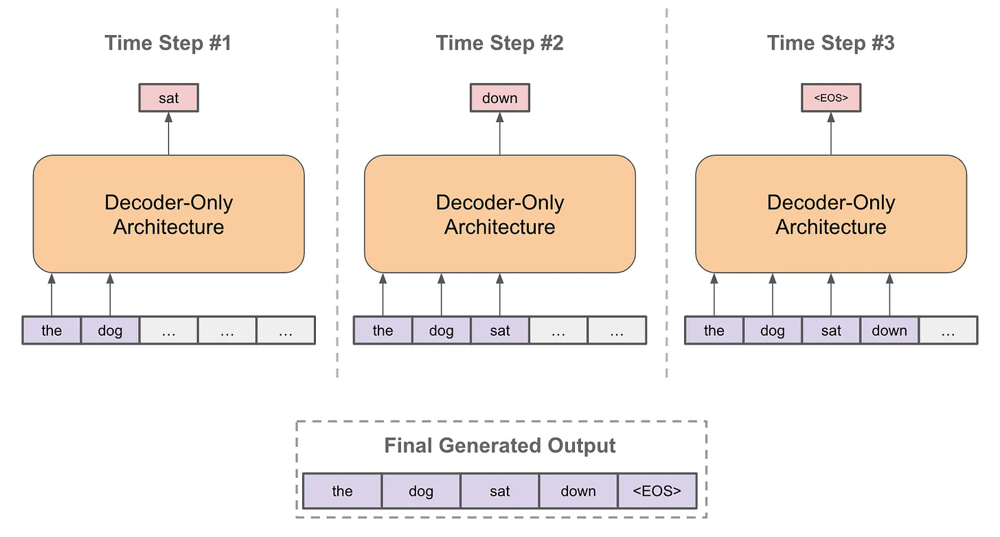

---

## GPT-2 Architecture


- GPT model stacks multiple transformer decoder blocks
- Each block has:
  - Masked Multi-Head Self-Attention layer
  - Feed-Forward Neural Network (FFN)
  - Layer Normalization and Residual Connections
- Final output layer


<span style="font-size: small;">Ref : Radford et al., 2019 "Language Models are Unsupervised Multitask Learners" </span>

---

## Detailed GPT-2 Architecture

<div> <br> </div>

<div style="display: flex; justify-content: space-between; align-items: center;">
    <div style="flex: 1; padding: 10px;">
        
    </div>
    <div style="flex: 1; padding: 10px;">
        
    </div>

</div>

```python

GPT_CONFIG_124M = {
"vocab_size": 50257, # 50000 BPE merges + 256 byte tokens + 1 special token
"context_length": 1024, # max length of input sequences
"emb_dim": 768,
"n_heads": 12,
"n_layers": 12,
"drop_rate": 0.1,
"qkv_bias": False
}
```

---

## Inputs to the GPT-2 Model

- Input Text -> Tokenization -> Token IDs
- Input Encodings:
  - Token Embeddings: Represent the meaning of each token
  - Positional Encodings: Represent the position of each token in the sequence
- Combined to form the input to the first transformer block


<div style="display: flex; justify-content: space-between; align-items: center;">
    <div style="flex: 1; padding: 10px;">
        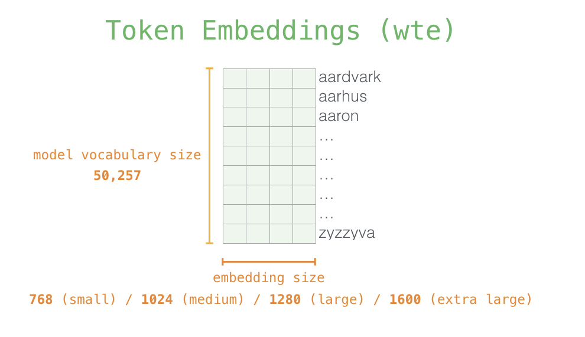
    </div>
    <div style="flex: 1; padding: 10px;">
        
    </div>

</div>


---

## Inputs to the GPT-2 Model

- Transformers have no inherent notion of sequence order, Without positional info, 'dog bites man' = 'man bites dog' to the model
- GPT-2 uses LEARNED positional embeddings (vs sinusoidal in original Transformer)
- Both embeddings are simply added element-wise (not concatenated)


---

## Layer Normalization

 - Gradient explosion/vanishing issues in deep networks
 - Normalizes (centers) inputs across features for **each token** to have zero mean and unit variance
 - Stabilizes training and improves convergence
 - In GPT-2, applied before self-attention and feed-forward layers (Pre-LN)
 

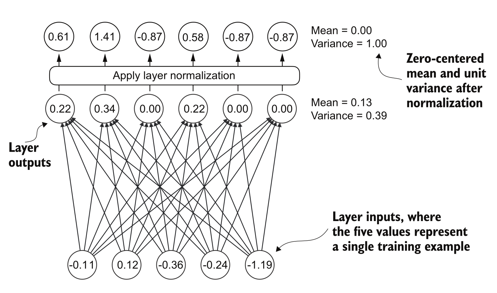

---

## Layer Normalization

- **Normalization**

<div style="text-align: center"> <br>
    $$
    \hat x = \frac{x - \mu}{\sigma + \epsilon} 
    $$

</div>

- **LayerNorm formula:**

<div style="text-align: center"> <br>

$$
\text{LayerNorm}(x) = \frac{x - \mu}{\sigma + \epsilon} \cdot \gamma + \beta
$$

</div>

Where:
- x: input vector for a token
- μ: mean of the elements in x
- σ: standard deviation of the elements in x
- ε: small constant for numerical stability
- γ, β: learnable parameters for scaling and shifting

---

## Self-Attention in GPT-2

- Multi-Head Self-Attention mechanism
- Attention heads : 12
- Head dimension : 64
- Context length : 1024 tokens
- Context Vector Size per token : 768 (12 heads * 64 dim)


---

## Self-Attention in GPT-2

- Each Transformer Block contains 
    - A Multi-Head Self-Attention layer
    - Each head computes attention using Q, K, V
    - Causal mask applied to prevent attending to future tokens and dropout for regularization

    <div style="margin-bottom: 30px;"></div>

<!-- Self-Attention Implementation Steps -->
<div class="r-stack">
    
    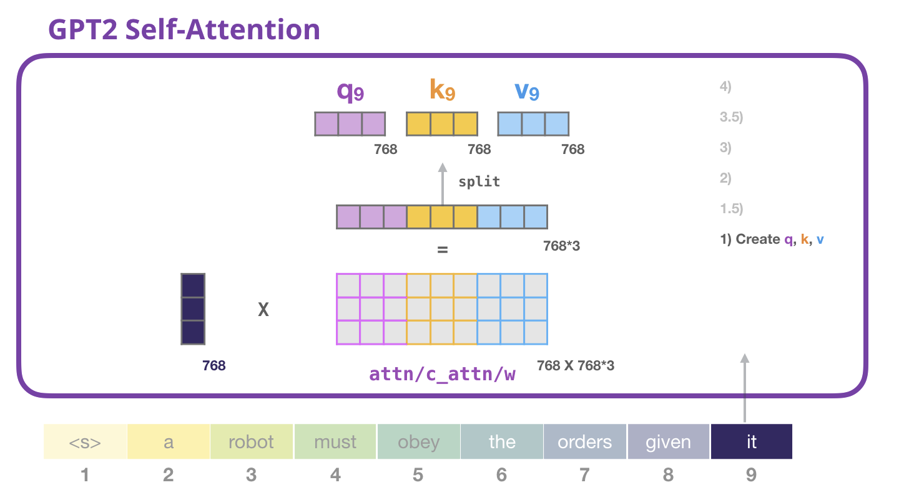
    
    
    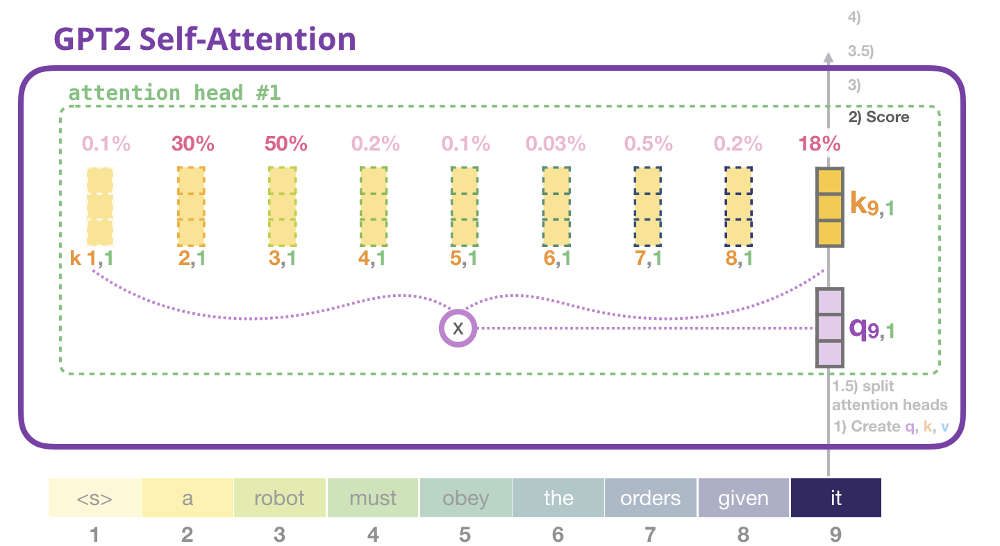
    
    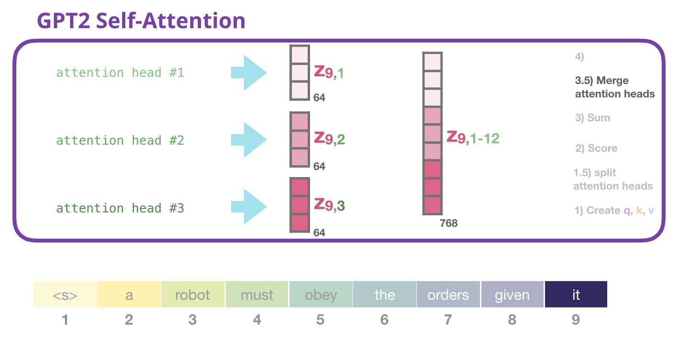
    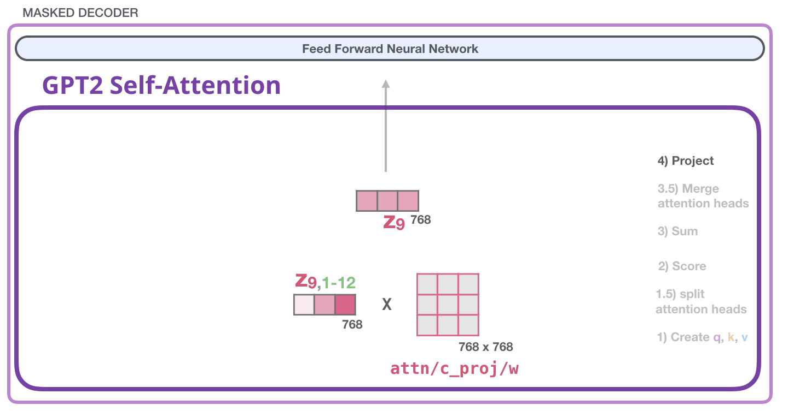
</div>


---

## Feed-Forward  Network (FFN)

- A Feed-Forward Network (FFN) is applied independently to each token's representation after the self-attention layer.
- Affine transformation followed by a non-linear activation function.

<div style="margin-bottom: 30px;"></div>


---

## Feed-Forward  Network (FFN)

- A Feed-Forward Network (FFN) is applied independently to each token's representation after the self-attention layer.
- Affine transformation followed by a non-linear activation function.


<div style="text-align: center"> <br>
A Linear Layer is defined as: $ \text{Linear}(x) = xW^T + b $

</div>

<div style="margin-bottom: 30px;"></div>


---

## Feed-Forward  Network (FFN) in GPT-2

- Each transformer block contains a Feed-Forward Network (FFN)
- FFN has two linear layers with GELU activation in between

<div style="text-align: center"> <br>
$$
\text{FFN}(x) = \text{Linear}_2(\text{GELU}(\text{Linear}_1(x)))
$$

</div>


---

## GELU Activation Function

- Gaussian Error Linear Unit (GELU) is  used in GPT-2's FFN
- Smooth approximation of ReLU, allows small negative values to pass through

<div style="margin-bottom: 50px;"></div>

<div style="text-align: center"> <br>
$\mathbf{GELU(x) = 0.5 \cdot x \cdot (1 + \tanh[\sqrt{2/\pi}(x + 0.044715 \cdot x^3)])}$
</div>

<div style="margin-bottom: 30px;"></div>


---

## FFN in GPT-2

- Hidden layer size is **4 times** the input/output size (3072 for GPT-2 small)
- Applies non-linear transformation to **each token's** representation independently

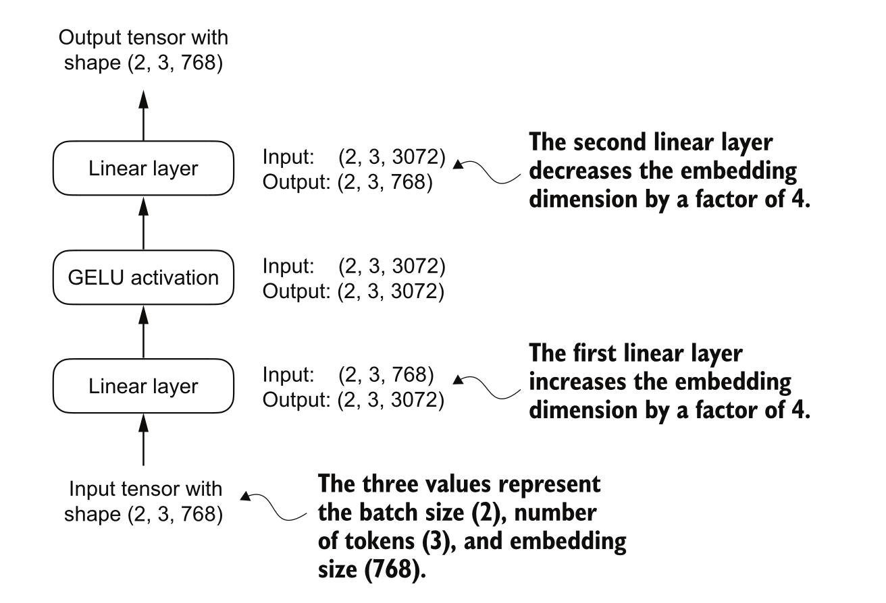

- Why 4x?
  - Empirically found to work well

- FFN layers contain most of the model's parameters!
  - For GPT-2 small: FFN has 768 -> 3072 -> 768, that's 768 * 3072 * 2 ≈ 4.7M params per block
  - 12 blocks × 4.7 M ≈ 56M params just in FFNs (almost half the model)

---

## Residual Connections

- Help mitigate vanishing gradient problems in deep networks
- Add the input of a layer to its output before passing to the next layer
- Gradients get progressively smaller as they backpropagate through layers
- Preserve information from earlier layers, helping training stability


---

## Connecting it all : Transformer Block in GPT-2

- We have implemented the key components of a transformer block used in GPT-2:
    - ✓ Layer Normalization
    - ✓ Multi-Head Self-Attention with Causal Masking
    - ✓ Residual Connection
    - ✓ Feed-Forward Network (FFN)

- 12 such blocks are stacked in GPT-2 small
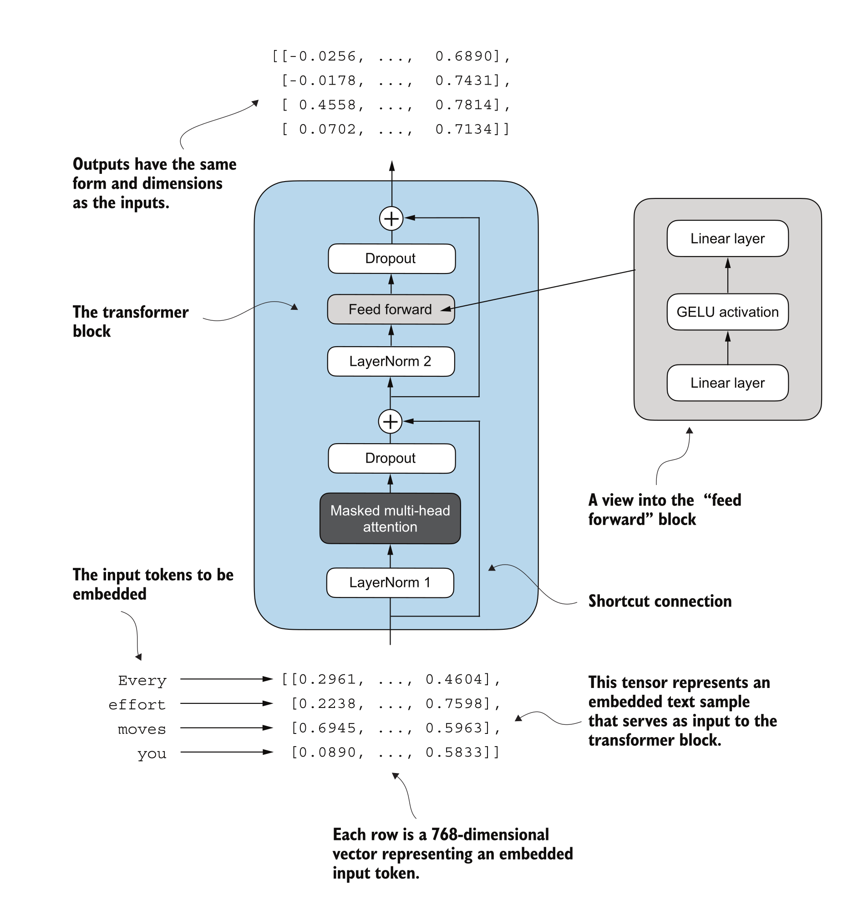


---

## Transformer Block in GPT-2


```python

def forward(self, x):
    shortcut = x
    x = self.norm1(x)
    x = self.att(x)
    x = self.dropout(x)
    x = x + shortcut

    shortcut = x
    x = self.norm2(x)
    x = self.ff(x)
    x = self.dropout(x)
    x = x + shortcut

    return x
```

---

## GPT-2 Model Implementation


- We have all the components to implement GPT-2 from scratch
- Token Embeddings + Positional Encodings
- Stack of Transformer Blocks
- Final Layer Normalization and Output Layer


---

## GPT-2 Model Implementation

**Model Initialization**

```python
## GPT-2 Model Initialization pseudo-code
tok_emb = nn.Embedding(vocab_size, emb_dim)
pos_emb = nn.Embedding(context_length, emb_dim)
drop_emb = nn.Dropout(drop_rate)
trf_blocks = [TransformerBlock(cfg) for _ in range(n_layers)] # 
final_norm = LayerNorm(emb_dim)
out_head = nn.Linear(emb_dim, vocab_size, bias=False)
```
**Forward Pass**
```python
x = tok_embeds + pos_embeds
x = self.drop_emb(x)
x = self.trf_blocks(x)
x = self.final_norm(x)
logits = self.out_head(x)
```

---

## GPT-2 Parameter Count

- GPT-2 small has ~124M parameters
- Major contributors:
  - Token Embeddings: ~38M
  - Transformer Blocks: ~85M
    - Self-Attention layers: ~23M
    - Feed-Forward Networks: ~56M
  - Output Layer: ~38M
- Most parameters are in embeddings and FFN layers

---

## Next Steps

- Implement training loop with cross-entropy loss
- Integrate tokenizer for text input/output
- Load pretrained weights from HuggingFace for GPT-2
- Experiment with text generation

---

## References

1. [Decoder-Only Transformers: The Workhorse of Generative LLMs](https://cameronrwolfe.substack.com/p/decoder-only-transformers-the-workhorse)
2. [The Illustrated GPT-2 (Visualizing Transformer Language Models)](https://jalammar.github.io/illustrated-gpt2/)
3. [GPT-2 Paper](https://cdn.openai.com/better-language-models/language_models_are_unsupervised_multitask_learners.pdf)
4. [Attention Is All You Need Paper](https://arxiv.org/abs/1706.03762)
5. Build LLMs from Scratch, Sebastian Raschka, Manning Publications, 2025

