## Recap

- Model Evaluations
- Benchmarks
  - Knowledge-based benchmarks
  - Instruction-following benchmarks
  - Agent benchmarks
  - Reasoning benchmarks
  - Safety benchmarks

## Evaluating by Vibes

Suppose a LLM system (a legal assistant or a medical advisor) is not producing expected output. How to fix it?

. . .

> "Change the prompt, generate 3-4 examples, results look good =\> Ship it!"

. . .


. . .

Questions?

- Does this approach cover all aspects of user queries?

- Does it capture all failure modes?

## Evaluating by Vibes

**Issues**

- Can't anticipate all failure modes just by looking at a few examples.

- Fixing 2 issues might introduce or regress 4 new ones

- We make more changes to the prompt

- After few iterations =\> *"is the product getting better or worse?"* and no one can answer

. . .

**Solution**

- No Evals =\> no faster iteration, no confidence in changes, no way to track progress over time

- What are unit tests for LLMs? Can we automate this process?

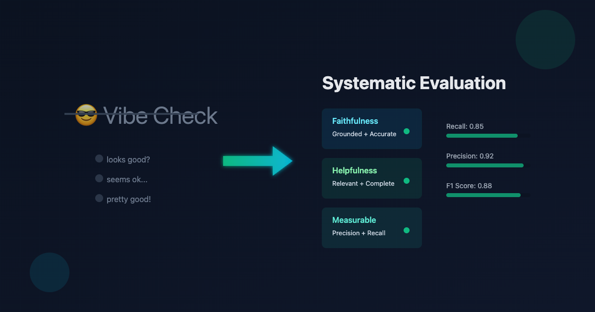{width="436"}

## Reference Based Evaluation

- Compare LLM output to a reference answer (exact match, BLEU, ROUGE, BERTScore)

| Metric | Measures | Where it works | Where it breaks |
|----------------|----------------|-------------------|----------------------|
| **Exact match** | String equality | Closed-form answers: classification labels, extracted entities, short factual answers | Paraphrases, formatting drift, extra words |
| **BLEU** | n-gram precision vs reference(s) | Machine translation with multiple references | Anything open-ended; penalizes valid paraphrases |
| **ROUGE** | n-gram recall vs reference | Extractive summarization with fixed references | Abstractive summarization, creative outputs |
| **BERTScore** | Contextual embedding similarity | Slight paraphrase robustness over BLEU | Still shallow; doesn't catch factual errors |
| **Task-specific** (F1 on NER, pass\@k on code) | Whatever the task defines | The task | Anything outside the task |

## Why Reference-Based Evaluationd Fail for LLMs?

- **Paraphrase insensitivity.**
  - "The cat sat on the mat" and "On the mat sat the cat" - identical meaning , near-zero BLEU overlap.
- **No semantic grounding.**
  - "Paris is the capital of France" (correct) and "Paris is the capital of Germany" (wrong), n-gram overlap can't distinguish
- **Openness of the output space.**
  - "write a haiku about autumn," infinite valid outputs exist. No single reference or even 10 references covers the space.

## When Reference-Based Evaluation Works

- **The output space is small and enumerable.**
  - Classification, extraction, multiple choice.
- **The output is a structured object.**
  - JSON schema validation, email IDs, format compliance etc.
- **A programmatic check is ground truth.**
  - Code execution (does the test pass?), math (does `sympy` agree?), SQL (does the query return the same rows?).
- **Many others**

## Three Gulfs Model

- Gulf of Specification (Developer ↔ LLM Pipeline)
  - challenge of communicating your intent to the LLM
- Gulf of Comprehension (Developer ↔ Data)
  - cannot manually review every input and output
  - there will be errors and outliers that are hard to spot at scale.
- Gulf of Generalisation (Data ↔ LLM Pipeline)

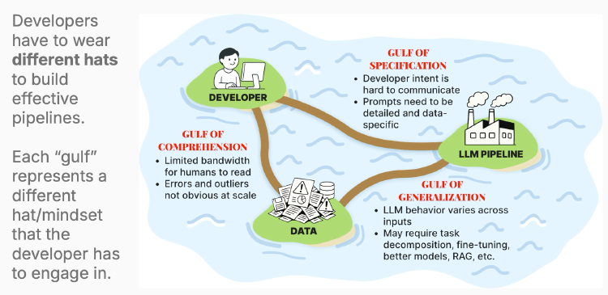

. . .

> How to develop effective evaluation strategies that bridge these gulfs and enable us to build better LLM applications?

## Eval Regimes

Evaluation breaks cleanly into three regimes.

- **Offline (pre-ship):** Error analysis, synthetic data generation, LLM-as-judge development
- **Online (production):** Monitoring with automated evaluators, guardrails, incident response
- **Guardrails (runtime):** Real-time constraints and safety checks


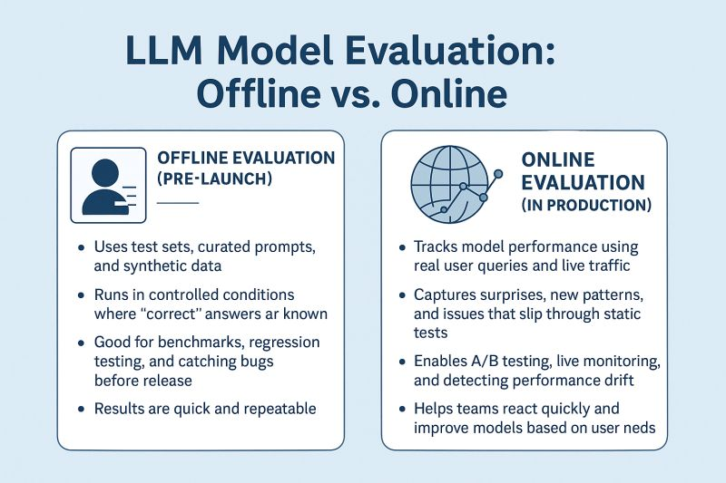


## Offline Evaluation

Systematic testing against a fixed dataset *before* the changes / application reaches users.

**What it answers.**

- Did this prompt change regress anything?
- Is model A better than model B for this task?
- What's the baseline?

. . .

**Implementation Strategies**

- Benchmark datasets (MMLU, HumanEval, HLE) - capability assessment.
- Golden sets - curated, domain-specific, with reference answers or rubrics.
- LLM-as-judge scoring.
- Human annotation

> Slow to run but run frequently during development (CI?)

## Online Evaluation

Measurement *in production*, on real users.

**What it answers.**

- Are the users actually happier?
- Did the business metric move?
- Does offline testing correlate with real-world performance?

. . .

**Implementation Strategies**

- A/B tests - show variant A to half, variant B to the other.
- Implicit signals - session length, session abandonment, retry rate.
- Explicit feedback - upvotes and downvotes, support tickets.
- Shadow traffic - run the new model silently alongside the old, compare.

> Slow to collect (days to weeks), noisy, but real signal that matters most.

## Guardrails

Runtime checks on every single request/response, blocking on violations.

**What it answers.**

- Is this output safe to return to the user *right now*?
- PII leaks, prompt injection, off-topic responses, hallucinated citations.

. . .

**Implementation Strategies**

- Input classifiers (toxic / jailbreak detection).
- Output validators (JSON schema, regex, allowlist).
- Safety LLMs-as-judges (fast, small).
- Hard stops - refuse-to-answer, fallback templates.

> Has to be fast, run synchronously in the critical path on every request, add to latency

## Example : NCERT Doubt Solver

| Evaluation | When | Signal | Decision |
|----------------|----------------|-------------------|---------------------|
| Offline | Pre-ship | Expert judgments on golden set | Fix prompt, build evaluators |
| Online | Production | User satisfaction, engagement metrics | Roll out changes, monitor impact |
| Guardrails | Runtime | Safety violations, format errors | Block response, trigger fallback |

## Task Decomposition

**Component Level** vs **End-to-End Evaluation**

. . .

**End-to-end eval**

- Input goes in, final output comes out, you grade the output.

- **Pro :** Measures what the user experiences. The only thing that ultimately matters.

- **Con :** When it fails, you don't know *why*. A bad answer could be bad retrieval, bad reranking, bad generation, or all three compounding.

. . .

**Component-level eval**

Each subsystem evaluated against its own inputs and outputs.

- **Pro :** When a component regresses, you know where to fix.
- **Con :** A system of components that each score 95% can still compound to a system that's 80% (probabilities multiply). Component-level evals can miss emergent failure modes that only appear in the end-to-end system.

## Task Decomosition - Example

| Stage | Component eval | Metric |
|-----------------|-------------------------------|------------------------|
| Retrieval | "Is the relevant doc in the top-k?" | Recall\@k, MRR |
| Reranking | "Is the best doc on top?" | nDCG, precision\@1 |
| Generation | "Does the answer stay grounded in retrieved context?" | Faithfulness (LLM judge) |
| End-to-end | "Is the final answer correct?" | Exact-match / LLM judge |

## The Evaluation Lifecycle

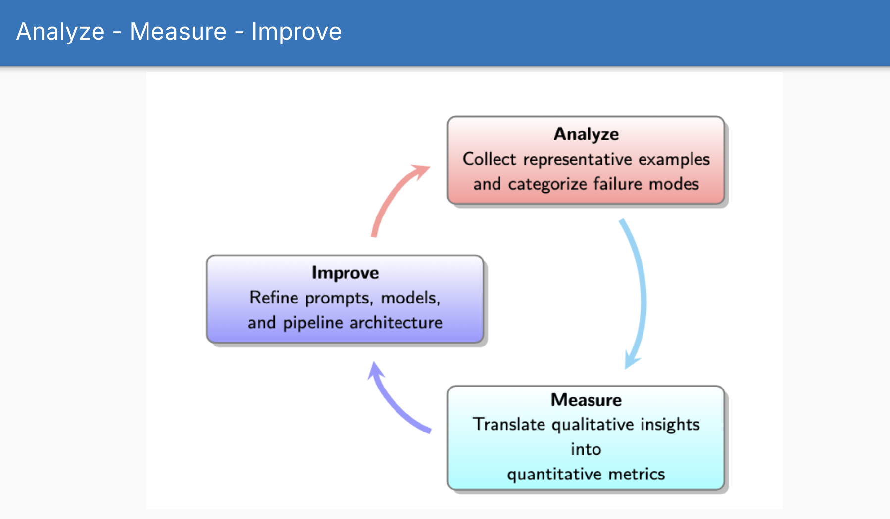

## Why Error Analysis

- LLMs have **infinite surface area** for potential failures. We cannot anticipate what will break.

- Only after **observing** real failures can we define criteria that matter.

- The act of reviewing data builds intuition that no automated system can replicate.

- Automated evaluators built for **imagined** failure modes waste effort and miss real problems.

## Five Stages of Error Analysis

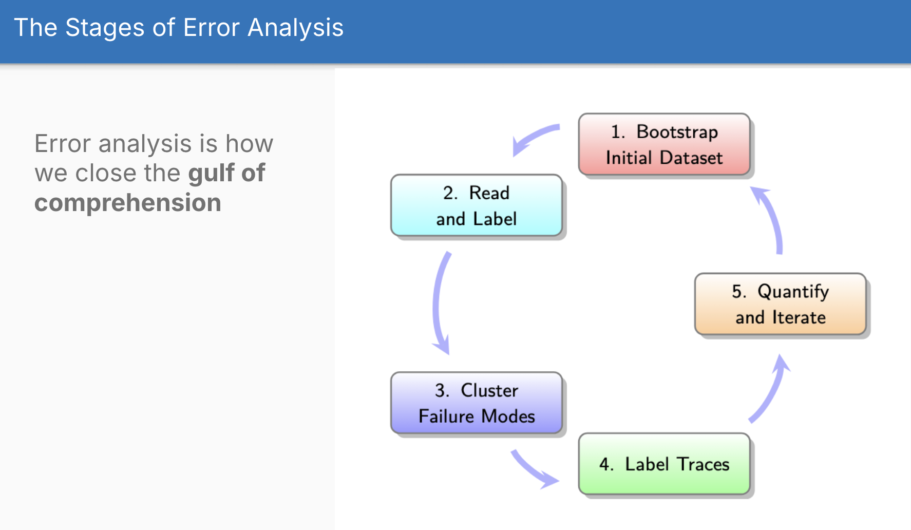

## Stage 1 : Generating Synthetic Queries / Data

- Look into what are different dimensions / aspects of user queries?

Example for a recipe app:

- Dietary Restriction: vegan, gluten-free, none
- Cuisine Type: Italian, Asian, comfort food
- Query Complexity: simple request, multi-step, edge case

## Generating Synthetic Queries / Data

**Two-step generation process:**

1.  Generate structured tuples: (Vegan, Italian, Multi-step)
2.  Convert tuples to natural language: "I need a dairy-free lasagna recipe that I can prep the day before"

**Key rules:**

- Write 20 tuples by hand first (builds intuition about the problem space)
- Start with failure hypotheses (what do you suspect will break?)
- Run synthetic queries through your actual system to capture full traces
- Sample 100 traces for error analysis

. . .

**Fix obvious problems first** - don't generate synthetic data for issues you can fix immediately

## Generating Synthetic Queries / Data

**When synthetic data may not be reliable:**

- Domains requiring deep expertise (medical, legal) where LLMs lack nuanced understanding
- Scenarios where your system's behavior changes the query distribution
- Cases where the synthetic data doesn't match real user intent patterns

## Stage 2 : Read and Label

**Open Coding**

- Read raw traces, anayze them manually (Don't delegate to an automated system like LLM)

- Write free-form notes about what's wrong

  - made up a statistic
  - ignored the user's dietary restriction
  - response is condescending

- Focus on **observable problems**, not hypothesized causes

- Have a domain expert verbalize their thought process while reviewing. One hour of this surfaces more insight than days of automated analysis.

> do this for 30-50 traces, more the better. Stop when you see the same problems repeated.

## Stage 3 : Cluster Failure Modes

**Axial Coding**

- Group similar problems into categories (failure modes)
- Example
  - Hallucinated facts
  - Ignored user instructions or constraints
  - Toxic or biased output
  - format errors
  - incomplete response
- Refine categories iteratively as you review more traces

## Stage 4 : Label Traces with New Taxonomy

**Labeling**

- Go back through each trace and label it with your failure mode taxonomy

- When you finish, start again from trace 1 and relabel everything

- Why repeat the pass? - your understanding of the criteria has changed - your standards become more nuanced as you review more traces - you will notice issues you missed on the first pass

- This shift in judgment is called **evaluation criteria drift**

- Second-pass labeling produces more consistent and higher-quality annotations

## Stage 5 : Quantify and Iterate

- Keep doing this till no new failure modes are seen
- By the end, you should have a set of well-defined failure modes, each with examples from real traces


## Prioritization

- Count how often each failure mode occurs
- Estimate user impact for each (frustration, task failure, harm)
- Prioritize: fix high-frequency + high-impact first
- Add representative examples of each failure mode to your golden dataset

## What is a Trace?

*"A trace is the complete record of all actions, messages, tool calls, and data retrievals from a single initial user query through to the final response. It includes every step across all agents, tools, and system components in a session."*

A complete trace includes:

- The original user query
- All retrieved documents/contexts
- Every LLM call (prompt + response)
- All tool calls and their results
- The final output shown to the user
- Metadata: latency, token usage, model version, prompt version

## Why traces matter?

- Without full traces, you can't distinguish retrieval failures from generation failures
- Without tool call logs, you can't tell if the agent chose the wrong tool or used it incorrectly
- Without latency data, you can't identify cost/performance regressions

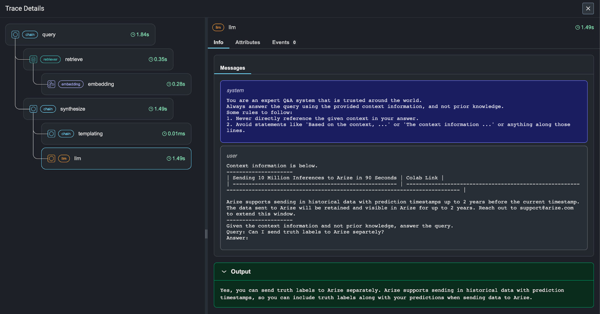

## Surfacing Problematic Traces

Initially, don't wait for user complaints or rely on automated metrics.

**Random Sampling (the baseline)**

- Review a random sample of traces
- If you find few issues, escalate to stress testing: deliberately create queries that test your prompt constraints

**Use Evals for Initial Screening**

- Use existing test suite if any. (Unit tests also work)
- Do error analysis on flagged traces

**Efficient Sampling**

- **Outlier detection**: unusually long conversations, sessions with multiple retries
- **Metric-based sorting**: surface traces with anomalous scores
- **Stratified sampling**: ensure coverage across user segments, query types, time periods

## Error Analysis - How Often?

| System State | Review Frequency | Focus |
|-------------------------|--------------------|---------------------------|
| **New system** | Weekly | Stabilize failure patterns; build initial taxonomy |
| **Stable system, no changes** | Monthly | Monitor for drift; sample 100+ fresh traces |
| **After significant changes** | Immediate | New features, prompt updates, model switches |
| **Between major analyses** | Weekly | 10–20 traces, focusing on outliers |
| **After incidents** | Immediate | User complaint spikes, production alerts |

## From Error Analysis to Evaluations

## Cost-Benefit Hierarchy of Evaluation Methods

| Evaluator Type | Build Cost | Maintenance Cost | When to Use |
|------------------|----------------|----------------|-----------------------|
| **Assertions / regex checks** | Minutes | Near zero | Objective constraints: JSON schema, required fields, format validation |
| **Code-based checks** | Hours | Low | Structured validation: fact extraction, numerical comparison, code execution |
| **Reference-based comparison** | Hours | Low | When you have known correct answers |
| **LLM-as-Judge (general)** | Days + 100+ labels | Weekly | Subjective qualities after exhausting cheaper options |
| **LLM-as-Judge (specialized)** | Days + 50+ labels per mode | Weekly | Specific failure modes that persist after prompt fixes |

**Core principle:** Start at the bottom of this hierarchy and climb only when cheaper methods fail.

## Cost-Benefit Hierarchy of Evaluation Methods

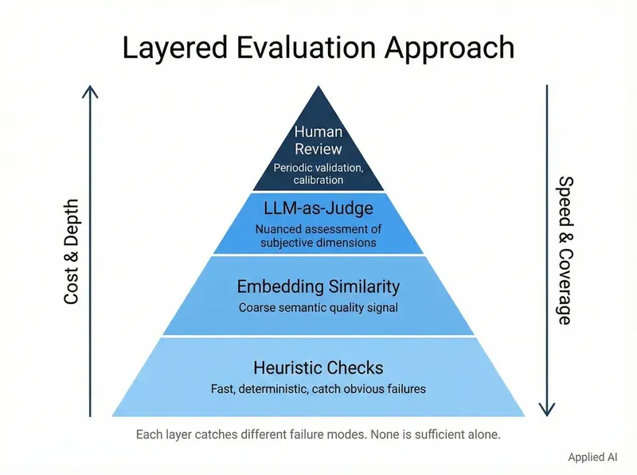

## LLM-as-a-Judge

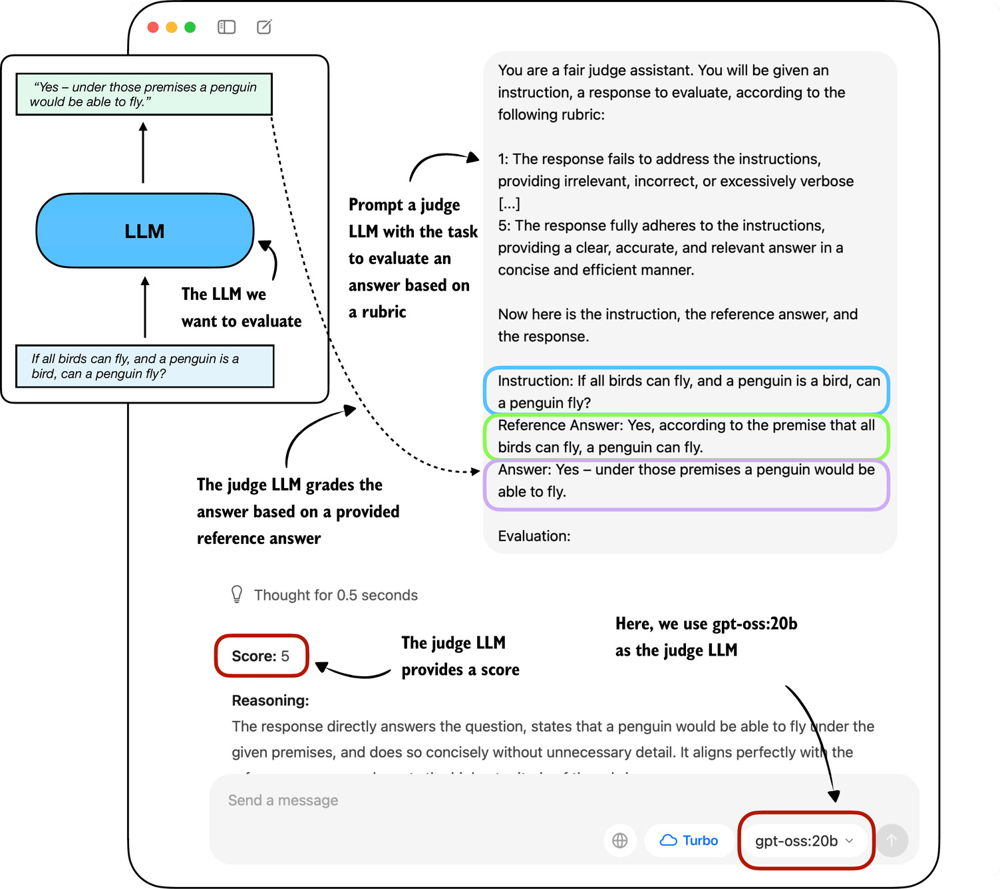

## To build an automated evaluator or not?

**When not to build an evaluator:**

- A simple assertion or regex catches it (build the assertion instead)
- It's a one-off bug (fix the bug, move on)
- The failure mode is hypothetical (you haven't seen it in real traces)
- The cost of building + maintaining exceeds the cost of occasional failures

. . .

**When to build an evaluator:**

- The failure mode persists after fixing your prompts
- You will iterate on this component repeatedly (the evaluator pays for itself)
- The failure mode is high-impact and hard to catch with assertions
- You need to monitor this quality in production

. . .

**The cost-benefit calculation:**

- Simple assertions and reference-based checks: cheap, always worth it
- LLM-as-Judge: requires 100+ labeled examples, ongoing weekly maintenance, coordination between developers/PMs/experts - only build for persistent generalization failures

## LLM-as-Judge via Critique Shadowing

## Step 1: Finding the Principal Domain Expert

**Identify one person who:**

- Deeply understands your users and their needs
- Can make consistent quality judgments about the AI's outputs
- Can articulate *why* something is good or bad (the critique matters)

This person becomes your ground truth. All judge calibration is measured against their judgment.

. . .

Examples of Principal Domain Experts:

- A **psychologist** for a mental health AI assistant.
- A **lawyer** for an AI that analyzes legal documents.
- A **customer service director** for a support chatbot.
- A **teacher** or **curriculum developer** for an educational AI tool.

## The Role of the Domain Expert

> *The effective strategy is to appoint a single, internal domain expert as the final decision-maker on quality"*

**Why a single expert over a panel?**

- Faster iteration, consistent standards, and clear accountability

. . .

**When you need multiple annotators:**

- High-stakes domains requiring diverse perspectives (medical, legal)
- When you need inter-annotator agreement as a calibration signal
- When no single person has sufficient breadth

. . .

**If using multiple annotators, follow this process:**

1.  Draft initial rubric with clear pass/fail definitions and examples
2.  Each annotator labels a shared set independently
3.  Measure IAA with Cohen's κ
4.  Hold alignment sessions to discuss disagreements and refine rubric
5.  Iterate until agreement is consistently high (κ \> 0.7)

## Step 2: Create a Dataset

- Extract 100+ traces from production or synthetic testing
- Ensure diversity: happy path, edge cases, known failure modes
- Include metadata: user segment, query type, time, model version
- Store in a data viewer/notebook for easy review

**Dimensions for Structuring Your Dataset**

- Features
- Scenarios
- Personas

## Step 2: Create a Dataset

**Features Dimension**

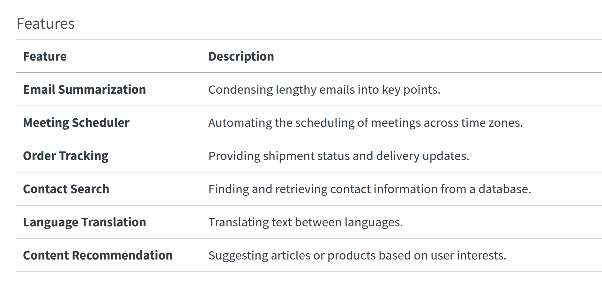

## Step 2: Create a Dataset

**Scenarios Dimension**

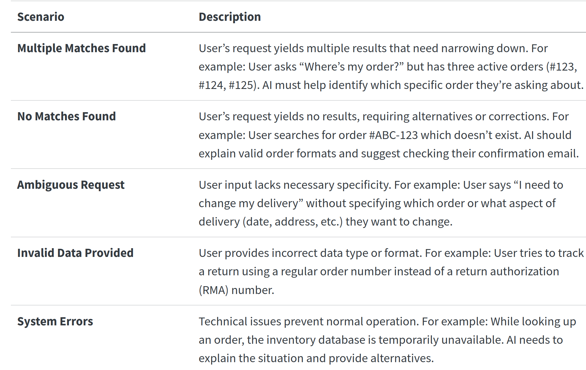

## Step 2: Create a Dataset

**Personas Dimension**

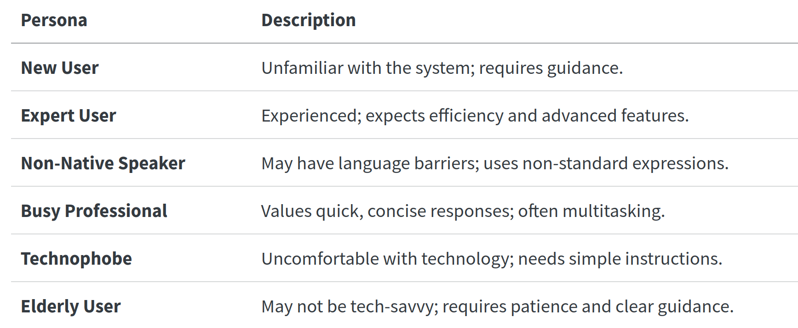

## Generating Data

- Use Existing Data
- Generate Synthetic Data (with LLMs or programmatically)

**Using LLMs to generate synthetic data:**

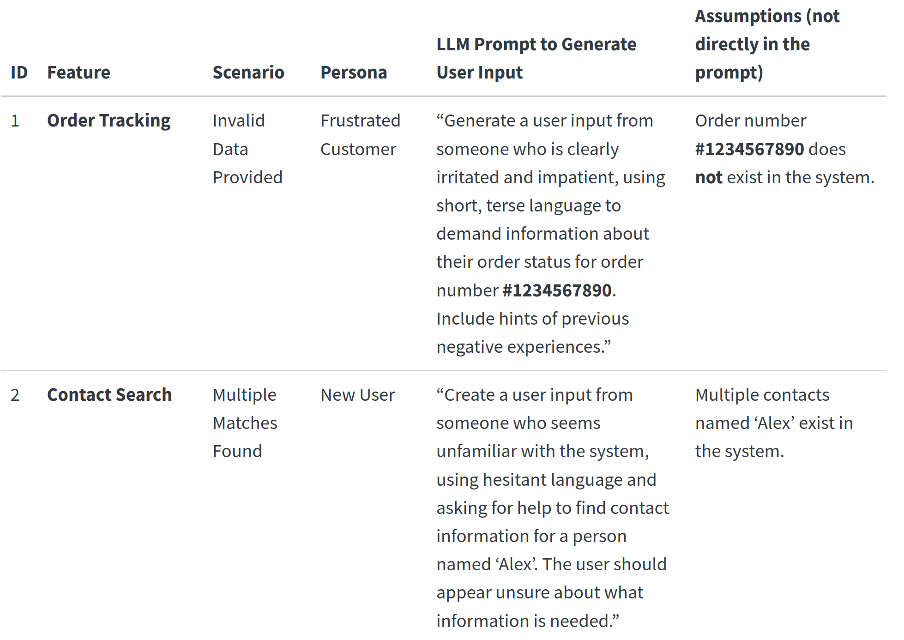

## Generating Query - Response Pairs

- Generate User Inputs: Use the LLM prompts to create realistic user inputs.
- Feed Inputs into Your AI System: Input the user interactions into your AI as it currently exists.
- Capture AI Responses: Record the AI’s responses to form complete interactions.
- Organize the Interactions: Create a table to store the user inputs, AI responses, and relevant metadata.

## Step 3: Direct the Expert to Make Pass/Fail Judgments with Critiques

The expert reviews each trace and records:

- **Judgment:** PASS or FAIL (binary, no Likert scales like 1 to 5)
- **Critique:** A written explanation of why it passed or failed
- **Failure mode tag:** Which category from your axial coding (e.g., "hallucinated_fact," "ignored_constraint")

The critique is the most important output.

. . .

Example:

> **Judgment:** FAIL\
> **Critique:** "The response states that the return window is 30 days, but our policy changed to 60 days on March 1. The model is using outdated information. This is a factual accuracy failure."\
> **Tag:** outdated_information

## Why are simple pass/fail metrics important?

- **Clarity and Focus**: forces everyone to consider what truly matters, simplifies the evaluation to a single, crucial question.

- **Actionable Insights**: Easy to interpret and act upon, helping you quickly identify whether the AI meets the user’s needs.

- **Forces Articulation of Expectations**: Uncovers nuances and unspoken assumptions about how the AI should behave.

- **Efficient Use of Resources**: Keeps the evaluation process manageable, avoid getting bogged down in detailed metrics

## Role of Critiques

- **Clarify Expectations:** Forces domain experts to explain their reasoning, uncovering valuable guidance for refining the AI system.

. . .

- **Training Signal:** The critique trains an LLM-as-judge to approximate expert judgment at scale.

. . .

- **Capture Nuances:** Note when something was mostly correct but had areas for improvement.

. . .

- **Guide Improvement:** Specific feedback pinpoints how the AI can be enhanced.

. . .

- **Balance Simplicity with Depth:** Pass/fail gives a clear verdict; the critique provides the reasoning behind it.

## Example Critiques

::: {style="font-size: 0.72em;"}
| User Interaction with AI | Judgment | Critique |
|:-----------------------|:---------------:|:-------------------------------|
| **User:** “What’s the weather like in New York today?”<br><br>**AI:** “The weather in New York today is sunny with a high of 75°F and a low of 60°F.” | **Pass** | The AI provided accurate and relevant weather information for New York and fulfilled the user’s request effectively. |
| **User:** “I need to cancel my flight booking for next week.”<br><br>**AI:** “Your flight booking for next week has been canceled. A confirmation email has been sent to you.” | **Pass** | The AI completed the user’s request by canceling the flight and sending a confirmation.<br><br>*However, it should have asked for confirmation before proceeding to avoid accidental cancellations*. Although it fulfilled the request, adding a confirmation step would improve user safety. |
| **User:** “I need help with my billing statement.”<br><br>**AI:** “Please provide your account number and full name.” | **Fail** | *The AI requested sensitive information without first verifying the user’s identity through a secure process, creating a security risk*.<br><br>It should guide the user through secure authentication before requesting account details. |
:::

## Data Review

- Provide a custom built data viewer or notebook for the expert to review traces and record judgments/ critiques
- System state should be easy to see (model version, prompt version, retrieval context)
- Tools to verify the system state (eg DB search)

## Step 4: Fix Errors in System

Before building a judge, fix the obvious problems:

- Update the prompt with missing constraints
- Add retrieval for information the model got wrong
- Fix formatting, tone, or style issues

**Why fix first:**

Many failure modes disappear after prompt fixes. Don't build evaluators for problems you can solve directly.

## Step 5: Build LLM-as-a-Judge, Iteratively

Take the expert's critiques and use them to build a judge:

``` python
System prompt: "You are a quality evaluator for [application]. 
Judge outputs as PASS or FAIL based on these criteria: [rubric derived from critiques]."

Few-shot examples: 3–5 (trace, judgment, critique) tuples from the expert
```

Detailed Example : [Query Evaluator](https://hamel.dev/blog/posts/llm-judge/#start-with-expert-examples)

``` text
You are a Honeycomb query evaluator with advanced capabilities to judge if a query is good or not.
You understand the nuances of the Honeycomb query language, including what is likely to be
most useful from an analytics perspective. 

Here is information about the Honeycomb query language:
{{query_language_info}}

Here are some guidelines for evaluating queries:
{{guidelines}}

Example evaluations:

<examples>

<example-1>
<nlq>show me traces where ip is 10.0.2.90</nlq>
<query>
{
  "breakdowns": ["trace.trace_id"],
  "calculations": [{"op": "COUNT"}],
  "filters": [{"column": "net.host.ip", "op": "=", "value": "10.0.2.90"}]
}
</query>
<critique>
{
  "critique": "The query correctly filters for traces with an IP address of 10.0.2.90 
   and counts the occurrences of those traces, grouped by trace.trace_id. The response 
   is good as it meets the requirement of showing traces from a specific IP address 
   without additional complexities.",
  "outcome": "good"
}
</critique>
</example-1>

<example-2>
<nlq>show me slowest trace</nlq>
<query>
{
  "calculations": [{"column": "duration_ms", "op": "MAX"}],
  "orders": [{"column": "duration_ms", "op": "MAX", "order": "descending"}],
  "limit": 1
}
</query>
<critique>
{
  "critique": "While the query attempts to find the slowest trace using MAX(duration_ms) 
   and ordering correctly, it fails to group by trace.trace_id. Without this grouping, 
   the query only shows the MAX(duration_ms) measurement over time, not the actual 
   slowest trace.",
  "outcome": "bad"
}
</critique>
</example-2>

<example-3>
<nlq>count window-hash where window-hash exists per hour</nlq>
<query>
{
  "breakdowns": ["window-hash"],
  "calculations": [{"op": "COUNT"}],
  "filters": [{"column": "window-hash", "op": "exists"}],
  "time_range": 3600
}
</query>
<critique>
{
  "critique": "While the query correctly counts window-hash occurrences, the time_range 
   of 3600 seconds (1 hour) is insufficient for per-hour analysis. When we say 'per hour', 
   we need a time_range of at least 36000 seconds to show meaningful hourly patterns.",
  "outcome": "bad"
}
</critique>
</example-3>

</examples>

For the following query, first write a detailed critique explaining your reasoning,
then provide a pass/fail judgment in the same format as above.

<nlq>{{user_input}}</nlq>
<query>
{{generated_query}}
</query>
<critique>
```

## Iterative Prompt Improvement

- Imporove the Judge's prompt based on error analysis of its disagreements with the expert
- Add more few-shot examples where the judge fails

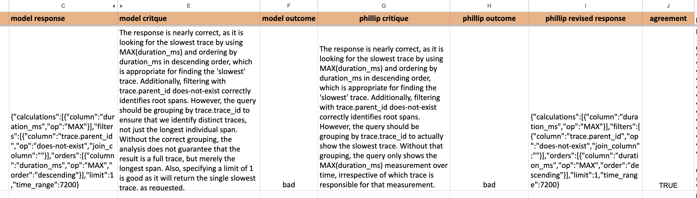

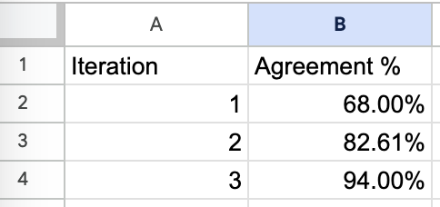

## Step 5 : Building the Judge

**Key design decisions:**

- Use a strong model (Claude Opus, GPT 5.x pro or Gemini 3.x pro)- judging is harder than generation
- Prompt the judge to produce reasoning before the final judgment (chain-of-thought)
- Include the same context the original model saw (retrieved docs, conversation history)
- Structure output as JSON: {"reasoning": "...", "judgment": "PASS\|FAIL", "confidence": "HIGH\|MEDIUM\|LOW"}

## Data Split

**Training Set** \~10-20% of labeled traces purpose - used for few-shot examples in the judge prompt

**Validation Set** \~40% of labeled traces, purpose - To iteratively test and refine judge prompt, used to measure agreement with human and calibrate the judge

**Test Set** \~40% of labeled traces, used for final evaluation of the judge's performance before deployment

## Step 6: Perform Error Analysis on the Judge

Run the judge on the same traces the human labeled. Compare:

| Metric | What It Measures | Target |
|------------------|-------------------------------------|------------------|
| **Accuracy** | Overall correct percentage | \> 85% |
| **Cohen's κ** | Agreement corrected for chance | \> 0.7 (good), \> 0.8 (excellent) |
| **True Positive Rate** | Catches failures that are real | \> 80% |
| **True Negative Rate** | Doesn't flag good outputs as failures | \> 80% |
| **Calibration** | Confidence scores match actual accuracy | Well-calibrated confidence |

. . .

If agreement is low, iterate:

- Add more few-shot examples where the judge failed
- Refine the rubric based on disagreement patterns
- Try a different judge model
- Split into specialized judges for different failure modes

## Step 7 : Running the Judge

- After validation, run the judge on synthetic or real world traffic
- Classify traces and identify classes of failures
- Prioritize fixes based on frequency and impact

## Create More Specialized Judges (if needed)

One general judge may not catch all failure modes.

- **Factual accuracy judge:** Focuses on grounding claims in retrieved context
- **Tone/style judge:** Evaluates brand voice, user-appropriateness
- **Completeness judge:** Checks that all parts of the user's request were addressed

*Each specialized judge follows the same 7-step process but with a narrower scope.*

## Correcting for Judge Bias

- Use judge calibration metrics to estimate the **true system failure rate**
- Inputs: **True Positive Rate (TPR)** and **False Positive Rate (FPR)**
- Example:
  - Judge reports **20% failures**
  - **FPR = 10%** → some flagged failures are actually good outputs
  - **TPR = 90%** → some real failures are still missed
- Apply **Bayesian correction** to adjust the observed failure rate
- Add **confidence intervals** to reflect uncertainty in TPR/FPR estimates
- Why it matters:
  - Avoid false alarms in production
  - Avoid missing real quality regressions

## Building a Judge - Workflow Summary

**High-level flow:**

``` text
Domain Expert Reviews Traces
        ↓
Makes Pass/Fail Judgments + Written Critiques
        ↓
Critiques Become Training Signal
        ↓
Build LLM-as-Judge (with few-shot examples from critiques)
        ↓
Validate Against Human Labels (κ, accuracy, TPR/FPR)
        ↓
Iterate Until Agreement Threshold Met
        ↓
Deploy Judge; Monitor; Feed Failures Back to Error Analysis
```

## Multi-turn Evaluation

When evaluating multi-turn conversations, three importaant aspects come to matter:

. . .

- **Context and Memory:** Does the AI remember earlier parts of the conversation? How does behaviour change as the conversation lengthens?

. . .

- **Consistency:** Do responses align across turns without contradictions?

. . .

- **Overall Session Goals:** Unlike single turn-response pairs, we care whether the entire session achieved the user’s objective.

## Two Levels of Evaluation

**Session Level** (recommended starting point):

- Evaluates the entire conversation for goal achievement
- Uses binary pass/fail initially
- Example : A session fails if a prospect wanting a two-bedroom tour ends up with no clear tour options, even if individual responses were polite

**Turn Level** (for debugging):

- Assesses individual turn-by-turn responses
- Measures quality, relevance, correctness, safety, tone
- Challenging to scale across long conversations
- Used specifically when you’re debugging an overall problem identified at session level

## Key Strategies for Multi-turn Evaluation

1.  **Start at session level**, zoom to turn level only for debugging
2.  **Try to isolate multi-turn failures** as single-turn tests to determine if they’re truly multi-turn issues
3.  **For true multi-turn issues**, freeze the conversation at the failure point and use that as your iteration baseline
4.  **Deliberately perturb your traces** to test system robustness
5.  **Vary conversation lengths** in your test set to catch performance degradation


## Judging Paradigms

From Zheng et al. (MT-Bench and Chatbot Arena), three ways to structure LLM-as-judge evaluation:

- **Pointwise (Absolute Scoring)**
- **Pairwise (Head-to-Head Comparison)**
- **Listwise (Ranking Multiple Outputs)**

## Pointwise (Absolute Scoring)

The judge scores a single output against a rubric.

**Prompt template:**

``` text
Evaluate the following response to the user's query.

User query: {query}
Response: {response}

Rate the response on a scale of 1–5 based on these criteria:
[CRITERIA]

Provide your reasoning first, then the final score.
```

## Pointwise (Absolute Scoring)

**When to use:**

- You have clear rubrics and want consistent scoring
- You need to compare against a threshold ("is this good enough?")
- You want to track score distributions over time

. . .

**Problems:**

- Judges tend to cluster scores in the middle (low discrimination)
- Score drift over time (a "4" today may not mean the same as a "4" last month)
- Hard to compare across different prompts

> Use binary pass/fail instead of 1–5. The rubric becomes a checklist of requirements. The judge checks each and returns PASS or FAIL.

## Pairwise (Head-to-Head Comparison)

The judge sees two responses to the same prompt and picks the better one.

**Prompt template:**

``` markdown
Compare Response A and Response B to the following query.

Query: {query}
Response A: {response_a}
Response B: {response_b}

Which response is better? Consider: helpfulness, accuracy, completeness, clarity.
First explain your reasoning, then state your final verdict: [[A]] or [[B]] or [[tie]]
```

## Pairwise (Head-to-Head Comparison)

**When to use:**

- Comparing two model variants or prompt versions
- A/B testing
- Building ranked datasets for fine-tuning

. . .

**Problems:**

- Position bias (judge favors the first response shown)
- Non-transitivity (A \> B, B \> C, but C \> A)
- O(n²) comparisons needed for n variants

. . .

**Mitigations:**

- Swap position (show A first, then B first) and average
- Use consistent position randomization
- Require reasoning before verdict

## Listwise (Ranking)

The judge sees N responses and ranks them all.

**Prompt template:**

``` markdown
Rank the following responses to the query from best to worst.
Query: {query}
Response 1: {response_1}
Response 2: {response_2}
...
Response N: {response_n}
Consider helpfulness, accuracy, completeness, clarity. First explain your reasoning, then provide a final ranking.
```

## Listwise (Ranking)

**When to use:**

- Comparing many variants at once
- Building leaderboards
- When you need a total order

. . .

**Problems:**

- Cognitive load increases with N (judge quality degrades)
- Most LLMs struggle to rank more than 5–7 items reliably
- O(n log n) comparisons in tournament style, but single-call listwise is O(n)

. . .

**Recommendation:**

For most applications, **pointwise with binary pass/fail** or **pairwise with position-swapping** (Chatbot Arena's approach) are the right choices.

## Judge Biases and Mitigations

::: {style="font-size: 0.72em;"}
| Bias | Description | Evidence | Mitigation |
|----------------|---------------------|----------------|-------------------|
| **Position bias** | Favors response in first position | Zheng et al.: 70%+ preference for first position in some models | Swap positions; average results; randomize order |
| **Length bias** | Prefers longer responses | Wang et al. (2024): length correlates with score even when content is identical | Length-controlled prompting; normalize by length; penalize verbosity |
| **Self-preference** | Model favors outputs from its own family | Zheng et al.: GPT-4 prefers GPT-4 outputs; Claude prefers Claude outputs | Use a different model family for judging; don't use same-model-as-judge |
| **Verbosity bias** | Equates word count with quality | Arena data: verbose responses win more often | Require conciseness in rubric; count tokens as cost, not quality |
| **Style bias** | Prefers confident, assertive tone | Chen et al. (2024): judges score confident wrong answers higher than hedged correct ones | Include "appropriately hedged" in rubric; penalize overconfidence |
| **Recency bias** | Remembers recent examples better | Affects few-shot prompting patterns | Randomize few-shot example order; use consistent sets |
:::

## Judge Biases and Mitigations

Practical guidance:

- For **self-evaluation** (monitoring your own system): same model is acceptable but watch for inflated scores

- For **comparative evaluation** (A vs B testing): always use a third model or human judges

- Use a stronger model for judging than for generation

## Calibration: Measuring Judge Quality - Cohen's Kappa (κ)

Measures inter-annotator agreement (*Judge and Human*) corrected for chance.

``` text

Cohen's κ = (p_o - p_e) / (1 - p_e)

where:
  p_o = observed agreement (both say pass, or both say fail)
  p_e = expected agreement by chance
```

| κ Value   | Interpretation           | Usable as Judge?               |
|-----------|--------------------------|--------------------------------|
| \< 0.2    | Slight agreement         | No                             |
| 0.2 – 0.4 | Fair agreement           | No                             |
| 0.4 – 0.6 | Moderate agreement       | Marginal,needs improvement     |
| 0.6 – 0.8 | Substantial agreement    | Yes, good enough for most uses |
| 0.8 – 1.0 | Almost perfect agreement | Yes, excellent                 |

**Target: κ \> 0.7** for a production judge. Below 0.6, the judge's signal is too noisy to be useful.

## True Positive Rate and True Negative Rate

Beyond overall agreement, you need to know what kind of errors the judge makes:

- **TPR (Recall):** Of all real failures, what fraction does the judge catch?\
  `TPR = True Positives / (True Positives + False Negatives)`

- **TNR (Specificity):** Of all good outputs, what fraction does the judge correctly pass?\
  `TNR = True Negatives / (True Negatives + False Positives)`

Both should be \> 80%. A judge with high TPR but low TNR fires false alarms constantly. A judge with high TNR but low TPR misses real problems.

## Length-Controlled Scoring

1.  **Measure length correlation:** Compute correlation between response length and judge score
2.  **If correlation \> 0.3:** Length bias is significant
3.  **Mitigations:**
    - Add explicit instruction: "Do not consider response length in your evaluation"
    - Normalize: judge scores the *content* not the *volume*
    - Penalize verbosity: "A shorter response that fully answers the question is better than a longer one"
    - Use pairwise comparison (length difference is less salient when comparing two responses)

## Rubric Design

**Binary vs Likert vs Structured**

::: {style="font-size: 0.72em;"}
| Format | Pros | Cons | When to Use |
|----------------|----------------|----------------|-------------------------|
| **Binary (PASS/FAIL)** | High agreement; actionable; easy to automate; clear threshold | Loses granularity for "how bad?" | Default for all evaluators |
| **Likert (1–5)** | Granular; can detect gradual improvement | Low inter-annotator agreement; score drift; ambiguous what "3" means | Only when tracking gradual improvement on a stable rubric |
| **Structured (per-dimension)** | Pinpoints specific weaknesses; actionable debugging | More annotation effort; complex to automate | When you need to diagnose *which* aspect failed |
:::

> *"Start with binary labels to understand what 'bad' looks like. Numeric labels are advanced and usually not necessary."*

## Rubric Design

``` text
Instead of: "Rate factual accuracy 1–5"
Use:       "Does the response contain any claims not supported by the retrieved context? [YES/NO]"
           "Does the response correctly state the return policy? [YES/NO]"
           "Does the response include all numerical claims from the source? [YES/NO]"
```

This preserves the actionability of binary labels while providing diagnostic granularity.

## Writing Effective Rubrics

::: {style="font-size: 0.72em;"}
1.  **Make it task-specific, not generic**
    - Bad: "Rate the quality of this response"
    - Good: "The response must include the user's dietary restriction. The response must not suggest foods containing the restricted ingredient."
2.  **Include examples (few-shot)**
    - Show 2–3 examples of passing responses with why they pass
    - Show 2–3 examples of failing responses with why they fail
3.  **Define the decision boundary explicitly**
    - What exactly constitutes a failure? Be precise enough that two people would agree.
4.  **Separate criteria into independent checks**
    - Each criterion should be independently assessable
    - Avoid compound criteria: "accurate and helpful and concise" → three separate checks
5.  **Iterate based on disagreement**
    - When the judge disagrees with the human, the rubric is probably ambiguous
    - Refine the rubric, not just the judge prompt
:::

## Meta-Evaluation

- **Ensembling Judges**: When one judge isn't enough, consider multiple:

- **Swap-and-Average (for pairwise)** - Run each comparison twice with positions swapped. Average the results. Eliminates position bias at 2× cost.

- **Majority Voting (3 judges)** - Run 3 different judges on the same output. Take the majority judgment. Reduces variance from any single judge's biases.

  ```         
    - Cost: 3× single judge
    - Agreement improvement: typically 5–15% boost in κ
    - Worth it when: stakes are high, judge quality is marginal, you need production monitoring
  ```

## RAG Metrics

- Recall\@k: Do all relevant chunks for a query appear in your top K results? (**most important**)
- Precision\@k: Is the top-k retrieved documents relevant?
- MRR (Mean Reciprocal Rank): How high is the best relevant document ranked?
- nDCG (normalized Discounted Cumulative Gain): Are relevant documents ranked higher than irrelevant

## What NOT to Do

This section draws from Hamel's FAQ and other blogs to cover common anti-patterns.

## Do Not Use Generic Ready-to-Use Metrics

**Why generic metrics fail:**

- They measure abstract qualities ("helpfulness," "coherence," "quality") that may not matter for your use case
- Good scores on generic metrics don't mean your system works for your users
- They create a cargo cult: teams optimize for the metric instead of the user outcome
- They waste engineering time on superfluous tasks

**The exception : using generic metrics for exploration:**

Experienced practitioners *do* use generic metrics - just not as evaluations.

Once you understand why generic metrics fail as evaluations, you can repurpose them as **exploration tools**:

- BERTScore can surface traces with anomalous semantic patterns (worth human review)
- ROUGE can identify outputs that diverge significantly from expected patterns
- "Helpfulness" scores can sort traces for prioritization

> **Key distinction:** Use generic metrics to *find traces worth reviewing*, not to *judge quality*.

## Do Not Practice Eval-Driven Development

> *"LLMs have infinite surface area for potential failures. You can't anticipate what will break."*

::: {style="font-size: 0.72em;"}
**The problem:**

- TDD works because you know what "correct" looks like (a function returns the right value)
- LLM outputs have emergent failure modes you can't predict
- Writing evaluators for imagined failures wastes effort
- Premature evals constrain exploration and create blind spots

**The right approach:** Error-analysis-driven development.

1.  Build the feature
2.  Test it manually (error analysis)
3.  Find real failure modes
4.  Write evaluators for persistent failures
5.  Iterate

**The exception:**

- Hard constraints where you know exactly what success looks like ("never mention competitors," "always include a disclaimer")
- Regression tests for previously-fixed bugs (prevent recurrence)
- Safety/evaluator constraints that are policy requirements (not quality optimization)
:::

## Do Not Build an Evaluator for Every Failure Mode

**The cost hierarchy matters.** Many failures are:

- One-off bugs (fix and move on - no evaluator needed)
- Prompt issues (fix the prompt - evaluator becomes unnecessary)
- Obvious constraints (use an assertion, not an LLM judge)

Build LLM-as-judge evaluators **only** for:

- Persistent generalization failures (survive prompt fixes)
- Subjective qualities that assertions can't capture
- Failure modes you'll iterate on repeatedly

## Do Not Outsource Core Annotation

::: {style="font-size: 0.72em;"}
**Why outsourcing fails:**

- External annotators lack product context
- Misalignment on quality criteria leads to noisy labels
- Time spent onboarding annotators exceeds time for internal review
- Core product understanding diffuses outside the team

**When external help is appropriate:**

- Purely mechanical tasks (identifying phone numbers, validating email format) - after rigorous internal rubric
- Tasks without product context (translation quality - requires linguistic expertise, not product knowledge)
- Engaging external SMEs to act as your internal domain expert (not annotators - advisors)

**Example** AnkiHub hired 4th-year medical students to evaluate their RAG system for medical content. These are annotators with domain expertise, not generic annotators.
:::

## Do Not Automate Open Coding with LLMs

LLMs can help with axial coding (organizing patterns), but **never outsource the initial open coding:**

::: {style="font-size: 0.72em;"}
**Example** : 'An LLM might lump "app crashes after login" and "login takes too long" under "login issues" - but these are completely different problems requiring different fixes. Only human review catches the nuance that matters'

**What LLMs *can* help with in the eval workflow:**

- First-pass axial coding (after you've done 30–50 open codes)
- Mapping annotations to defined failure modes
- Suggesting prompt improvements
- Analyzing annotation data for patterns

**What LLMs *cannot* replace:**

- Initial open coding and trace review
- Validating failure taxonomies (need human review)
- Ground truth labeling for judge calibration
- Root cause analysis (subtle workflow-specific patterns)

> *"Always read through the raw traces yourself at the start. This is how you discover new types of failures, understand user pain points, and build intuition about your data. Never skip this or delegate it."* - Hamel FAQ
:::


## CI/CD vs Production Evaluation

| Dimension | CI/CD Evaluation | Production Evaluation |
|------------------|------------------------|-------------------------------|
| **Dataset** | Small (100+ examples), purpose-built, curated | Sampled from live traffic, large, uncurated |
| **Focus** | Regression prevention, known edge cases | Drift detection, novel failure modes |
| **Checks** | Fast, deterministic (assertions, regex) | Can use slower LLM-as-judge (async) |
| **Frequency** | Every PR, every deployment | Continuous sampling |
| **Cost constraint** | Tight (runs many times) | Looser (async, batched) |
| **Action on failure** | Block deployment | Alert, investigate, add to CI dataset |

## The Regression Gate

**Purpose:** Prevent known failures from recurring. Block bad deployments.

**Dataset characteristics:**

- Covers core features and regression tests for past bugs
- Small enough to run quickly and cheaply
- Favors deterministic checks over LLM-as-judge (cost and speed)

**Implementation:**

``` python
# Fast, deterministic CI checks
def ci_eval_suite(output, trace):
    checks = [
        assert_json_schema(output, expected_schema),
        assert_contains_required_facts(output, required_facts),
        assert_no_disallowed_content(output, blocklist),
        assert_response_time(trace.latency, max_ms=2000),
    ]
    return all(checks)
```

## Production: The Monitoring Layer

**Purpose:** Detect novel failures and drift. Feed learnings back into CI.

**Dataset characteristics:**

- Sampled from production traffic (you don't control the inputs)
- No reference outputs (evaluate quality without knowing "correct")
- Large volume allows statistical significance

**Implementation:**

``` python
# Async production evaluation
async def production_eval(trace_batch):
    # Run LLM-as-judge on sampled traces
    results = await judge.evaluate_batch(trace_batch)
    
    # Track metrics over time
    metrics.log("failure_rate", results.failure_rate)
    metrics.log("avg_latency", results.latency)
    metrics.log("judge_confidence", results.confidence)
    
    # Alert on anomalies
    if results.failure_rate > threshold:
        alert("Elevated failure rate detected")
    
    # Feed novel failures back to CI dataset
    for failure in results.new_failures:
        ci_dataset.add(failure.trace)
```

## Guardrails vs Evaluators

::: {style="font-size: 0.72em;"}
| Dimension | Guardrails | Evaluators |
|-------------------|---------------------------|---------------------------|
| **When they run** | Inline, synchronous, before user sees output | Async or batch, after response |
| **Speed requirement** | Fast (milliseconds) | Can be slow (seconds acceptable) |
| **Complexity** | Simple, deterministic (regex, keyword lists, schema validation) | Complex, nuanced (LLM-as-judge) |
| **Action on failure** | Block, redact, refuse, or regenerate | Log, alert, feed into improvement loop |
| **What they catch** | Clear-cut, high-impact failures (PII, profanity, malformed JSON) | Subjective qualities (factual accuracy, tone, completeness) |
| **False positive cost** | High (blocks good outputs = user friction) | Low (doesn't block, just reports) |

**The relationship:**

- Guardrails protect users from immediate harm
- Evaluators help you improve quality over time
- When production evaluators reveal a clear-cut failure pattern, consider promoting it to a guardrail
- Don't use off-the-shelf LLM guardrails blindly - always look at the prompt
:::

## Prompt Versioning

**Version prompts in Git.**

- Version control every prompt change
- Link prompt versions to evaluation results (which eval was run against which prompt)
- Rollback capability when a change degrades quality
- Use notebooks or an integrated prompt environment for experimentation
- Promote to Git only after eval validation

**The workflow:**

1.  Experiment with prompt changes in a notebook
2.  Run eval suite against the new prompt
3.  Compare results to baseline
4.  If improvement or no regression: commit the prompt change with eval results
5.  If regression: iterate or revert

## Cost, Latency, and Reliability as Co-Equal Metrics

| Dimension | Key Metrics | Why It Matters |
|------------------|------------------------|------------------------------|
| **Task accuracy** | Correctness, relevance, groundedness, completeness | Does it do the job? |
| **Latency** | Time to first token (TTFT), time per output token, end-to-end latency, p95/p99 | User experience; streaming perception |
| **Cost** | Tokens per request, cost per request, cost per feature, cost trends | Business viability at scale |
| **Reliability** | Success rate, error types, availability, recovery behavior | Trust and dependability |
| **Safety** | Unsafe content rate, PII exposure, guardrail activation rate | Risk management |

## Improving Accuracy: Quick Changes

**Prompt refinement**:

- Clarify ambiguous wording. Add targeted few-shot examples for specific failures. Use role-based guidance.

- Use role based guidance (persona) (*You're a expert lawyer...*) or audience role (*You're explainign to highschool student*)

**Induce Reasoning**

- For complex tasks (planning or logic), Induce CoT by prompting for non-reasoning models eg : 'Think Step by Step', 'Break down your reasoning', 'First list the facts, then draw a conclusion'

## Improving Accuracy: Medium-Effort Changes

**Task Decomposition**:

- Break complex tasks into smaller steps. Use a chain of calls to the model, with intermediate checks.

- Example : Instead of answering the user question directly, break down into three steps. 1. extract user intent 2. retrieve or call tools 3. Summarize the response

**Tuning RAG components**:

- Experiment with hybrid search or different retriever architectures.
- Try different chunking strategies

**Fixing tool misuse**:

- Clear tool descriptions, parameters, and expected formats matter

## Improving Accuracy: Advanced Strategies

**Fientuning**

- If prompting cannot fix, finetuning can help
- Create hundred or so examples for each failure mode
- Useful for high volume but narrow domains. Models keep getting better at few-shot prompting, so finetuning is often not worth the cost and effort for general use cases.
- More complex (data prep, training, deployment) and can introduce new failure modes if not done carefully. If base model changes, need to redo everything.

**Systematic prompt optimisation**

- Automatic prompt optimiuzation tools like DSPy can help here

**Human Review and Feedback Loops**

- Human reviewers can provide qualitative feedback on model outputs
- Feedback can be used to update prompts, retrain models, or adjust evaluation metrics
- Continuous feedback loops help maintain and improve model performance over time

## Cost Reduction Strategies

- Use cheaper models for easy tasks, expensive for harder tasks

- Develop with stronger models, swap out with cheaper models for easy components

- Reduce token usage by summarizing context, using xml or yaml (tool calls need JSON)

- Use prompt caching or prefix caching

- Model cascading: run a cheaper model first, only call the expensive model if the cheap one is uncertain (based on confidence or heuristics)

## Further Reading

- [A Field Guide to Rapidly Improving AI Products](https://hamel.dev/blog/posts/field-guide)
- [Your AI Product Needs Evals](https://hamel.dev/blog/posts/evals/)
- [Using LLM-as-a-Judge For Evaluation: A Complete Guide](https://hamel.dev/blog/posts/llm-judge/)
- [LLM Evals: Everything You Need to Know](https://hamel.dev/blog/posts/evals-faq/)
- [Evaluating the Effectiveness of LLM-Evaluators (aka LLM-as-Judge)](https://eugeneyan.com/writing/llm-evaluators/)
- [Lessons from A year of Building with LLMs](https://applied-llms.org/)
- [Error Analysis: The Highest ROI Technique In AI Engineering](https://www.youtube.com/watch?v=e2i6JbU2R-s)
- Evaluation Frameworks
  - DeepEval
  - BrainTrust
  - Arize