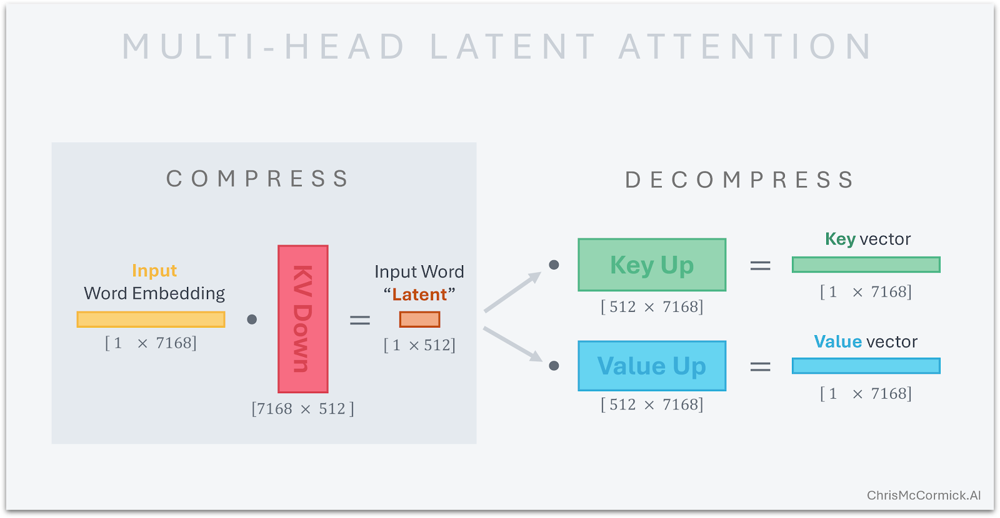

<div class="center-slide">

# LLMs : A Hands-on Approach 

### Modern Architectures
</div>

---

## Topics Covered

- **Modern LLM Architectures**
    - Positional Encodings
    - Attention Variants

---

## Recap : Current Models

<iframe src="https://docs.google.com/spreadsheets/d/e/2PACX-1vQsF7QOjxAI1f7ud_oYNLRBq6qa3ZzLqtMMF_1xOKKbi5qb6atwvgeYIp4pYjuGXHDTKXMO0IdxBaVw/pubhtml?gid=1330227995&amp;single=true&amp;widget=true&amp;headers=false" style="width:100%;height:100%;border:none;"></iframe>

---

## Pre-Norm vs Post-Norm

**Almost all models post-2020 use pre-norm.**


**Original Transformer** : Post Norm

`x → Attention(x) → Add → LayerNorm → FFN → Add → LayerNorm`


**GPT 2** : Pre-Norm

`x → LayerNorm → Attention → Add → LayerNorm → FFN → Add`

---

## LayerNorm vs RMSNorm


<div style="text-align: center;"> 
Strong consensus toward RMSNorm
</div>


<div style="display: flex; gap: 2rem;">

<div style="flex: 1;">

**LayerNorm** (original): 

Normalize by subtracting mean and dividing by std dev, then scale ($\gamma$) and shift ($\beta$):

$$y = \frac{x - E[x]}{\sqrt{Var[x] + \epsilon}} \cdot \gamma + \beta$$

*Models* : GPT-1/2/3, OPT, GPT-J, BLOOM

</div>

<div style="flex: 1; border-left: 2px solid #333; padding-left: 2rem;">

**RMSNorm** (modern): 

Drop the mean subtraction and bias term:

$$y = \frac{x}{\sqrt{||x||_2^2 + \epsilon}} \cdot \gamma$$

*Models* : LLaMA family, DeepSeek V3, Qwen3 etc

</div>


</div>

**Why RMSNorm**

 - Fewer operations: RMSNorm requires fewer computations (no mean subtraction, no bias term) which reduces both FLOPs and memory bandwidth.

---

## Activations & Gated Linear Units (Strong trend toward SwiGLU/GeGLU)

**Evolution of activations:**

| Activation | Formula | Notable Models |
|---|---|---|
| ReLU | $FF(x) = \max(0, xW_1)W_2$ | Original transformer, T5, Gopher, OPT |
| GeLU | $FF(x) = GELU(xW_1)W_2$ where $GELU(x) = x\Phi(x)$ | GPT-1/2/3, GPT-J, BLOOM |
| SwiGLU | $FF(x) = (Swish(xW) \otimes xV)W_2$ | LLaMA 1/2/3, PaLM, Mistral, *most post-2023* |
| GeGLU | $FF(x) = (GELU(xW) \otimes xV)W_2$ | T5 v1.1, mT5, Phi3, Gemma 2/3 |


where `Swish(x) = x * sigmoid(x)` and $\otimes$ is elementwise multiplication.

---

## Gated Linear Units (GLU)

**What do GLUs do?**

- GLUs add a **gating mechanism**
- Hidden representation element-wise multiplied by a gate $xV$ (learned linear projection)
- $xV$ controls information flow through the MLP

$$\text{Standard:} \quad \sigma(xW_1) \rightarrow \sigma(xW_1) \otimes (xV) \quad \text{(gated)}$$

<div style="margin-bottom:30px"></div>


---

## Position Encodings

**Evolution:**

| Type | How it works | Models |
|---|---|---|
| **Sinusoidal** | Add fixed sin/cos to embedding | Original Transformer |
| **Absolute (learned)** | Add learned position vector $u_i$ to embedding | GPT-1/2/3, OPT |
| **Relative** | Add learned bias to attention scores | T5, Gopher, Chinchilla |
| **ALiBi** | Linear attention bias | BLOOM |
| **NoPE** | No position embedding at all | SmolLM3, Kimi Linear |
| **RoPE** | Rotate query/key vectors | GPT-J, PaLM, LLaMA, **all 2024+ models** |

---

## Position Encodings

#### Why do we need Position Encodings?

**Attention is a position-agnostic operation**

- Treats the input as a **set**, not a sequence
- No inherent notion of order or position

**Example:**

*The dog chased another dog* vs *Another dog chased the dog*


- Both have the **same set of tokens**
- But **different meanings**

**Solution:** Add positional encodings to inject order information into the model


---

## Integer Posion Encoding

- Add the integer postion directly into embeddings.
- Problems:
    - Position encoding magnitude greater than token embedding magnitude
    - Model should separately learn to handle content and position, which can make learning harder.

<video controls src="https://huggingface.co/datasets/huggingface/documentation-images/resolve/main/blog/you-could-have-designed-SOTA-positional-encoding/IntegerEncoding.mp4" title="Int Encoding"></video>

---

## Binary Position Encoding

<video controls src="https://huggingface.co/datasets/huggingface/documentation-images/resolve/main/blog/you-could-have-designed-SOTA-positional-encoding/BinaryEncoding.mp4" title="Title"></video>

---

## Binary Position Encoding

<video controls src="https://huggingface.co/datasets/huggingface/documentation-images/resolve/main/blog/you-could-have-designed-SOTA-positional-encoding/BinaryPositionalEncodingPlot.mp4" title="Title"></video>


**Problems**:

- Hamming distance artifacts
- Sparse representations (most bits are zero, which can make learning harder)
- No lernable interpolation

---

## Sinusoidal Position Encoding

$$ PE_{(pos,2i)} = sin(pos/10000^{2i/d_{\text{model}}}) $$

$$ PE_{(pos,2i+1)} = cos(pos/10000^{2i/d_{\text{model}}}) $$


<video controls src="https://huggingface.co/datasets/huggingface/documentation-images/resolve/main/blog/you-could-have-designed-SOTA-positional-encoding/SteppedPositionalEncodingPlot.mp4" title="Title"></video>

---

## Sinusoidal Position Encoding


*Why **sin** and **cos***? 

$sin(a+b) = sin(a)cos(b) + cos(a)sin(b)$

$cos(a+b) = cos(a)cos(b) - sin(a)sin(b)$

*PE(pos+k)* is a linear function of *PE(pos)*


So 

$$
\begin{aligned}
\sin(\omega \cdot (p+k)) &= \sin(\omega p)\cos(\omega k) + \cos(\omega p)\sin(\omega k)
\end{aligned}
$$

$$
\begin{aligned}
\cos(\omega \cdot (p+k)) &= \cos(\omega p)\cos(\omega k) - \sin(\omega p)\sin(\omega k)
\end{aligned}
$$

<div style="margin-bottom:20px"> </div>

**Downsides** :

Sinusoidal PE is added to embeddings: $x_p = x_{token} + PE(p)$

Then projected: $q_p = W_q x_p$, $k_p = W_kx_p$

- Position and content are entangled before attention
- Relative position is implicit, not structural
- Attention must learn how to extract distance

---

## Absolute vs Relative Position Encodings


- *Absolute position encodings*  - Unique encoding to each position in the sequence. 

- *Relative position encodings* - Encodes the relative distance between tokens, rather than their absolute position.


**Why do we need them?**

- "The cat sat" should have similar relationships whether at positions [5,6,7] or [105,106,107]

- Absolute encodings make it harder to learn patterns based on relative distance (e.g., "the word two positions to the left of X")

**Benefits:**

- Learn patterns based on **relative distance** between tokens
- More important for many tasks than absolute position
- No reliance on fixed absolute positions

---

## Relative Position Encoding Example

**Example sentence:** *"The dog chased another dog"*

When attending from position 2 ("chased"):

| Position | Token | Absolute | Relative to pos 2 |
|---|---|---|---|
| 0 | The | 0 | -2 |
| 1 | dog | 1 | -1 |
| 2 | **chased** | 2 | **0** (self) |
| 3 | another | 3 | +1 |
| 4 | dog | 4 | +2 |

**In practice:**


```python
# T5-style relative attention bias
# For position i attending to position j:
relative_position = j - i  # e.g., "dog"(1) → "chased"(2) = 1 - 2 = -1

# Bias added to attention scores (learned, not fixed):
attention_score = (q_i @ k_j) + bias[clip(relative_position, -max_dist, max_dist)]
```

**Key differences from absolute:**
- Same relative pattern at any absolute position (e.g., "-1" always means "previous token")
- Model learns one bias per relative distance, not per absolute position

---

## Position Encoding : Desirable Properties

1. **Inject position information** into the model
2. **Allow generalization to longer sequences** than seen during training
3. **Facilitate learning of relative position patterns** (e.g., "the word   two positions to the left of X")
4. **Be computationally efficient** (not too many parameters or FLOPs)
5. **Be compatible with attention mechanism** (e.g., allow position information to influence attention scores)

---

## Rotary Position Embeddings (RoPE)

We want attention scores to depend only on *relative* position $(i - j)$, not absolute positions. 

Mathematically, find $f(x, i)$ such that:

$$\langle f(x, i), f(y, j) \rangle = g(x, y, i-j)$$

**RoPE's key idea:**
- Instead of adding PE to the input `x`, apply rotation to the query and key vectors based on their position. 
- Position information is directly encoded in the attention scores


---

## Encoding position as a rotation

**Rotating a 2D vector by an angle $\theta$** 

<div style="text-align:center"> 

$$
\begin{bmatrix}
x' \\\\
y'
\end{bmatrix} =
\begin{bmatrix}
\cos \theta & -\sin \theta \\\\
\sin \theta & \cos \theta
\end{bmatrix}
\begin{bmatrix}
x \\\\
y
\end{bmatrix}
$$ 

</div>


**Rotating a word vector**

Given a word vector $x = (x_1, x_2)$ at position $m$, we can rotate it by an angle $\theta_m$ to get the position-aware vector $x'$:

<div style="text-align:center"> 
$$
\begin{bmatrix}
x'_1 \\\\
x'_2
\end{bmatrix} =
\begin{bmatrix}
\cos \theta_m & -\sin \theta_m \\\\
\sin \theta_m & \cos \theta_m
\end{bmatrix}
\begin{bmatrix}
x_1 \\\\
x_2
\end{bmatrix}
$$ 
</div   >

---

## Dot product of rotated vectors

Let's rotate two vectors $q$ and $k$ by angles $\theta_q$ and $\theta_k$ respectively. 

$q' = R_{(\theta_q)} q$

$k' = R_{(\theta_k)} k$

The dot product of the rotated vectors is:
$$\begin{aligned}
q' \cdot k' &= (R(\theta_q) q) \cdot (R(\theta_k) k) \\
&= q^T R(\theta_q)^T R(\theta_k) k \\
&= q^T R(\theta_k - \theta_q) k
\end{aligned}$$

**Dot products depend only on relative rotation.**

Now attention scores depend on : `q`, `k`, and the **relative angle** $(\theta_k - \theta_q)$, which encodes the relative position between the two tokens.


---

## Rotations in higher dimensions


- In higher dimensions, we can apply **rotations in multiple planes**
    - Example: In 4D space, rotate independently in $(x_1, x_2)$ plane and $(x_3, x_4)$ plane

- For a $d$-dimensional vector:
    - Apply $\frac{d}{2}$ independent rotations
    - Each rotation has its own angle $\theta_m$
    - Encodes position information compatible with attention mechanism

- **Example**: Model with hidden dimension $d = 512$
    - Apply 256 independent rotations
    - Each pair of dimensions gets rotated by different frequency
    - Creates a rich positional representation

---

## Rotation in `m` dimensions


$\theta_i = B^{-2i/d} \quad \text{where } B \text{ is the base (typically 10000)}$

The wavelength of dimension $i$ is:

$$\lambda_i = \frac{2\pi}{\theta_i} = 2\pi \cdot B^{2i/d}$$

This creates a geometric progression of wavelengths:

- **Shortest wavelength** (highest freq, $i=0$): $\lambda_{\min} = 2\pi \approx 6.28$ tokens
- **Longest wavelength** (lowest freq, $i=d/2-1$): $\lambda_{\max} = 2\pi \cdot B \approx 62,832$ tokens (when $B=10000$)

---

## Computing Attention with RoPE

```python
class RoPEAttention(nn.Module):

    -----    

    def forward(self, x: torch.Tensor):    
        # Apply RoPE to queries and keys
        q = apply_rotary_emb(q, self.freqs_cis[:seq_len])
        k = apply_rotary_emb(k, self.freqs_cis[:seq_len])
                
        # Scaled dot-product attention
        scores = (q @ k.transpose(-2, -1)) / (self.head_dim ** 0.5)

```

**Key implementation details:**

1. **Precompute frequencies**: Calculate $\theta_i = 10000^{-2i/d}$ for all dimension pairs once
2. **Apply once per forward pass**: Rotate Q and K by position-dependent angles
3. **No extra parameters**: RoPE is fully deterministic, no learned weights


---

## Other Hyperparameters

- How many attention heads?
- How many layers?
- Hidden dimension size?
- FFN dimension size?
- Vocab size?


---

## Other Hyperparameters

#### FFN Dimensions

- Typical FFN dimension is 4x the hidden dimension (dff​=4⋅dmodel​)
- in *GLU variants* (SwiGLU, GeGLU), use 2/3 scaling to keep parameter count same

####
####
#### Number of attention heads

- Common choices are 16, 32, or 64 heads for large models. 
- The number of heads is often chosen to be a divisor of the hidden dimension for simplicity (e.g., 512 hidden dimension with 16 heads means each head has 32 dimensions).

#### 
####
#### Vocabulary size

**Monolingual models:** 30-50K tokens (Original Transformer: 37K, GPT-2/3: 50K, LLaMA: 32K)

**Multilingual/Production:** 100-250K tokens (GPT-4: 100K, PaLM: 256K, Qwen: 152K, Command A: 255K)

---
<div class="center-slide" >

## Efficent Attention Variants

</div>

---

## MHA Overview

 $\text{Attention}(Q, K, V) = \text{softmax}\left(\frac{QK^T}{\sqrt{d_k}}\right)V$

$$
\text{MultiHead}(Q, K, V) = \text{Concat}(\text{head}_1, \dots, \text{head}_h)W^O
$$


- **Scaled Dot-Product Attention**:
- $Q, K, V$: Query, Key, and Value matrices derived from input embeddings
- $d_k$: The dimensionality of the keys (and queries)
- $W^O$: Output projection matrix that combines the outputs of all heads into a single vector.
- $h$: The number of parallel attention heads.


---

## MHA - Generation Phase

**Generation Phase (Autoregressive Decoding):**

- Generate tokens **one at a time** autoregressively
- At each step, compute attention over **all previously generated tokens**
- Keys and Values for past tokens **remain unchanged**
- Only the new token's Query needs to attend to all previous Keys/Values


---

## MHA - Generation Phase

**Problem:** Without caching, we recompute K and V for all previous tokens at every step!

- Step 1: Compute K, V for token 1
- Step 2: Recompute K, V for tokens 1, 2
- Step 3: Recompute K, V for tokens 1, 2, 3
- ...
- Step N: Recompute K, V for all N tokens → **O(N²) redundant computation**

**Solution: KV Cache** — Store computed K and V vectors and reuse them


---

## KV Cache Memory Usage


**KV Cache size needed for MHA:**

| Parameter | Value |
|---|---|
| KV head dim | 128 |
| Sequence length | 32,768 |
| Num KV heads | 128 |

**Per-layer calculation:**

$$\text{KV cache} = \text{seq\_len} \times \text{num\_heads} \times \text{head\_dim} \times 2 \times 2$$

$$= 32768 \times 128 \times 128 \times 2 \times 2 = \textbf{2.14 GB per layer}$$

**Total for 61 layers:** ~ 131 GB (~ 4 MB per token)

| Attention Type | Memory per Token |
|---|---|
| **MHA** | 4 MB |


**Solution:** Reduce KV heads to 1 (MQA) or use more efficient attention variants (GQA, MLA)

---

## Multi-Query Attention (MQA)

<div style="display: flex; justify-content: space-between; align-items: center;">
    <div style="flex: 1; padding: 10px;">
        
    </div>
    <div style="flex: 1; padding: 10px;">
        
    </div>
</div>


**Key Insight:** Reduce number of KV heads to 1 = **MQA (Multi-Query Attention)**

$$\text{KV Cache} = 32768 \times 128 \times 1 \times 2 \times 2 = \textbf{16 MB per layer}$$

For all 61 layers: **~1 GB total** (~32 KB per token)

**128× reduction in KV cache memory!**

| Attention Type | Memory per Token |
|---|---|
| **MHA** | 4 MB |
| **MQA** | 32 KB |

---

## Grouped-Query Attention (GQA)

<div style="display: flex; justify-content: space-between; align-items: center;">
    <div style="flex: 1; padding: 10px;">
        
    </div>
    <div style="flex: 1; padding: 10px;">
        
    </div>
</div>

**Key Insight:** Use 1 KV head for each group of query heads (e.g., 1 KV head for 8 query heads)

- Balance between MHA (full expressivity) and MQA (maximum efficiency)
- If 8 Query heads share 1 KV head

| Attention Type | Memory per Token |
|---|---|
| **MHA** | 4 MB |
| **MQA** | 32 KB |
| **GQA** | 500 KB |

**8× reduction compared to MHA, while preserving more expressivity than MQA**

---

## Multi-head Latent Attention (MLA)


<div style="display: flex; justify-content: space-between; align-items: center;">
    <div style="flex: 1; padding: 10px;">
        
    </div>
    <div style="flex: 1; padding: 10px;">
        
    </div>
</div>


**Key Insight:** Compress K and V into a low-dimensional **latent vector** before caching

- Project hidden states into a compressed latent representation $c^{KV}$ (e.g., 512 dims)
- Cache only the compressed latent, not full K and V
- Reconstruct K and V from latent during attention computation


---

## DeepSeek V3 MLA

**KV Cache size for MLA (DeepSeek V3):**

| Parameter | Value |
|---|---|
| KV compression dim ($d_c$) | 512 |
| RoPE dim ($d_r$) | 64 |
| Sequence length | 32,768 |

**Per-layer calculation:**

$$\text{MLA cache} = \text{seq\_len} \times (d_c + d_r) \times 2$$

$$= 32768 \times (512 + 64) \times 2 = \textbf{37.7 MB per layer}$$

**Total for 61 layers:** ~ 2.3 GB (~ 70 KB per token)

| Attention Type | Memory per Token |
|---|---|
| **MHA** | 4 MB |
| **MQA** | 32 KB |
| **GQA (8 groups)** | 500 KB |
| **MLA** | 70 KB |

**~57× reduction compared to MHA, ~7× reduction compared to GQA**


---

## QK-Norm (Attention Softmax Stability)

**Concept**: Apply LayerNorm to Query ($Q$) and Key ($K$) vectors before computing dot-product attention.

LayerNorm has evolved from Post-Norm (Transformer) to Pre-Norm (GPT-2) and now directly into the attention mechanism (QK-Norm) 


---

## Further Reading

[The Big LLM Architecture Comparison](https://magazine.sebastianraschka.com/p/the-big-llm-architecture-comparison)