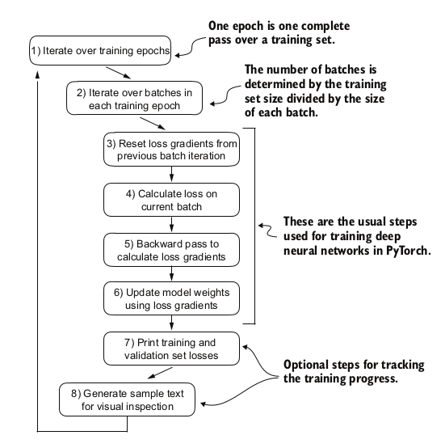
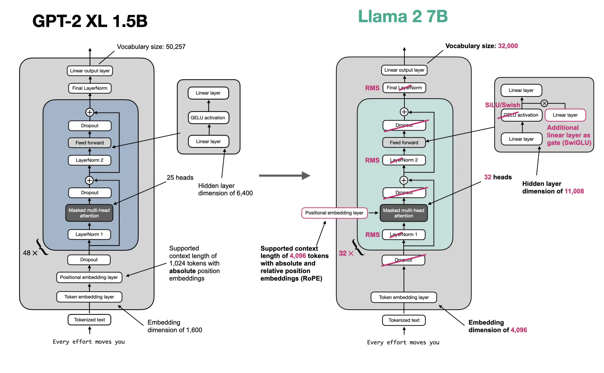
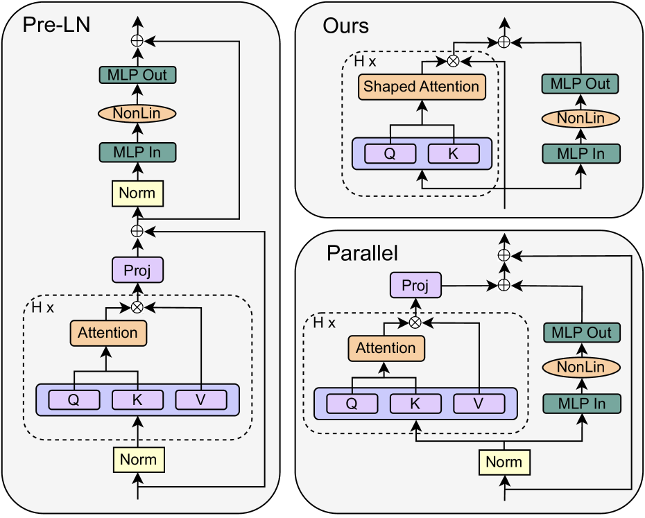
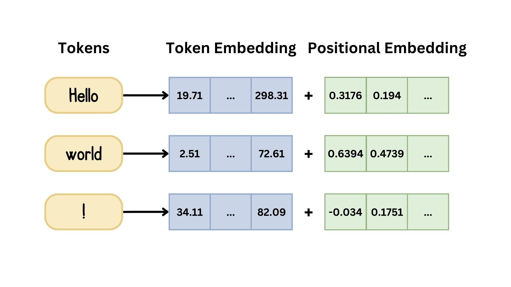
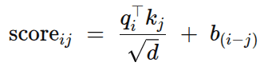
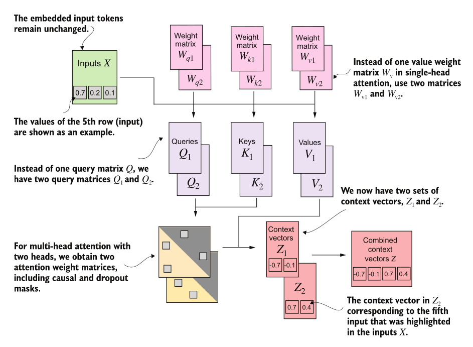
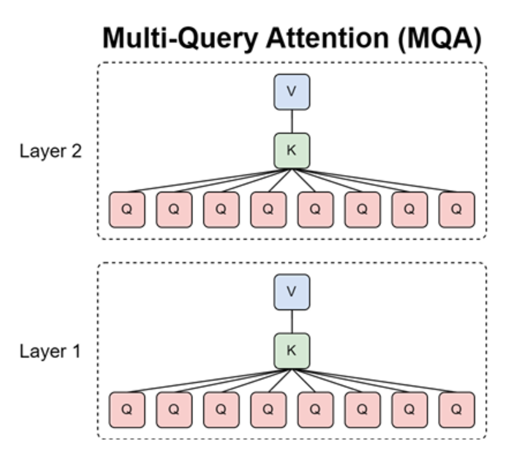
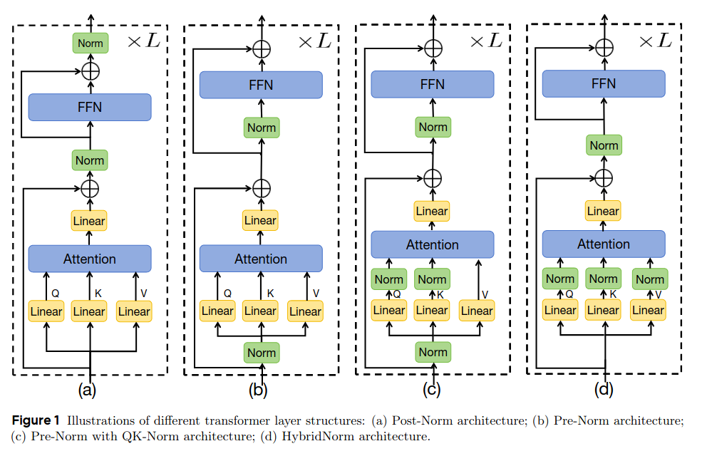

<div class="center-slide">

# LLMs : A Hands-on Approach 

### Modern Architectures
</div>

---

## Topics Covered

- **GPT-2 Review**
    - Training Loop
- **Modern LLM Architectures**
    - Norm Types
    - Activation Functions
    - Positional Encodings
    - Attention Variants
    - Hyperparameters

---


## Recap : GPT-2 Training Loop

During Training we update model weights to minimize loss through **backpropagation** and **gradient descent**.




**Training Loop in code**

```python

    for epoch in range(num_epochs):
        model.train()  # Enable dropout

        for input_batch, target_batch in train_loader:
            optimizer.zero_grad()  # Reset gradients

            loss = calc_loss_batch(input_batch, target_batch, model, device)
            loss.backward()        # Calculate gradients
            optimizer.step()       # Update weights

```
---
##  Loading and Saving Model Weights


**We must save trained models to:**

- Avoid retraining
- Share models with others
- Resume training later
- Deploy to production


```python
# ============ SAVE ============

torch.save(model.state_dict(), "model.pth")

# Save model + optimizer (for resuming training)
torch.save({
    "model_state_dict": model.state_dict(),
    "optimizer_state_dict": optimizer.state_dict(),
}, "model_and_optimizer.pth")


# ============ LOAD ============
# Load weights into fresh model
model = GPTModel(GPT_CONFIG_124M)
model.load_state_dict(torch.load("model.pth", map_location=device))
model.eval()  # Set to evaluation mode

# Resume training
checkpoint = torch.load("model_and_optimizer.pth", map_location=device)
model = GPTModel(GPT_CONFIG_124M)
model.load_state_dict(checkpoint["model_state_dict"])

optimizer = torch.optim.AdamW(model.parameters(), lr=5e-4, weight_decay=0.1)
optimizer.load_state_dict(checkpoint["optimizer_state_dict"])
model.train()  # Set to training mode
```

---

## LLM Loss Surfaces

LLM training optimizes a **high-dimensional non-convex loss surface** defined by:


$$
\mathcal{L}(\theta) = -\frac{1}{N} \sum_{i=1}^{N} \log P_\theta(x_i^{\text{target}})
$$

Key properties:

- Billions of parameters
- Extremely overparameterized
- Many equivalent minima
- Flat basins dominate

More details in :
 - [Unveiling the Basin-Like Loss Landscape in Large Language Models](https://arxiv.org/html/2505.17646v2)
 - [Visualizing the Loss Landscape of Neural Nets](https://www.youtube.com/watch?v=lyZorUc8Gm4)

---

<div class="center-slide">

## Modern Architectures

</div>

---

## GPT-2 Architecture

**Position embedding**: learned, absolute

**FFN**: GELU

$$ \text{FFN}(x) = GELU(xW_1 + b_1)W_2 + b_2 $$


**Norm type**: Pre-Norm, LayerNorm


---

## Current Models

<iframe src="https://docs.google.com/spreadsheets/d/e/2PACX-1vQsF7QOjxAI1f7ud_oYNLRBq6qa3ZzLqtMMF_1xOKKbi5qb6atwvgeYIp4pYjuGXHDTKXMO0IdxBaVw/pubhtml?gid=1330227995&amp;single=true&amp;widget=true&amp;headers=false" style="width:100%;height:100%;border:none;"></iframe>

---

## Llama 2, LlaMA 3 and Qwen 3 Architectures

**Position embedding**: RoPE (rotary position embeddings)

**FFN**: \*GLU variant (SwiGLU for LLaMA, GeGLU for Qwen)

$$
\textbf{SwiGLU}(x) = \text{Swish}(xW) \otimes (xV)W_2
$$

**Norm type**: Post-Norm, RMSNorm



---

## Pre-Norm vs Post-Norm

**Almost all models post-2020 use pre-norm.**


**Original Transformer** : Post Norm

`x → Attention(x) → Add → LayerNorm → FFN → Add → LayerNorm`


**GPT 2** : Pre-Norm

`x → LayerNorm → Attention → Add → LayerNorm → FFN → Add`

---

## Pre-Norm vs Post-Norm

<image src="images/pre-post-ln.png" >

**Why pre-norm wins:**

- Better gradient flow throrugh residual connections. 
- Practical evidence: almost all modern LLMs use pre-norm


**Note** : Double norm also used in some models, but not as common as pre-norm. It applies LayerNorm both before and after the sub-layer.


*Question* : `BERT was trained with post-norm and it was huge success. But most models use pre-norm. Why?`

---

## LayerNorm vs RMSNorm


<div style="text-align: center;"> 
Strong consensus toward RMSNorm
</div>


<div style="display: flex; gap: 2rem;">

<div style="flex: 1;">

**LayerNorm** (original): 

Normalize by subtracting mean and dividing by std dev, then scale ($\gamma$) and shift ($\beta$):

$$y = \frac{x - E[x]}{\sqrt{Var[x] + \epsilon}} \cdot \gamma + \beta$$

*Models* : GPT-1/2/3, OPT, GPT-J, BLOOM

</div>

<div style="flex: 1; border-left: 2px solid #333; padding-left: 2rem;">

**RMSNorm** (modern): 

Drop the mean subtraction and bias term:

$$y = \frac{x}{\sqrt{||x||_2^2 + \epsilon}} \cdot \gamma$$

*Models* : LLaMA family, DeepSeek V3, Qwen3 etc

</div>


</div>

**Why RMSNorm**

 - Fewer operations: RMSNorm requires fewer computations (no mean subtraction, no bias term) which reduces both FLOPs and memory bandwidth.

---

## Dropping bias Terms in FFN and LayerNorm

Most modern transformers have **no bias terms** in linear layers or LayerNorm.

Original: $FFN(x) = \max(0, xW_1 + b_1)W_2 + b_2$

Modern: $FFN(x) = \sigma(xW_1)W_2$
SiLU activation is used instead of ReLU, but the key point is that **bias terms are removed**.

**Reasons:**

1. Same memory/data movement argument as RMSNorm -- fewer parameters to load
2. **Optimization stability** -- empirically, dropping bias terms stabilizes training of very large networks


***LayerNorm Recap***

- Most models use RMSNorm
- Almost all models use pre-norm

---

## Activations & Gated Linear Units (Strong trend toward SwiGLU/GeGLU)

**Evolution of activations:**

| Activation | Formula | Notable Models |
|---|---|---|
| ReLU | $FF(x) = \max(0, xW_1)W_2$ | Original transformer, T5, Gopher, OPT |
| GeLU | $FF(x) = GELU(xW_1)W_2$ where $GELU(x) = x\Phi(x)$ | GPT-1/2/3, GPT-J, BLOOM |
| SwiGLU | $FF(x) = (Swish(xW) \otimes xV)W_2$ | LLaMA 1/2/3, PaLM, Mistral, *most post-2023* |
| GeGLU | $FF(x) = (GELU(xW) \otimes xV)W_2$ | T5 v1.1, mT5, Phi3, Gemma 2/3 |


where `Swish(x) = x * sigmoid(x)` and $\otimes$ is elementwise multiplication.

---

## Gated Linear Units (GLU)

**What do GLUs do?**

- GLUs add a **gating mechanism**
- Hidden representation element-wise multiplied by a gate $xV$ (learned linear projection)
- $xV$ controls information flow through the MLP

$$\text{Standard:} \quad \sigma(xW_1) \rightarrow \sigma(xW_1) \otimes (xV) \quad \text{(gated)}$$

<div style="margin-bottom:30px"></div>


---

## Gated Linear Units (GLU)


**More number of parameters?**

*The extra parameter V* means GLU models have 3 weight matrices *(W, V, W2)* instead of 2. 

How to keep parameter count the same? (memory is the real bottleneck, not compute)


---

## Gated Linear Units (GLU)


**More number of parameters?**

*The extra parameter V* means GLU models have 3 weight matrices *(W, V, W2)* instead of 2. 

How to keep parameter count the same? (memory is the real bottleneck, not compute)

**Scale the FF Params** 

---

## Gated Linear Units (GLU)


**More number of parameters?**

*The extra parameter V* means GLU models have 3 weight matrices *(W, V, W2)* instead of 2. 

How to keep parameter count the same? (memory is the real bottleneck, not compute)

**Scale the FF Params** 
- Standard MLP
    -  $W_1 \in \mathbb{R}^{d \times d_{ff}}$ + $W_2 \in \mathbb{R}^{d_{ff} \times d}$ = $2 \cdot d \cdot d_{ff}$ params
    - Total FFN params = $2 \cdot d \cdot 4 d$ = $8 \cdot d^2$.


---

## Gated Linear Units (GLU)


**More number of parameters?**

*The extra parameter V* means GLU models have 3 weight matrices *(W, V, W2)* instead of 2. 

How to keep parameter count the same? (memory is the real bottleneck, not compute)

**Scale the FF Params** 
- Standard MLP
    -  $W_1 \in \mathbb{R}^{d \times d_{ff}}$ + $W_2 \in \mathbb{R}^{d_{ff} \times d}$ = $2 \cdot d \cdot d_{ff}$ params
    - Total FFN params = $2 \cdot d \cdot 4 d$ = $8 \cdot d^2$.

- Gated MLP: 
    - $W \in \mathbb{R}^{d \times d_{ff}}$ + $V \in \mathbb{R}^{d \times d_{ff}}$ + $W_2 \in \mathbb{R}^{d_{ff} \times d}$ = $3 \cdot d \cdot d_{ff}$ params. 


---


## Gated Linear Units (GLU)


**More number of parameters?**

*The extra parameter V* means GLU models have 3 weight matrices *(W, V, W2)* instead of 2. 

How to keep parameter count the same? (memory is the real bottleneck, not compute)

**Scale the FF Params** 
- Standard MLP
    -  $W_1 \in \mathbb{R}^{d \times d_{ff}}$ + $W_2 \in \mathbb{R}^{d_{ff} \times d}$ = $2 \cdot d \cdot d_{ff}$ params
    - Total FFN params = $2 \cdot d \cdot 4 d$ = $8 \cdot d^2$.

- Gated MLP: 
    - $W \in \mathbb{R}^{d \times d_{ff}}$ + $V \in \mathbb{R}^{d \times d_{ff}}$ + $W_2 \in \mathbb{R}^{d_{ff} \times d}$ = $3 \cdot d \cdot d_{ff}$ params. 

- To match: 
    - set $d_{ff}^{gated} = \frac{2}{3} d_{ff}^{standard} = \frac{2}{3} \cdot 4d = \frac{8}{3}d$. 
    - Total FFN params = $3 \cdot d \cdot \frac{8}{3}d = 8 \cdot d^2$.

**Scaling Factors:** 
- Standard MLP: $d_{ff} = 4 \cdot d$
- Gated MLP: $d_{ff} = \frac{8}{3} \cdot d \approx 2.67 \cdot d$

---


## Serial vs Parallel Layers

**Normal transformer blocks are serial – they compute attention, then the MLP**


Standard transformer block can be written as:

$$ 
y = x + \text{MLP}(\text{LayerNorm}(x + \text{Attention}(\text{LayerNorm}(x))) 
$$

Whereas the parallel formulation can be written as:

$$ 
y = x + \text{MLP}(\text{LayerNorm}(x)) + \text{Attention}(\text{LayerNorm}(x)) 
$$



[image source](https://arxiv.org/html/2311.01906)

---

## Position Encodings

**Evolution:**

| Type | How it works | Models |
|---|---|---|
| **Sinusoidal** | Add fixed sin/cos to embedding | Original Transformer |
| **Absolute (learned)** | Add learned position vector $u_i$ to embedding | GPT-1/2/3, OPT |
| **Relative** | Add learned bias to attention scores | T5, Gopher, Chinchilla |
| **ALiBi** | Linear attention bias | BLOOM |
| **NoPE** | No position embedding at all | SmolLM3, Kimi Linear |
| **RoPE** | Rotate query/key vectors | GPT-J, PaLM, LLaMA, **all 2024+ models** |

---

## Position Encodings

#### Why do we need Position Encodings?

**Attention is a position-agnostic operation**

- Treats the input as a **set**, not a sequence
- No inherent notion of order or position

**Example:**

*The dog chased another dog* vs *Another dog chased the dog*


- Both have the **same set of tokens**
- But **different meanings**

**Solution:** Add positional encodings to inject order information into the model





---

## Integer Posion Encoding

- Add the integer postion directly into embeddings.
- Problems:
    - Position encoding magnitude greater than token embedding magnitude
    - Model should separately learn to handle content and position, which can make learning harder.

<video controls src="https://huggingface.co/datasets/huggingface/documentation-images/resolve/main/blog/you-could-have-designed-SOTA-positional-encoding/IntegerEncoding.mp4" title="Int Encoding"></video>

---

## Binary Position Encoding

<video controls src="https://huggingface.co/datasets/huggingface/documentation-images/resolve/main/blog/you-could-have-designed-SOTA-positional-encoding/BinaryEncoding.mp4" title="Title"></video>

---

## Binary Position Encoding

<video controls src="https://huggingface.co/datasets/huggingface/documentation-images/resolve/main/blog/you-could-have-designed-SOTA-positional-encoding/BinaryPositionalEncodingPlot.mp4" title="Title"></video>


**Problems**:

- Hamming distance artifacts
- Sparse representations (most bits are zero, which can make learning harder)
- No lernable interpolation

---

## Sinusoidal Position Encoding

$$ PE_{(pos,2i)} = sin(pos/10000^{2i/d_{\text{model}}}) $$

$$ PE_{(pos,2i+1)} = cos(pos/10000^{2i/d_{\text{model}}}) $$


<video controls src="https://huggingface.co/datasets/huggingface/documentation-images/resolve/main/blog/you-could-have-designed-SOTA-positional-encoding/SteppedPositionalEncodingPlot.mp4" title="Title"></video>

---

## Sinusoidal Position Encoding


*Why **sin** and **cos***? 

$sin(a+b) = sin(a)cos(b) + cos(a)sin(b)$

$cos(a+b) = cos(a)cos(b) - sin(a)sin(b)$

*PE(pos+k)* is a linear function of *PE(pos)*


So 

$$
\begin{aligned}
\sin(\omega \cdot (p+k)) &= \sin(\omega p)\cos(\omega k) + \cos(\omega p)\sin(\omega k)
\end{aligned}
$$

$$
\begin{aligned}
\cos(\omega \cdot (p+k)) &= \cos(\omega p)\cos(\omega k) - \sin(\omega p)\sin(\omega k)
\end{aligned}
$$

<div style="margin-bottom:20px"> </div>

**Downsides** :

Sinusoidal PE is added to embeddings: $x_p = x_{token} + PE(p)$

Then projected: $q_p = W_q x_p$, $k_p = W_kx_p$

- Position and content are entangled before attention
- Relative position is implicit, not structural
- Attention must learn how to extract distance

---

## Absolute vs Relative Position Encodings


- *Absolute position encodings*  - Unique encoding to each position in the sequence. 

- *Relative position encodings* - Encodes the relative distance between tokens, rather than their absolute position.


**Why do we need them?**

- "The cat sat" should have similar relationships whether at positions [5,6,7] or [105,106,107]

- Absolute encodings make it harder to learn patterns based on relative distance (e.g., "the word two positions to the left of X")

**Benefits:**

- Learn patterns based on **relative distance** between tokens
- More important for many tasks than absolute position
- No reliance on fixed absolute positions

---

## Relative Position Encoding Example

**Example sentence:** *"The dog chased another dog"*

When attending from position 2 ("chased"):

| Position | Token | Absolute | Relative to pos 2 |
|---|---|---|---|
| 0 | The | 0 | -2 |
| 1 | dog | 1 | -1 |
| 2 | **chased** | 2 | **0** (self) |
| 3 | another | 3 | +1 |
| 4 | dog | 4 | +2 |

**In practice:**



```python
# T5-style relative attention bias
# For position i attending to position j:
relative_position = j - i  # e.g., "dog"(1) → "chased"(2) = 1 - 2 = -1

# Bias added to attention scores (learned, not fixed):
attention_score = (q_i @ k_j) + bias[clip(relative_position, -max_dist, max_dist)]
```

**Key differences from absolute:**
- Same relative pattern at any absolute position (e.g., "-1" always means "previous token")
- Model learns one bias per relative distance, not per absolute position

---

## Position Encoding : Desirable Properties

1. **Inject position information** into the model
2. **Allow generalization to longer sequences** than seen during training
3. **Facilitate learning of relative position patterns** (e.g., "the word   two positions to the left of X")
4. **Be computationally efficient** (not too many parameters or FLOPs)
5. **Be compatible with attention mechanism** (e.g., allow position information to influence attention scores)

---

## Rotary Position Embeddings (RoPE)

We want attention scores to depend only on *relative* position $(i - j)$, not absolute positions. 

Mathematically, find $f(x, i)$ such that:

$$\langle f(x, i), f(y, j) \rangle = g(x, y, i-j)$$

**RoPE's key idea:**
- Instead of adding PE to the input `x`, apply rotation to the query and key vectors based on their position. 
- Position information is directly encoded in the attention scores


---

## Encoding position as a rotation

**Rotating a 2D vector by an angle $\theta$** 

<div style="text-align:center"> 

$$
\begin{bmatrix}
x' \\\\
y'
\end{bmatrix} =
\begin{bmatrix}
\cos \theta & -\sin \theta \\\\
\sin \theta & \cos \theta
\end{bmatrix}
\begin{bmatrix}
x \\\\
y
\end{bmatrix}
$$ 

</div>


**Rotating a word vector**

Given a word vector $x = (x_1, x_2)$ at position $m$, we can rotate it by an angle $\theta_m$ to get the position-aware vector $x'$:

<div style="text-align:center"> 
$$
\begin{bmatrix}
x'_1 \\\\
x'_2
\end{bmatrix} =
\begin{bmatrix}
\cos \theta_m & -\sin \theta_m \\\\
\sin \theta_m & \cos \theta_m
\end{bmatrix}
\begin{bmatrix}
x_1 \\\\
x_2
\end{bmatrix}
$$ 
</div   >

---

## Dot product of rotated vectors

Let's rotate two vectors $q$ and $k$ by angles $\theta_q$ and $\theta_k$ respectively. 

$q' = R_{(\theta_q)} q$

$k' = R_{(\theta_k)} k$

The dot product of the rotated vectors is:
$$\begin{aligned}
q' \cdot k' &= (R(\theta_q) q) \cdot (R(\theta_k) k) \\
&= q^T R(\theta_q)^T R(\theta_k) k \\
&= q^T R(\theta_k - \theta_q) k
\end{aligned}$$

**Dot products depend only on relative rotation.**

Now attention scores depend on : `q`, `k`, and the **relative angle** $(\theta_k - \theta_q)$, which encodes the relative position between the two tokens.


---

## Rotations in higher dimensions


- In higher dimensions, we can apply **rotations in multiple planes**
    - Example: In 4D space, rotate independently in $(x_1, x_2)$ plane and $(x_3, x_4)$ plane

- For a $d$-dimensional vector:
    - Apply $\frac{d}{2}$ independent rotations
    - Each rotation has its own angle $\theta_m$
    - Encodes position information compatible with attention mechanism

- **Example**: Model with hidden dimension $d = 512$
    - Apply 256 independent rotations
    - Each pair of dimensions gets rotated by different frequency
    - Creates a rich positional representation

---

## Rotation in `m` dimensions


$\theta_i = B^{-2i/d} \quad \text{where } B \text{ is the base (typically 10000)}$

The wavelength of dimension $i$ is:

$$\lambda_i = \frac{2\pi}{\theta_i} = 2\pi \cdot B^{2i/d}$$

This creates a geometric progression of wavelengths:

- **Shortest wavelength** (highest freq, $i=0$): $\lambda_{\min} = 2\pi \approx 6.28$ tokens
- **Longest wavelength** (lowest freq, $i=d/2-1$): $\lambda_{\max} = 2\pi \cdot B \approx 62,832$ tokens (when $B=10000$)

---

## Computing Attention with RoPE

```python
class RoPEAttention(nn.Module):

    -----    

    def forward(self, x: torch.Tensor):    
        # Apply RoPE to queries and keys
        q = apply_rotary_emb(q, self.freqs_cis[:seq_len])
        k = apply_rotary_emb(k, self.freqs_cis[:seq_len])
                
        # Scaled dot-product attention
        scores = (q @ k.transpose(-2, -1)) / (self.head_dim ** 0.5)

```

**Key implementation details:**

1. **Precompute frequencies**: Calculate $\theta_i = 10000^{-2i/d}$ for all dimension pairs once
2. **Apply once per forward pass**: Rotate Q and K by position-dependent angles
3. **No extra parameters**: RoPE is fully deterministic, no learned weights


---

## Other Hyperparameters

- How many attention heads?
- How many layers?
- Hidden dimension size?
- FFN dimension size?
- Vocab size?


---

## Feedforward network hyperparameters
- Typical FFN dimension is 4x the hidden dimension (dff​=4⋅dmodel​)
- in *GLU variants* (SwiGLU, GeGLU), use 2/3 scaling to keep parameter count same

---

## Number of attention heads
- Common choices are 16, 32, or 64 heads for large models. 
- The number of heads is often chosen to be a divisor of the hidden dimension for simplicity (e.g., 512 hidden dimension with 16 heads means each head has 32 dimensions).

---

## Vocabulary size


**Monolingual models:** 30-50K tokens (Original Transformer: 37K, GPT-2/3: 50K, LLaMA: 32K)

**Multilingual/Production:** 100-250K tokens (GPT-4: 100K, PaLM: 256K, Qwen: 152K, Command A: 255K)

---
<div class="center-slide" >

## Efficent Attention Variants

</div>

---

## MHA Overview




---

## MHA - Generation Phase


---

## MHA - Generation Phase


KV Cache size needed for DeepSeek V3:

KV head dim =  emb_dim // num_heads = 7168 // 56 = 128

KV cache = sequence_length * num_heads * head_dim * 2 * 2
KV cache = 32768 * 128 * 128 * 2 * 2 = 2.14 GB per layer

For all 61 layers, KV cache = ~131 GB for all layers ( ~ 4 MB per token)

MHA |
-----
4 MB|

---

## Multi-Query Attention (MQA)

 


Reduce number of KV heads to 1 = MQA (Multi-Query Attention)

KV Cache = 32768 * 128 * 1 * 2 * 2 = 16 MB per layer

For all 61 layers, KV cache = ~1 GB for all layers ( ~ 32 KB per token)

128X reduction.

MHA | MQA |
---------
4 MB | 32 KB

---

## Grouped-Query Attention (GQA)

- Use 1 KV head for each group of query heads (e.g., 1 KV heads for 8 query heads)


MHA | MQA | GQA |
----|------|-----|-------
4 MB | 32 KB | 500 KB


8X reduction compared to MHA

---

## Multi-head Latent Attention (MLA)

 - Project KV vectors into a smaller latent space (e.g., 576 dimensions) for attention computation
 - Use this vector for attention instead of the full KV vectors (num_heads * head_dim * 2 dimensions)

576 <<< 128 * 128 * 2 = 32768


MHA | MQA | GQA | MLA |
----------------------
4 MB | 32 KB | 500 KB | 70 KB

57X reduction compared to MHA, and 7X reduction compared to GQA.

---


### 3.3 QK-Norm (Attention Softmax Stability)

**Concept**: Apply LayerNorm to Query ($Q$) and Key ($K$) vectors before computing dot-product attention.

**Why use QK-Norm?**
- **Softmax Stability**: Bounds the inputs to the softmax, preventing extreme logit values
- **Training Robustness**: Reduces training instability in very deep or large-scale architectures
- **Evolution of Norms**: LayerNorm has evolved from Post-Norm (Transformer) to Pre-Norm (GPT-2) and now directly into the attention mechanism (QK-Norm) 




**Meta-lesson:** LayerNorm is strikingly effective as a stability tool. It's been added at pre-norm position, post-norm-outside-residual position, and now inside attention for QK normalization.

---

## Further Reading

[The Big LLM Architecture Comparison](https://magazine.sebastianraschka.com/p/the-big-llm-architecture-comparison)