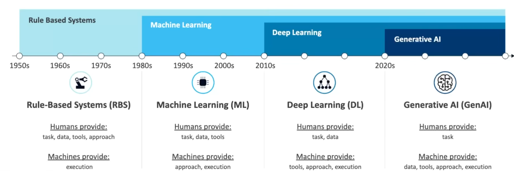
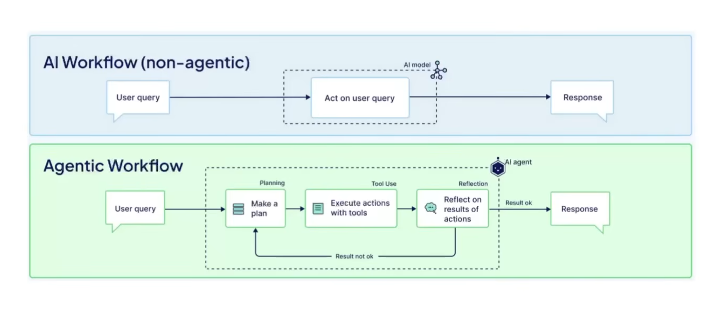
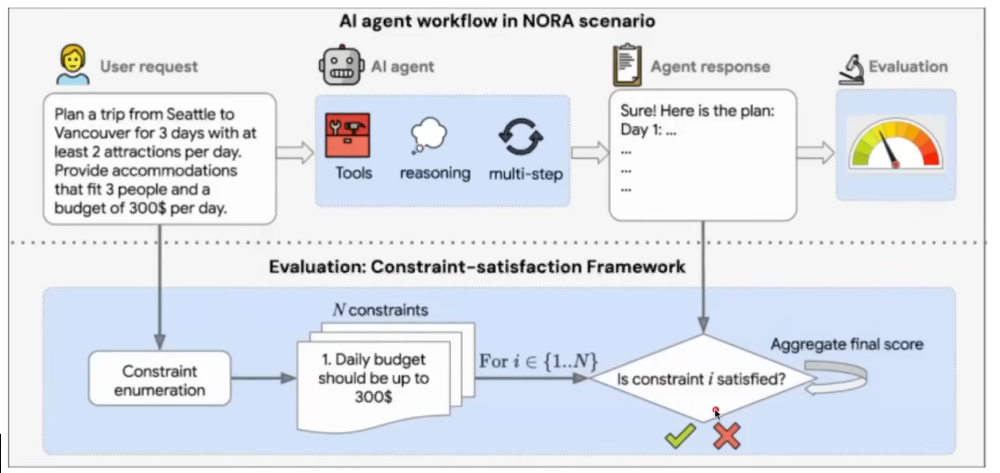
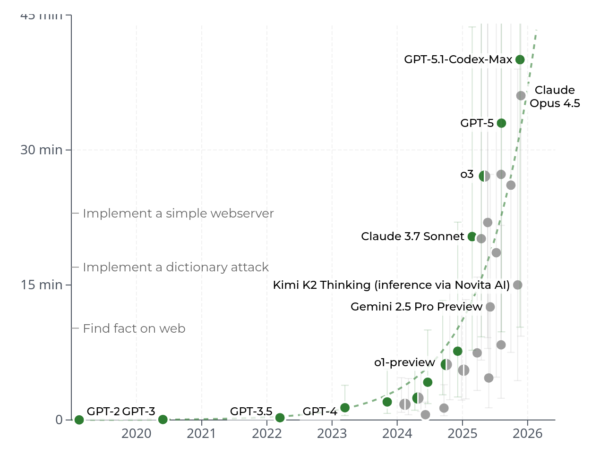
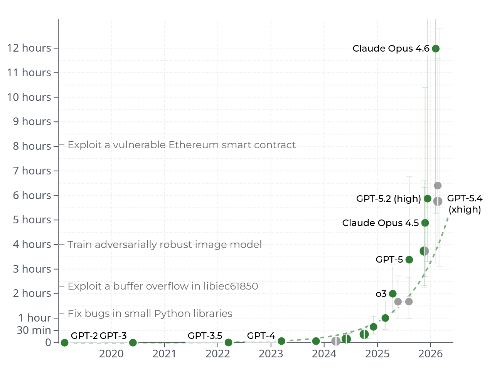
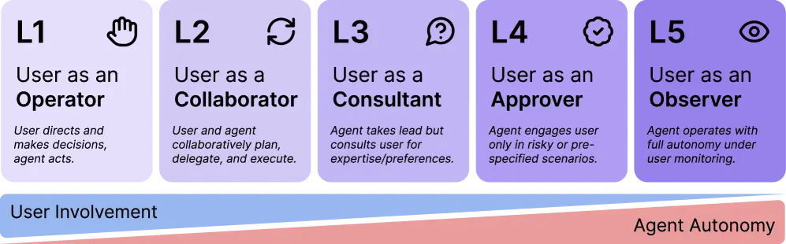
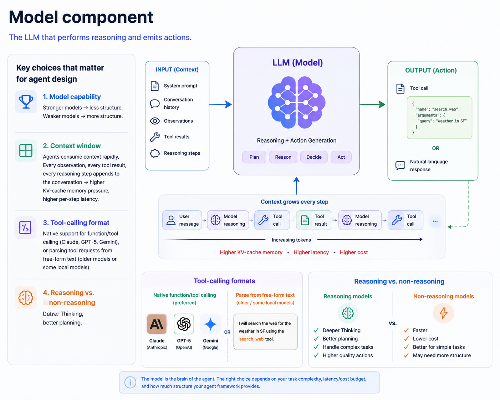
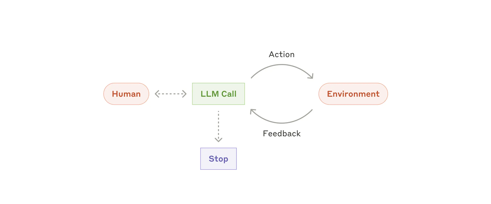
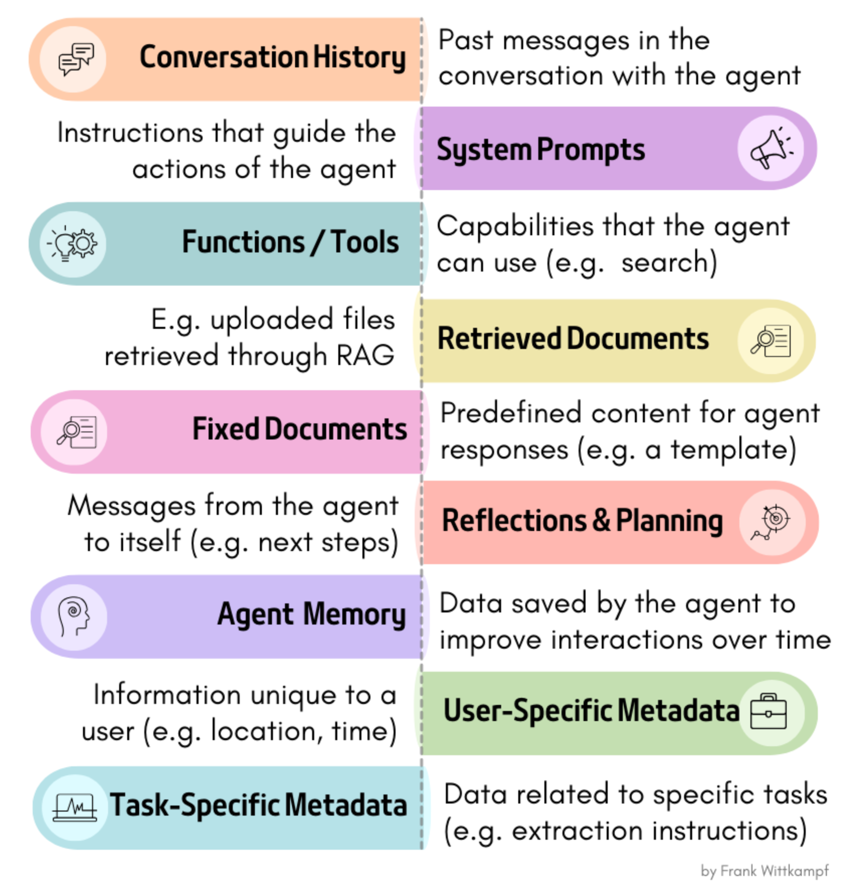
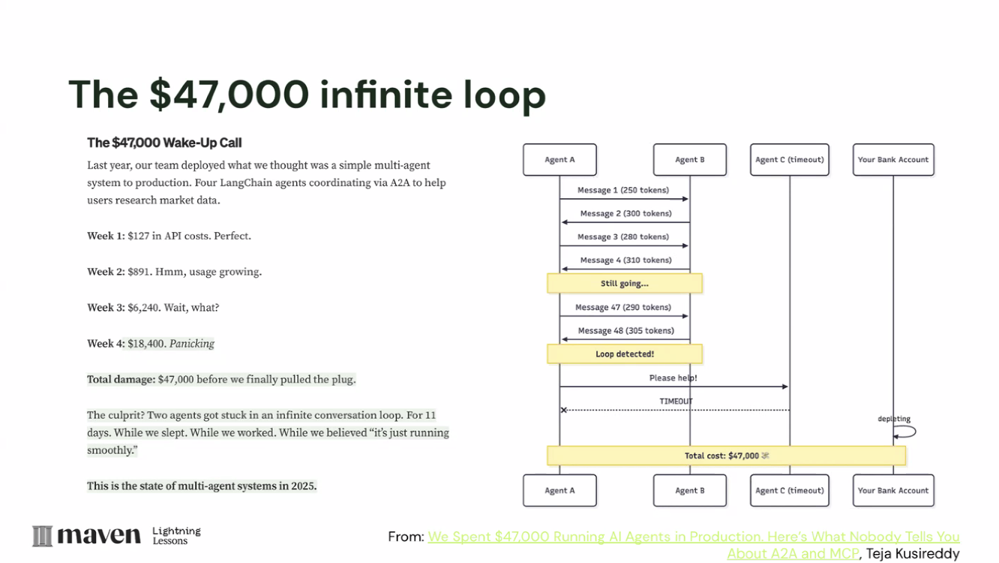

## Overview

- What are agents?
- Core components of an agent
- ReAct loop
- Implementing a minimal agent


## Evolution of AI



## Motivation

-  **Remarkable capabilities** -  GenAI models excel across a wide range of tasks
-  **Knowledge cutoff** -  limited by pre-training data and prompts
-  **Hallucination** -  pre-training optimizes next-token prediction, not factual accuracy
-  **Task-specific gaps** -  no single model is best at everything
-  **Context window limits** -  prompts can't grow indefinitely
-  **Noise in input** -  irrelevant context can degrade model performance

## GenAI Arc

1.  **Pretraining scale** (2020–2022)
    - bigger models, better emergent capabilities

2.  **Inference-time reasoning** (2023–2024)
    - o1, DeepSeek-R1, test-time compute scaling

3.  **Agentic systems** (2024–present)
    - reasoning alone isn't enough. The model needs to *act* in real-world environments

. . .

> "A reasoning model thinks. An agent thinks, acts, observes, and loops."


## What changes when we say "Agent"

| Reasoning model | Agent |
|-----|-------|
| Reads text, emits text | Reads text + environment, emits text *or* tool calls |
| One pass through the model | Loop: think -> act -> observe |
| Verifier scores a single trace | Verifier scores a *trajectory* |
| Errors are wrong tokens | Errors are wrong actions on a real system |
| Cost is bounded by `max_tokens` | Cost is bounded by `max_steps × max_tokens × tool cost` |


## Demo: Weather Agent

**User asks:**

```text
Tell me about the current weather in Bangalore.
```

. . .

**Agent loop:**

| Step | Model decision | Tool action | Observation |
|-|---|---|-----|
| 1 | Need current weather data for Bangalore | `get_weather("Bangalore")` | `{"temp": 28, "condition": "Partly Cloudy", "humidity": 65, ...}` |
| 2 | Need location coordinates for more detail | `get_coordinates("Bangalore")` | `{"lat": 12.9716, "lon": 77.5946}` |
| 3 | Fetch extended forecast | `get_forecast(lat=12.9716, lon=77.5946)` | Next 5 days: 27–31°C, chance of rain on Day 3 |
| 4 | Stop and answer | final response | Summary: 28°C, partly cloudy, humid; rain expected mid-week |


## AI Agent: LLM + Planning + Tooling

**An AI agent** - system that combines a large language model (LLM) with planning and tooling capabilities




**Common Tools:**

- Web search
- Code execution (APIs, DB, shell, etc.)
- Repo tools: list files, search text, read files, run tests


## AI Agent: LLM + Planning + Tooling

**Example**




## Capabilities



## Capabilities




## Four System Types


::: {style="font-size: 0.8em; margin-top: 1.5em;"}
| System Type | Autonomy | Structure / Predictability | Description |
|--------|-------|-------|------------------|
| CHATBOT | Low | High | Single-turn or multi-turn conversation; no external tools, no persistent goal |
| PIPELINE | Low-Medium | High | Fixed sequence of transformations; no branching (e.g., chunk -> embed -> retrieve -> generate) |
| WORKFLOW | Medium | Medium-High | Pre-defined graph of steps; LLM executes nodes but topology is fixed (LangGraph-style DAG) |
| AGENT | High | Low | Decides what to do next; may deviate from plan; chooses tools; loops until goal or budget |
:::


## What makes an Agent?

Should have all the following properties: 

::: {style="font-size: 0.8em; margin-top: 1.5em;"}
| Property | Meaning | Counter-example |
|----------|------------|---------------------------|
| **1. Goal-directed** | Pursues an objective, not just responds | Chatbot: reactive, no persistent goal |
| **2. Tool-grounded** | Can perform actions with side effects beyond text generation | Pipeline where LLM only produces text |
| **3. Closed-loop** | Observes the result of actions and feeds observations back into reasoning | One-shot tool call without reading the result |
| **4. Autonomous control** | Decides the sequence of actions; topology is emergent | Workflow where human coded the state machine |

:::


## What makes an Agent?

Examples: 

. . . 

- *A system that generates a SQL query and returns it to the user, who then runs it manually.* 

. . .

   → **NOT an agent**

. . .

- *A system that generates SQL, executes it against a database, reads the results, and generates a report based on those results.* 

. . .

→ **Workflow**

. . .

- *A coding assistant that edits files, runs tests, reads error output, fixes bugs, and loops until tests pass.* 

. . .

→ **AGENT**.

## Agent Autonomy vs. Structure

> "How much structure should we impose on an agent, vs. letting the LLM figure it out?"

- **More structure** => more reliable, cheaper per call, easier to debug, but lower ceiling and brittle 

- **Less structure** =>  more graceful failure recovery, but harder to verify, more expensive, and behaviour shifts with every model upgrade.



. . . 

> [Anthropic's recommendation](https://www.anthropic.com/engineering/building-effective-agents): "Start with workflows and add agentic loops only where necessary."


## Anatomy of an Agent

## 1 - The Model


::: {.columns}

::: {.column width="60%"}

 

:::

::: {.column width="40%"}


**Key choices  for agents**

1. **Model capability**

2. **Context window** 
3. **Tool-calling format**

4. **Reasoning vs. non-reasoning** 


:::

:::


## 2 - Tools / The Action Space

The set of actions the agent can perform. Every action has:

- A **name** (identifier)
- A **schema** (parameters, types, constraints)
- An **implementation** (the actual function that runs)
- A **description** (natural language prompt the model sees)


**Example: A `calculator` tool**

```json
{
  "name": "calculator",
  "description": "Evaluate mathematical expressions. Use this for ALL arithmetic—do not compute in your head. Input must be a valid Python expression string. Returns the numeric result or an error message.",
  "parameters": {
    "type": "object",
    "properties": {
      "expression": {
        "type": "string",
        "description": "A valid Python math expression, e.g., '2 + 2' or 'math.sqrt(16)'"
      }
    },
    "required": ["expression"]
  }
}
```

## 2 - Tools / The Action Space

**Example: Repo tools**

```json
[
  {
    "name": "search_repo",
    "description": "Search the repository for exact text or regex patterns. Use this before reading many files.",
    "parameters": {
      "type": "object",
      "properties": {
        "query": {"type": "string"},
        "path": {"type": "string", "description": "Optional directory or file scope"}
      },
      "required": ["query"]
    }
  },
  {
    "name": "read_file",
    "description": "Read a repository file by path. Use after search identifies a likely relevant file.",
    "parameters": {
      "type": "object",
      "properties": {
        "path": {"type": "string"}
      },
      "required": ["path"]
    }
  }
]
```

## 2 - Tools / The Action Space


::: {style="font-size: 0.8em; margin-top: 1.5em;"}

**The action space spectrum**

| Action Space | Grounding | Verification | Failure Modes | Use Case |
|-------------|---------|-----------|--------------|----------|
| JSON tool calls | Strong (typed schema) | Easy (validate against schema) | Hallucinated args, wrong tool choice | API agents, coding agents |
| Code execution | Medium (interpreter catches syntax) | Medium (tracebacks, output) | Infinite loops, dangerous imports, sandbox escapes | Data science, complex computation |
| GUI actions (click, type) | Weak (pixels, DOM elements) | Hard (was the click registered?) | Click misses, modal dialogs, visual changes | Browser automation, computer use |
| Voice turns | Weak (audio ambiguity) | Hard (user may interrupt) | Misheard commands, latency gaps | Conversational agents |

:::


## Component 3: The Loop

The control structure that repeatedly calls the model, executes actions, and feeds observations back.



## Component 3: The Loop

**The canonical ReAct loop (pseudo-code):**

```python
class ReActAgent:
    def __init__(self, model, tools, max_steps=10):
        self.model = model
        self.tools = {t.name: t for t in tools}
        self.max_steps = max_steps
        self.state = []  # conversation history
    
    def run(self, task: str) -> str:
        self.state.append(user_message(task))
        
        while True:
            # REASON: Model decides what to do
            response = self.model.generate(self.state, available_tools=list(self.tools.values()))
            
            if response.has_tool_calls:
                self.state.append(response)
                # ACT: Execute each tool call
                for tool_call in response.tool_calls:
                    result = self.execute_tool(tool_call)
                    # OBSERVE: Append result to state
                    self.state.append(tool_result_message(tool_call.id, result))
            else:
                # FINISH: Model returns final answer
                return response.content
        
    
    def execute_tool(self, tool_call):
        tool = self.tools[tool_call.name]
        # Validate arguments against schema
        validated_args = tool.schema.validate(tool_call.arguments)
        # Execute
        return tool.run(**validated_args)
```


## Component 4: State / Context Memory




## Component 4: State / Context Memory

The information the agent can access when making its next decision.

In the minimal ReAct agent, state is simply the conversation history: a list of messages:
```
[system_prompt, user_task, assistant_thought_1, tool_call_1, tool_result_1, assistant_thought_2, ...]
```

For the repo-question example, state might contain:

```text
User task: Where is authentication handled, and what tests cover it?
Tool call: search_repo("auth")
Observation: src/auth.py, src/middleware.py, tests/test_auth.py
Tool call: read_file("src/auth.py")
Observation: token validation and session helpers
...
```


## Component 5: Stop Conditions



## Component 5: Stop Conditions

The criteria that terminate the loop.

Agents should not run forever. Termination can be triggered by:


::: {style="font-size: 0.8em; margin-top: 1.5em;"}

| Stop Condition | Type | When It's Used |
|---------|--------|---------------|
| **Goal achievement** | Model-driven | Agent emits final answer instead of tool call |
| **Step budget** | System-enforced | Max N iterations reached |
| **Cost cap** | System-enforced | Max dollars/tokens spent |
| **Time budget** | System-enforced | Wall-clock timeout |
| **Error threshold** | System-enforced | N consecutive tool failures |
| **Dead-end detection** | Heuristic | Agent repeating the same action |
| **Human trigger** | External | User presses stop |

:::

. . . 

**Stopping Criteria** for Repo-question stop condition ??

