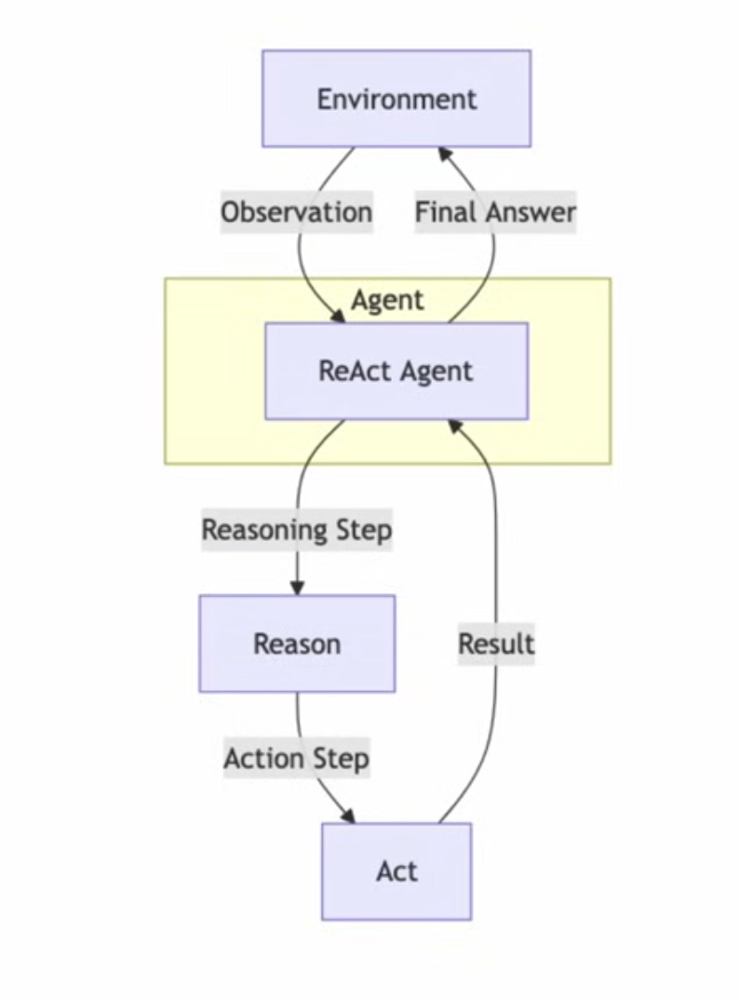
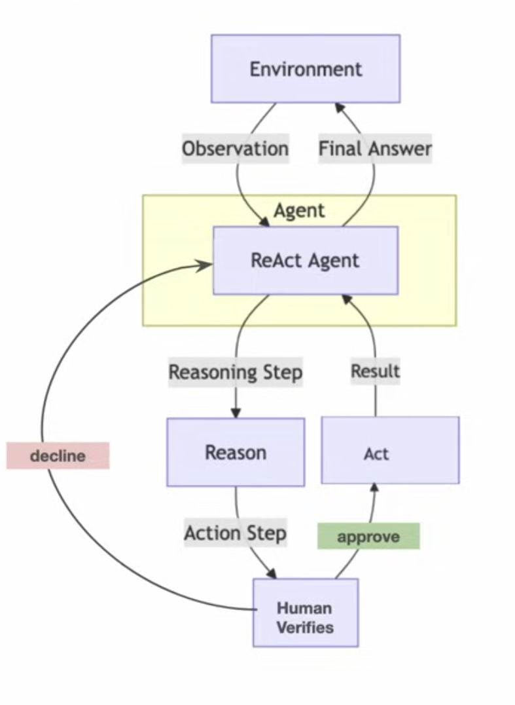
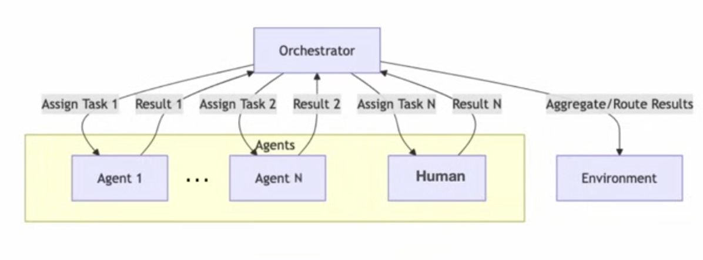
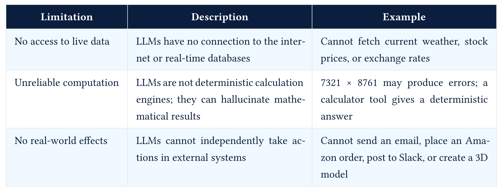
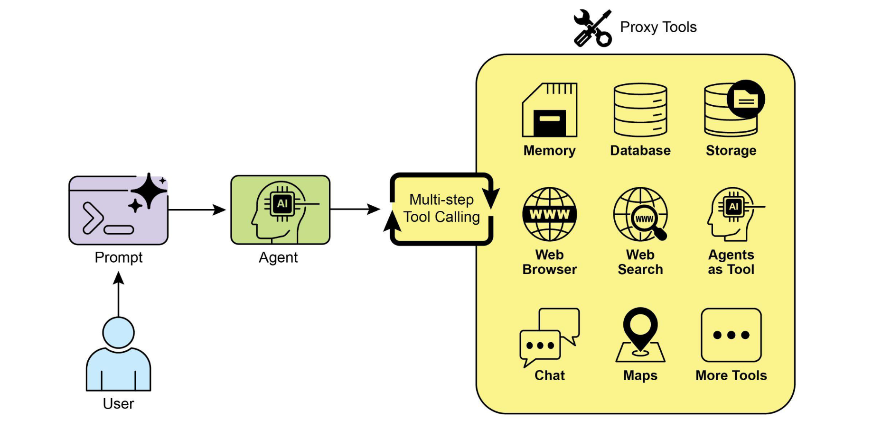
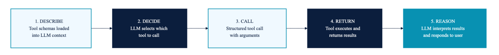
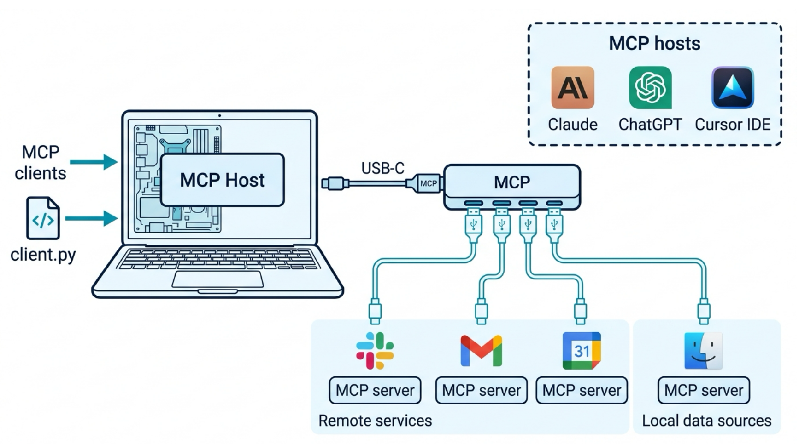
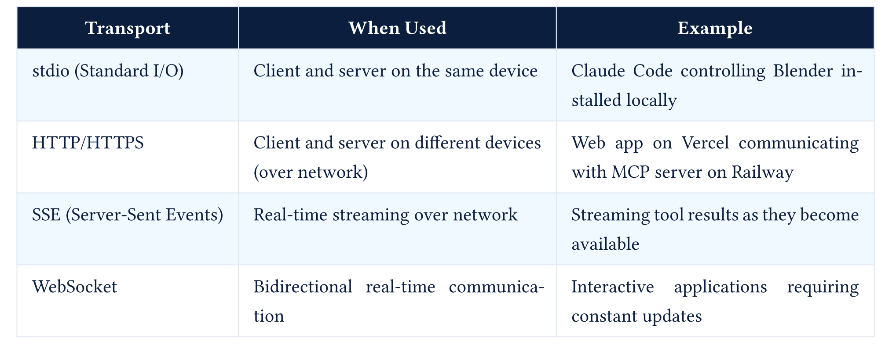

## Essential Agentic Design Patterns

## ReAct Pattern (Reason + Act)

- The agent alternates between Reasoning and Taking Actions (Act) in a loop to achieve its goals, often using tools, APIs, and memory



Example:

- An agent that performs a complex task like booking a flight, which requires multiple steps and interactions with external systems (searching for flights, comparing prices, making a reservation, etc.)

## ReAct Pattern (Reason + Act)

**Advantages**: 

- Combines the strengths of reasoning and acting, allowing for more complex and dynamic behavior
- Supports complex and multi-step tasks that require both planning and execution
- Integration with real-world tools and APIs allows for practical applications

**Limitations**: 

- Increased complexity in design and state management
- Requires robust error handling and recovery mechanisms
- May be slower due to the need for multiple reasoning and action cycles

## ReAct Loop - Deep Dive

## The ReAct Pattern in Detail

**The three primitives:**

1.  **Thought** - The model's reasoning about the current situation, what it knows, what it needs, and what to do next.
2.  **Action** - A structured invocation of a tool (or a special finish action).
3.  **Observation** - The result returned by the tool, added to the trace.

**Trace structure (what the model actually sees):**

```         
System: You are a helpful assistant with access to tools. Answer the user's question.

User: In this repo, where is authentication handled, and what tests cover it?

Assistant:
Thought: I need evidence from the repository, not a guess. I should search for authentication-related files.
Action: search_repo
Action Input: {"query": "auth"}

Observation: Matches found in src/auth.py, src/middleware.py, tests/test_auth.py.

Thought: I should inspect the implementation and the tests before answering.
Action: read_file
Action Input: {"path": "src/auth.py"}

Observation: src/auth.py defines login, token validation, and session helper functions.

Thought: Now I need the test coverage.
Action: read_file
Action Input: {"path": "tests/test_auth.py"}

Observation: tests/test_auth.py covers login success, login failure, and expired-token behavior.

Thought: I have enough evidence to answer with file references.
Action: finish
Action Input: {"answer": "Authentication is handled primarily in src/auth.py, with middleware references in src/middleware.py. The direct tests are in tests/test_auth.py, covering login success/failure and expired-token behavior."}
```

## The ReAct Pattern in Detail

**Native tool calling vs. ReAct prompting:**

- Early ReAct implementations parsed free text; modern implementations use structured APIs.

- Modern APIs (Anthropic, OpenAI) use native tool calling: the model emits a structured `tool_use` block, not free-text `Action:`.

## ReAct - Limitations

- **No explicit lookahead:** The model chooses the next action without a built-in tree search unless we add one
- **No built-in backtracking:** The model can revise its plan, but it cannot undo side effects unless the system provides rollback tools
- **Context drift:** As the trace grows, early observations may be "forgotten"
- **Action-space myopia:** The agent can only do what tools permit. Tool design limits reasoning.

. . .

**Repo example:** the agent may read too many files, miss synonyms like "session" or "token", stop after one weak match, or cite a file it did not actually inspect.

## ReAct + Planning (Plan-then-Execute)

``` text
User -> Planner LLM -> Plan -> Executor LLM -> Tool -> ... -> Answer
```

 **Implementation**

*Plan Mode*: AI analyzes requirements, reads codebase, builds a step-by-step plan. No modifications are made. The user reviews the plan.

*Act Mode*: AI executes the plan, editing files and running commands. Human approval at each step.

``` python

def plan_and_execute(task: str):
    # Phase 1: Plan (no tool execution)
    plan = planner_llm.generate(
        system="You are a planner. Analyze the task and create a step-by-step plan. "
               "Do NOT execute anything.",
        user=task
    )

    # Phase 2: Execute (follow the plan)
    for step in plan.steps:
        result = executor_llm.generate(
            system="You are an executor. Complete the given step using tools.",
            user=f"Plan context: {plan}\nCurrent step: {step}"
        )
        # ... execute tools from result
```

**Examples** : Cline (Plan/Act modes), Aider (Architect mode)

## ReAct + Reflection

``` text
User -> LLM -> Tool -> ... -> LLM -> Draft Answer -> Critic LLM ->
  [if good: return]
  [if bad: feedback -> LLM -> retry]
```

**Implmentation**

``` python
def react_with_reflection(task: str, max_reflections: int = 3):
    draft = basic_react_loop(task)

    for attempt in range(max_reflections):
        critique = critic_llm.generate(
            system="Evaluate this output. Is it complete, correct, well-structured? "
                   "If not, explain what needs improvement.",
            user=f"Task: {task}\nOutput: {draft}"
        )

        if critique.is_satisfactory:
            return draft

        # Retry with feedback
        draft = basic_react_loop(
            f"Original task: {task}\n"
            f"Previous attempt: {draft}\n"
            f"Feedback: {critique.feedback}\n"
            f"Please improve based on this feedback."
        )

    return draft  # Best effort after max reflections
```

**Examples** : CrewAI, LangGraph

## ReAct + Reflection + Compaction

**ReAct + Compaction** 

- Compact the context window to avoid drift and forgetting
- The model can summarize or extract key information from the trace to keep the most relevant context in focus.

**Examples** - Claude Code, OpenClaw, Hermes etc

## Code-as-Action

``` text
User -> LLM -> Generate Python Code -> Execute in Sandbox -> Output -> LLM -> ... -> Answer
```

**Implementation**

``` python
# Instead of structured tool calls, the LLM writes code:

# LLM generates:
"""
results = web_search("latest AI frameworks 2026")
filtered = [r for r in results if r.date > "2025-01-01"]
summary = summarize(filtered)
final_answer(f"Found {len(filtered)} recent frameworks. Summary: {summary}")
"""

# The runtime:
# 1. Extracts the code block
# 2. Runs it in a sandbox (E2B, Docker, Pyodide)
# 3. Captures output and final_answer()
# 4. Returns to user
```

**Example** : SmolAgents


::: {style="font-size: 0.8em; margin-top: 1.5em;"}

::: {.columns}

::: {.column}

**Advantages:**

- Can compose multiple tools in one step (regular tool calling does them one at a time)
- Can use conditionals, loops, variables within one "action"
- More natural for code-trained LLMs
- Fewer round-trips to the API

:::

::: {.column}

**Limitations:**

- Arbitrary code execution requires robust sandboxing
- Harder to audit than structured tool calls
- Error messages can be opaque

:::

:::
:::


## Event-Driven / Stream-Based / Graph Based


**Event Driven**

``` text
Event Stream -> Agent subscribes -> Processes events -> Emits new events
```

*Used By*: AG2 (MemoryStream), CrewAI Flows

**Graph-Based State Machine**

``` text
Nodes = agents/functions
Edges = transitions (can be conditional)
State = immutable, checkpointed after every node
```

*Used by*: LangGraph, Google ADK 2.0

## Heartbeat / Proactive Loop

``` text
Cron triggers agent 
  -> Agent checks task list 
  -> [nothing to do: HEARTBEAT_OK (suppressed)]
  -> [something to do: execute -> notify user]
```

**Examples** - OpenClaw, Hermes Agent

**Implementation**:

``` python
# Pseudo-code for OpenClaw's heartbeat
@cron("*/30 * * * *")  # Every 30 minutes
def heartbeat():
    context = assemble_context(
        agents_md=read("AGENTS.md"),
        soul_md=read("SOUL.md"),
        tasks=read("tasks.md"),
        memory=search_memory("pending tasks")
    )

    response = llm.generate(
        system=context,
        user="Check your task list. If anything needs attention, "
             "handle it and report. Otherwise reply HEARTBEAT_OK."
    )

    if "HEARTBEAT_OK" in response:
        return  # Gateway suppresses, user sees nothing

    gateway.send_to_user(response)  # User gets notified
```

## Human in the Loop (HITL) Pattern

Extends another pattern (typically ReAct), but adds a validation step prior to taking an action, where the agent seeks human feedback or approval before proceeding with certain actions.



**Example**: - An agent that performs sensitive actions, such as sending emails or making financial transactions


## Agent Orchestration Pattern

- Multiple agents with different capabilities are orchestrated together to achieve a common goal



**Example**: - Software development agent that uses multiple specialized agents for code generation, testing, and deployment


## Agentic Patterns Summary

| Variant | Complexity | Best For | Example Framework |
|----------------|-------------|-------------------|------------------|
| Basic ReAct | Low | Simple tasks, prototypes | mini-swe-agent |
| Plan+Execute | Medium | Complex multi-step tasks | Cline, Aider |
| ReAct+Reflection | Medium | Quality-critical outputs | CrewAI |
| ReAct+Compaction | Medium | Long-running tasks | Claude Code |
| Code-as-Action | Medium | Data processing, multi-tool | smolagents |
| Event-Driven | High | Reactive systems, pipelines | AG2, CrewAI Flows |
| Graph State Machine | High | Production multi-agent | LangGraph |
| Heartbeat | Medium | Proactive, background tasks | OpenClaw |

## Model-Centric to System-Centric Thinking

- Previous classes: Architecture, GPUs, Inference and Evaluation - *LLM was central*
- Current focus: Overall system design, where LLM is a critical component but not the only one
  - Control flow (the loop)
  - State management (context, soon memory)
  - I/O interfaces (tools)
  - Safety properties (bounds, sandboxing)
  - Observability (tracing, logging)

## When *not* to use an Agent

1.  **Is the task structure stable?** If the steps are the same every time, it's a pipeline.
2.  **Is there a small fixed branch set?** (≤5 known branches.) It's a workflow with an LLM router.
3.  **Is the search space large but the verifier cheap?** It's best-of-N over generations.
4.  **Does the LLM need to decide what to do based on what it just saw?** Needs an Agent.

. . .

**Repo-question decision:**

A stable "find files -\> retrieve chunks -\> answer" system is a pipeline/RAG app. It becomes agentic when the model chooses follow-up searches, reads, tests, or stops based on observations.

## Concrete examples

| Task | Best tool | Why |
|------------------------|------------------------|------------------------|
| Extract structured fields from invoices | LLM call with JSON schema | Single call, no decision |
| RAG QA over a fixed corpus | Pipeline (retrieve -\> rerank -\> answer) | Steps are fixed |
| Customer support routing across 8 categories | Workflow (LLM router -\> category-specific handler) | Bounded branches |
| Multi-step research across a changing web | Agent | The next step depends on the last result |
| Coding assistant on an unfamiliar repo | Agent | The whole point is exploration |

## Tool Calling, MCP and Skills

## Why LLMs need tools

- LLMs are next-token predictiors, lack intefaces to interact with the world




## Why LLMs need tools

- Tools extend LLMs' capabilities by providing access to external information, computation, and actions.



## Tool Calling Patterns

**Generation 1: Text-Based Tool Calls (2023)**

- LLM generates free-text instructions to call tools, which are parsed by the system.

``` python
prompt = """
You are an AI assistant that can call tools.

Available tools:

1. get_weather_data(c_lat: float, c_long: float)
   - Get weather data for a given location


First think step by step and write your reasoning inside <thinking>...</thinking>.

When you need to use a tool, output ONLY in the following format and also add your reasoning:

<tool_call>
{
  "name": "<tool_name>",
  "arguments": { ... }
}
</tool_call>

If no tool is needed, respond normally.

...
"""
```

## Tool Calling Patterns

**Generation 2: Structured Tool Calls (2024)** 

- LLM generates structured tool calls using native API support from the provider, eliminating the need for free-text parsing.

``` python
{
  "tool_calls": [{
    "id": "call_123",
    "function": {
      "name": "search",
      "arguments": "{\"query\": \"AI agents\"}"
    }
  }]
}
```

**Generation 3: MCP / Protocol-Based (2025-2026)** 

- LLMs interact with tools through a defined protocol (Model Context Protocol - MCP) - Standardized protocol. Any MCP server works with any MCP client. Language-agnostic

``` python
{
  "method": "tools/call",
  "params": {
    "name": "search",
    "arguments": {"query": "AI agents"}
  }
}
```

## Tool Schema Example

``` python
{
  "name": "search_products",
  "description": "Search the product catalog from the e-commerce database. Returns top 50 matching items with price, availability, and category.",
  "parameters": {
    "type"      : "object",
    "properties": {
      "query"      : {
        "type": "string",
        "description": "Search keyword to match against\nproduct name, description, or SKU"
      },
      "category"   : {
        "type"       : "string",
        "enum"       : ["electronics", "clothing", "home", "sports", "books"],
        "description": "Product category to filter results"
      },
      "max_results": {
        "type"       : "integer",
        "description": "Maximum number of results to\nreturn (default: 50)"
      }
    },
    "required"  : ["query"]
  }
}
```

## Tool Schema Best Practices

::: {style="font-size: 0.8em; margin-top: 1.5em;"}

| Principle | Description | Example |
|---------------|----------------------------|------------------|
| Verb-noun naming | Tool name follows action_entity format in snake_case | search_missions, get_weather_forecast, calculate_fuel_estimate |
| Clear description | Explain what the tool does, what it returns, and when to use it | Search the AstroLog mission database by keywords, status, etc. Returns matching missions with status, crew, and destination. |
| Enumerate constraints | Specify required vs. optional parameters and use enums for categorical parameters | enum: \[planned, in_transit, completed, delayed, aborted\] |
| Only mark truly required parameters | Avoid marking everything as required to prevent the LLM from hallucinating values for unknown fields | Only mark essential parameters as required |
| Return descriptions | Document what the tool returns so the LLM can interpret results | returns: { “missions”: \[ { “id”: “”, “name”: “”, “status”: “” } \] } |
| Low parameter count | Keep parameters under 5; combine related fields into objects | More parameters = more chances for the LLM to make errors |

:::

## Tool Lifecycle 



**Who Runs the Tool?**

- **The LLM does NOT execute tools**. The LLM produces a structured JSON describing which tool to call and what arguments to pass.
- **The tool’s own logic executes the function**. The structured output from the LLM is used to invoke the function programmatically.
- **The LLM produces two types of output during a tool interaction**: (1) a structured tool call (hidden from user), specifying tool name and arguments, and (2) a natural language response (shown to user), the final answer after reasoning over tool results.

## MCP (Model Context Protocol)

- With standard fucntion calling, each tool integratiuon is custom-built on the client side 
- eg : If a company had 3 AI chatbots and wanted to connect to 10 services, they needed 3 × 10 = 30 unique integrations.
- Unsustainable at scale with N x M growth in tools and clients.


## MCP (Model Context Protocol)

- MCP standardizes how instructions are sent to the server and how results are returned 
- With MCP, the N × M custom integrations are replaced by N + M integrations (N clients + M tools), since any client can call any tool as long as they both speak MCP.


## The USB-C Analogy




## MCP vs APIs

::: {style="font-size: 0.8em; margin-top: 1.5em;"}

| Aspect | Traditional API | MCP |
|-------|----------------|----------------|
| Purpose | Expose a service's functionality to any consumer (web apps, mobile apps, scripts) | Standardize how LLMs specifically discover and invoke tools |
| Consumer | Any software: browsers, mobile apps, backend services, CLI tools | LLM-based applications (Claude Desktop, Cursor, custom agents) |
| Discovery | Manual: read API docs, write integration code, handle authentication | Automatic: client calls tools/list and receives all available tools with schemas |
| Integration effort | Custom code per API per client (N × M problem) | One protocol for all: connect once, access everything (N + M) |
| Schema format | Varies: OpenAPI/Swagger, GraphQL, custom docs | Standardized JSON tool schemas with name, description, parameters, and return type |
| Who writes the glue code? | The client developer writes API calls, auth, error handling, rate limiting | The server developer wraps their API once; clients connect with zero custom code |
| Communication | HTTP request/response (REST) or query/mutation (GraphQL) | JSON-RPC 2.0 over stdio (local) or HTTP/SSE (remote) with bidirectional messaging |
| Context awareness | None: APIs have no concept of LLM context windows or token budgets | Built-in: the MCP client manages what schemas and results enter the LLM's context |

:::

## MCP Architecture


## MCP Architecture


| Component | Role | Key Responsibilities |
|-----------|------|---------------------|
| MCP Client | Intermediary between user/LLM and server | Manages LLM's context window; decides what tool schemas to expose to LLM; decides what portion of tool results to feed to LLM; maintains conversation loop |
| MCP Server | Hosts and executes tools | Exposes tool schemas, resources, and prompts; executes tool functions; returns results to client; does NOT manage the LLM's context |
| LLM | The reasoning brain | Decides which tools to call and in what order; produces structured tool call responses; reasons over tool results; produces final natural language output |

. . . 

> The LLM never communicates directly with the MCP server. All communication flows through the MCP client.


## MCP Primitives


## MCP Primitives

Primitive |Description | Example
-----------|----------------|------------------------
Tools | Functions the LLM can invoke via structured calls | get_transcript(video_url), search_missions(query, status)
Resources |Documents exchanged between server and client for later reference | Mission logs, crew schedules, transcripts stored as markdown
Prompts |Predefined, reusable system prompts associated with tool actions | Summarize this transcript in one paragraph


## Transport Layer and Communication

**Transport Layer**: 



**Communication**
-  JSON-RPC 2.0

## MCP Server Example

## Code-as-Action

## Skills as Markdown

## The Tool Sprawl Crisis

## Solving Tool Sprawl: 7 Patterns

## Tool Sandboxing