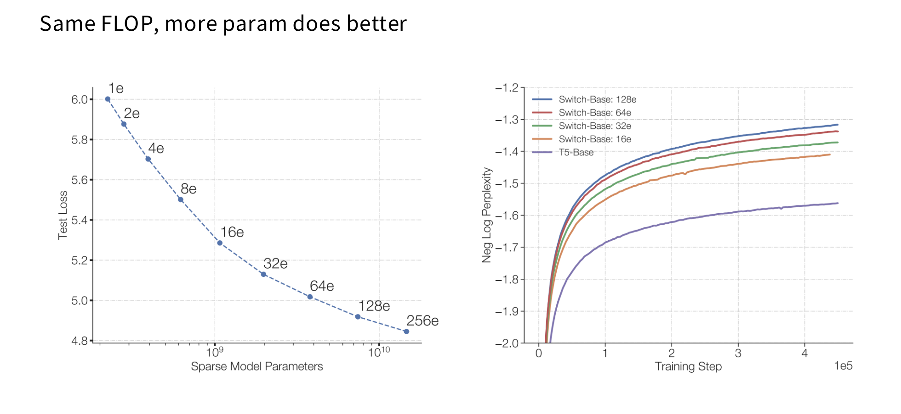
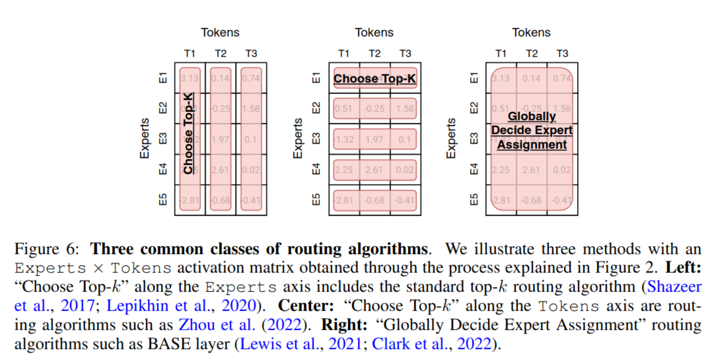
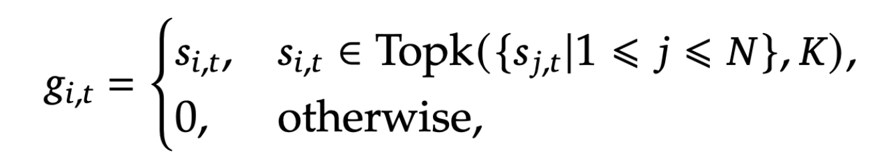
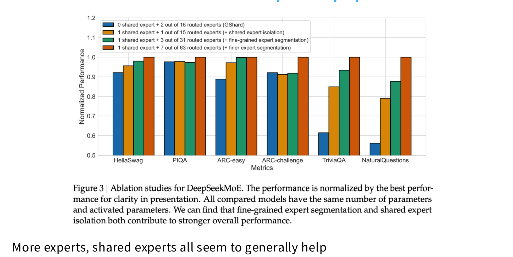
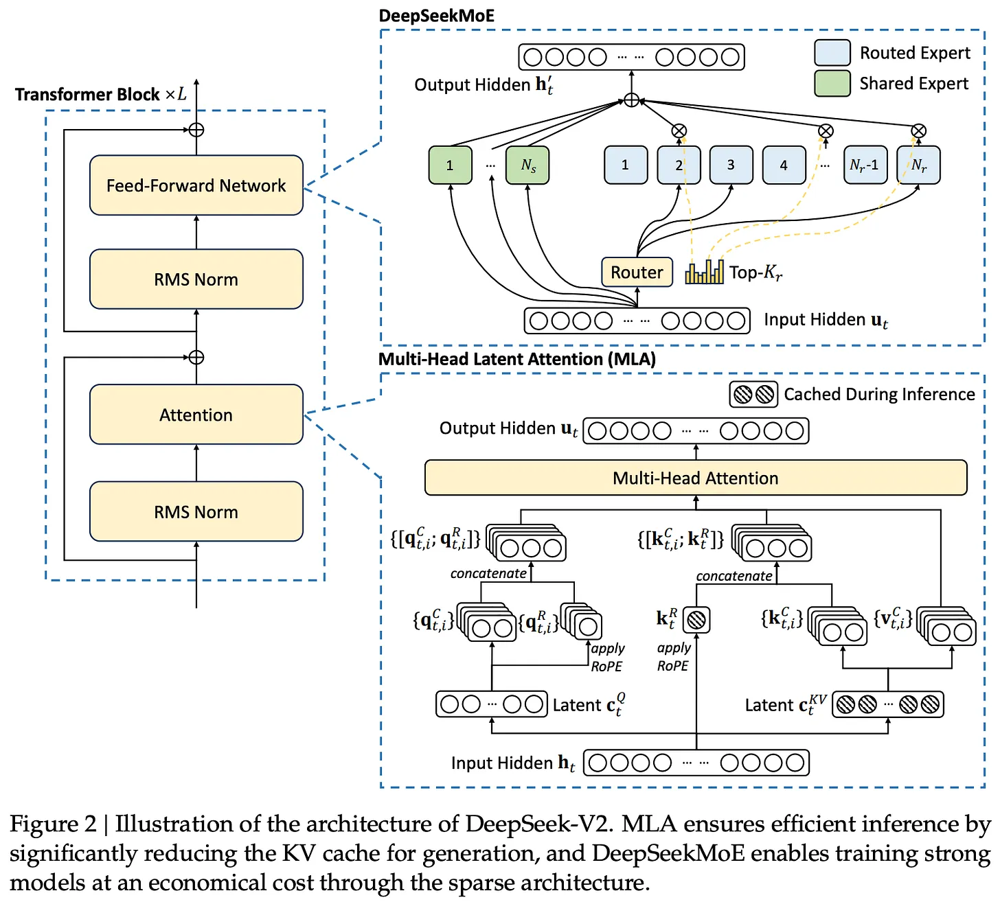

<div class="center-slide">

# LLMs : A Hands-on Approach 

### Mixture of Experts

</div>

---

## Overview

- Motivation
- MoE Architecture
- What do MoEs look like in LLMs?
- Dense vs Sparse MoE
- Routing Mechanisms
- Expert Configuration
- DeepSeek V3 MoE Architecture

---

## Motivation


---

## Decoder-only LLMs 


 - Decoder-only is the predominant architecture for LLMs
 - Core components
    - Self-attention
    - Feedforward (FFN)
    - LayerNorm and residual connections

- Most parameters are in the FFN layers

---

## Decoder-only LLMs 


- Most parameters are in the FFN layers
- The FFN layers are the main bottleneck for scaling up model capacity
- Increasing FFN size leads to quadratic growth in parameters and compute


---

## MoE Architecture

- Replace big FFN with multiple smaller FFNs (experts)
- Only a subset of experts are active for each input token
- Routing mechanism decides which experts to activate
- Increase parameters without increasing compute


---

## MoE Architecture

- All layers can be MoE
- Some layers (e.g., every 2nd layer) can be MoE in an interleaved fashion.

```python
def moe_layer(token, experts, router, top_k): 
    # Ask the router "which experts should handle this token?" 
    logits = router(token) 
    
    # With N total experts, pick only top_k (top_k << N) 
    top_k_logits, top_k_experts = top_k(logits, top_k) 
    # Compute experts' mixing weights
    weights = softmax(top_k_logits)

    # Mix only top_k experts together to provide the final output    
    output = 0 
    for i, expert_idx in enumerate(top_k_experts): 
        output += weights[i] * experts[expert_idx](token) 
    return output 
    
```

---

## Why are MoEs getting popular?

- **Efficient Scaling:** : Add model capacity (total parameters) without increasing active parameters (compute) significantly

- **Efficient Pretraining and Inference** - Faster training and inference compared to dense models of similar capacity



---

## Why are MoEs getting popular?

- **Improved Performance:** - Better performance on many tasks by leveraging specialization and ensemble effects
- DeepSeek V2 236B MoE with 21B active parameters outperforms dense models with 100B+ parameters


---

## MoE Architectures

Three things vary across MoE architectures:

1. **Routing function** - how tokens get assigned to experts
2. **Expert sizes** - how many experts, how large each one is, shared vs routed
3. **Training objectives** - how to train the router and keep experts balanced

---

## Routing Mechanisms


- Token choice top K
- Expert choice top K
- Hash-based routing
- Learnable routing networks



---

## Top-K routing in detail


**1. Compute Gating Scores** (e.g., dot product)

<div style="text-align: center;">

$$s_{i,t} = \text{Softmax}_i\left(\mathbf{u}_t^{lT} \mathbf{e}_i^l\right)$$

- $\mathbf{u}_t^l$ : input token representation at layer $l$ 
- $\mathbf{e}_i^l$ : expert embedding for expert $i$ at layer $l$

</div>

**2. Select Top-K Experts**



**3. Compute Mixed Output**
<div style="text-align: center;">
$$ \mathbf{h}_t = \sum_{i=1}^{N} g_{i,t} \cdot \text{FFN}_i(\mathbf{u}_t) + \mathbf{u}_t $$

where $\text{FFN}_i$ is the feedforward network for expert $i$
</div>

---

## Top-K routing in more detail

#### Why not just softmax without top-K?

<!-- .element: class="fragment" -->

- You immediately lose the systems efficiency
<!-- .element: class="fragment" -->
- Without top-K, you pay the training cost of all N experts per token
<!-- .element: class="fragment" -->
- **The whole point of MoE is sparse activation** during both training and inference
<!-- .element: class="fragment" -->


---

## Router Collapse

#### The Problem
- Gating network routes tokens to only a small subset of experts

- Leaves most experts **underutilized or completely inactive**

- **The "Rich-get-richer" effect**: Specialized experts attract more tokens $\rightarrow$ get more gradients $\rightarrow$ become better $\rightarrow$ attract even more tokens

- **Degenerate policy**: Router learns $s_{i,t} \approx 0$ for most experts

$$
\text{Effective capacity} \ll N \times \text{expert size}
$$

#### Consequences
- **Wasted memory**: Unused experts consume GPU memory but add no value
- **Reduced model quality**: Equivalent to training a much smaller dense model
- **Poor generalization**: Active experts become overloaded and overfit

---

## Mitigating Router Collapse

#### Strategies

- **Auxiliary Balancing Loss**: Penalize uneven distribution (e.g., $F \cdot P$ loss)

- **Expert Capacity**: Cap the tokens per expert per batch to force overflow

- **Random Noise**: Add noise to router logits to encourage exploration

- **Expert Choice**: Experts pick tokens (rather than tokens picking experts)

---

## Expert Configuration

**Fine-Grained Experts**
- Make experts smaller and use more of them.
- Instead of $N$ full-sized FFN copies, make each expert **much smaller** (1/4 to 1/14 of standard FFN size)

*The fine-grained ratio = (expert intermediate dim) / (standard FFN intermediate dim)*


---

## Expert Configuration

**Shared Experts**
-  One or more experts that process **all tokens** regardless of routing
- *Shared experts* provide a common processing pathway for all tokens, ensuring that every token benefits from some shared knowledge.
- *Routed experts* can specialize on different subsets of tokens. This hybrid approach can improve performance and stability.


---

## Expert Configuration



---

### Expert Routing Configurations for Major MoEs

| Model | Routed | Active | Shared | Fine-grained ratio |
|---|---|---|---|---|
| GShard | 2048 | 2 | 0 | -- |
| Switch Transformer | 64 | 1 | 0 | -- |
| Mixtral | 8 | 2 | 0 | -- |
| DBRX | 16 | 4 | 0 | -- |
| Grok | 8 | 2 | 0 | -- |
| DeepSeek V1 | 64 | 6 | 2 | 1/4 |
| Qwen 1.5 | 60 | 4 | 4 | 1/8 |
| DeepSeek V3 | 256 | 8 | 1 | 1/14 |
| OLMoE | 64 | 8 | 0 | 1/8 |
| MiniMax | 32 | 2 | 0 | ~1/4 |
| Llama 4 (Maverick) | 128 | 1 | 1 | 1/2 |

---

## Training MoEs

**The Core Challenge**

- **Sparsity vs. Differentiability**: We need sparsity for training-time efficiency.
- **Problem**: Sparse gating decisions (hard top-K selection) are **not differentiable**.
- Gradient descent cannot directly optimize the discrete "choice" of an expert.


**The Efficiency Trade-off**

- Activating all experts simplifies gradients but destroys compute efficiency.
- **FLOPs Cost**: "Having a model that's 256 times more expensive to train is a total no-go."
- **Goal**: Maintain sparse execution while ensuring the routing mechanism can still be trained effectively.

---


## Heuristic Balancing Losses


**Switch Transformer F*P Loss (Standard)**


where:
- $f_i = \frac{1}{T} \sum_{x \in \mathcal{B}} \mathbb{1}\{\text{argmax } p(x) = i\}$ is the fraction of tokens dispatched to expert $i$
- $P_i = \frac{1}{T} \sum_{x \in \mathcal{B}} p_i(x)$ is the mean router probability for expert $i$
- $\alpha$ is the balancing coefficient
- $N$ is the number of experts

---

## Expert Capacity

#### Hardware Efficiency vs. Dynamic Routing

**Expert Capacity**: The maximum number of tokens assigned to each expert per batch.

$$ \text{Expert Capacity} = \frac{\text{Tokens per Batch}}{\text{Number of Experts}} \times \text{Capacity Factor} $$


#### Handling Overflow (Dropped Tokens)

*   **Token Dropping**: Occurs when the number of tokens routed to an expert exceeds its capacity.
*   **Residual Bypass**: Dropped tokens skip expert computation and flow directly through the residual connection to the next layer.


---

## Computing output of MoE layer

-  For each selected expert, compute the output for the assigned tokens


- Combine the outputs from the selected experts (e.g., weighted sum) and add the residual connection


[Example MoE Training code](https://github.com/cat-state/modded-nanogpt-moe/blob/main/train_gpt_moe.py#L215)

---

## Total vs Activate Parameters

- **Total Parameters**: The entire set of model parameters, including all available experts (both active and inactive).
- **Active Parameters**: The parameters actually triggered to process a single input token. This determines the compute cost (FLOPs) per token.
- **Key Advantage**: MoEs scale model capacity (Total) while maintaining the inference latency and training cost of a much smaller dense model (Active).


---

## Total vs Activate Parameters

**Mixtral 8x7B MoE**


- **Total Parameters**: ~46.7B
- **Active Parameters**: ~12.9B 
- **Configuration**:
    - 8 experts per layer
    - Top-2 gating ($K=2$ experts active per token)
- **Parameter Sharing**:
    - Only the Feed-Forward Network (FFN) blocks are replicated.
    - **Shared components**: Attention layers, LayerNorms, and Embeddings.

$$ \text{Active Params} = \text{Shared} + (K \times \text{Expert FFN}) $$
$$ \text{Total Params} = \text{Shared} + (N \times \text{Expert FFN}) $$


---

## DeepSeek V3 MoE

**DeepSeek V2** 

- a 236 billion parameter MoE with 21 billion active parameters


**DeepSeek V3**
- a 671B parameter MoE with 37B active parameters

---

## DeepSeek V3 Architecture



- **Sparse Activation**: 671B total parameters, only 37B active per token
- **Shared + Routed Experts**: Combines fine-grained routed experts (256) with 1 shared expert, 8 activated experts processing all tokens
- **Multi-Head Latent Attention (MLA)**: Compresses KV cache into latent space, synergizes with sparse MoE for efficient inference
- **Multi-Token Prediction**: Jointly optimizes predicting multiple tokens in parallel for improved coherence and throughput

---

<div class="center-slide">

## Questions? 
</div>
