## RECAP

## MCP (Model Context Protocol)

- With standard fucntion calling, each tool integratiuon is custom-built on the client side
- eg : If a company had 3 AI chatbots and wanted to connect to 10 services, they needed 3 × 10 = 30 unique integrations.
- Unsustainable at scale with N x M growth in tools and clients.

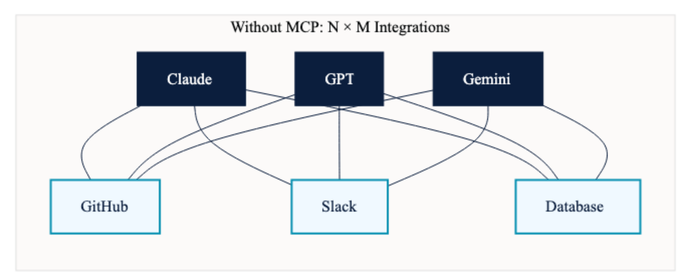

## MCP (Model Context Protocol)

- MCP standardizes how instructions are sent to the server and how results are returned
- With MCP, the N × M custom integrations are replaced by N + M integrations (N clients + M tools), since any client can call any tool as long as they both speak MCP.

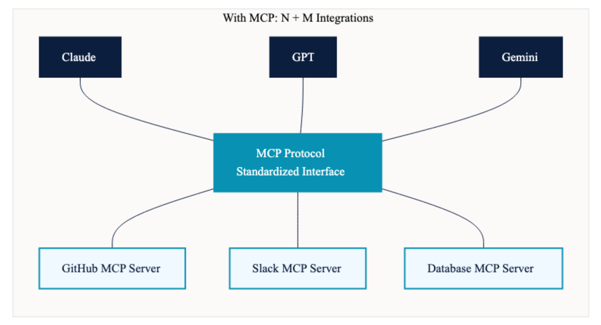

## The USB-C Analogy


## MCP Architecture

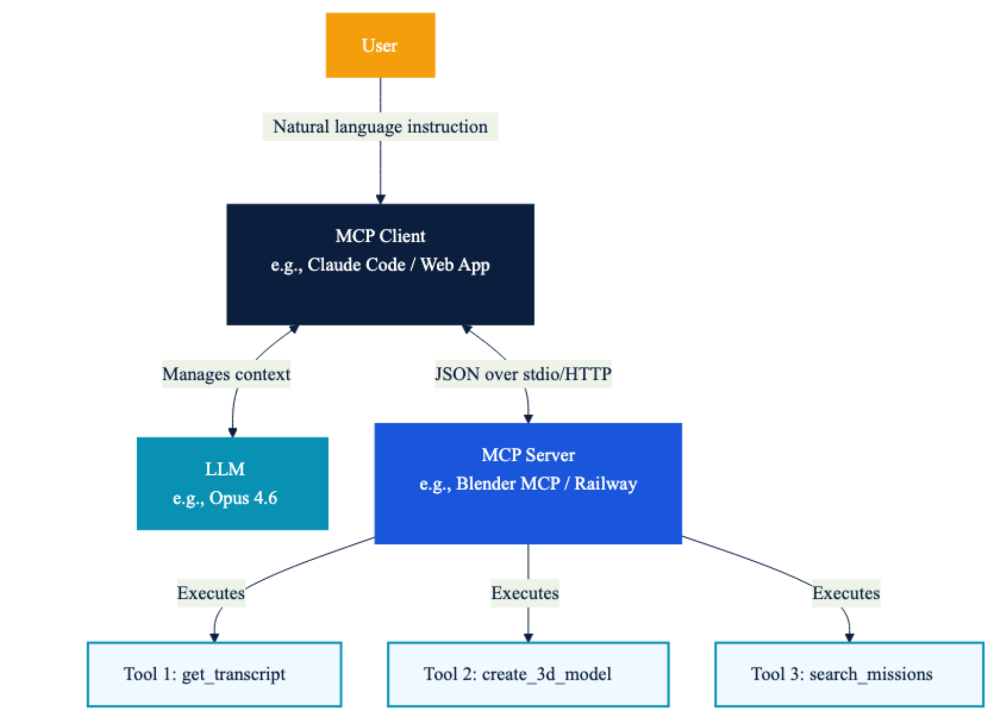

## MCP Architecture

| Component | Role | Key Responsibilities |
|-------------------|----------------|-------------------------------------|
| MCP Client | Intermediary between user/LLM and server | Manages LLM's context window; decides what tool schemas to expose to LLM; decides what portion of tool results to feed to LLM; maintains conversation loop |
| MCP Server | Hosts and executes tools | Exposes tool schemas, resources, and prompts; executes tool functions; returns results to client; does NOT manage the LLM's context |
| LLM | The reasoning brain | Decides which tools to call and in what order; produces structured tool call responses; reasons over tool results; produces final natural language output |

. . .

> The LLM never communicates directly with the MCP server. All communication flows through the MCP client.

## MCP Primitives


## MCP Primitives

| Primitive | Description | Example |
|------------------|----------------------|---------------------------------|
| Tools | Functions the LLM can invoke via structured calls | get_transcript(video_url), search_missions(query, status) |
| Resources | Documents exchanged between server and client for later reference | Mission logs, crew schedules, transcripts stored as markdown |
| Prompts | Predefined, reusable system prompts associated with tool actions | Summarize this transcript in one paragraph |

## Transport Layer and Communication

**Transport Layer**:


**Communication** - JSON-RPC 2.0

## The MCP Lifecycle

**Three Stages**: 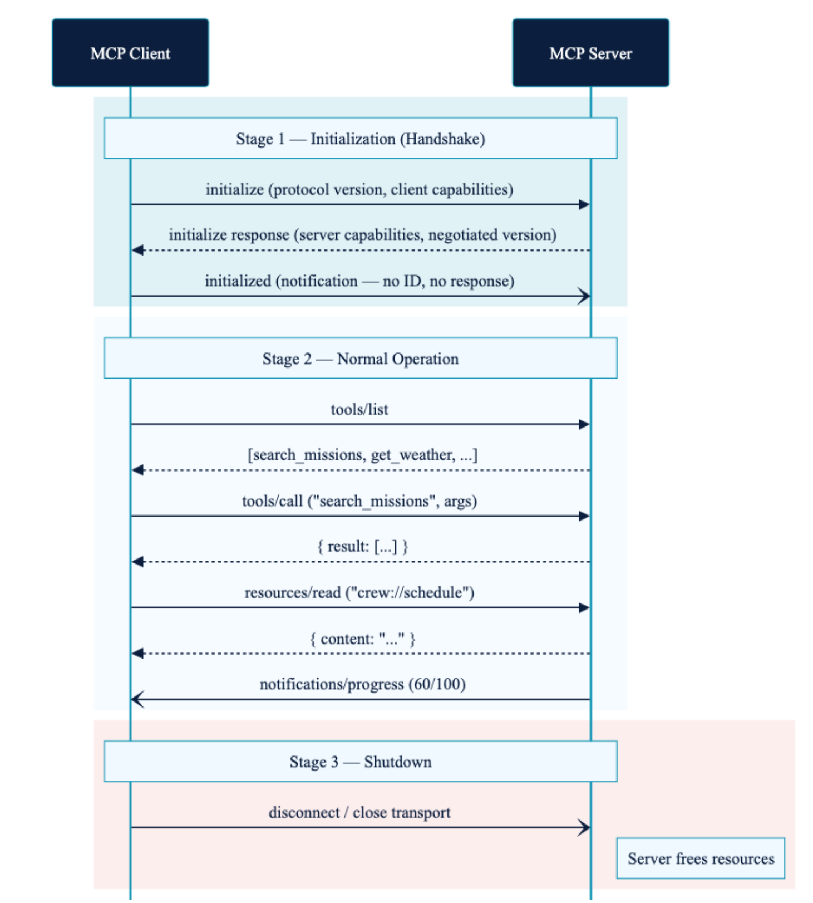{width="579"}

## The MCP Lifecycle

**Stage 1 : Initialization**

*Handshake* - Client sends Initialize Request \[protocol version (e.g., 2024-11-05), client capabilities (roots, sampling), and implementation info (client name/version)\]

- Server responds with Initialize Response \[protocol version, server capabilities (tools, resources), and implementation info (server name/version)\]

- Client sends Initialized Notification \[A notification (no ID) confirming the connection is successful. After this, the session is active.\]

*Compatibility Negotiation*

- Client and server compare protocol versions and capabilities to ensure compatibility. If incompatible, the client can choose to proceed with limited functionality or terminate the session.

## The MCP Lifecycle

*Capabilities Exchange*

- Client Capabilities

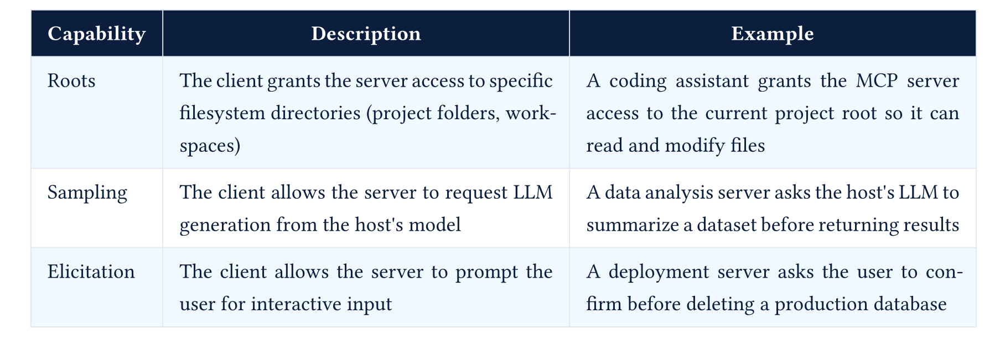

## The MCP Lifecycle

- Server Capabilities

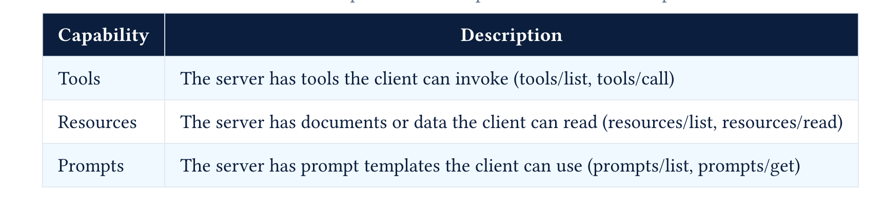


## The MCP Lifecycle

*Server to Client Requests : Bidirectional*

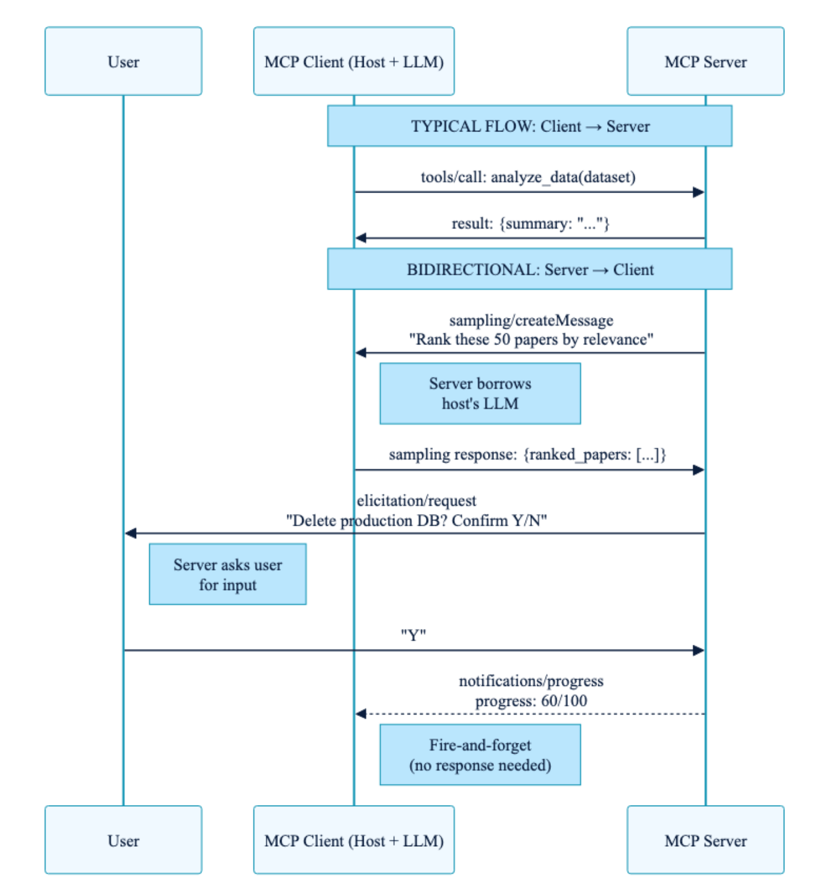

## MCP Stage 2 : Active Session

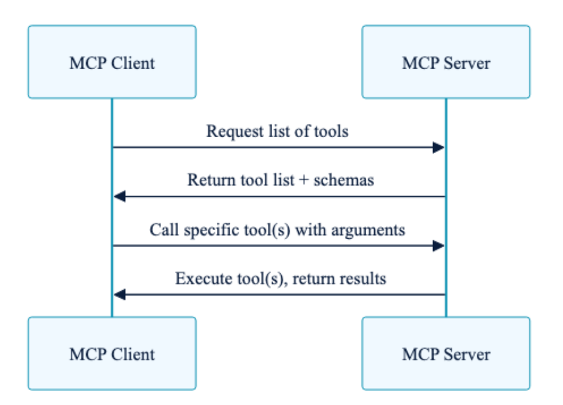

**1. Capabilities Discovery** 

- `tools/list` : Client requests list of available tools with schemas and metadata
- `resources/list` : Client requests list of available resources with metadata
- `prompts/list` : Client requests list of available prompts with metadata

**2. Tool and Resource Usage**

- Based on user queries, the client calls specific tools `tools/call` or reads specific resources `resources/read`.

## MCP Stage 3 : Shutdown

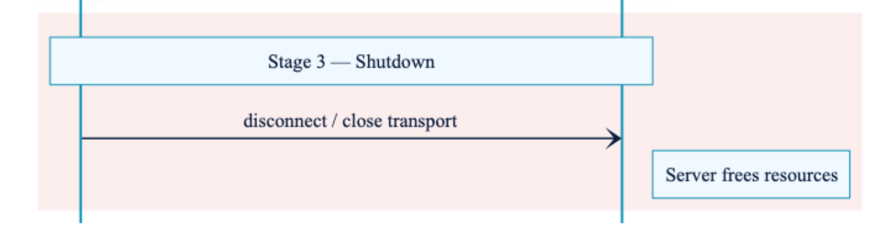

## MCP Example Walkthrough

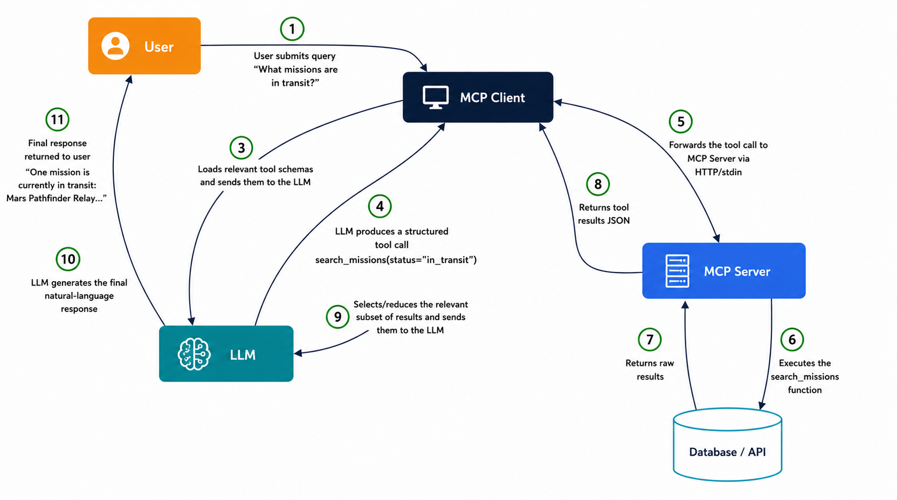

## Who does What?

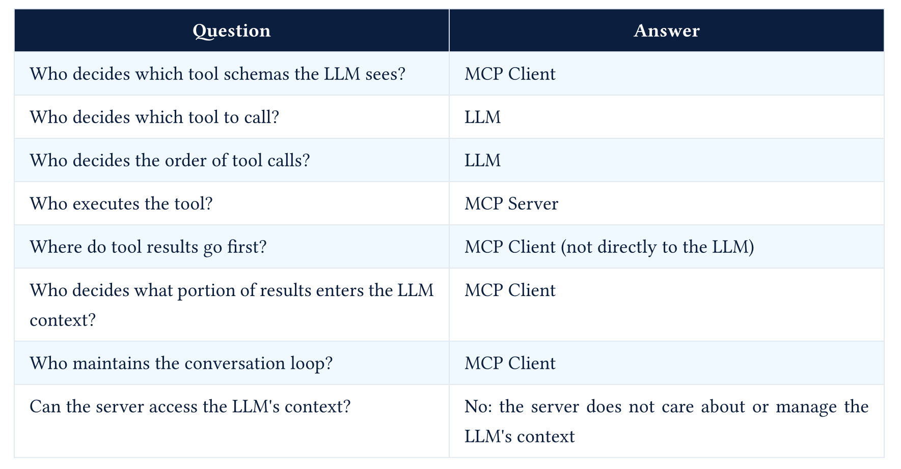

## MCP Ecosystem

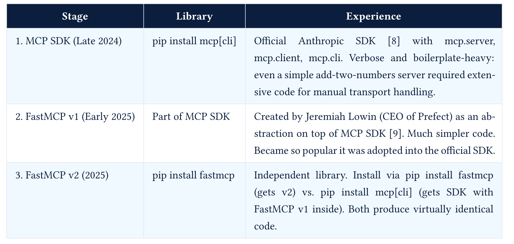

## MCP Server Skeleton

``` python

from fastmcp import FastMCP
mcp = FastMCP("DB Query Server")
@mcp.tool(description="Run a database query and return results as JSON")
    def run_query(query: str) -> str:
    # Execute the query on the database
    ...
    return "Query results as JSON string"

@mcp.resource("queries://list")
def get_queries() -> str:
    # Return valid queries from JSON file
    ...
    return "List of valid queries as JSON string"

mcp.run() # STDIO transport (local), 
# mcp.run(transport="http", host="0.0.0.0", port=8000) # HTTP transport (remote)
```

## MCP Clients

- Claude COde, Cursor, VS COde all ship with MCP clients

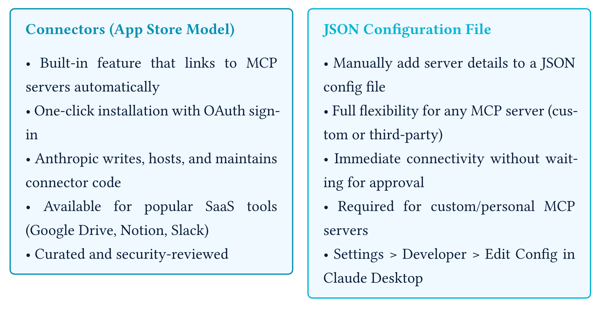

- MCP servers list - [Awesome MCP Servers](https://github.com/punkpeye/awesome-mcp-servers)

## MCP Clients

- To develop your own MCP client, you can use FastMCP, LangChain MCP Adapters or other MCP client libraries in your preferred programming language.

``` python

import asyncio
from fastmcp import Client, FastMCP

# In-memory server (ideal for testing)
server = FastMCP("TestServer")
client = Client(server)

# HTTP server
client = Client("https://example.com/mcp")

# Local Python script
client = Client("my_mcp_server.py")

async def main():
    async with client:
        # Basic server interaction
        await client.ping()

        # List available operations
        tools = await client.list_tools()
        resources = await client.list_resources()
        prompts = await client.list_prompts()

        # Execute operations
        result = await client.call_tool("example_tool", {"param": "value"})
        print(result)

asyncio.run(main())
```

## MCP Demo

- Connect a custom MCP server out agent

- Connect Blender MCP server to our custom MCP client and demonstrate how an LLM agent can use Blender

## Skills

- Skills are instructions in Markdown files. Agents read skills at runtime

- Think of skills as "mini-manuals" or "onboarding guides" for specific tasks, tools, or domains that agents can refer to when needed.


- Detailed Example : [DOCX_SKILL.md](https://github.com/anthropics/skills/blob/main/skills/docx/SKILL.md)

## Writing Skills

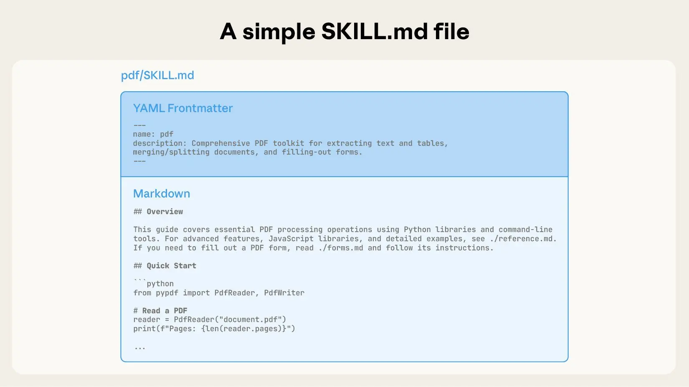

## Writing Skills

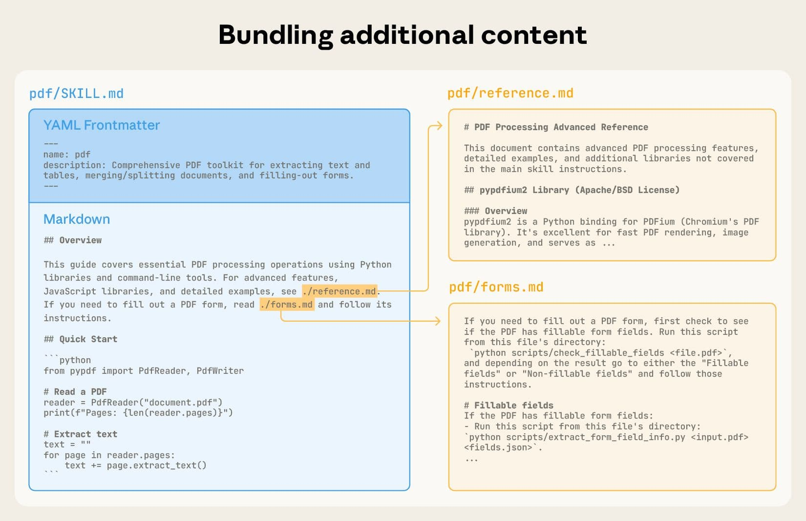

## Using Skills in Context

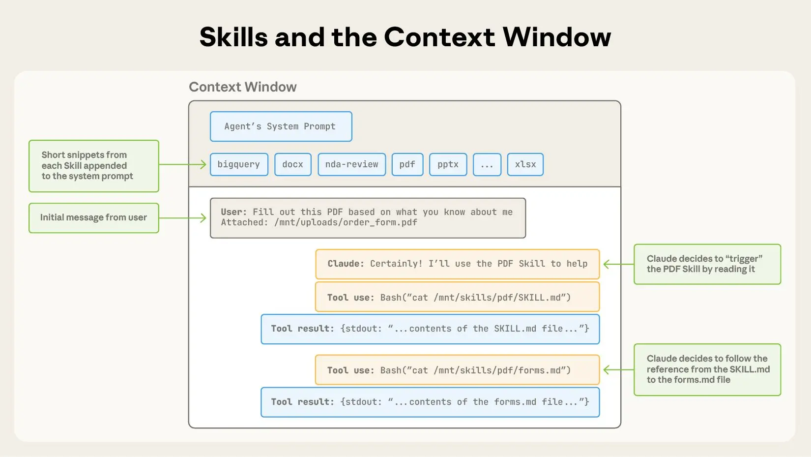

## Skills with Bundled code

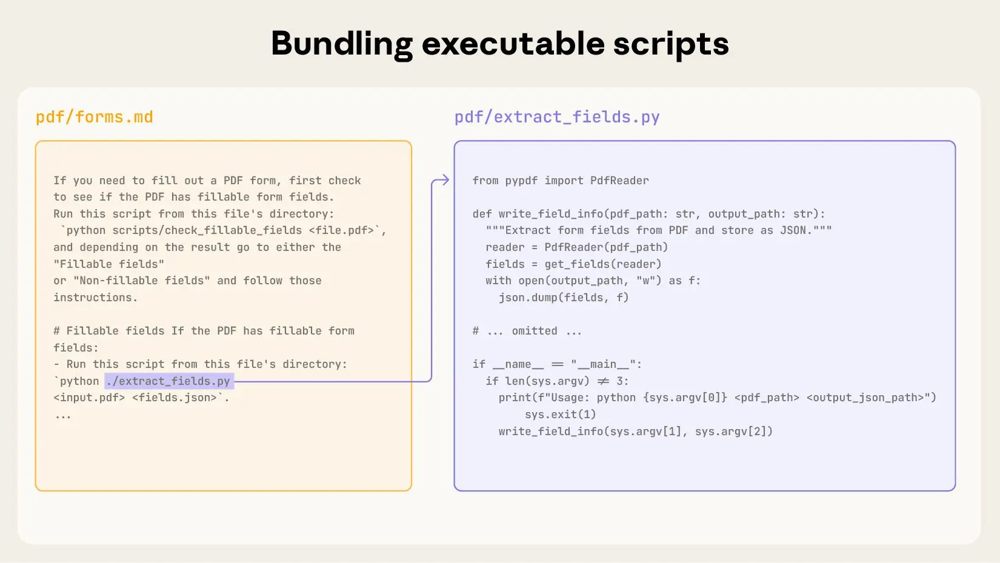

## Developing and evaluating skills

- **Start with evaluation**: Identify gaps by running representative tasks and observing struggles.
- **Build incrementally**: Address shortcomings as they are identified.
- **Structure for scale**:
  - Split `SKILL.md` when it becomes unwieldy.
  - Reference separate files to reduce token usage.
  - Use code as both executable tools and documentation.
- **Think from LLM’s perspective**:
  - Monitor usage for unexpected trajectories or overreliance.
  - Optimize skill names and descriptions for triggering accuracy.
- **Iterate with LLM**:
  - Capture successful approaches and common mistakes.
  - Use self-reflection to determine necessary context.

## Skills Demo

