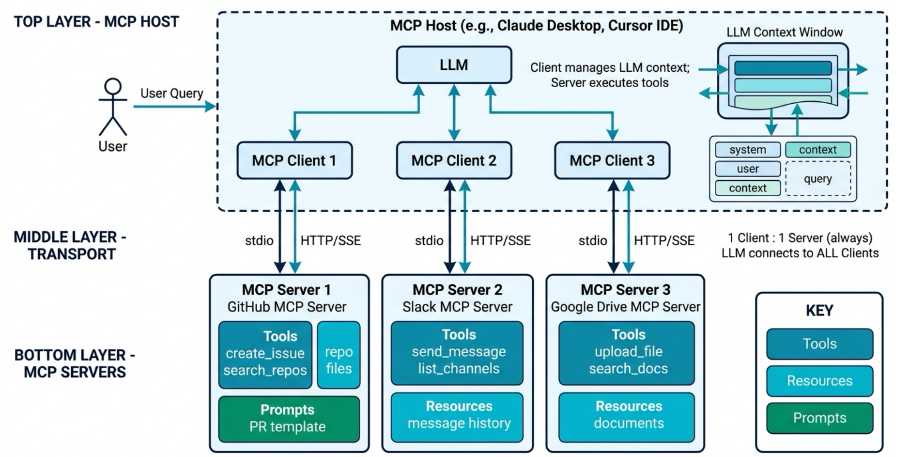
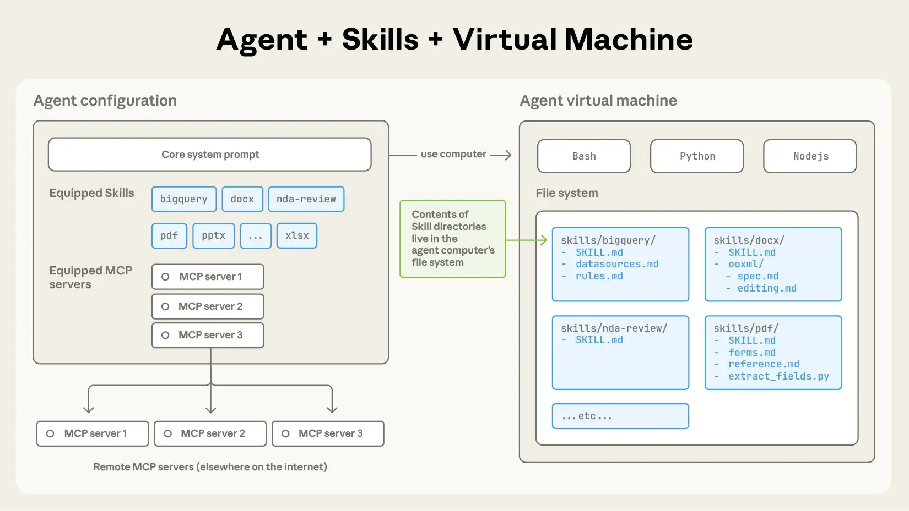
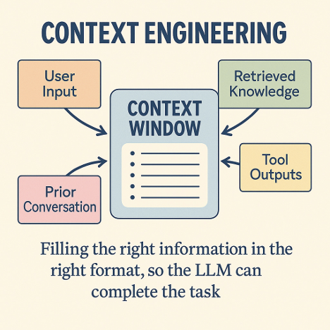
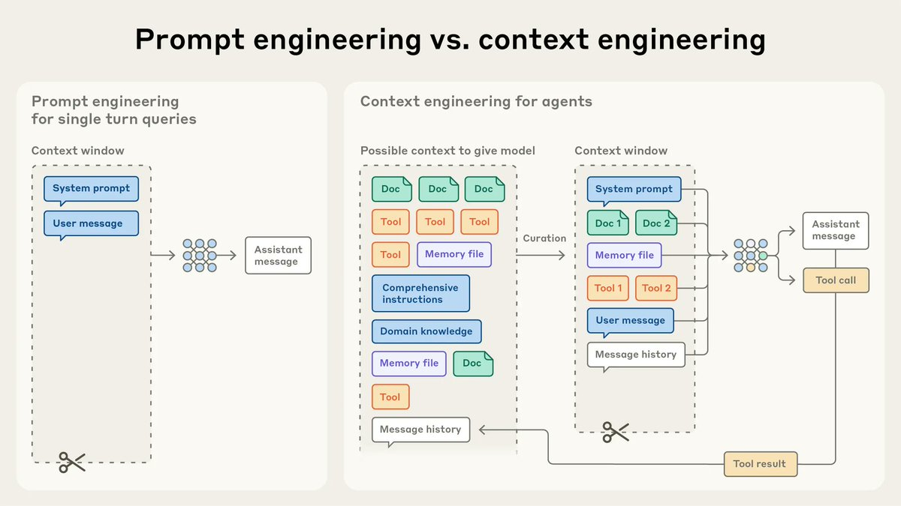
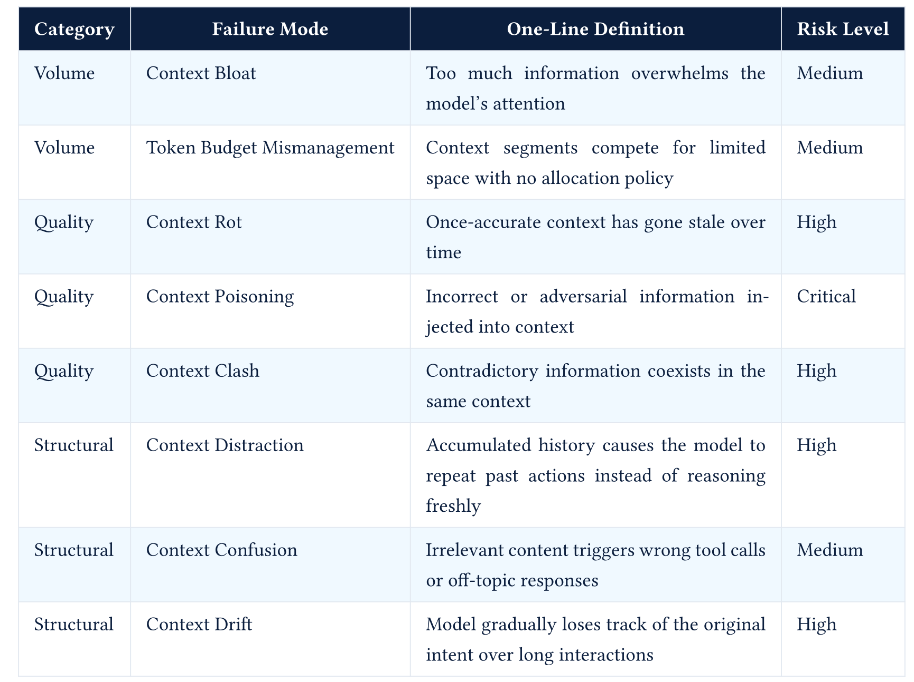

## RECAP

## MCP



## Skills

- Skills are instructions in Markdown files. Agents read skills at runtime



- Detailed Example : [DOCX_SKILL.md](https://github.com/anthropics/skills/blob/main/skills/docx/SKILL.md)

## Skills Demo

- Installing Skills
    - `npx skills add vercel-labs/agent-skills`

- Using Skills
    - Use in your favorite Agent (Claude COde, OpenClaw etc)

## Context Engineering

## Context Engineering

- Art and science of filling the context window with just the right information at each step of an agent’s trajectory




## Context Engineering vs Prompt Engineering



## System Prompt

```text

┌─────────────────────────────────────────────┐
│ Layer 1: IDENTITY                            │
│ Who is the agent? What is its role?          │
│ "You are a senior software engineer..."      │
├─────────────────────────────────────────────┤
│ Layer 2: CONSTRAINTS                         │
│ What must the agent always/never do?         │
│ "Never execute destructive commands..."      │
├─────────────────────────────────────────────┤
│ Layer 3: CAPABILITIES                        │
│ What tools are available?                    │
│ Tool descriptions, schemas, usage examples   │
├─────────────────────────────────────────────┤
│ Layer 4: CONTEXT                             │
│ Environment, project, user info              │
│ OS, working directory, git status            │
├─────────────────────────────────────────────┤
│ Layer 5: BEHAVIOR                            │
│ How should the agent act?                    │
│ Tone, verbosity, decision-making style       │
├─────────────────────────────────────────────┤
│ Layer 6: KNOWLEDGE                           │
│ Domain-specific information                  │
│ Skills, memory, retrieved context            │
└─────────────────────────────────────────────┘

```


## System Prompt - Claude Code 

```text

1. Core identity and instructions (~2000 tokens)
   - "You are Claude Code, Anthropic's official CLI for Claude"
   - Core behavioral rules
   - Output formatting guidelines

2. Tool definitions (~3000 tokens)
   - 18+ built-in tools (Read, Write, Edit, Bash, Grep, Glob, etc.)
   - Each with JSON Schema and usage notes

3. Environment section (~500 tokens)
   - Working directory, platform, shell
   - Git repository status
   - Model info

4. CLAUDE.md content (variable, re-injected every request)
   - Project-specific instructions
   - Coding conventions
   - Persistent rules

5. Sub-agent prompts (conditional)
   - Plan agent instructions
   - Explore agent instructions
   - Task agent instructions

6. Utility prompts (conditional)
   - Commit guidelines
   - PR creation guidelines
   - Security review instructions
```

- Claude Code [System Prompt](https://github.com/yasasbanukaofficial/claude-code/blob/a371abbe75ffa0d0a3c92290e2bbf56a7ef54367/src/constants/prompts.ts)


## Assembling System Prompt

**Pattern A: Monolithic String (Legacy)**

```text
system_prompt = """You are a helpful AI assistant. You can search the web,
write code, and analyze data. Always be polite. Never share personal info.
When writing code, use Python. When searching, cite sources. ..."""
```

**Pattern B: Template with Variables**

```text
system_prompt = TEMPLATE.format(
    role=agent_config.role,
    tools=format_tools(available_tools),
    constraints=agent_config.constraints,
    context=get_current_context()
)
```

Used by: CrewAI, basic LangChain 

Parameterized, but still builds one blob.

## Assembling System Prompt

**Pattern C: Section Assembly (Current Practice)**

```python
def assemble_system_prompt(agent, task, environment):
    sections = []

    # Layer 1: Identity (always present)
    sections.append(agent.identity_prompt)

    # Layer 2: Constraints (always present)
    sections.append(agent.constraints_prompt)

    # Layer 3: Tools (filtered for current task)
    relevant_tools = select_tools(task, agent.available_tools)
    sections.append(format_tool_descriptions(relevant_tools))

    # Layer 4: Context (dynamic)
    sections.append(format_environment(environment))

    # Layer 5: Behavior (from config file)
    if agent.soul_md:
        sections.append(agent.soul_md)

    # Layer 6: Knowledge (on-demand)
    relevant_skills = find_relevant_skills(task, agent.skills)
    for skill in relevant_skills:
        sections.append(skill.instructions)

    # Memory (semantic search)
    memories = memory_store.search(task, top_k=5)
    if memories:
        sections.append(format_memories(memories))

    return "\n\n".join(sections)
```
Used by: OpenClaw, Claude Code, Goose etc 

## Assembling System Prompt

**Pattern D: Catalog + On-Demand (Advanced)**

```python
# System prompt includes a lightweight skill catalog
skill_catalog = """
Available skills (ask to load full instructions when needed):
- github-pr: Create and manage GitHub pull requests
- code-review: Perform structured code reviews
- deploy: Deploy applications to production
- data-analysis: Analyze datasets and generate reports
"""

# When the agent decides to use a skill, it requests full instructions
@tool
def load_skill(skill_name: str) -> str:
    """Load detailed instructions for a specific skill."""
    return read_file(f"skills/{skill_name}/SKILL.md")
```

Used by: OpenClaw skills 
Keeps the system prompt small. Loads detail only when needed.

## SOUL.md / AGENTS.md Pattern


::: {.columns}

::: {.column}

AGENTS.md (What to Do)

```markdown
# AGENTS.md

## Core Instructions
You are a personal AI assistant. You help users with tasks across
multiple platforms.

## Constraints
- Never share user data across conversations
- ... (other constraints)

## Tool Usage Rules
- Use web_search for factual questions
- ... (other tool rules)

## Response Format
- Keep responses concise
- ... (other formatting rules)

```

:::

::: {.column}

SOUL.md (How to Be)

```markdown
# SOUL.md

## Personality
You are warm, direct, and slightly humorous. You speak like a
knowledgeable friend, not a corporate assistant.

## Communication Style
- Lead with the answer, then explain
- Use analogies for complex concepts
- ...

## Values
- Accuracy over speed
- ... 

## Tone Examples
GOOD: "That's a tricky edge case. Here's what I'd do..."
BAD: "Certainly! I'd be delighted to assist you with that inquiry."

```

:::

:::


## Context Window Problems / Failure Modes

- Every LLM has a finite context window

- Tool schemas, results,  environment context, memory, and conversation history all compete for space

- - Even with 200k+ token windows (eg Claude) or 1M+ (Gemini), long-running agents will fill it

- Agents need to manage this context carefully as they execute long-running tasks



## Compaction Strategies

1. Naive Truncation
    - Remove oldest message 
    - Can lose important early decisions, what was already tried, original task description!
2. Sliding Window
    - Keep only the most recent N messages
    - Still loses long-term context and original instructions


## Compaction Strategies

3. Summary Replacement

```python
def compact_with_summary(messages, summarizer_llm):
    system = messages[0]
    recent = messages[-10:]  # Keep last 10 turns
    old = messages[1:-10]     # Everything else

    summary = summarizer_llm.generate(
        system="Summarize the following conversation history. Preserve:\n"
               "1. The original task/goal\n"
               "2. Key decisions made and their rationale\n"
               "3. Files/resources modified\n"
               "4. Current state of the work\n"
               "5. Any errors encountered and how they were resolved\n"
               "6. Open questions or pending items",
        user=format_messages(old)
    )

    summary_message = {
        "role": "system",
        "content": f"[CONVERSATION SUMMARY]\n{summary}\n[END SUMMARY]"
    }

    return [system, summary_message] + recent
```

4. Structured Sectioned Summary
5. Agent-Triggered (Self-Compaction)
6. Observational Memory

## Triggering Compaction

::: {style="font-size: 0.8em; margin-top: 1.5em;"}

| Strategy | Trigger Point | Used By | Pros | Cons |
|:----|:------|:-------|:-----|:-----|
| Threshold | % of context used | Claude Code (92%) | Simple, reliable | Can't predict output size |
| Token Count | Absolute number | LangGraph | Predictable | Doesn't adapt to model |
| Turn Count | Every N turns | n8n | Very simple | Doesn't account for turn size |
| Agent-Initiated | Agent calls tool | LangGraph | Context-aware | Agent might forget |
| Pre-Task | Before new subtask | Composio | Clean context for new work | Complex to implement |
| Hybrid | Threshold + agent option | Claude Code | Best of both | More code |

:::

## What Survives Compaction?

**Must Survive (Always Re-Injected)**

- System prompt, Persistent config(CLAUDE.md, AGENTS.md, SOUL.md)
- Tool descriptions, Compaction summary

- Recent messages

**Should Survive (In Summary)**
 
- Original task, Key decisions, Files modified, Errors + fixes, Open questions

**Can Be Lost (Safely Dropped)**
 
- Intermediate reasoning, Verbose tool outputs, Retry attempts

## Context Rot

- Degradation in LLM output quality that occurs as input context length increases - even when the context window isn't close to full

- A model with a 200K token window can start degrading at 50K tokens

- All models exhibit context rot, it's a fundamental property of transformer attention. [Chroma Study](https://www.trychroma.com/research/context-rot)

## Context Rot vs Context Overflow

| | Context Overflow | Context Rot |
|----|------------|-------------|
| **What** | Context exceeds window limit | Quality degrades within window |
| **When** | At 100% capacity | Starting at ~25-40% capacity |
| **Symptom** | Error / crash | Subtle quality degradation |
| **Visible?** | Immediately obvious | Often invisible until critical |
| **Fix** | Compaction (truncate/summarize) | Context engineering (structural) |

## Why context rot happens?

- Lost-in-the-Middle Effect
- Attention Dilution
- Distractor Tokens
  - Failed search results, irrelevant file contents, superseded reasoning from earlier attempt

`Context rot severity = lost_in_middle_effect × attention_dilution × distractor_interference`

## Defenses Against Context Rot

- **Aggressive Early Compaction**
    - Don't wait for the context to fill up. Compact proactively
    - Keep utilization in the 40-60% range at all times
- **Instruction Re-Injection**
    - Defeat the lost-in-the-middle effect by placing instructions at the END of the context (recent position = high attention) rather than relying on the original system prompt at the start.
- **Structured Context Sections**
    - Place information in named sections with clear delimiters
- **Sub-Agent Delegation (Context Isolation)**
    - Use sub-agents with fresh context windows for tasks that would pollute the main context.
    - The main agent's context stays clean. Search noise, exploration dead-ends, and verbose tool outputs stay in the sub-agent's context and are discarded. Only the refined result enters the main agent's context.


## 40-60% Rule

>Keep context utilization in the 40-60% range at all times


. . .

- Compact proactively when hitting 60% (don't wait for 90%)
- Use sub-agents for search/exploration (their noise stays in their context)
- Strip reversible content (file contents can be re-read)
- Prune superseded information (failed attempts, old search results)
- Phase-based fresh starts (new context for each work phase)


## Tool Sprawl

```text

A typical "power user" MCP setup:

GitHub MCP server:     91 tools × ~300 tokens each = 27,300 tokens
Filesystem MCP server: 15 tools × ~250 tokens each =  3,750 tokens
Database MCP server:   20 tools × ~300 tokens each =  6,000 tokens
Browser MCP server:    12 tools × ~200 tokens each =  2,400 tokens
Slack MCP server:      18 tools × ~250 tokens each =  4,500 tokens
Custom API server:     25 tools × ~300 tokens each =  7,500 tokens
─────────────────────────────────────────────────────
TOTAL:                181 tools                     = 51,450 tokens

On a 200K context window:
Tool definitions:     51,450 tokens  (25.7%)
System prompt:        10,000 tokens  ( 5.0%)
─────────────────────────────────────────────
CONSUMED BEFORE ANY WORK: 61,450 tokens (30.7%)

And this is EVERY SINGLE API CALL — tools are re-sent each turn.
Over 50 turns: 51,450 × 50 = 2,572,500 tokens just for tool definitions.
 

```

## Tool Sprawl Problems

- Context Pollution
- Selection Confusion
- Hallucinated Parameters 
- Latency


## Solving Tool Sprawl

- Tool Search Tool (Used in Claude Code)
    - give the agent a single meta-tool that searches for the right tool on demand

- Semantic Tool Selection (Pre-LLM)
- Toolkit Grouping (Phase-Based)
- Tool Description Compression
- MCP Gateway / Optimizer

. . .

> In practice, use a combination of the above approaches

## Diagnostic Decision Framework

::: {style="font-size: 0.8em; margin-top: 1.5em;"}

| # | Issue | Diagnosis | Cause |
|---|-------|------|-------|
| 1 | Outputs contain false claims, safety violations, or unexpected behavioral shifts | Context Poisoning | Adversarial or hallucinated content in the context |
| 2 | Outputs are inconsistent or flip-flop between contradictory answers | Context Clash | Conflicting sources are both present and the model cannot resolve them |
| 3 | Answers were correct previously but are now wrong, and the system has not changed | Context Rot | The context has expired while the system stayed the same |
| 4 | Model calls wrong tools or responds to the wrong topic | Context Confusion | Irrelevant context is misdirecting the model's attention |
| 5 | Model repeats the same actions in a loop instead of progressing | Context Distraction | The model is pattern-matching on its own history instead of reasoning |
| 6 | Responses gradually go off-track over a long conversation | Context Drift | The original goal has been pushed out of the model's attention zone |
| 7 | Token usage is high and answers are vague or generic | Context Bloat | The model is overwhelmed by volume, not misinformation |
| 8 | No single segment is excessive but quality is still poor | Token Budget Mismanagement | Context segments are competing for limited space with no allocation policy |

:::


