## Memory


## RECAP

**Agent primitives:**

- Tool Use
- MCP
- Skills
- Context Engineering

. . . 

> But how do we make agents that can learn and improve over time? Agents should remembr and learn from past interactions.

## Memory Systems

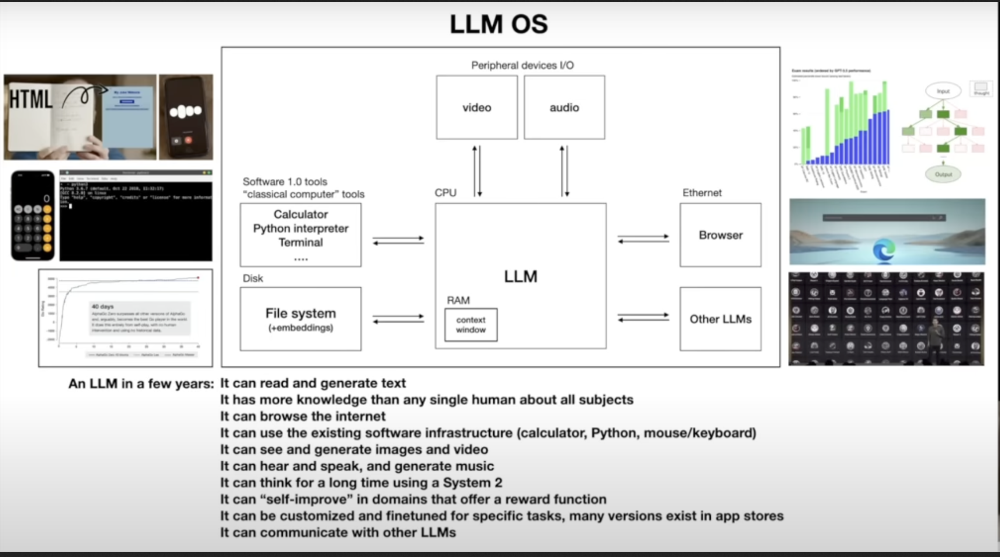

## Why Agents Need Memory

Many tasks depend on information that is not naturally present in the immediate prompt

. . .

- A personal assistant remembers the user's timezone, writing style, and recurring commitments.

. . .

- A coding agent remembers that the project uses `pytest`, that auth lives in `src/auth`, and that migrations must be generated manually.

. . .

- A research agent remembers sources it already checked and which ones were unreliable.

## Why Agents Need Memory

Bad memory can make agents worse.

- Stale memories can override current instructions.

- Duplicated memories can create contradictions.

- Sensitive data can be stored accidentally.

- Memory writes can reinforce mistakes.

- Token cost rises if memory is injected eagerly.


. . .


>What should be remembered, in what form, who can edit it, when is it retrieved, and how is it evaluated?


## Memory Taxonomy

::: {style="font-size: 0.8em;"}

| Human term | Agent analogue | Lifespan | Where it lives |
|------------|-------------|-------|-----------------|
| Working memory | Context window | This turn | LLM input tokens |
| Short-term memory | Session state | This conversation | In-process object / DB |
| Episodic memory (events) | Past trajectories | Forever | Vector DB / SQLite |
| Semantic memory (facts) | Project knowledge | Forever | Files / vector DB |
| Procedural memory (skills) | Reusable workflows | Forever | `SKILL.md` files |

:::

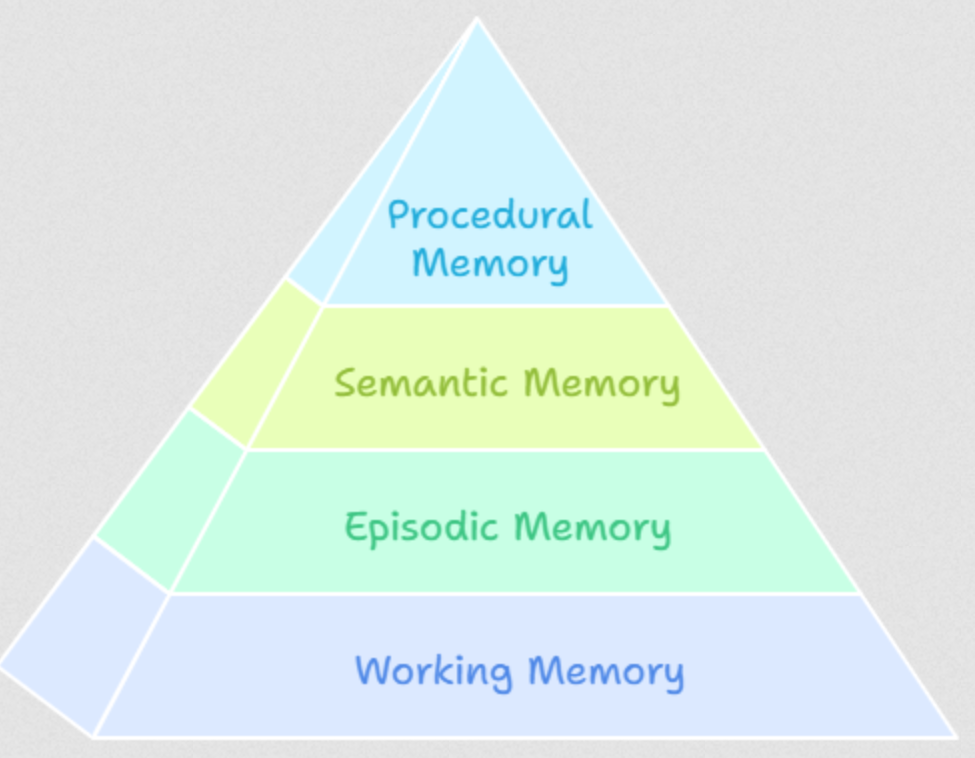


## Working Memory (Context Window)

- LLM's "RAM" - the current conversation context. Everything the model can "see" in the current request.

**What Belongs in Working Memory**

- Current task description
- Recent conversation turns (last 5-10)
- Active tool results
- Current file contents being edited
- Compaction summary of older history

## Working Memory (Context Window)

- LLM's "RAM" - the current conversation context. Everything the model can "see" in the current request.

**What Doesn't Belong**

- Full conversation history (use compaction)
- All available tool descriptions (use JIT)
- All skill instructions (use catalogs)
- User's entire project history (use long-term memory)

## Working Memory (Context Window)

**Optimization Strategies**

- Minimize system prompt size : Assemble only what's needed
- JIT tool loading : Don't include all tools all the time
- Compact early : Don't wait until full
- Structured messages : Dense, factual, no fluff


## Short-Term / Session Memory

- **Scoped** : Persists within a session; cleared or archived when it ends
- **Tracks** : Goals, decisions, plans, and errors made during the session
- **Coherence** : Agent remembers what it did two steps ago
- **Compaction** : Used to build summaries before context fills up
- **Isolation** : One task or workflow per session

```python
class SessionState:
    """Maintains state across a single conversation session."""

    def __init__(self):
        self.goal: str = ""
        self.decisions: list[Decision] = []
        self.files_modified: list[FileChange] = []
        self.errors: list[Error] = []
        self.plan: Optional[Plan] = None
        self.compaction_summaries: list[str] = []

    def to_context(self) -> str:
        """Format state for injection into context."""
        return f"""
## Session State
Goal: {self.goal}
Decisions: {self.format_decisions()}
Files Modified: {self.format_files()}
Current Plan: {self.plan}
"""
```


## Long-Term Memory

- Persists across conversation sessions, gives agents a sense of history and continuity


```markdown
memory/
├── user.md          # Who the user is, preferences
├── project.md       # Project context, architecture
├── feedback.md      # Corrections and confirmed approaches
├── reference.md     # External resource pointers
└── MEMORY.md        # Index file

```


## Memory Implementations

1. **The OS pattern (Letta)** - the agent manages memory explicitly via tool calls (`mem_load`, `mem_save`)
    -  the agent's own judgment is the right gatekeeper of what goes in and out of memory

2. **The pipeline pattern (Mem0, Zep, Cognee)** - memory is extracted, indexed, and retrieved *automatically* by a background service
    - The agent doesn't think about memory


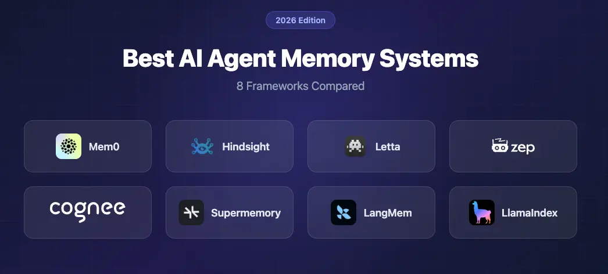

## Implmentation Patterns

**File-based memory (OpenClaw, Claude Code)**

```
memory/
├── user.md          # Who the user is, preferences
├── project.md       # Project context, architecture
├── feedback.md      # Corrections and confirmed approaches
├── reference.md     # External resource pointers
└── MEMORY.md        # Index file (always loaded)
```


::: {.columns}

::: {.column}

**Why it works:**

- Human-readable & editable
- Git-friendly.
- No infrastructure dependency.
- Inspectable for debugging.

:::

::: {.column}

**Why it breaks:**

- Doesn't scale past a few hundred entries.
- No semantic search.
- Requires the agent to *know* which file to read.

:::

:::


## Implmentation Patterns

**Vector store memory**

```python
from chromadb import Client
db = Client()
col = db.create_collection("agent_memory")

col.add(
    documents=["User prefers functional Python with type hints"],
    metadatas=[{"type": "user_preference", "date": "2026-03-15"}],
    ids=["mem_001"]
)

results = col.query(
    query_texts=["What coding style does the user prefer?"],
    n_results=5
)
```


::: {.columns}

::: {.column}

**Why it works:**

- Semantic search (finds conceptually similar memories).
- Scales to large memory stores.
- Automatic ranking by relevance.

:::

::: {.column}

**Why it breaks:**

- Embeddings ≠ understanding (false positives, especially with negations).
- Less human-readable.
- Returns top-k regardless of quality (you need a relevance threshold).
- Embedding model drift if you change models.

:::

:::


## Hybrid (Hermes Agent, Mem0 etc)

- Files for *human-curated, structural* knowledge (preferences, project notes). 

- Vector DB for *retrieved, contextual* knowledge (past traces, observations)

**Conceptual Implmentation**

```python
class MemorySystem:
    def __init__(self):
        self.files = FileMemory("./memory/")
        self.vectors = VectorMemory("./vectors/")
        self.fts = SQLiteFTS5("./memory.db")

    def store(self, m: Memory):
        self.files.write(m)
        self.vectors.embed_and_store(m)
        self.fts.index(m)

    def recall(self, query, top_k=5):
        return dedupe_and_rank(
            self.files.keyword_search(query)
            + self.vectors.semantic_search(query, top_k)
            + self.fts.search(query, top_k)
        )
```

## Mem0 Demo


- Four-scope model (`user_id` / `agent_id` / `run_id` / `app_id`)

```python
# pip install mem0ai
from mem0 import MemoryClient

memory = MemoryClient(api_key="...")  # or self-hosted

# Mem0 extracts facts from a conversation asynchronously.
# You write conversations; Mem0 turns them into searchable memories.
memory.add(
    messages=[
        {"role": "user", "content": "I'm allergic to penicillin and I work at Acme Corp."},
        {"role": "assistant", "content": "Got it — noted both."}
    ],
    user_id="asha_42",
    metadata={"app_id": "support_bot", "session_id": "s-1"}
)

# Later — different session, different agent — recall semantically:
results = memory.search(
    query="What medications should I avoid?",
    user_id="asha_42",
    filters={"app_id": "support_bot"}  # scope by app
)
# Returns: [{"memory": "User is allergic to penicillin", "score": 0.91, ...}]
```

## When to Fetch Memory?

1. **Eager injection** - load relevant memory at the start of each session (Claude Code's `CLAUDE.md`, OpenClaw's `SOUL.md`)

2. **On-demand tool** - expose memory as a tool the agent calls (`recall_memory(query)`)


## Episodic Memory

- A structured record of what the agent tried, what worked, and what failed.
- Pioneered by **Hermes Agent** and formalized in **A-MEM (NeurIPS 2025, Xu et al.)**

- After completing a task, the agent writes an episode


## Episodic Memory

**Implementation**

```python

# 1. After completing a task, write an episodic record
episode = Episode(
    task_type="deploy-to-ecs",
    approach="Used CDK to define infrastructure, then deployed via CLI",
    outcome="failure",
    key_actions=[
        "Created ECS task definition",
        "Built Docker image",
        "Pushed to ECR",
        "Deployed with `cdk deploy`"
    ],
    lessons="CDK deploy failed because the VPC subnet was private. "
            "Next time, check subnet type before deploying. "
            "Use `aws ec2 describe-subnets` to verify."
)
episodic_store.save(episode)

# 2. Before starting a SIMILAR future task, retrieve relevant episodes
similar_episodes = episodic_store.search("deploy to ECS", top_k=3)

# 3. Inject into context BEFORE execution begins
context += format_episodes(similar_episodes)
# The agent now knows: "Last time I tried to deploy to ECS, I failed
# because of private subnets. I should check subnet type first."
```

## Episodic Memory

- Learning from mistakes without retraining
- Transfer learning across similar tasks
- Continuous improvement - the agent gets better at recurring tasks
- Transparency - you can inspect why the agent chose a particular approach


**Observational Memory** [Mastra] - extracts discrete facts and stores them 

## Procedural memory: Agents  write their own skills

- Hermes' pattern: after a *complex* task succeeds, the agent is prompted: *"Write a `SKILL.md` that future-you could use to do this faster."* 


## User modeling : A special case of memory

The agent builds a **deepening model of the user** across sessions:

- Session 1: name, timezone, languages.
- Session 5: typical tasks, communication style, expertise.
- Session 20: decision patterns, common mistakes, preferred solutions.

```python
class UserModel:
    name: str
    expertise_areas: list[str]
    communication_style: str  # "terse" | "detailed" | "casual"
    decision_patterns: list[str]
    preferred_solutions: dict[str, str]  # problem_type → approach

    def update(self, new_observation: str):
        # LLM-powered integration: merge or replace?
        ...
```

Claude Code - project-level `MEMORY.md` store

## Memory Comparison

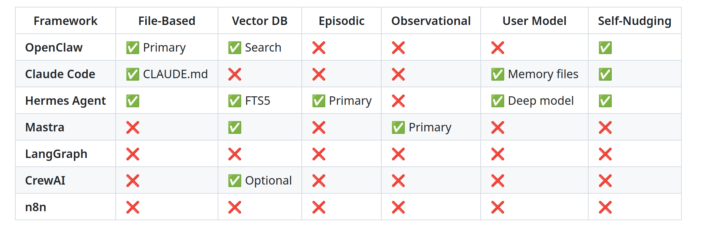


## MULTI-AGENT SYSTEMS


## Why Multi-Agent?

- Specialized agents win, like specialized humans. A coder, a reviewer, a tester - clean division of labor


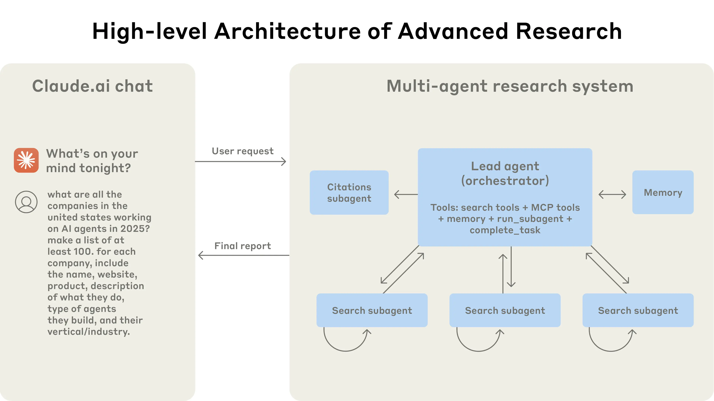


## Muti-agent System Benefits

1. **Specialization** - different prompts AND different tools/models. (Expensive model for planning, cheap model for implmentation)
2. **Parallelism** - independent subtasks that can run concurrently. (Fix 5 unrelated bugs in 5 PRs.)
3. **Adversarial dynamics** - debate, red-teaming, solver–critic. The *disagreement* is the signal.

## Multi-Agent Systems Drawbacks

1. **Coordination cost** - each handoff is a token tax + a latency tax.
2. **Error compounding** - a 90%-reliable agent chained 5 times is 0.9^5 ≈ 59% reliable.
3. **Context fragmentation** - agent B doesn't have what agent A knew.
4. **Debug nightmare** - failures cross agent boundaries; root cause analysis is hard.


## Multi-Agent Frameworks  

The current multi-agent framework landscape

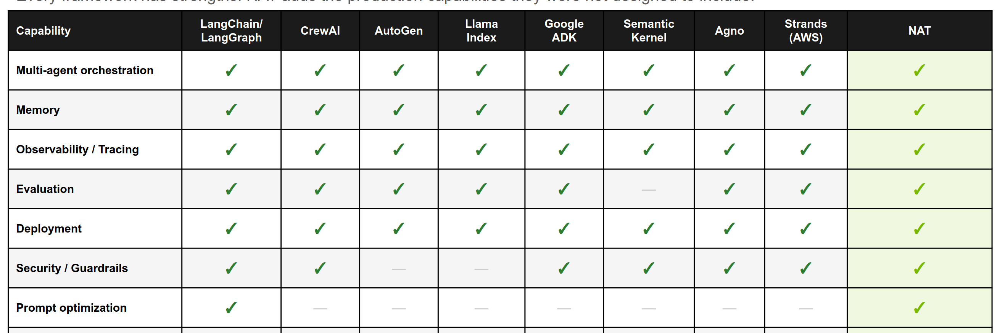


## Orchestration Patterns

## Pattern 1 : Supervisor / Manager (hub-and-spoke)

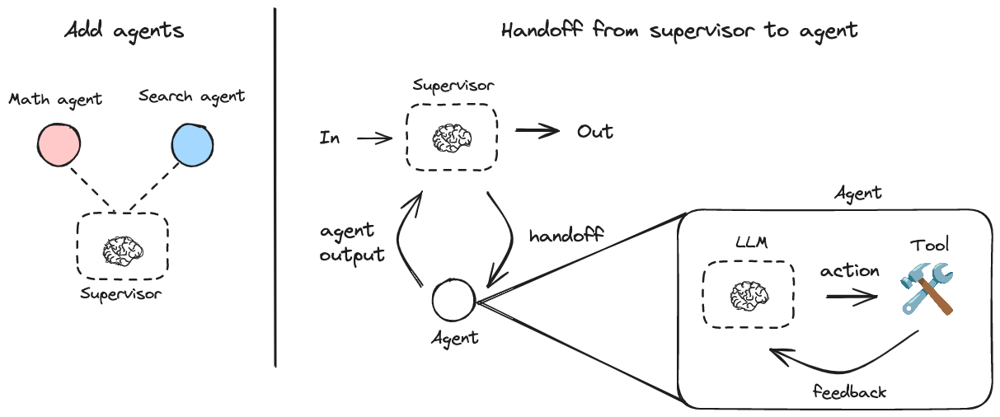

Supervisor decides who works next, aggregates results, maintains overview.

```python
def supervisor(state):
    """LLM decides which worker to call next."""
    resp = supervisor_llm.generate(
        system="You manage a team: researcher, coder, tester. "
               "Decide who should work next. Reply with the name "
               "or 'DONE' if complete.",
        user=f"Current state: {state}"
    )
    return {"next_agent": resp.text}

graph.add_conditional_edges("supervisor", lambda s: s["next_agent"])
```

**Used by:** 
CrewAI (hierarchical), LangGraph, AutoGen GroupChat.


## Pattern 2 : Sequential Pipeline

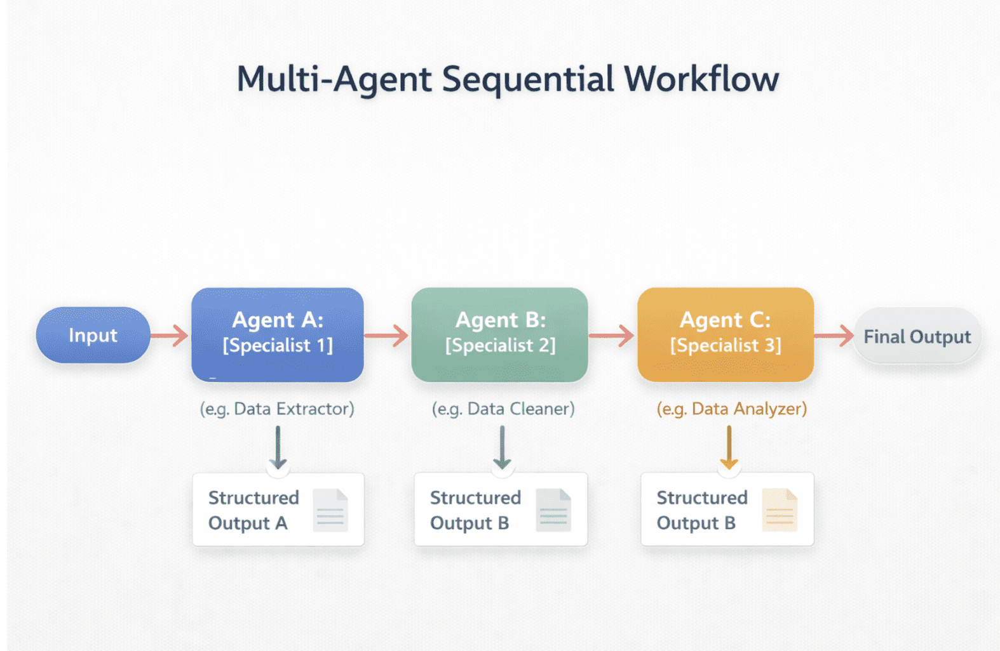

**Used by:** 

MetaGPT (PM -> Architect -> PM -> Engineer -> QA), Aider (architect -> editor).

## Pattern 3 : Graph with Conditional Edges

Explicit DAG (or graph with cycles) where nodes are agents and edges encode transitions.

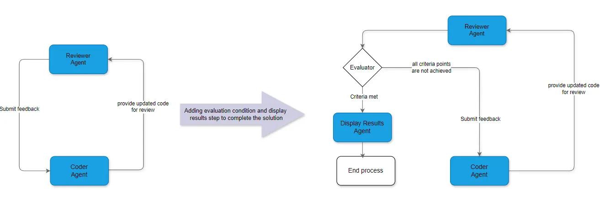

```python
graph = StateGraph(State)
graph.add_node("planner", planner_agent)
graph.add_node("coder", coder_agent)
graph.add_node("reviewer", reviewer_agent)

graph.set_entry_point("planner")
graph.add_edge("planner", "coder")
graph.add_edge("coder", "reviewer")
graph.add_conditional_edges("reviewer", {
    "approved": END,
    "needs_changes": "coder"
})
```

## Pattern 4 : Parallel Fleet

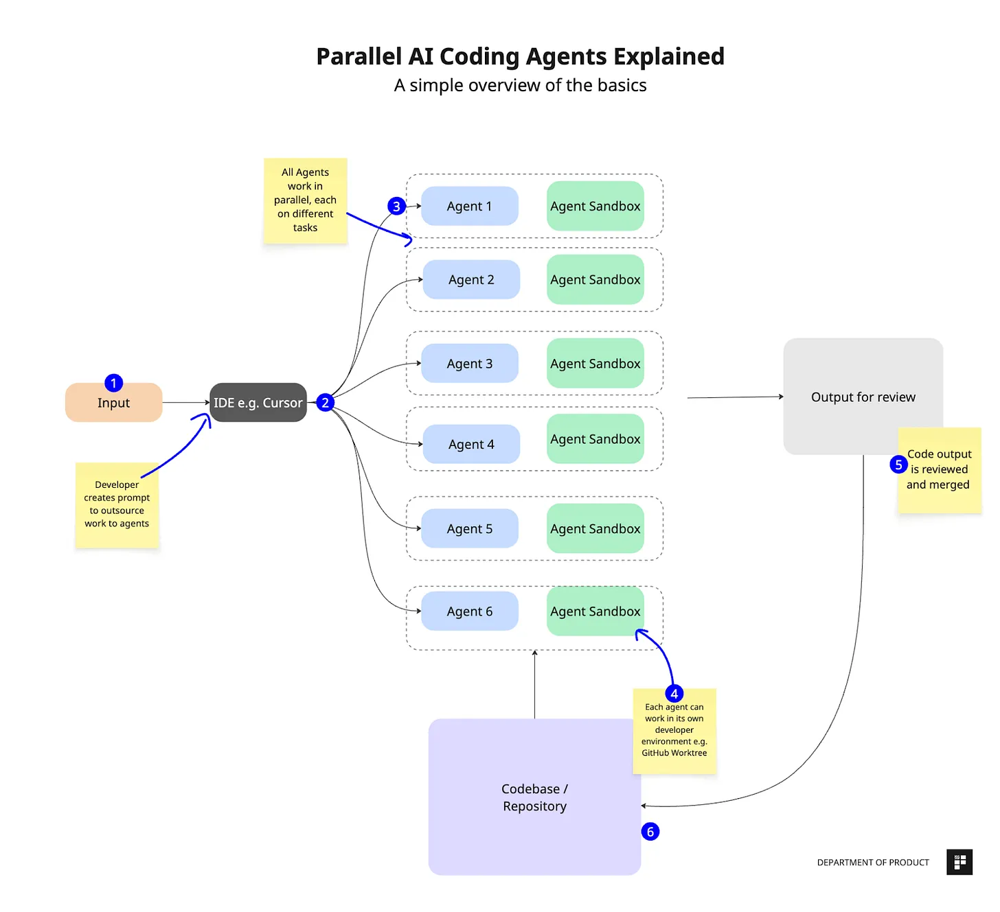

Independent agents in isolated workspaces ( eg git worktrees!) work in parallel on parallelizable subtasks

**Pros:** massive parallelism, isolated workspaces (no merge conflicts mid-execution).

**Cons:** orchestration is complex, merge conflicts etc

## Multi-Agent System Checklist


1. **Identity prompt** - who this agent *is*.
2. **Scope** - what it does AND what it doesn't.
3. **Tools** - its specific (narrow!) tool set.
4. **Inputs** - what shape of state it consumes.
5. **Outputs** - what shape of artifact it produces.
6. **Handoff rules** - when does it pass to another agent?
7. **Failure mode** - what happens if it fails? Retry? Escalate?


## Demo

- LangGraph supervisor + ReAct agents with tiered model strategy (Claude Opus 4 for supervisor, Haiku 4 for workers)
- Claude Agent SDK subagents

<!-- ```python
# pip install langgraph langgraph-supervisor langchain-anthropic
from langgraph_supervisor import create_supervisor
from langgraph.prebuilt import create_react_agent
from langchain_anthropic import ChatAnthropic

# Tiered model strategy (cuts cost 60–70% vs. all-Opus):
supervisor_llm = ChatAnthropic(model="claude-opus-4-7")   # reasoning for routing
worker_llm     = ChatAnthropic(model="claude-haiku-4-5-20251001")  # execution

researcher = create_react_agent(
    worker_llm, tools=[web_search], name="researcher",
    prompt="You research topics. Return facts only."
)
coder = create_react_agent(
    worker_llm, tools=[run_python], name="coder",
    prompt="You write Python. Return code only."
)
reviewer = create_react_agent(
    worker_llm, tools=[], name="reviewer",
    prompt="You review code for bugs. Return issues found or 'OK'."
)

supervisor = create_supervisor(
    [researcher, coder, reviewer],
    model=supervisor_llm,
    prompt="Route work between researcher, coder, reviewer. Reply 'DONE' when complete."
).compile(checkpointer=MemorySaver())  # durable execution
```

## Demo -  

```python
from claude_agent_sdk import query, ClaudeAgentOptions, AgentDefinition

async for message in query(
    prompt="Review the authentication module for security issues",
    options=ClaudeAgentOptions(
        allowed_tools=["Read", "Grep", "Glob", "Agent"],  # 'Agent' is required to spawn subagents
        agents={
            "code-reviewer": AgentDefinition(
                description="Expert reviewer. Use for security/quality reviews.",
                prompt="Review code for security issues. Be concise.",
                tools=["Read", "Grep", "Glob"],   # read-only — can't break things
                model="opus",                      # high-stakes → bigger model
            ),
            "test-runner": AgentDefinition(
                description="Runs and analyzes test suites.",
                prompt="Run tests, summarize failures.",
                tools=["Bash", "Read", "Grep"],
                model="sonnet",                    # cheap model, can execute
            ),
        },
    ),
):
    if hasattr(message, "result"): print(message.result)
``` -->


## State Passing & Communication

- Shared state object (LangGraph, CrewAI)
- Artifact passing (MetaGPT)
- Message passing (AG2-style)


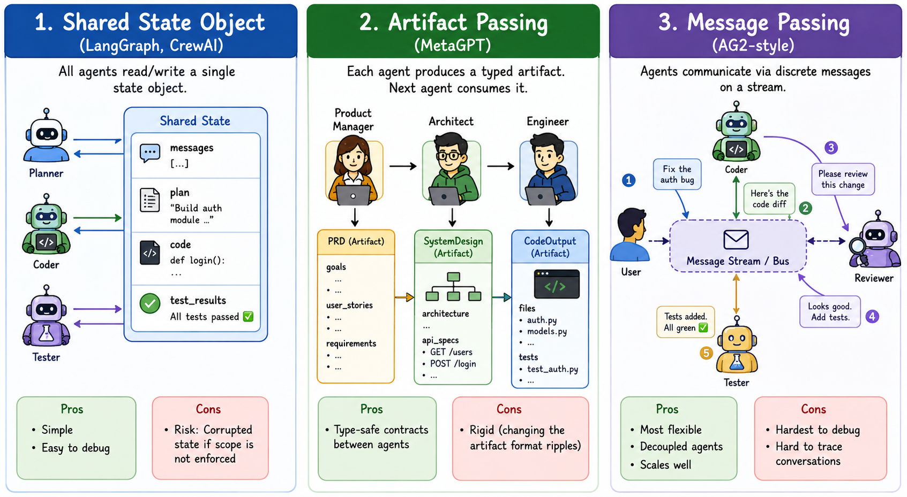

## Method 1 : Shared state object (LangGraph, CrewAI)

```python
class SharedState(TypedDict):
    messages: list
    plan: str
    code: str
    test_results: str

def planner(state):
    plan = llm("Plan for: " + state["messages"][-1])
    return {"plan": plan}

def coder(state):
    code = llm("Implement: " + state["plan"])
    return {"code": code}
```


- All agents read/write a single state object. 
- Simple, debuggable. 
- Risk: Corrupted state if scope is not enforced.

## Method 2 : Artifact passing (MetaGPT)

```python
class PRD(BaseModel):
    goals: list[str]
    user_stories: list[str]
    requirements: list[str]

class SystemDesign(BaseModel):
    architecture: str
    api_specs: list[APISpec]

prd: PRD = product_manager.generate(requirement)
design: SystemDesign = architect.generate(prd)
code: CodeOutput = engineer.generate(design)
```

- Each agent produces a **typed artifact**. Next agent consumes it. Pros: type-safe contracts between agents. Cons: rigid (changing the artifact format ripples).

## Method 3 : Message passing (AG2-style)

```python
class Agent:
    async def handle_message(self, msg: Message) -> Message:
        resp = await self.llm.generate(msg.content)
        return Message(sender=self.name, recipient=msg.sender, content=resp)

stream.subscribe("coder", coder_agent.handle_message)
stream.subscribe("reviewer", reviewer_agent.handle_message)
stream.emit(Message(sender="user", content="Fix the auth bug"))
```

- Agents communicate via discrete messages on a stream. Most flexible, hardest to debug


## Communication Protocols

## A2A (Agent-to-Agent Protocol)


 - A2A developed by Google, contributed to the **Linux Foundation** 
 - It's becoming the agent-mesh standard.
 - Supported by most of agent frameworks

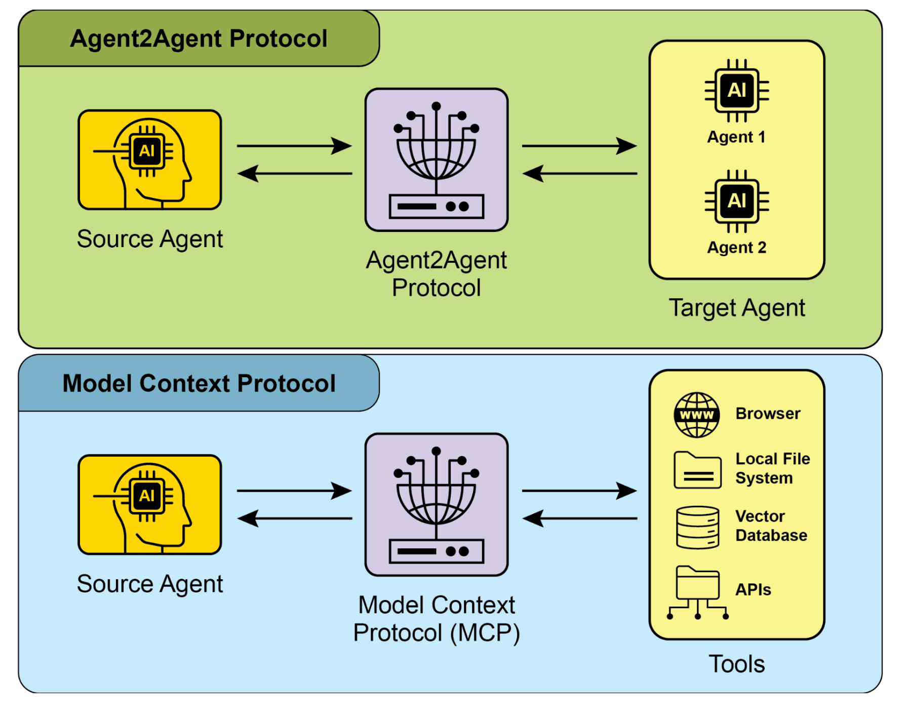

## A2A (Agent-to-Agent Protocol)


## A2A (Agent-to-Agent Protocol)

**Architecture:**

- **Transport:** HTTP + Server-Sent Events + JSON-RPC 2.0.

- **Agent Cards:** Eeach agent publishes what it can do, what it requires, auth scheme.

- **Tasks:** The primary unit, long-running, with state transitions (`submitted` -> `working` -> `completed` / `failed` / `canceled`).

- **Modalities:** Multimodal (text, audio, video streaming)

- **Security:** parity with OpenAPI auth schemes; enterprise SSO + RBAC


## A2A (Agent-to-Agent Protocol)

**Minimal A2A message:**

```json
{
  "jsonrpc": "2.0",
  "id": "req-42",
  "method": "tasks/send",
  "params": {
    "id": "task-abc",
    "sessionId": "session-xyz",
    "message": {
      "role": "user",
      "parts": [{"type": "text", "text": "Research the latest quantum chip benchmarks."}]
    },
    "acceptedOutputModes": ["text", "application/json"]
  }
}
```

. . .

> A research team's stack might be custom  for research and LangGraph for execution. A2A provides bridge between them


## Why Multi-Agent systems win

> Multi-agent systems usually win through context isolation, not through role specialization.

. . . 


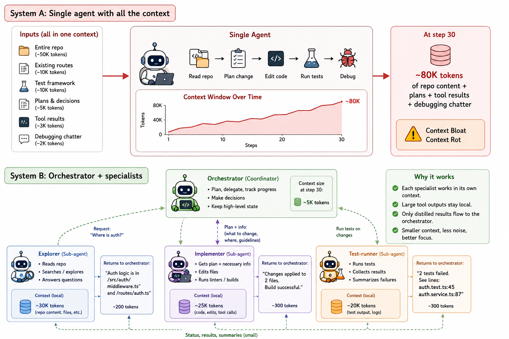


## Case study: Anthropic's multi-agent research system

[How we built our multi-agent research system](https://www.anthropic.com/engineering/multi-agent-research-system)

 - **Architecture:** `Lead Researcher` (Claude Opus 4) + parallel Sonnet 4 ` subagents` + a `Citation Agent` that runs after the research loop closes.

- **Performance:** **+90.2%** over single-agent Opus 4 on Anthropic's internal research eval.

- **Cost:** approximately **15× the tokens of a chat interaction** (vs. ~**4×** for a single agent). *Multi-agent is economically viable only for high-value tasks.*


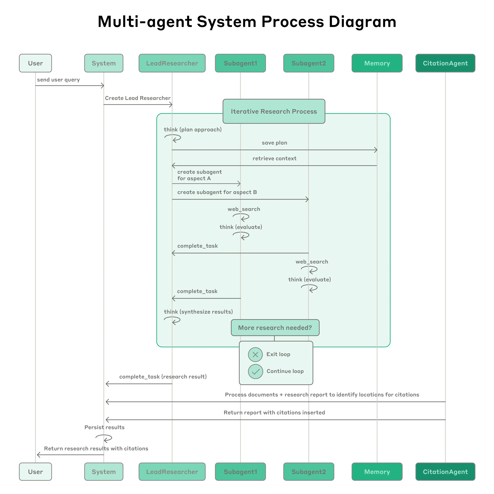


## Anthropic sizing recommendations

- **3–5 agents per team** max. More Agents -> coordination overhead.
- **1–5 tools per agent**. More tools -> tool-selection failures.
- **Max 10 tools across team**. Total surface should be manageable.
- **Start with 1 agent.** Add more only with empirical evidence.


## More Case Studies

| System       | Memory             | Multi-agent        | Stance       |
|--------------|--------------------|--------------------|--------------|
| Pi           | Minimal (in-prompt) | None              | Minimal      |
| Claude Code  | File-based + user model | Sub-agents (Task) | Polished baseline |
| Hermes       | Episodic + observational + user model | Provider/backend isolation | Self-improving |
| OpenClaw     | File-based + dated folders | Delegates to sub-agents | Heavy infra |


## Appendix


## Enterprise AI Agent Pattern

Standard Reference - **AEGIS = Agentic AI Enterprise Guardrails for Information Security.**


1. **Governance**- agent inventory, ownership, lifecycle, decommissioning.
2. **Identity** - every agent has its own identity, least-privilege scoped credentials; rotation policy.
3. **Data security** - what data the agent can see, classify, write; DLP at agent egress.
4. **Application security** - sandboxing, code-execution boundaries, MCP server allowlists.
5. **Threat operations** -  anomaly detection on tool-call patterns.
6. **Zero Trust** - every agent action is verified; no implicit trust between agents.

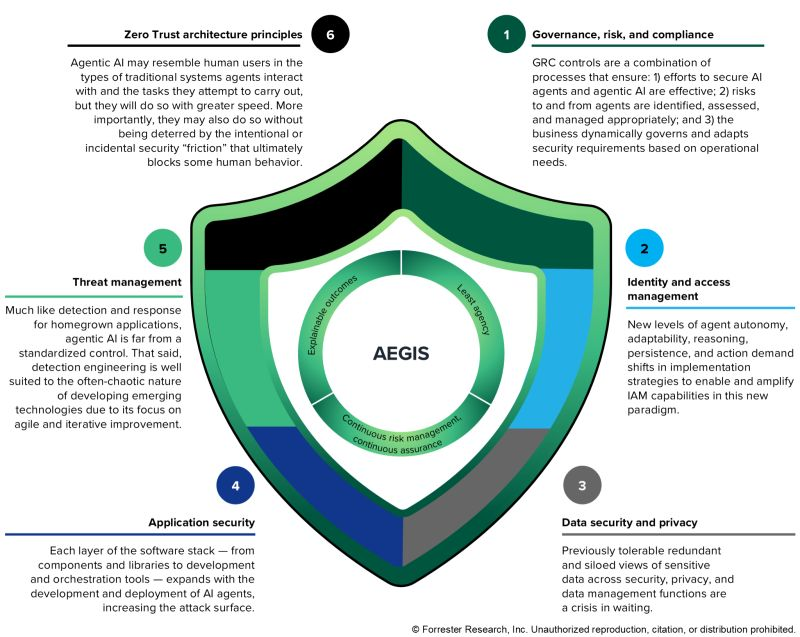


## Enterprise AI Agent Pattern : 2026


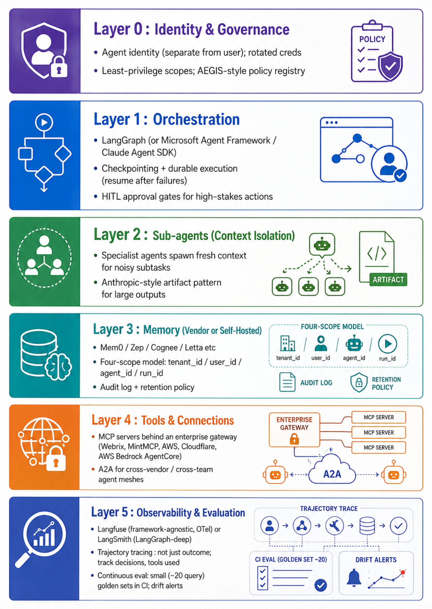


## Default stack for a new custom enterprise agent

| Layer | Default pick | When to deviate |
|-------|--------------|------------------|
| LLM provider | Claude (Sonnet 4 default, Opus 4 for orchestrator) OR GPT-5/o-series | Cost-sensitive → Haiku for workers; data-residency → on-prem via vLLM |
| Orchestration | **LangGraph** if you want graphs; **Claude Agent SDK** if Claude-native + want subagents primitive; **Microsoft Agent Framework** if Azure shop | CrewAI for quick prototypes; OpenAI Agents SDK if OpenAI-native |
| Memory | **Mem0** (fastest path) | Zep if you need temporal audit; Cognee if you need graph over docs; Letta if you want explicit OS-style paging |
| Tools | **MCP** servers behind an enterprise gateway | Inline tools only for in-process logic |
| Inter-agent | **A2A** for cross-team / cross-vendor; in-process handoffs within one team | MCP-wrapping if the other agent is logically a tool |
| Observability | **LangSmith** (if LangGraph) OR **Langfuse** (if framework-agnostic) | Arize Phoenix if eval rigor is the priority |
| Sandbox | Docker containers + git worktrees per parallel agent | firejail / gVisor / E2B for stricter isolation |
| Governance | AEGIS-aligned policy registry; per-agent identity; least-privilege | If the org has a CISO, they already have requirements — use theirs |


## Build Order

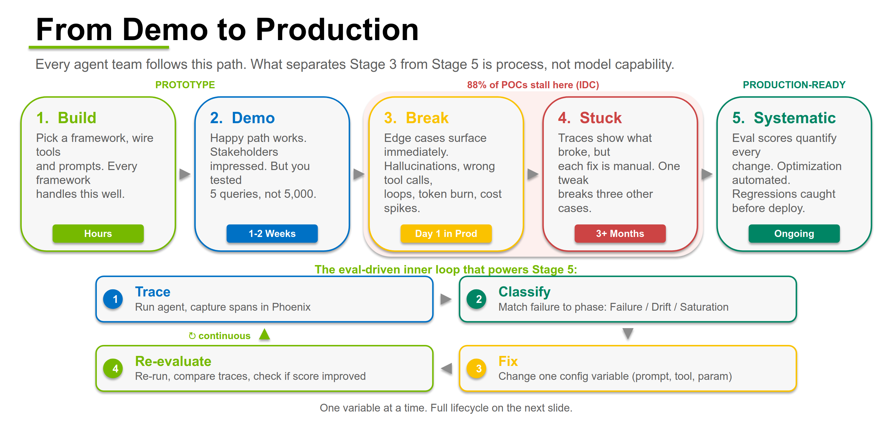


## Build Order

1. **Eval harness** - golden outputs, LLM-as-judge with calibrated rubric (Class 1/2 work).
2. **Single-agent prototype** - one LLM, one prompt, two tools, no memory. Measure baseline cost/latency/quality.
3. **Trajectory logging via OpenTelemetry** -  Every tool call, every cost, every latency.
4. **Memory layer** - (4-scope: tenant/user/agent/run). Re-run eval
5. **Compaction + structured note-taking** - `PROJECT_NOTES.md`-style external scratchpad for any task >10 turns.
6. **Sub-agent for one noisy subtask** - pick the highest-token sub-task (file exploration, web search, debugging) and isolate it. Re-run eval under equal budget.
7. **MCP gateway in front of tools** - even if it's just one tool. The gateway is the audit + RBAC point; never let agents talk to tools directly in prod.
8. **HITL approval gate for one high-stakes action** - destructive writes, financial transactions, customer-visible outputs. Build the human-in-the-loop UI before you need it.
9. **Eval in CI** - small (20 prompt) eval suite runs on every PR. Alert on regression. Drift detection in production.
10. **Failure taxonomy + runbook** - after 50 production traces, categorize failures (wrong tool, infinite loop, context overflow, hallucinated API, permission denial, memory miss). One mitigation per category.


## Questions to answer about an Enterprise Agent

1. **What does the agent actually do?** - one user-visible workflow, end-to-end.
2. **How do we know it works?** - eval numbers on a documented golden set.
3. **What does it cost per user per month?** - token cost + memory cost + observability cost.
4. **What gets affected if the agent goes wrong?** - sandbox, permissions, HITL gates.
5. **Vendor Portability?** - abstractions over MCP/A2A so a memory provider swap is one config change.

