## Multimodal LLMs

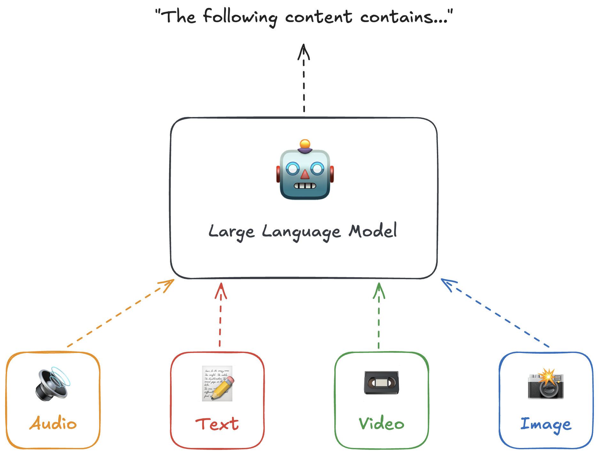


## Current Models


::: {.columns}

::: {.column}

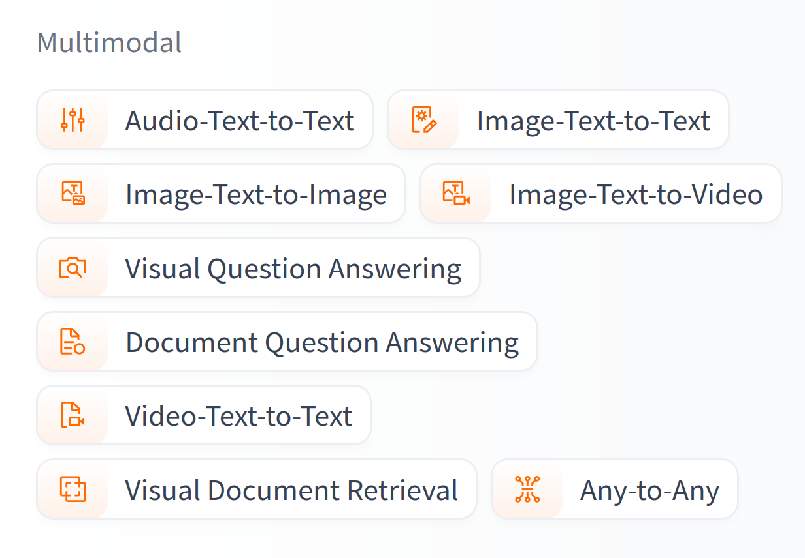

:::

::: {.column}

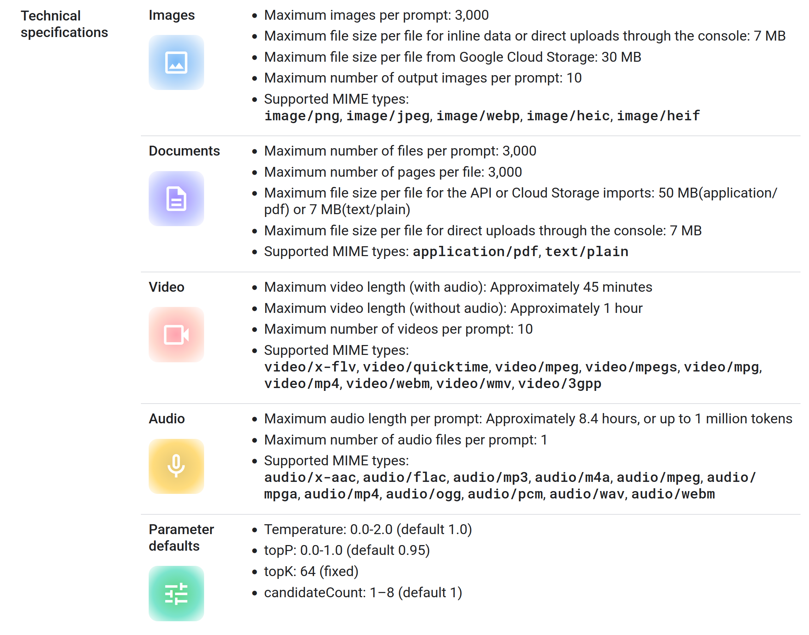

:::

:::

## MLLM Applications


1. **Document parsing / OCR** : Reading an invoice -> JSON.
2. **Visual agent**: Reading a browser screenshot -> click coordinates.
3. **Voice assistant**: Qwen3-Omni full-duplex audio.
4. **Long video Q&A**: "Summarize what happened between 12:30 and 14:00" on a 30-minute video.


## Text LLMs

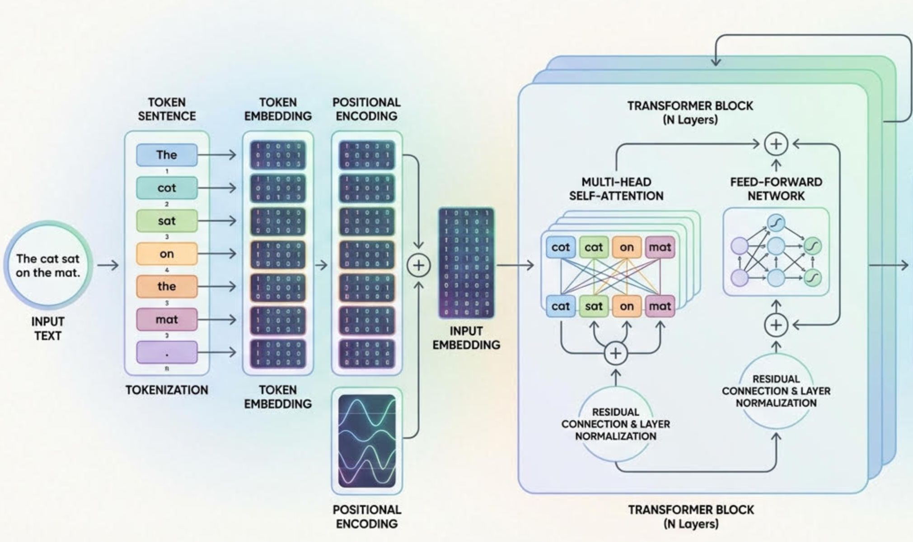


. . .

::: {style="font-size: 0.8em;"}

- The transformer doesn't care what produced these vectors
- The transformer processes **sequences of vectors in $\mathbb{R}^d$**.
- Everything in between is **modality-agnostic**.


We want to know :

- `image_to_vectors: Image → R^{N×d}`
- `audio_to_vectors: Audio → R^{N×d}`
- `video_to_vectors: Video → R^{N×d}`

:::


## This class at High Level

Go from `Text LLM` to `Multimodal LLM` by adding three components:

1. **Encode** : Turn raw modality data (pixels, audio samples, video frames) into a sequence of vectors.
2. **Align** : Make vectors live in language embeddings space of the model.
3. **Fuse** : Inject vectors into the LLM's computation alongside text tokens.

| Problem | Image | Audio |
|-|--|---|
| Encode | ViT (patchify pixels) | Whisper / AuT (spectrogram + conv + transformer) |
| Align | CLIP / SigLIP contrastive pretraining | Supervised ASR pretraining |
| Fuse | MLP projector + concat (LLaVA) | MLP projector + concat (Qwen Audio) |


## From Pixels to Tokens

- A 3D tensor: `[height, width, 3]` of pixel intensities (RGB).
- Goal: produce a sequence-of-vectors representation.


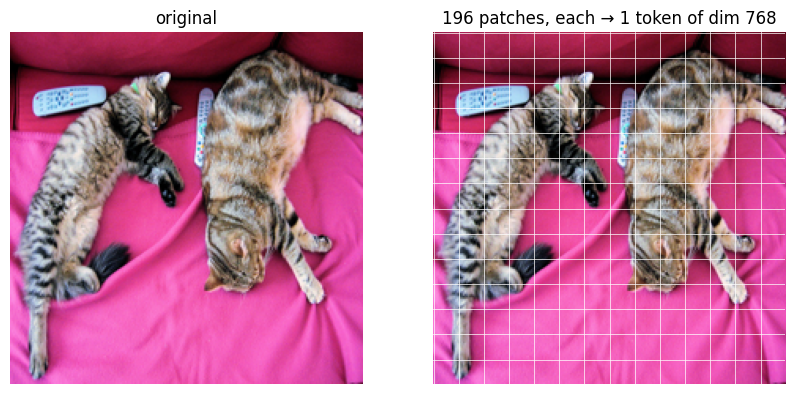

## Vision Transformer (ViT)


::: {.columns}

::: {.column}

1. Split a 224×224 image into  16 pixel × 16 pixel patches -> 14×14 = **196 patches**.
2. Flatten each patch (16·16·3 = 768 numbers).
3. Linearly project each flattened patch to dim $d$ (e.g., 768).
4. Add a learned positional embedding (per-patch).
5. Run through a standard transformer encoder stack.

:::

::: {.column}

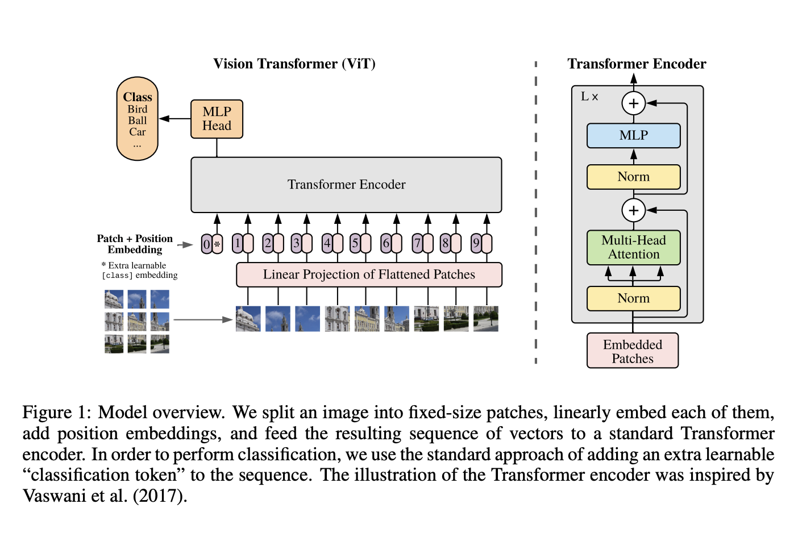

:::

:::


## Code example: ViT


## CLIP 

- We have ~400M `(image, caption)` pairs scraped from the web.
- We want an image encoder whose outputs are *near* the matching caption's text-encoder output and *far* from non-matching captions.

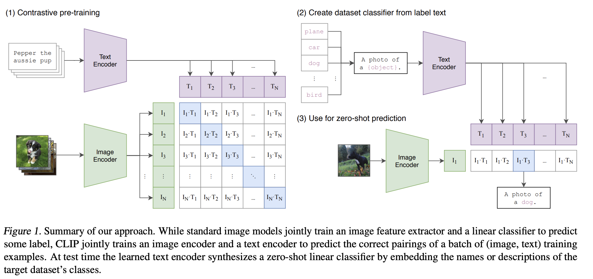

<!-- ## CLIP : Contrastive Pretraining


For a batch of $N$ pairs, compute the $N \times N$ similarity matrix $S$, where $S_{ij} = \cos(\text{img}_i, \text{txt}_j)$. The diagonal entries are positive pairs; off-diagonal are negatives.

**InfoNCE loss:** apply cross-entropy on rows (each image picks the right caption) and on columns (each caption picks the right image):

$$\mathcal{L} = -\frac{1}{2N} \sum_{i=1}^{N} \left[ \log \frac{\exp(S_{ii}/\tau)}{\sum_j \exp(S_{ij}/\tau)} + \log \frac{\exp(S_{ii}/\tau)}{\sum_j \exp(S_{ji}/\tau)} \right]$$

where $\tau$ is a learnable temperature. -->


## CLIP Applications

- **Zero-shot classification:** to classify an image into ImageNet classes, encode each class name with the text encoder ('a photo of a {class}'), encode the image, pick the highest cosine similarity. *No labels needed.*
- **Cross-modal retrieval:** the workhorse that powered the RAG module's multimodal retrieval.

**Demo : CLIP zero-shot classification**


## SigLIP

- CLIP's softmax loss requires every example to know about every other example

- **SigLIP** (Zhai et al., Google, ICCV 2023) replaces softmax with a per-pair **sigmoid**

$$\mathcal{L}_{\text{SigLIP}} = -\sum_{i,j} \log \sigma\left(y_{ij} \cdot (t \cdot \mathbf{x}_i \cdot \mathbf{y}_j + b)\right)$$

where $y_{ij} = +1$ for positives, $-1$ for negatives, and $(t, b)$ are learnable.


- Used in **PaliGemma, Gemma 3, Qwen3-VL (SigLIP-2)**, and many others

. . . 

**What's Next** :

 - CLIP's vision encoder is aligned with **CLIP's** text encoder, *not* with Llama's or Qwen's text embeddings. 
 - We can't just hand CLIP vision vectors to Llama and expect it to read them.


<!-- ## Demo : Token-count vs Resolution

## Dynamic Resolution

- **AnyRes / tile-then-encode** (LLaVA-NeXT, 2024): tile a high-res image into multiple 336² crops + a global thumbnail. Each tile encoded separately.
- **Native dynamic resolution** (Qwen2-VL onward): re-engineer the ViT to accept *any* resolution. Patch count varies per image. 2D RoPE inside the ViT. -->


## From Understanding to Generation

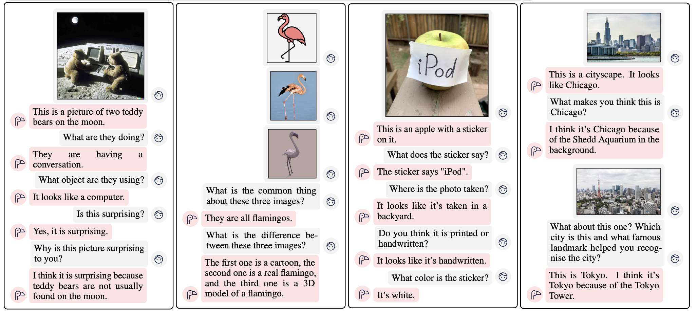

## Fusion : Connecting Encoder to LLM

We have:

- A frozen text LLM (eg Llama-3-8B) that consumes token-embedding sequences in dim $d_\text{llm}$.
- A frozen, language-aligned vision encoder (SigLIP) that produces patch-embedding sequences in dim $d_\text{vis}$.

. . . 

How to connect them?

**Can we naively concatenate them:**

1. Dimensions don't match ($d_\text{vis} \neq d_\text{llm}$).
2. Semantic spaces don't match (SigLIP's "language space" $\neq$ Llama's input-embedding space).
3. The LLM was never trained to attend to non-text tokens.

## Flamingo (DeepMind, 2022): gated cross-attention


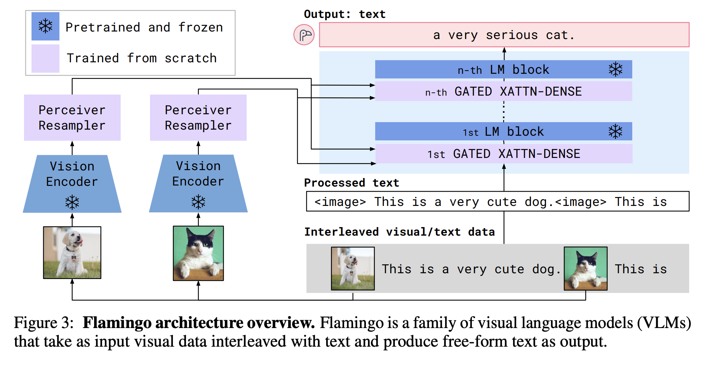


<!-- - Insert dedicated **gated cross-attention layers** at intervals inside the frozen LLM.
- Vision tokens (after going through a Perceiver Resampler that compresses to 64 tokens) are the keys/values; text tokens are the queries.
- A **learned gate $\alpha$, initialized to 0**, with a $\tanh$ activation. At init, the LLM behaves identically to its pretrained self. Over training, $\alpha$ moves away from 0 and the LLM learns to use vision.
- **Trains ~80B params** (the new cross-attn layers + Perceiver Resampler). -->

**Pros:** LLM mostly frozen; supports interleaved images-and-text in long contexts (few-shot in-context multimodal prompting).

**Cons:** Heavy architectural modifications on the LLM, hard to extend to a new modality, lots of new parameters.

## BLIP-2 : Q-Former


::: {.columns}

::: {.column}

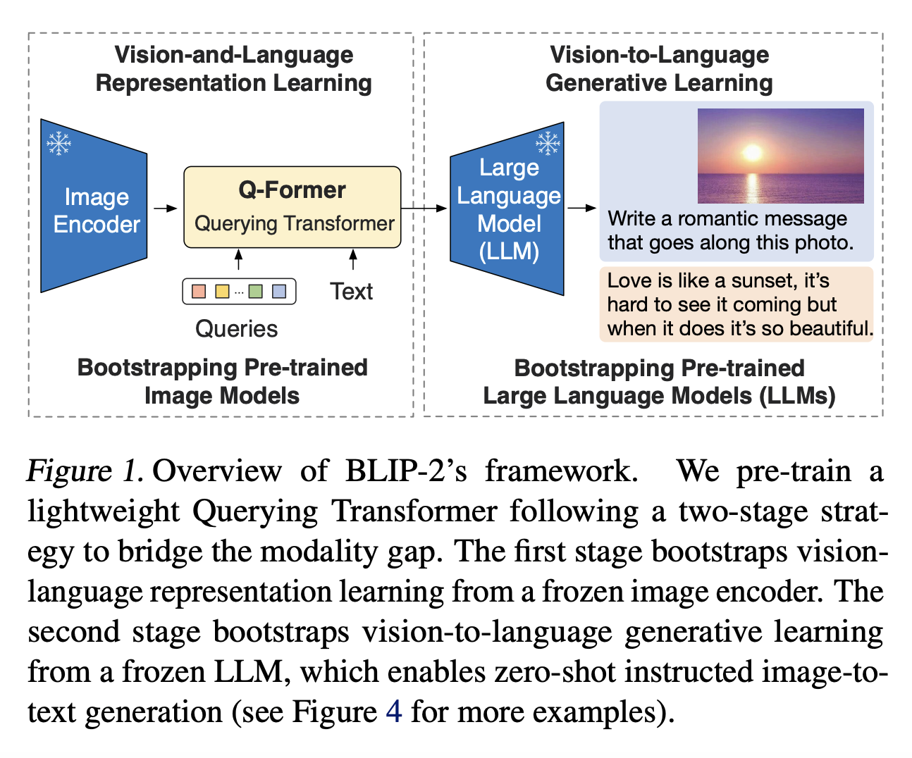

:::

::: {.column}


::: {style="font-size: medium;"}
- A small transformer ("**Q**uerying Transformer") with $k$ **learnable query tokens** (typically 32).

- The Q-Former cross-attends to the ViT output and produces 32 summary vectors **regardless of input image size**.

- These 32 vectors are linearly projected to LLM dim and prepended to text tokens.
- **Trains ~188M params** (the Q-Former). Vision encoder (~1B ViT-g) and LLM (3–11B) frozen.

:::

:::

:::


## Modern Vision-Language Models

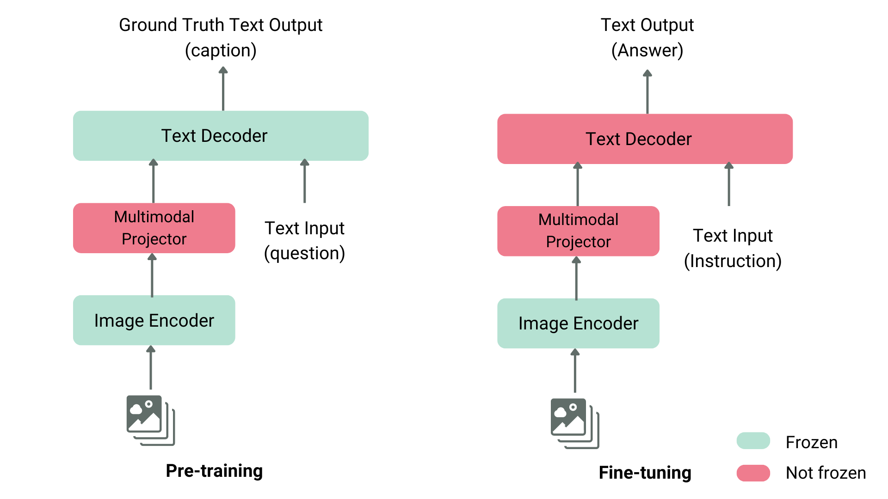

## LLaVA : the MLP projector

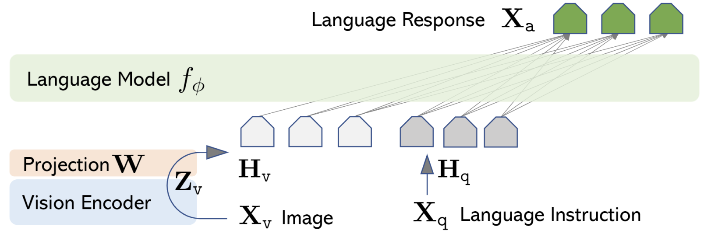

- A **2-layer MLP with GELU** maps each vision-encoder output vector (dim ≈ 1024) to LLM embed dim (e.g., 4096).
- Projected vision tokens are **concatenated** with text-token embeddings to form a single sequence.
- Hand the joint sequence to the LLM as if it were one long text prompt.


## The LLaVA training recipe (Stage 1 : Feature Alignment)

**Template used by most VLMs:**

- Freeze : vision encoder (CLIP-ViT) + LLM (Viccuna)
- Train: **only the MLP projector**.
- Data: **558K image-caption pairs** filtered from LAION-CC-SBU.
- Loss: standard next-token prediction on the caption, conditioned on the image.
- **Outcome:** the projector learns to map SigLIP/CLIP-space into Llama-input-space. Caption-style outputs.

## The LLaVA training recipe (Stage 2 : Instruction Tuning)

- Unfreeze: LLM (full or LoRA). **Vision encoder stays frozen.**
- Train: **projector + LLM**.
- Data: **150K GPT-4-generated multimodal instructions** + ~515K academic VQA data.
- Loss: same next-token prediction, but on instruction-style multi-turn conversations.
- **Outcome:** the model can follow multimodal instructions, do reasoning, multi-turn dialog.


## A minimal VLM

```python
import torch, torch.nn as nn

class MiniVLM(nn.Module):
    """A LLaVA-style multimodal LLM"""

    def __init__(self, vision_encoder, llm, vis_dim, llm_dim):
        super().__init__()
        self.vision = vision_encoder            # SigLIP, frozen
        self.proj   = nn.Sequential(            # the MLP projector
            nn.Linear(vis_dim, llm_dim),
            nn.GELU(),
            nn.Linear(llm_dim, llm_dim),
        )
        self.llm = llm                          # Llama-style decoder

    def forward(self, pixel_values, input_ids, image_token_id):
        # 1. Encode the image
        vis = self.vision(pixel_values).last_hidden_state  # [B, N_patches, vis_dim]
        vis = self.proj(vis)                                # [B, N_patches, llm_dim]

        # 2. Get text embeddings
        txt = self.llm.embed_tokens(input_ids)              # [B, N_text, llm_dim]

        # 3. Splice vis vectors in where the <image> placeholder sits
        x = splice_image_at_placeholder(txt, vis, input_ids, image_token_id)

        # 4. Standard LLM forward pass on the joint sequence
        return self.llm(inputs_embeds=x)


```

## Demo : LLaVA Inference


## State of the Art in VLMs (2025-26)

<!-- ## Native dynamic resolution (Qwen2-VL onward)

**Qwen2-VL (Sep 2024)** rebuilt the vision tower to natively accept any resolution.

- Image of size $H \times W$ -> $\lceil H/p \rceil \times \lceil W/p \rceil$ patches with $p=14$.

- **2D RoPE inside the ViT** replaces fixed positional embeddings → generalizes to arbitrary aspect ratios and unseen resolutions.

- A **2×2 patch merge** in the projector cuts vision tokens by 4× (concatenates 4 adjacent patches into one).

- Min/max token bounds (e.g., 4 to 16384 patches) prevent unbounded prefill cost.

## Example token counts for Qwen2-VL

| Image | Token count |
|---|---|
| 224 × 224 | ~64 tokens |
| 1024 × 768 | ~384 tokens |
| 2048 × 1536 | ~1500 tokens |
| 4K page | 10,000+ tokens |

## M-RoPE postion encoding

RoPE :

- Recap: rotate Q/K vectors by angle $\theta_t = t \cdot \theta_0$ where $t$ is position. After the QK dot product, only the *relative* position $(t_q - t_k)$ matters.

**Multimodal Positional Encoding**

- Text is 1D: position = sequence index.
- An image has **two spatial axes** (height, width).
- A video has **three** (time, height, width).
- Standard RoPE just uses "position in the flattened sequence" -> which collapses all 2D/3D structure into 1D and forces the model to *learn* it.

## M-RoPE solution

**Split the rotary dimensions into three groups: $(t, h, w)$.** Each group rotates by its own positional index.

| Token type | $t$ | $h$ | $w$ |
|---|---|---|---|
| Text token at sequence index $k$ | $k$ | $k$ | $k$ |
| Image patch at $(i, j)$ in image starting at seq $k$ | $k$ | $k + i$ | $k + j$ |
| Video patch at frame $f$, position $(i, j)$ | $k + f$ | $k + i$ | $k + j$ |

The next text token after the image continues from $k + \max(H, W)$ to maintain monotonicity. -->

<!-- ### Example

Sample prompt: `[text: "Look at this"] [image: 3x4 patches] [text: ". Describe it."]`

```
Token             |  t  |  h  |  w
"Look"            |  0  |  0  |  0
"at"              |  1  |  1  |  1
"this"            |  2  |  2  |  2
img patch (0,0)   |  3  |  3  |  3
img patch (0,1)   |  3  |  3  |  4
img patch (0,2)   |  3  |  3  |  5
img patch (0,3)   |  3  |  3  |  6
img patch (1,0)   |  3  |  4  |  3
...               |     |     |
img patch (2,3)   |  3  |  5  |  6
"."               |  7  |  7  |  7
"Describe"        |  8  |  8  |  8
"it"              |  9  |  9  |  9
```
. . .

> "The model can now natively express 'what's above what,' 'what's earlier than what,' and 'what frame is this.'" -->

## Qwen3-VL 

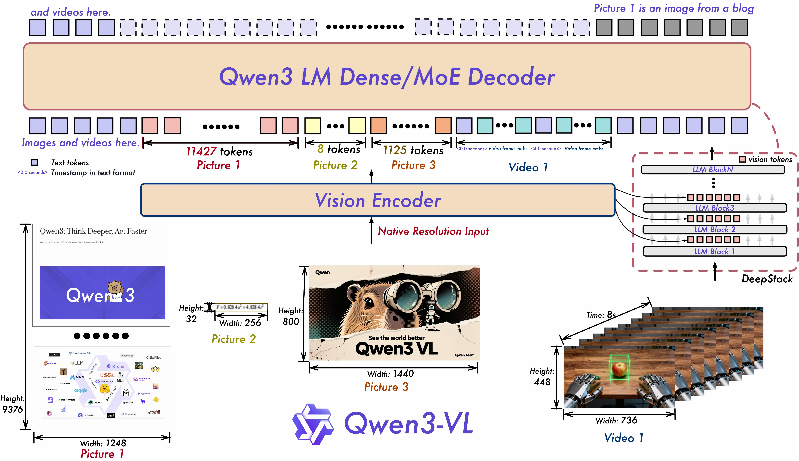

## Qwen3-VL

Architecture


- **Vision encoder:** SigLIP-2 (continues training with dynamic input resolutions).
- **DeepStack:** multi-level ViT features fed to projector.
- **Enhanced interleaved-MRoPE.**
- **Native 256K context** (extensible to ~1M).
- Dense variants: 2B / 4B / 8B / 32B. **MoE variants: 30B-A3B, 235B-A22B.**


## Qwen3-VL

Capabilities (training-data choices)

- **OCR & dense text:** multilingual OCR training data. Benefits from dynamic resolution.
- **Grounding:** outputs bounding boxes as text tokens, e.g., `<|box_start|>(x1,y1),(x2,y2)<|box_end|>`. This is a *vocabulary + training data* choice, not an architecture change
- **Agentic browsing:** trained on GUI screenshots paired with click actions
- **Thinking mode:** chain-of-thought before answer, gated by a flag


## Performance (Nov 2025 benchmarks)

- MMMU: **78.7%** (Qwen3-VL-235B); GPT-5 was at 82.7% at the time.
- MathVista: **84.9–85.8%** — beats Gemini 2.5 Pro (84.6%) and GPT-5 (82.7%).
- DocVQA: **96.5%**.

## Gemma 3 (Google, 2025)

- **Vision encoder:** frozen **SigLIP-400M** at fixed 896×896.
- **256 visual tokens** per image (fixed, regardless of input).
- **Pan-and-Scan (P&S):** for non-square or high-resolution images, an adaptive windowing algorithm segments the image into equal-size crops, resizes each to 896×896, and encodes each independently.
- **128K context** (vs. Qwen3-VL's 256K).
- Local-global attention pattern (5 local : 1 global)

## Design contrast table

| | Qwen3-VL | Gemma 3 |
|---|---|---|
| Vision encoder | SigLIP-2, native dynamic resolution | SigLIP-400M, fixed 896² + pan-and-scan |
| Tokens per image | Variable (64 -> 16K+) | 256 fixed (× number of P&S crops) |
| Position embeddings | Enhanced interleaved M-RoPE | Standard RoPE, per-modality |
| Context | 256K (-> 1M) | 128K |
| Optimized for | Documents, agents, long video | On-device, predictable inference cost |
| Vision encoder during training | Continued training | Frozen |


## Video Modality


. . .

**Video = image + one more dimension.**

1. **Frame sampling rate** 
2. **Tokens per frame** 
3. **Position Encoding** 

## Video Transformer

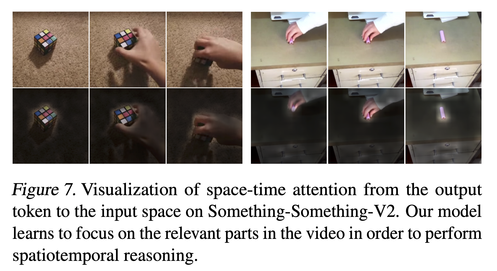

[*Is Space-Time Attention All You Need for Video Understanding?*](https://arxiv.org/pdf/2102.05095)


- TimeSformer adapt the standard ViT for videos by enabling attention both **within each frame** and **across frames**.


## Video Pre-Training : Video MAE

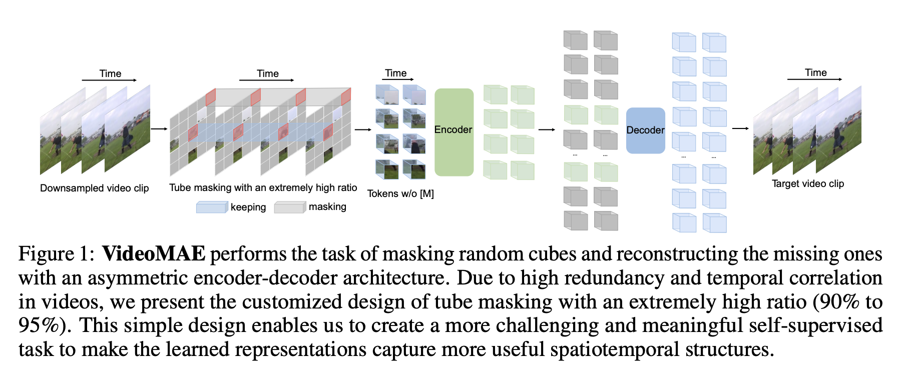


## InternVideo2: Unified Video Foundation Models

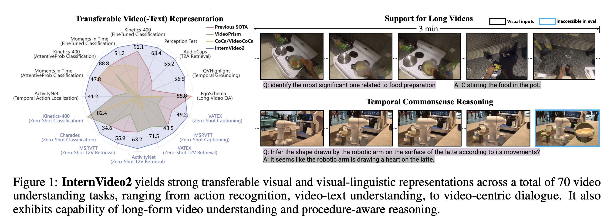

[*InternVideo2: Scaling Foundation Models for Multimodal Video Understanding*](https://arxiv.org/pdf/2403.15377)


## InternVideo2: Unified Video Foundation Models


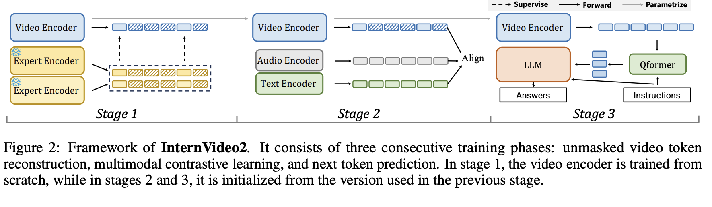


- **Masked Video Modeling (Stage 1)** - The video encoder is trained with a masked video token reconstruction task (analogous to VideoMAE),  model learns spatiotemporal structures

- **Crossmodal Contrastive Learning (Stage 2)** - Next, InternVideo2 aligns video representations with other modalities

- **LLM Integration via QFormer (Stage 3)** - In the final stage, InternVideo2 connects with a Large Language Model to enable **reasoning and generation** based on video input via a **Q-Former** module (inspired by BLIP-2 style architectures)


## Qwen3-VL


**Demo**


## Audio 


## Text LLMs


. . .

::: {style="font-size: 0.8em;"}

- The transformer doesn't care what produced these vectors
- The transformer processes **sequences of vectors in $\mathbb{R}^d$**.
- Everything in between is **modality-agnostic**.


We want to know :

- `image_to_vectors: Image → R^{N×d}`
- `audio_to_vectors: Audio → R^{N×d}`
- `video_to_vectors: Video → R^{N×d}`

:::


## This class at High Level

Go from `Text LLM` to `Multimodal LLM` by adding three components:

1. **Encode** : Turn raw modality data (pixels, audio samples, video frames) into a sequence of vectors.
2. **Align** : Make vectors live in language embeddings space of the model.
3. **Fuse** : Inject vectors into the LLM's computation alongside text tokens.

| Problem | Image | Audio |
|-|--|---|
| Encode | ViT (patchify pixels) | Whisper / AuT (spectrogram + conv + transformer) |
| Align | CLIP / SigLIP contrastive pretraining | Supervised ASR pretraining |
| Fuse | MLP projector + concat (LLaVA) | MLP projector + concat (Qwen Audio) |


## Audio Representation

- A 1D waveform: amplitude vs. time, typically sampled at **16 kHz** for speech.
- 30 seconds of audio = 480,000 samples. **Far too long to feed directly.**


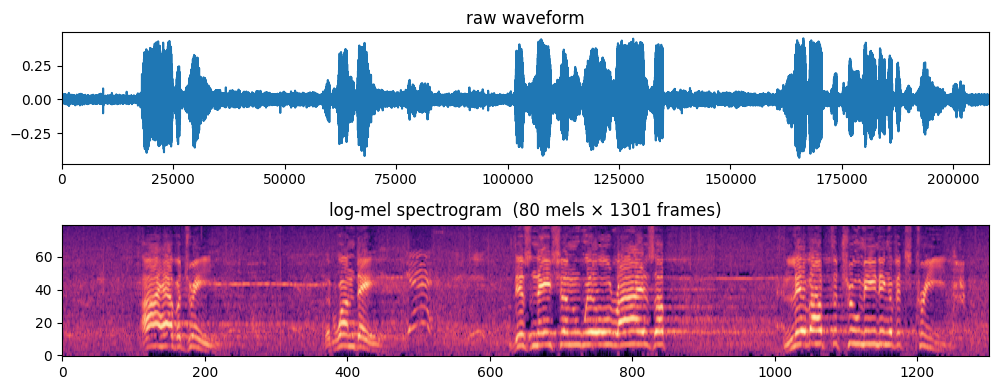

## Preprocessing: log-mel spectrogram

- Slide a 25 ms window over the waveform with a 10 ms stride.

- For each window, compute the power spectrum, then apply 80 **mel filterbanks** (perceptually-spaced frequency bins).

- Take the log.

- Result: a 2D matrix of shape `[80 mel bins, ~3000 time frames]` per 30-second clip.

. . .

> A spectrogram looks like an image: width is time, height is frequency, intensity is energy. The same encoder ideas that worked for ViT should work here


## Audio + LLMs

| Problem | Audio answer |
|---|---|
| Encode | Spectrogram -> conv stack -> transformer (Whisper) |
| Align | **Supervised** on (audio, transcript) pairs -> not contrastive! (except CLAP)|
| Fuse | Same MLP projector + concat pattern as LLaVA |

## Whisper (OpenAI, 2022)

**ViT for audio**

## Whisper Architecture

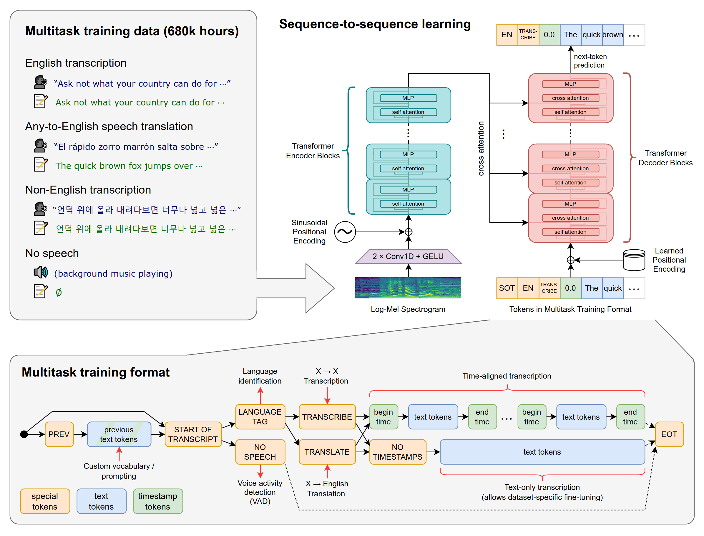

1. **Input:** log-mel spectrogram of shape `[80, 3000]` (30 seconds @ 16 kHz).

2. **Stem:** two Conv1d layers over the time axis (kernel=3, stride=2 on the second). This is the audio analog of ViT's patchify. **Halves the time dimension.**

3. **Output of stem:** `[1500, d]` - a sequence of 1500 audio "patches" (each = 20 ms of audio).

4. **Encoder:** standard transformer with sinusoidal positional embeddings.

5. **Decoder** (Whisper-specific): transformer decoder that cross-attends to encoder output and produces text tokens (BPE, same as GPT-2). Predicts language ID + transcription + timestamps via special tokens.


## Comparison : ViT vs Whisper

| | ViT | Whisper encoder |
|---|---|---|
| Input | RGB image `[H, W, 3]` | Log-mel spectrogram `[80, 3000]` |
| Stem | Conv2d patchify | Two Conv1d layers |
| Patch / frame | 14×14 pixel patch | 20 ms audio window |
| Output | $N_\text{patches}$ vectors | 1500 vectors (per 30s) |
| Pre-training data | (image, caption) pairs | (audio, transcript) pairs |
| Alignment | Contrastive (CLIP) | Supervised ASR |


## Demo : Whisper Inference

## Qwen2-Audio

- **Architecture:** Whisper-style encoder + Qwen LLM + **MLP projector**. **Exactly the LLaVA recipe**, with Whisper in place of CLIP/SigLIP

- **Training:** same two-stage recipe (align projector -> instruction tune).

- **Tasks:** transcription, translation, music description, ambient sound classification, spoken Q&A, paralinguistic queries ("what emotion is the speaker conveying?").

## LLaVa- Qwen2-Audio comparison

```
LLaVA            ┌─ CLIP/SigLIP ─┐
                 │   (vision)    │
                 └───┬───────────┘
                     │
                     ▼
                 [MLP projector]
                     │
                     ▼
                 [Llama / Qwen] ─→ text output

Qwen2-Audio      ┌─ Whisper enc. ┐
                 │   (audio)     │
                 └───┬───────────┘
                     │
                     ▼
                 [MLP projector]
                     │
                     ▼
                 [Qwen LLM]  ─→ text output
```

## Audio Generation

**Task** : How to autoregressively generate a waveform?

. . .

**Solution** : discrete audio codec tokens

- A **neural audio codec** (e.g., **EnCodec**, **SoundStream**) compresses raw audio into a small sequence of discrete tokens (~50-75 tokens/second) using a learned VQ-VAE-style tokenizer.

- A neural vocoder reverses the process: discrete tokens -> waveform.

- Once audio is *discrete*, an autoregressive LLM can generate it **just like text**.

## Qwen3-Omni : SotA in 2025-26

- **Inputs:** text, image, video, audio -> each encoded by its respective tower, projected, and concatenated. Same fusion pattern as everything we've seen.

- **Audio encoder:** Qwen3-Omni replaced Whisper with **AuT (Audio Transformer)** -> trained from scratch on **20 million hours** of supervised audio

- **Two sub-models on the output side, both MoE:**
  - **Thinker** (MoE): the main LLM. Autoregresses over text tokens.
  - **Talker** (MoE): smaller streaming model that produces discrete audio codec tokens in real time -> vocoder -> speech.

Talker conditions only on **audio and visual multimodal features** -> **not** on Thinker's text representations. Allows post processing of text output (e.g., add prosody, emotion) before generating speech.


## Demo : Qwen3-Omni full-duplex audio


## Multimodal Inference Engineering

- **Token explosion & prefill dominance**

For text LLM chat:
- Prompt is usually short (100s–1000s of tokens). Decode dominates wallclock.
- TTFT (time-to-first-token) is small relative to total response time.

For multimodal: A 7B VLM

- Input : single 2048×1536 image, 50-token query  
- Vision tokens: ~1500. Total prefill tokens: ~1550.

- Input : 4K page (e.g., a document) + 50 token query
- Vision tokens: 10,000+. Total prefill tokens: 10,050+

- **Prefill becomes the bottleneck.**

## Quantizing Multimodal LLMs

- **Vision/audio towers:** keep at **BF16/FP16**. They're small relative to the LLM, and quantization hurts perception quality disproportionately (especially OCR and fine details).
- **LLM body:** GPTQ / AWQ / FP8 / INT8 / INT4 normally
- **Projector:** stays at full precision (tiny, no benefit to quantize).


## Current Directions


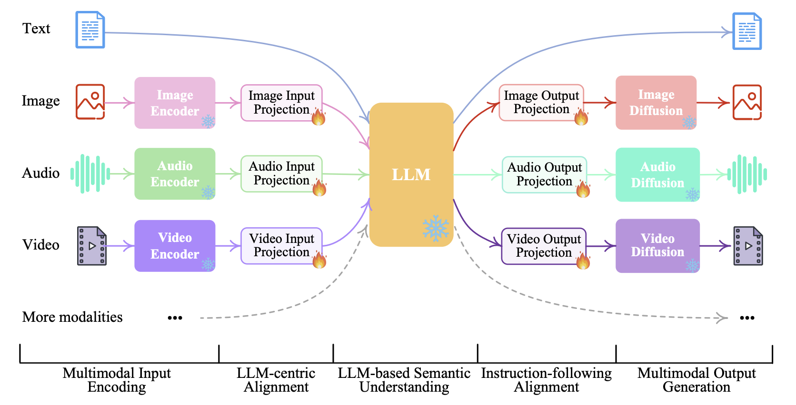

## Wrapping Up

| Problem | Image | Audio |
|---|---|---|
| Encode | ViT (patchify pixels) | Whisper / AuT (spectrogram + conv + transformer) |
| Align | CLIP / SigLIP contrastive | Supervised ASR pretraining |
| Fuse | MLP projector + concat | MLP projector + concat (**same!**) |
| Output | text | text + discrete codec tokens (Talker) |


## References

- Dosovitskiy et al., *An Image is Worth 16x16 Words: Transformers for Image Recognition at Scale*, ICLR 2021. arXiv: <https://arxiv.org/abs/2010.11929>
- Radford et al., *Learning Transferable Visual Models From Natural Language Supervision*, ICML 2021. arXiv: <https://arxiv.org/abs/2103.00020>
- Zhai et al., *Sigmoid Loss for Language Image Pre-Training*, ICCV 2023. arXiv: <https://arxiv.org/abs/2303.15343>
- Alayrac et al., *Flamingo: a Visual Language Model for Few-Shot Learning*, NeurIPS 2022. <https://proceedings.neurips.cc/paper_files/paper/2022/file/960a172bc7fbf0177ccccbb411a7d800-Paper-Conference.pdf>
- Li et al., *BLIP-2: Bootstrapping Language-Image Pre-training with Frozen Image Encoders and Large Language Models*, ICML 2023. arXiv: <https://arxiv.org/abs/2301.12597>
- Liu et al., *Visual Instruction Tuning* (LLaVA), NeurIPS 2023. arXiv: <https://arxiv.org/abs/2304.08485>
- Liu et al., *Improved Baselines with Visual Instruction Tuning* (LLaVA-1.5), CVPR 2024. arXiv: <https://arxiv.org/abs/2310.03744>
- Wang et al., *Qwen2-VL: Enhancing Vision-Language Model's Perception of the World at Any Resolution*, Sep 2024. arXiv: <https://arxiv.org/abs/2409.12191>
- Gemma Team, *Gemma 3 Technical Report*, Mar 2025. arXiv: <https://arxiv.org/abs/2503.19786>
- Radford et al., *Robust Speech Recognition via Large-Scale Weak Supervision* (Whisper), Sep 2022. arXiv: <https://arxiv.org/abs/2212.04356>
- Whisper architecture deep dive (blog): <https://amgadhasan.substack.com/p/whisper-how-to-create-robust-asr-46b>
