## Recap: Decoder-only LLMs

::::: columns
::: {.column width="50%"}
-   Tokenizer
-   Transformer Decoder
    - Self-attention
    - Feedforward layers
    - Layer normalization
    - Residual connections
    - Positional encoding
-   Decoder only LLM
-   Training Objective
:::

::: {.column width="50%"}
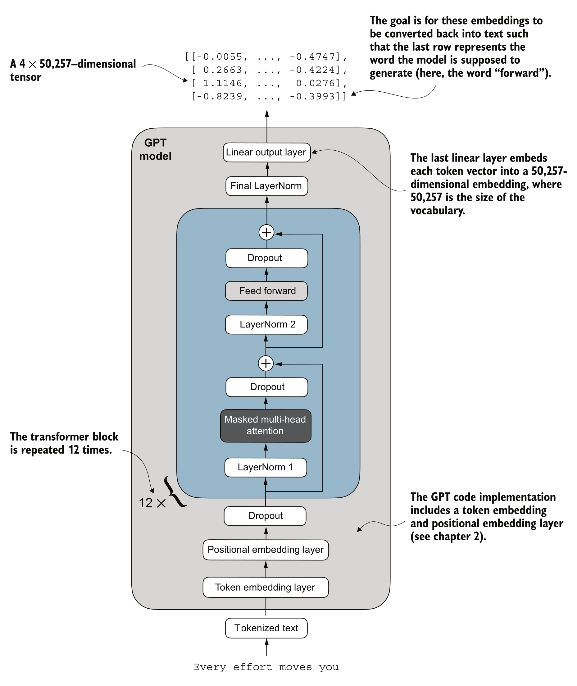{fig-alt="Decoder Internals" }
<p style="font-size: 0.4em; text-align: right;">Source: [Build a Large Language Model (From Scratch), Sebastian Raschka](https://www.manning.com/books/build-a-large-language-model-from-scratch)</p>
:::
:::::

## Motivation

You've a trained model. How to get useful text out of it?

- Understand different decoding strategies for generating text
- Explore trade-offs between determinism, diversity, and computational efficiency
- Understand structured output generation

<!--

-->

## Auto Regressive Language Model

Predict next token given previous tokens, i.e., learn $P(y_t \mid y_{<t}, x)$

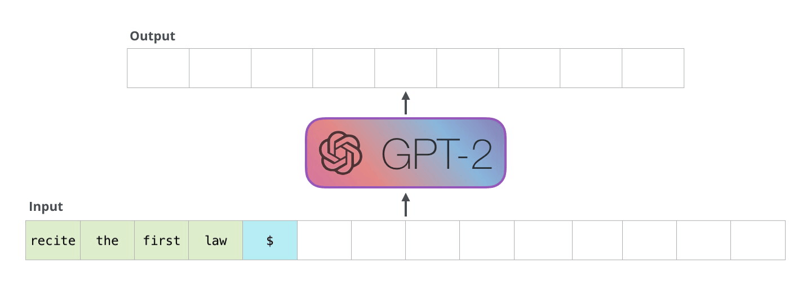{fig-alt="GPT-2 Language Model" width="636"}

<p style="font-size: 0.4em; text-align: right;">Source: Illustrated GPT-2</p>


## Auto Regressive Language Model

$$
P(y_1, y_2, \dots, y_T) = \prod_{t=1}^{T} P(y_t \mid y_{<t})
$$

The core objective :  Predict the conditional probability distribution

$$
P(y_t \mid y_{<t}, \theta)
$$

**Where:**

-   $y_t$: The token to be predicted at time step $t$.
-   $y_{<t} = (y_1, \dots, y_{t-1})$: The sequence of preceding tokens (context).
-   $\theta$: The model parameters.

Example : P("The cat sat") = P("The") × P("cat"|"The") × P("sat"|"The cat")


## Training vs. Inference

-   Training : Learn to predict the next token given the previous tokens
-   Inference : Use the trained model to generate text, given a prompt

<video controls autoplay muted loop style="width: 100%; max-width: 1000px;">
  <source src="images/LLMParallelVsSerial.mp4" type="video/mp4">
  Your browser does not support the video tag.
</video>

## Decoding

- $P(y_t \mid y_{<t}, x)$ gives us a probability distribution over next-tokens

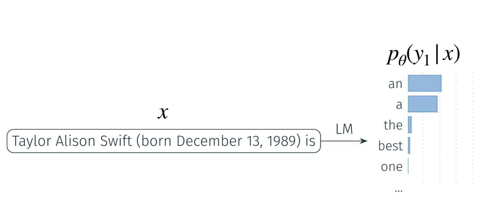{fig-alt="Decoding Methods" width="636"}

## Decoding

- $P(y_t \mid y_{<t}, x)$ gives  probability distribution over next-tokens
-   We choose a next token, add it to the context, and get a new distribution over next-tokens
-   Choose next token based on some decoding strategy, and repeat until we generate an end-of-sequence token or reach a maximum length.

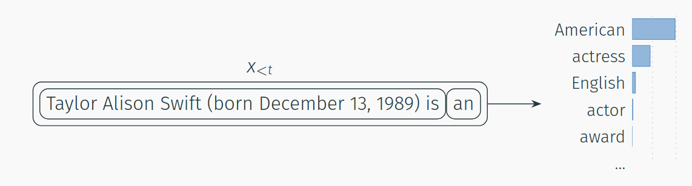{fig-alt="Decoding Methods" width="636"}

-   Token-level decoding algorithms are primarily concerned with how to choose the next token.

## Decoding

-   Decoding is search : Optimize for the most likely sequence of tokens given the model's probability distribution
-   Different decoding strategies balance between determinism, diversity, and computational efficiency

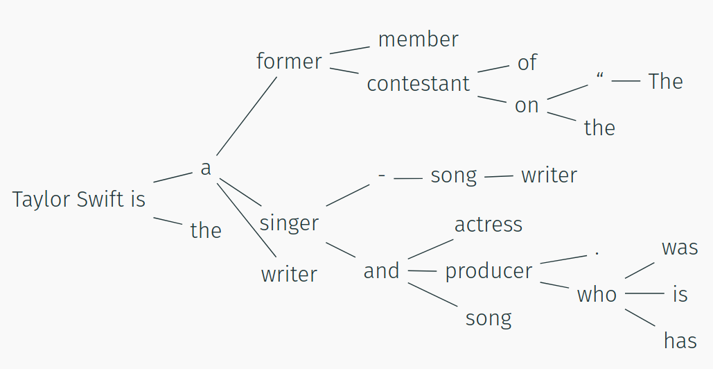{fig-alt="Decoding Methods" width="636"}

## Greedy Decoding

-   Choose the most likely token at each step

```text
for t in range(max_length):
    next_token = argmax(P(y_t | y_{<t}, x))
    output.append(next_token)
    if next_token == end_of_sequence_token:
        break
```
```{.python code-line-numbers="|5|6"}
# Pytorch
for _ in range(max_length):
    outputs = model(input_ids) # run forward pass
    logits = outputs.logits[0, -1, :] # chose last token's logits
    next_token = torch.argmax(logits).unsqueeze(0).unsqueeze(0) # chose logit with max prob {.fragment highlight-current-red}
    input_ids = torch.cat([input_ids, next_token], dim=1) # append input tokn back to prompt
```

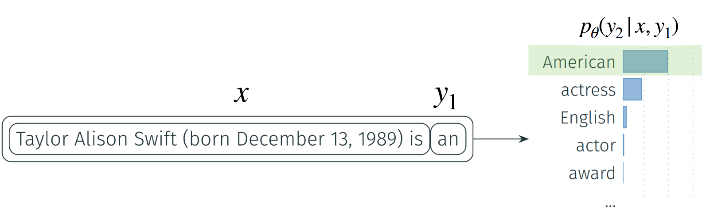{fig-alt="Greedy Decoding" width="636"}

## Greedy Decoding

-   Choose the most likely token at each step
-   May not produce the most likely overall sequence, as it doesn't consider future tokens
-   Can lead to repetitive or generic outputs

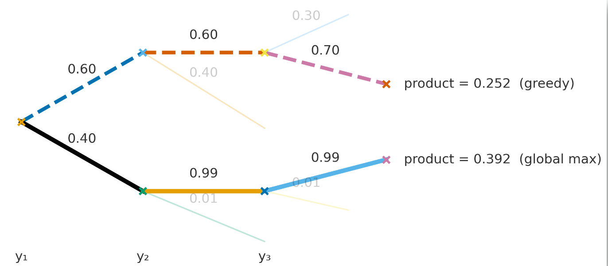{fig-alt="Greedy Decoding" width="896"}

Where is greedy decoding reasonable?

## Beam Search

-   Keep track of the top-k most likely sequences at each step, rather than just the single most likely token.
-   Top-k sequences are called "beams" and k is the "beam width". 

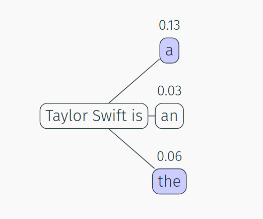{fig-alt="Beam Search" width="786"  align="center"}

## Beam Search

-   At each step, expand each of the k sequences by one token and keeps the top-k resulting sequences based on their cumulative probabilities.

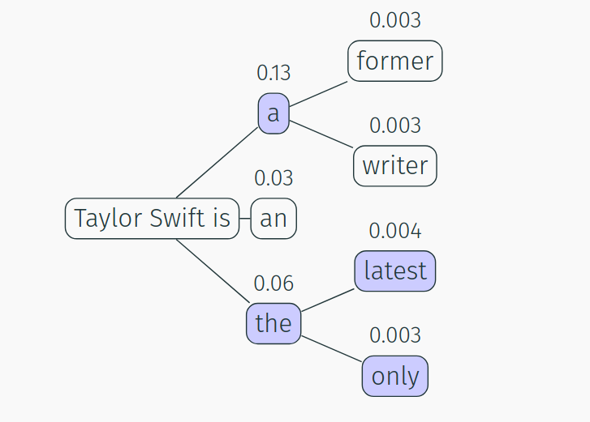{fig-alt="Beam Search" width="773"}

## Beam Search

-   At each step, expand each of the k sequences by one token and keeps the top-k resulting sequences based on their cumulative probabilities.

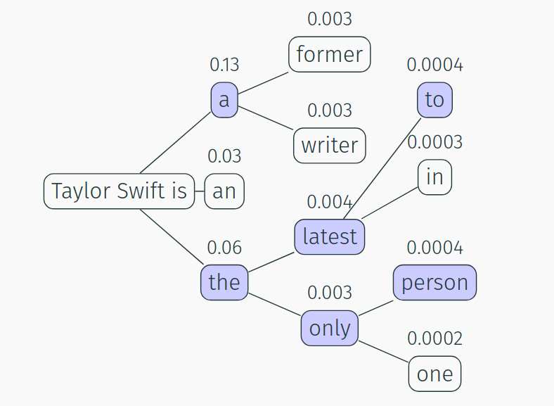{fig-alt="Beam Search" width="788"}

## Beam Search

-   At each step, expand each of the k sequences by one token and keeps the top-k resulting sequences based on their cumulative probabilities.

::::: columns
::: {.column width="40%"}
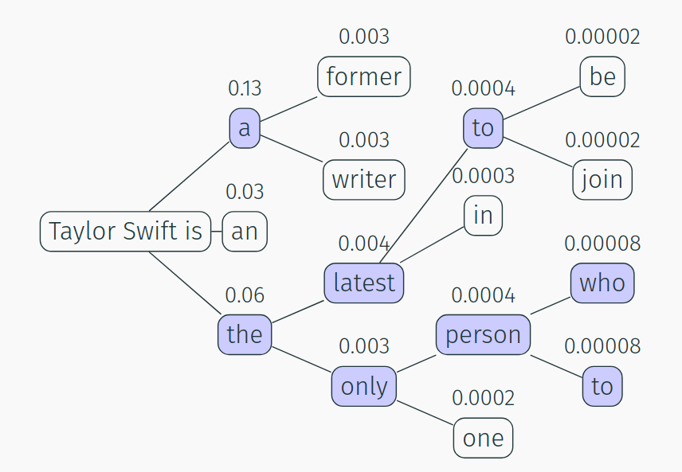{fig-alt="Beam Search" width="862"}
:::
::: {.column width="60%"}
```{.python code-line-numbers="|8|12|15-18|21"}
for seq, score in beams:
    # If the last token is EOS, keep the beam as is
    if seq[0, -1].item() == tokenizer.eos_token_id:
        all_candidates.append((seq, score))
        continue

    outputs = model(seq)
    logits = outputs.logits[0, -1, :]
    log_probs = F.log_softmax(logits, dim=-1)

    # Get top K candidates for this specific beam
    top_k_log_probs, top_k_idx = torch.topk(log_probs, beam_width)

    for i in range(beam_width):
        next_token = top_k_idx[i].unsqueeze(0).unsqueeze(0)
        new_seq = torch.cat([seq, next_token], dim=1)
        new_score = score + top_k_log_probs[i].item()
        all_candidates.append((new_seq, new_score))

# Sort all candidates by score and pick the top 'beam_width'
beams = sorted(all_candidates, key=lambda x: x[1], reverse=True)[:beam_width]
```
:::
:::::

## Beam Search

-   Computationally expensive, but can produce higher-quality outputs
    -   B =1 : Greedy decoding
    -   B \>1 : More diverse outputs
    -   B = $|V|^T$ : Exhaustive search (where $|V|$ is the vocabulary size and $T$ is the sequence length)
        -   Example for GPT-2 small: B = 50,257 (vocab size) \^ 128 (max length) = 50,000\^128 sequences
-   In practice, often used with a small beam width (e.g., B=5, 10, 20, 30) to balance quality and efficiency.
- Downsides:
    - Computationally expensive
    - Memory intensive
    - Can still produce generic or repetitive outputs


## Sampling

::::: columns
::: {.column width="60%"}
-   Don't choose the most likely token, we can sample from the probability distribution over next tokens at each step.

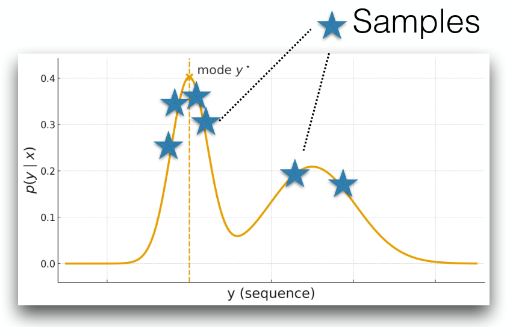{fig-alt="Sampling Graph" width="100%"}
:::

::: {.column width="40%"}
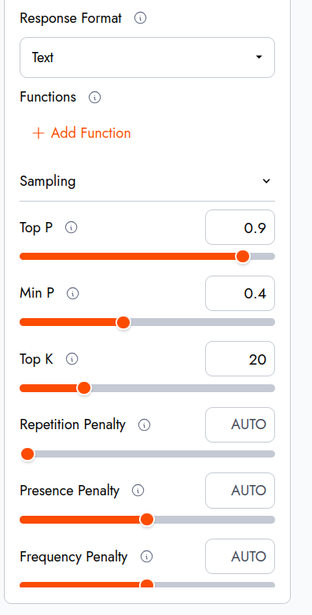{fig-alt="Sampling Params" width="100%"}
:::
:::::


## Ancestral Sampling

-   Sample from the model's next token distribution at each step without any constraints.

$$\hat{y}_t \sim p_\theta(y_t \mid \hat{y}_{<t}, x)$$

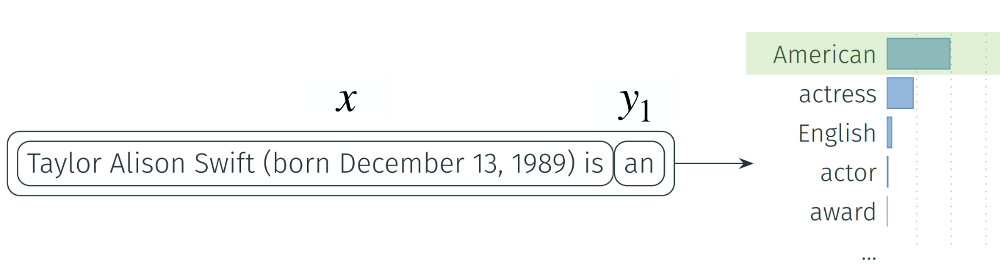{fig-alt="Ancestral Sampling" width="636"}

## Ancestral Sampling

-   Sample from the model's next token distribution at each step without any constraints.

$$\hat{y}_t \sim p_\theta(y_t \mid \hat{y}_{<t}, x)$$

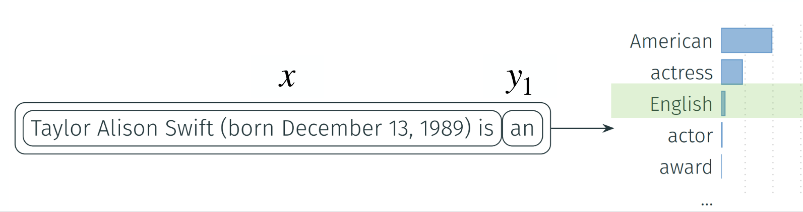{fig-alt="Ancestral Sampling" width="636"}

## Ancestral Sampling

-   Sample from the model's next token distribution at each step without any constraints.


::::: columns
::: {.column width="40%"}
$$\hat{y}_t \sim p_\theta(y_t \mid \hat{y}_{<t}, x)$$
:::
::: {.column width="60%"}
```{.python code-line-numbers="|2|12|13"}
outputs = model(input_ids)
logits = outputs.logits[0, -1, :]

# Apply temperature scaling
if temperature != 1.0:
    logits = logits / temperature

# Convert logits to probabilities
probs = F.softmax(logits, dim=-1)

# Sample from the distribution
next_token = torch.multinomial(probs, num_samples=1).unsqueeze(0)
input_ids = torch.cat([input_ids, next_token], dim=1)
```
:::
:::::

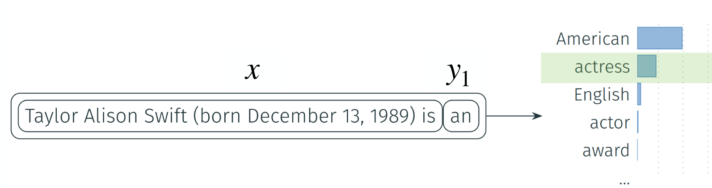{fig-alt="Ancestral Sampling" width="636"}

## Ancestral Sampling - Drawbacks

-   Can produce incoherent or low-quality outputs
-   Errors in early tokens can compound, leading to increasingly unlikely sequences


<div> </div>
```text
The weather today is very cold outside as it got cold the night before. 14.
The teacher is going to give a card tomorrow.
```


## Heavy Tail Problem

-   Vocabulary size \~50,000
-   Even if each "bad" token has small probability $\epsilon$, sum of bad tokens has non-trivial probability
-   Compounding error: 
    - For length-$T$ sequence, probability of no bad tokens = $(1-\epsilon)^T$

::::: columns
::: {.column width="50%"}
| $\epsilon$ | $T$  | $P(\text{no bad tokens})$ |
|:----------:|:----:|:-------------------------:|
|    0.01    | 128  |           27.6%           |
|    0.05    | 128  |           0.14%           |
|    0.01    | 1024 |          0.0033%          |
:::

::: {.column width="50%"}   
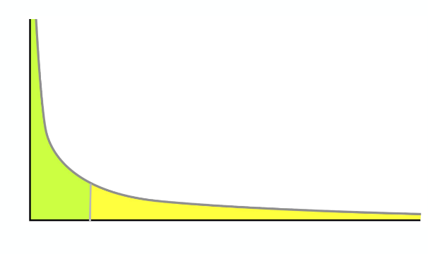{fig-alt="Ancestral Sampling" width="100%"}
:::
:::::

**Workaround**: Truncate the Tail

## Top-k Sampling

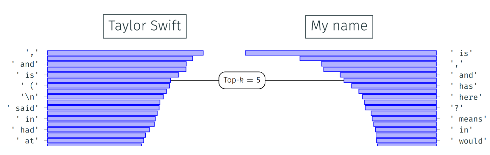{fig-alt="Top-k Sampling" }

$$\hat{y}_t \sim \begin{cases} p_\theta(y_t | y_{<t}, x) / Z_t & \text{if } y_t \in \text{top } k \\ 0 & \text{otherwise} \end{cases}$$

where $Z_t = \sum_{y \in \text{top } k} p_\theta(y | y_{<t}, x)$ is the normalization constant.

<p style="font-size: 0.4em;"> $Z_t$ is the sum of the probabilities of the top-k tokens. It is used to **renormalize** the truncated distribution so that the remaining probabilities sum to 1. </p>


## Top-k Sampling

**Algorithm**: 
At each step, 

- Only consider the top-k most probable tokens 
- Renormalize their probabilities to sum to 1
- Sample from this truncated distribution

``` python
model.generate(do_sample=True, top_k=20)
```

**Pros**: Limits choices to high-probability tokens


::::: columns
::: {.column width="50%"}

**Cons**:

- If distribution is narrow (confident), may include too many low-quality tokens
- If distribution is broad (uncertain), may exclude good tokens
:::
::: {.column width="50%"}

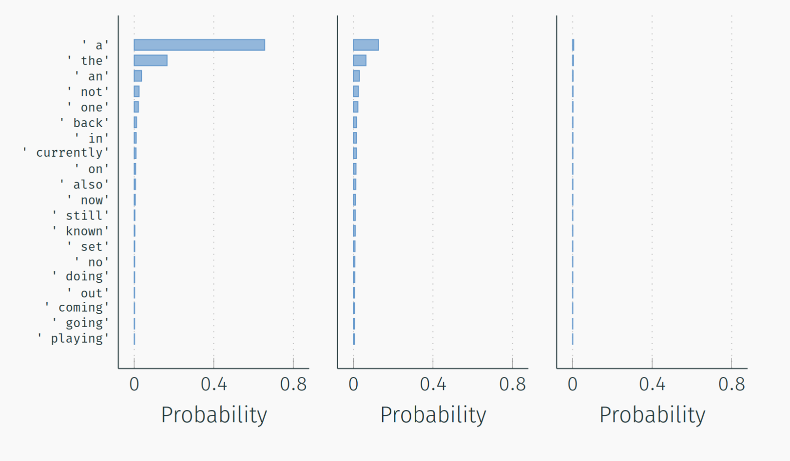{fig-alt="Top-k Sampling Flat" width="636"}
:::
:::::

## Top-p (Nucleus) Sampling

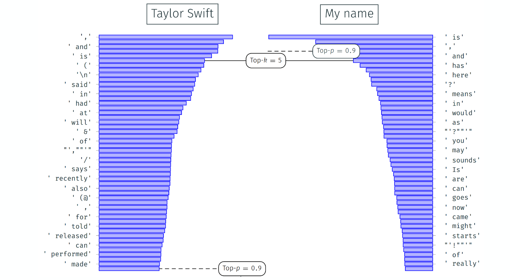{fig-alt="Top-p Sampling" width="636"}

``` python
model.generate(do_sample=True, top_p=0.9)
```

<p style="font-size: 0.6em;">
**Algorithm**: 
 
  1. Compute probabilities for all V tokens
  2. Sort descending
  3. Take cumulative sum
  4. Find smallest set of tokens whose cumulative probability ≥ p
  5. Renormalize and sample

</p>


## Min-p Sampling

-   **Top-p Downside**: The threshold `p` is absolute - doesn't scale with model confidence.
-   **Min-p fix**: Set a dynamic floor based on the probability of the **most likely token**:

$$\hat{y}_t \sim p_\theta(y_t \mid y_{<t}, x) \quad \text{if} \quad p_\theta(y_t) \geq \alpha \cdot \max_v p_\theta(v)$$

where $\alpha$ is the `min_p` parameter (e.g., 0.05–0.1).

**Key insight**: The threshold scales with model confidence.

| Model confidence | Top token prob | min_p=0.05 floor | Tokens admitted |
|---|---|---|---|
| High (peaked) | 0.90 | 0.045 | ~2–3 tokens |
| Low (flat) | 0.10 | 0.005 | many tokens |

``` python

model.generate(do_sample=True, min_p=0.05)
```

## Temperature Sampling

-   Temperature sampling: Adjust the model's output logits by a temperature parameter `T` before sampling.
-   Instead of truncating the distribution, we can soften or sharpen it.

$$softmax(z_i , T) = \frac{e^{z_i / T}}{\sum_j e^{z_j / T}}$$

Where `T` is the temperature parameter applied to **logits** $z_i$ (before softmax)

```python
model.generate(do_sample=True, temperature=0.7)
```

<p style="font-size: 0.8em;"> Temperature is applied to logits before softmax, so it directly affects the shape of the probability distribution. In practice: T=0.7–1.0 for creative tasks, T=0.0–0.3 for code/factual tasks. Often combined with top-p.</p>

## Temperature Sampling


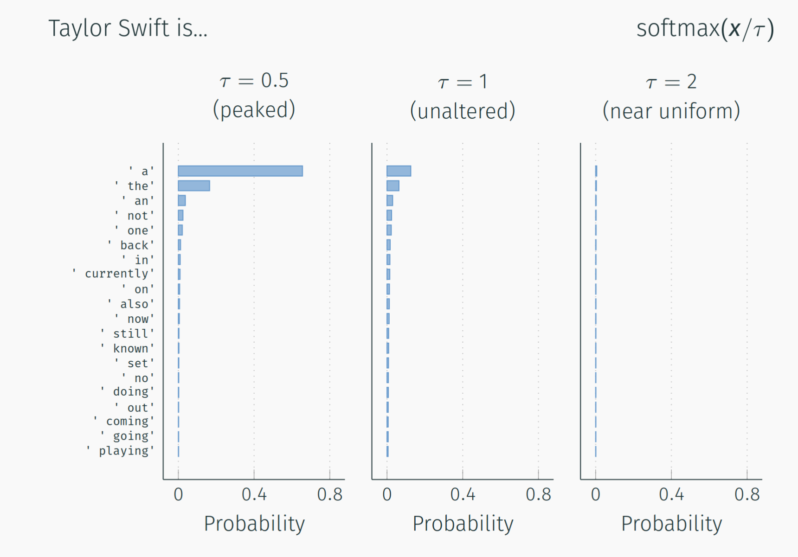{fig-alt="Temperature Sampling" width="636"}

- T = 1.0 : Original distribution (ancestral sampling)
- T \< 1.0 : More peaked, concentrated around the mode
- T \> 1.0 : More uniform, more diverse/random outputs
- T => 0 : Equivalent to greedy decoding


## Stop Sequences

-   **Problem**: The model doesn't know when to stop unless it generates `<eos>`  which may not happen at the right time.
-   **Solution**: Define strings that terminate generation immediately when produced.

<p style="font-size: 0.8em;">Example: In a chat system, you want to stop generation when the model starts generating the next user turn (e.g., `"\n\nHuman:"`).
</p>

``` python
# HuggingFace
from transformers import StoppingCriteria, StoppingCriteriaList

outputs = model.generate(
    **inputs,
    eos_token_id=tokenizer.encode("\n\nHuman:", add_special_tokens=False),
    stopping_criteria=StoppingCriteriaList([...])
)

```

**Common use cases:**

| Use case | Stop sequence |
|---|---|
| Chat (prevent impersonation) | `"\nHuman:"`, `"\nUser:"` |
| Structured extraction | `"</json>"`, `"###"` |
| Code generation | `"\n\n\n"` (blank lines) |


## Sampling Pipeline: Putting It All Together

```Text
Logits  [vocab_size]
   │
   ▼
① Repetition Penalty   penalize already-generated tokens
   │
   ▼
② Temperature Scaling  logits ÷ T   (sharpen or flatten)
   │
   ▼
③ Top-k Filter         keep top-k, set rest to −∞
   │
   ▼
④ Top-p / Min-p        cumulative-prob or relative-floor cutoff
   │
   ▼
⑤ Softmax              convert filtered logits → probabilities
   │
   ▼
⑥ Sample               draw one token
   │
   ▼
⑦ Stop-sequence check  halt if generated text hits a stop string
   │
   ▼
Append token → repeat
```

## Sampling Pipeline: HuggingFace

All steps map directly to `generate()` parameters:

```python
outputs = model.generate(
    **inputs,
    do_sample=True,
    temperature=0.7,          # ② Temperature
    top_k=50,                 # ③ Top-k  (0 = disabled)
    top_p=0.9,                # ④ Top-p  (1.0 = disabled)
    repetition_penalty=1.1,   # ① Repetition penalty (1.0 = disabled)
    max_new_tokens=256,
    eos_token_id=tokenizer.eos_token_id,  # ⑦ natural stop
)
```

** defaults** (approximate):

| Provider | temp | top_p | top_k | rep. penalty |
|---|---|---|---|---|
| OpenAI (chat) | 1.0 | 1.0 | — | freq/presence |
| Anthropic (Claude) | 1.0 | 0.999 | 0 | — |
| HuggingFace default | 1.0 | 1.0 | 50 | 1.0 |
| llama.cpp default | 0.8 | 0.95 | 40 | 1.1 |


<!--

-->

## Decoding Strategies Summary

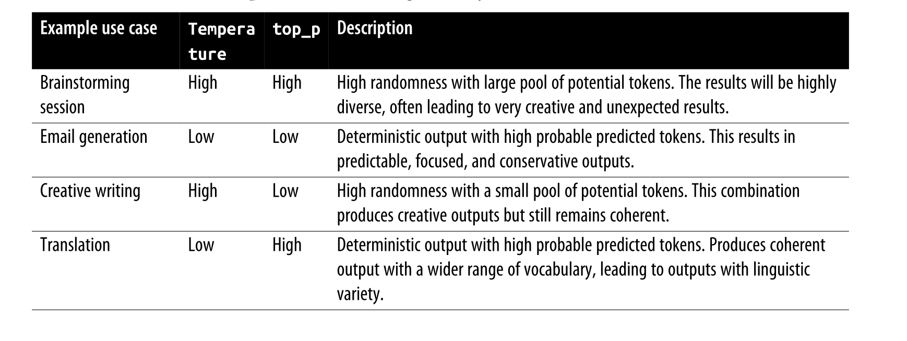{fig-alt="Decoding Strategies Summary" width="636"}

<!--

-->

## Base vs Instruction-tuned Models

-   **Base (Pre-trained) Models**: Trained on massive datasets for next-token prediction.
    -   Good at: Document completion, few-shot learning.
    -   Example: `smollm3-3B-base` (Requires specific phrasing to evoke desired behavior).
-   **Instruction-tuned (IT) Models**: Fine-tuned on (Instruction, Output) pairs and preference data (RLHF/DPO).
    -   Good at: Following direct commands, conversational dialogue, helpfulness, and safety.
    -   Example: `smollm3-3B` (Optimized for chat interfaces).
-   **Key Difference**: Same underlying parameters, but IT models are conditioned to act as assistants and usually adhere to specific **Chat Templates**.


## Prompting

-   Put an input into a format (a "prompt") that encourages the model to carry out a task

$$p_\theta(\text{y} \mid f(x))$$

-   x: "I love LLMs!"
-   f(x): Classify this sentence's sentiment as either Positive or Negative: "I love LLMs!".
-   y: The sentence is positive.

## Prompting Strategy 1: No Prompt

After pre-training, we have an autoregressive language model $p(x_1, x_2, ..., x_T)$

**Prompt:** $x_{1:t}$ -> "When a dog sees a squirrel, it will usually"

**Output:** $x_{t+1:T}$ -> 

- "bark a lot, especially at close range." 
- "start to chase after it. When it does…"

## Prompting Strategy 2: Instruction Prompt ("Zero Shot")

-   Prompt the model with a task instruction: $f(x; \text{instruction})$
-   Called "zero-shot" — no (x, y) examples provided.

**Example:**

Classify the sentiment of the following sentence as Positive or Negative.
Sentence: "The movie was absolutely terrible."
Sentiment:

**Output:** `Negative`

Zero-shot works well for instruction-tuned models; base models may not follow the instruction format.

## Prompting Strategy 3: Instruction + examples ("Few Shot")

Provide instruction + (x, y) examples:

$\text{Prompt: } f(x_{\text{test}}; \text{instruction}, [(x,y)_1, ..., (x,y)_K])$ => Output: $y_{\text{test}}$

```text
Classify the sentiment of the following sentences as Positive or Negative.
Sentence: "The movie was absolutely terrible."
Sentiment: Negative
Sentence: "I loved the cinematography and the acting."
Sentiment: Positive
Sentence: "The plot was predictable and boring."
Sentiment:

```


**In-context learning:** Model understands task format without parameter updates.

## Complex Prompting Strategies

::::: columns
::: {.column width="50%"}
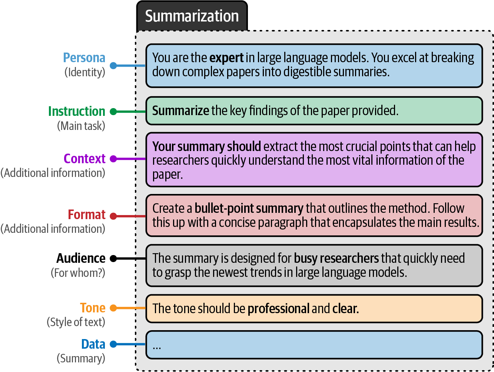{fig-alt="Complex Prompting" width="100%"}
:::
::: {.column width="50%"}
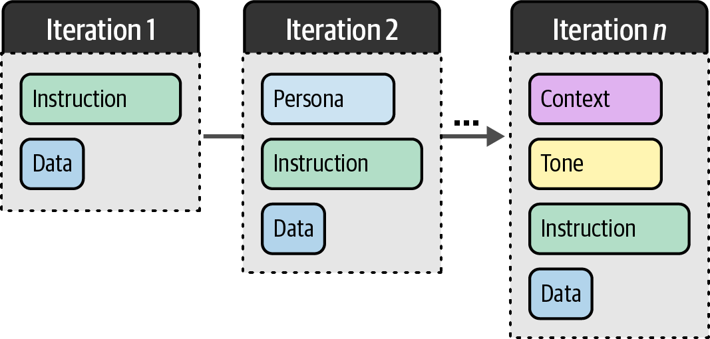{fig-alt="Complex Prompting" width="100%"}
:::
:::::


## Chat Templates

Many models are fine-tuned as chatbots with **messages format**:

```python
messages = [
    {
        "role": "system",
        "content": "Please classify movie reviews as 'positive' or 'negative'."
    },
    {
        "role": "user",
        "content": "This movie is a banger."
    },
]
```

**Roles:**

-   System: Sets behavior and context for the conversation

-   User: Provides input or asks questions

-   Assistant: Model's responses

## Chat Format: Llama 3 Example

Messages are converted to strings with special tags:

```python
messages = [
    {
        "role": "system",
        "content": "You are a helpful assistant that helps a student understand complex topics"
    },
    {
        "role": "user",
        "content": "Can you explain how photosynthesis works?"
    }
]

input_text = tokenizer.apply_chat_template(messages, tokenize=False)
print(input_text)

# Output:
<|begin_of_text|><|start_header_id|>system<|end_header_id|>
You are a helpful assistant that helps a student understand complex topics
<|start_header_id|>user<|end_header_id|>
Can you explain how photosynthesis works?
```

Every model family has a [different template](https://huggingface.co/spaces/huggingfacejs/chat-template-playground). Chosing the wrong template for a model produces garbage outputs:

  - Mistral: `[INST] ... [/INST]`
  - Qwen: `<|im_start|>system\n...<|im_end|>\n<|im_start|>user\n...<|im_end|>`
  - Gemma: `<start_of_turn>user\n...<end_of_turn>\n<start_of_turn>model`

## System Prompts

**Components:**

::::: columns
::: {.column width="40%"}


- Knowledge cutoff date
- Step-by-step reasoning instructions
- Harmful request handling
- Markdown formatting guidelines
- Word/letter counting rules

Example : [Claude's system prompt](https://platform.claude.com/docs/en/release-notes/system-prompts#claude-opus-4)

:::
::: {.column width="60%"}
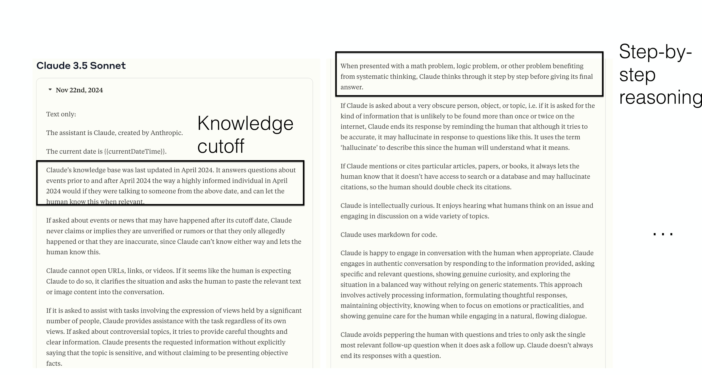{fig-alt="System Prompt" width="120%"}
:::
::::::

## Example System Prompt

```python
messages = [
    {
        "role": "system",
        "content": "You are a helpful assistant that helps a student understand complex topics"
    },
    {
        "role": "user",
        "content": "Can you explain how photosynthesis works?"
    }
]

input_text = tokenizer.apply_chat_template(messages, tokenize=False)
inputs = tokenizer(input_text, return_tensors="pt")
outputs = model.generate(**inputs, max_new_tokens=200, do_sample=True, temperature=0.7, top_p=0.9)
print(tokenizer.decode(outputs[0], skip_special_tokens=True))

```

- Can help to control model behavior
- Specify task set
- Define response properties (language, style)
- Control formatting

> Ultimately these are inputs to model : $p_\theta(y \mid \text{prompt}(x))$

## Chain of Thought (CoT) prompting

- **Motivation**: LLMs perform well generally but struggle with complex tasks requiring multi-step problem-solving.
- **Solution**: CoT helps LLMs break down complex problems into smaller, sequential, and manageable steps.
- **Example Prompt**: *"What is the fastest an H100 GPU could possibly generate 100 tokens from LLaMA 3 8B?"*
```text
*Step 1 (Recall)*: Identify the architecture and specifications of the H100 GPU.
*Step 2 (Recall)*: Understand the model size and architecture of LLaMA 3 8B.
*Step 3 (Reasoning)*: Setup the calculation for theoretical maximum throughput.
*Step 4 (Computation)*: Perform the calculations or run a program.
*Step 5 (Synthesis)*: Combine the results to provide the final answer.
```
- **Complexity**: Different problems require varying numbers of steps.
- **Challenge**: How to allocate the correct number of reasoning steps depending on problem complexity?

## Chain of Thought (Wei et al., 2022)
- Generate intermediate reasoning steps before producing the final answer

- **Formal Definition:**
    - Input: $x$ (problem statement)
    - Chain of Thought: $z$ (intermediate reasoning steps)
    - Output: $y$ (final answer)
    - Goal: $P(y \mid x) = \sum_z P(z,y \mid x)$

**Illustration of COT**:
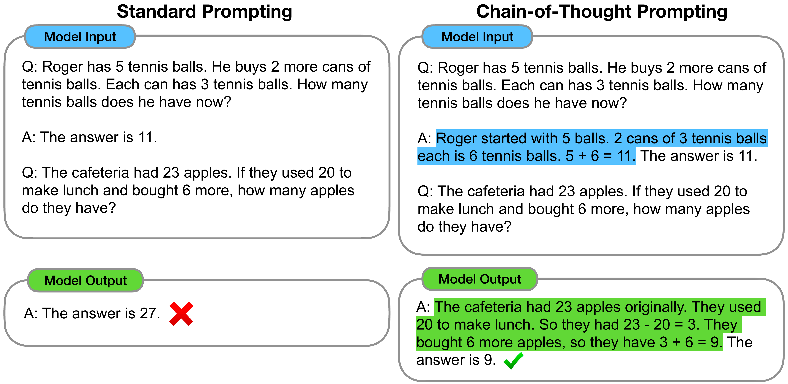{fig-alt="Wei et al" width="50%"}

## Few shot CoT
- Provide examples of problems with their step by step reasoning in the prompt.
- Present new problem without reasoning and ask the model to generate the reasoning steps and final answer.
- Model generates reasoning steps and final answer from examples.

**Example Prompt**:

```text
Q: John had 3 apples. He bought 5 more apples. How many apples does he have now?

A: John had 3 apples. He bought 5 more apples. 3 + 5 = 8. Therefore, John has 8 apples now.

Q: Sarah had 10 oranges. She gave 4 oranges to her friend. How many oranges does she have now?

A: Sarah had 10 oranges. She gave 4 oranges to her friend. 10 - 4 = 6. Therefore, Sarah has 6 oranges now.

Q: If a car travels at 60 miles per hour for 2 hours, how far does it travel?
```
**Example Output**:

```text
A: A car travels at 60 miles per hour for 2 hours. Distance = Speed × Time. 
Distance = 60 miles/hour × 2 hours = 120 miles. Therefore, the car travels 120 miles.
```

## Zero-shot CoT (Kojima et al., 2022)
 - Instead of providing examples, use a specific prompt to encourage the model to generate reasoning steps.
 - Common prompt: "Let's think step by step."
 - This approach leverages the model's inherent reasoning capabilities without requiring fine-tuning or additional training data.


##  Self-consistency (Wang et al.)

Generate multiple reasoning paths and select the most consistent one.

::::: columns
::: {.column width="50%"}
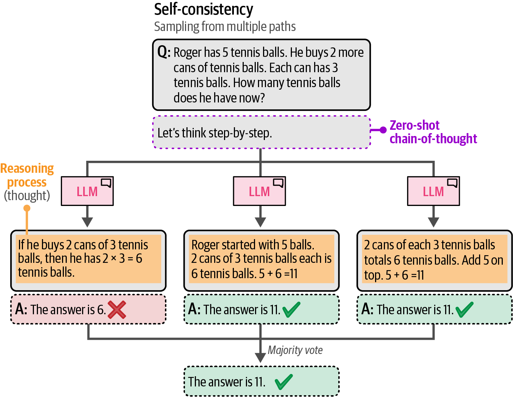{fig-alt="Self-consistency diagram"}
:::

::: {.column width="50%"}
- Instead of generating a single chain of thought, sample multiple reasoning paths for the same input.
- Aggregate the final answers from these paths and select the most frequently occurring answer as the final output.
- This approach helps mitigate errors in individual reasoning paths and improves overall accuracy.
:::
:::::

## Tree of Thoughts (Yao et al., 2022)
 - Explore multiple reasoning paths in a tree structure
 - Evaluate them to select the most promising paths.
 

:::: {.columns}
::: {.column}

```python
zeroshot_tot_prompt = [
    {
        "role": "user",
        "content": (
            "Imagine three different experts are answering this question. "
            "All experts will write down 1 step of their thinking, then share it with the group. "
            "Then all experts will go on to the next step, etc. "
            "If any expert realizes they're wrong at any point then they leave. "
            "The question is 'The cafeteria had 23 apples. If they used 20 to make lunch and bought 6 more, "
            "how many apples do they have?' Make sure to discuss the results."
        ),
    }
]

# Generate the output
outputs = pipe(zeroshot_tot_prompt)
print(outputs[0]["generated_text"])
```
:::
::: {.column}
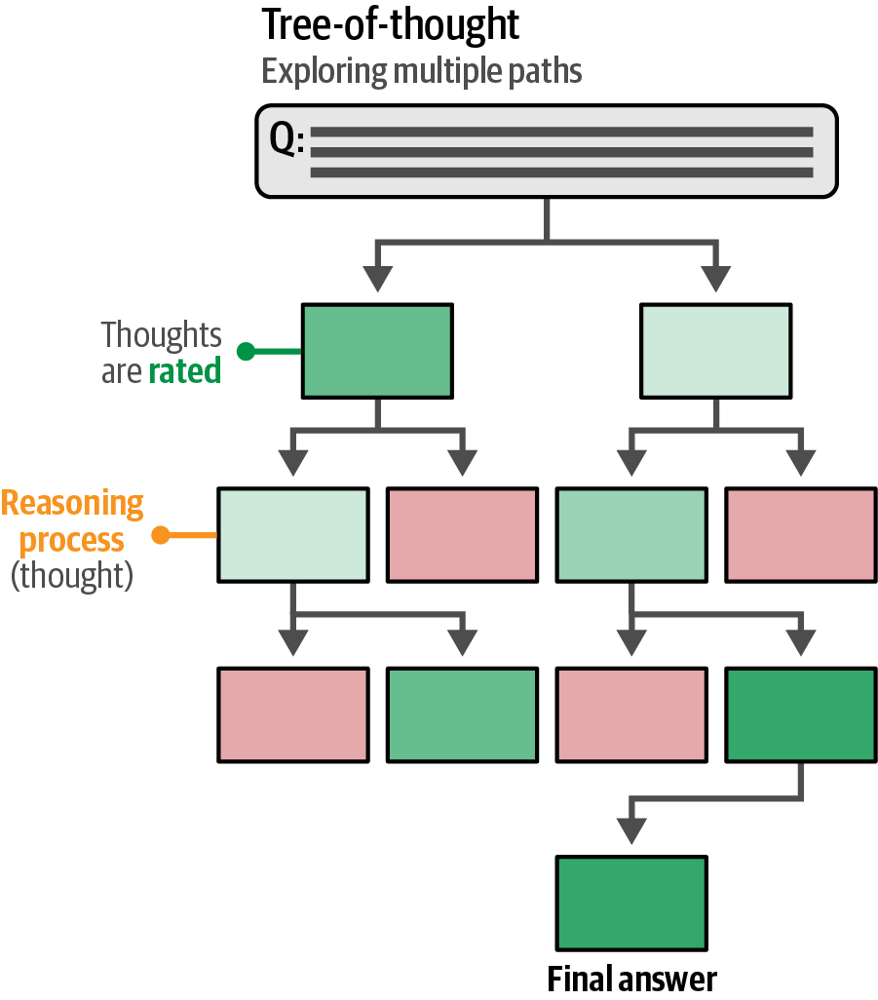
:::
::::


## Structured Output Generation

- Embedding LLMs in larger systems requires that they can communicate with the larger system, e.g., with JSON, XML, or other structured formats.
- Can we force LLMs to generate structured outputs?

Whatsapp Message:

"I want to order a pizza with pepperoni and mushrooms, and I want it delivered to 123 Main Street by 7 PM."

```JSON
{
    "order": {
        "item": "pizza",
        "toppings": ["pepperoni", "mushrooms"],
        "delivery_address": "123 Main Street",
        "delivery_time": "7 PM"
    }
}
```

## Structured Output Generation - The Challenge

::::: columns
::: {.column width="50%"}

**Challenges:**

- LLMs are trained to generate natural language, not structured data
- LLMs may produce outputs that are not valid JSON or do not conform to the expected schema
- Can't handle structured outputs with prompts alone

:::

::: {.column width="50%"}

**Solutions:**

- Output validation and correction
- Constrained decoding
- Specialized training or fine-tuning for structured output generation

:::
:::::


See [Example 1](https://openrouter.ai/chat?room=orc-1772745910-3OSYLe2nVog4f5JL7gD0), [Example 2](https://nanonets.com/cookbooks/structured-llm-outputs/basic-concepts/the-problem)


## Constrained Decoding for Structured Output

**Example : JSON**

 - At each decoding step, there are only a small number of choices that will result in valid JSON

 - Can we write down all the rules that will produce JSON?

"Taylor Swift was born December 13, 1989"

Key | Type
-----| -----
name | string
birth year | int


## Template-based Constrained Decoding

- Compile the schema into a state machine/regex/grammar.
- Filter the next-token distribution for valid tokens

::::: columns
::: {.column width="50%"}
Key | Type
-----| -----
name | string
birth year | int
--------------------------------

| Token | Prob. |
|-------|-------|
| \\n    | ~~0.36~~  |
| "     | ~~0.16~~  |
| {     | 0.026 |
| https | ~~0.025~~ |
| …     | …     |


:::
::: {.column width="50%"}
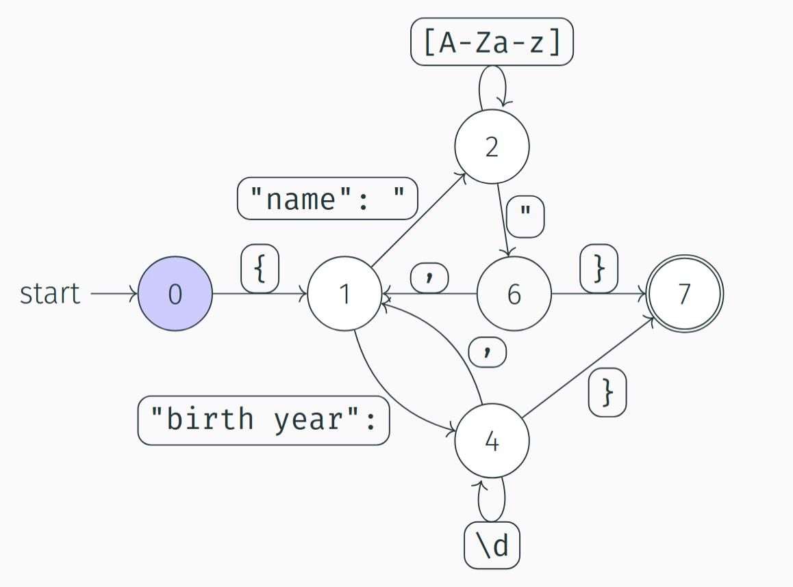{fig-alt="FSA for JSON Schema" width="100%"}
:::
::::::


## Unconstrained Decoding for Structured Output

- Constraint Decoding : Complex, brittle, not generalizable to new schemas and slow decoding

- Unconstrained Decoding : Generate free-form text and then parse it into structured format

**How to ensure valid structured output?**

- Prompting
    - good prompt
    - example outputs
    - system instructions

- Output validation and correction
    - Extract and clean
    - Parse the output and check if it conforms to the schema
    - If not, provide feedback to the model and ask it to correct its output

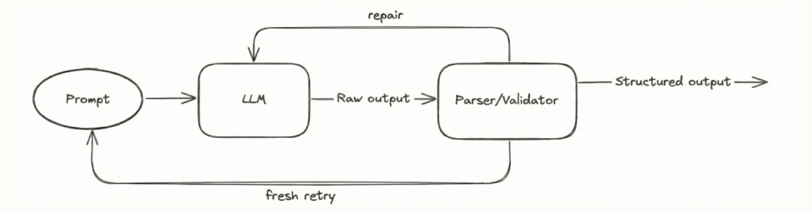{fig-alt="Unconstrained Decoding" width="100%"}


## In Practice: Structured Output Generation

Libraries:

- Pydantic
- Outlines
- BAML

Inference Engines:

- llama.cpp
- vLLM/SGLang
- Hugging Face Transformers

Model Providers:

- OpenAI : Structured Outputs
- Gemini : Response Schema


## Summary

- Decoding strategies balance between determinism, diversity, and computational efficiency
- Prompting techniques can significantly influence model behavior and output quality
- Chain of Thought prompting helps LLMs break down complex problems into manageable steps, improving reasoning capabilities
- Structured output generation is crucial for integrating LLMs into larger systems, and can be achieved through constrained decoding or unconstrained decoding with validation and correction.


## Further Reading

- [Beyond Decoding: Meta-Generation Algorithms for Large Language Models](https://cmu-l3.github.io/neurips2024-inference-tutorial/static/slides/neurips2024metageneration-tutorial-all.pdf)
- [Structured Output Generation with LLMs](https://nanonets.com/cookbooks/structured-llm-outputs)
- Prompt Engineering Guides from [OpenAI](https://developers.openai.com/api/docs/guides/prompt-engineering/), [Google](https://cloud.google.com/discover/what-is-prompt-engineering), [Anthropic](https://platform.claude.com/docs/en/build-with-claude/prompt-engineering/claude-prompting-best-practices)


<!--
## NOTES: Summary & Missing Topics
-->
