## Inference

**Using a trained model to generate outputs from input prompts**

-   Chatbots and Agents
-   Text generation (code, stories, summaries)
-   Machine translation & question answering
-   Evaluation and synthetic-data generation (RLHF rollouts, preference pairs)

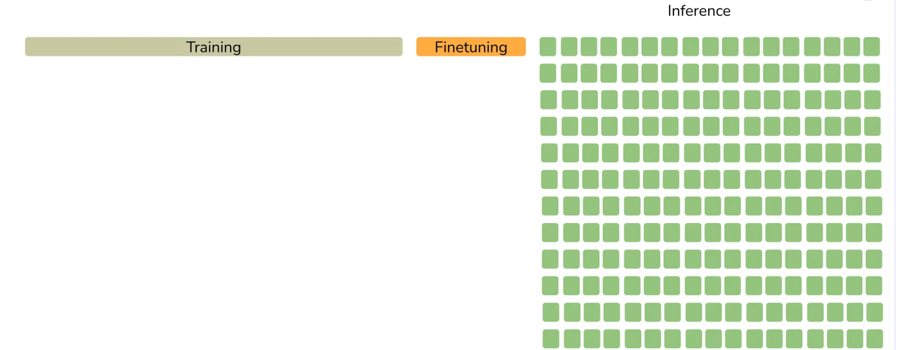{width="397"}

<p style="font-size: 0.4em; text-align: center;">

Compute Spend

</p>

::: callout-note
Training is a one-time cost; inference is a recurring cost - accounting for **80-90%** of total compute spend.
:::

## Inference vs Training

**Training**

-   Weight updates via backprop & gradient descent
-   Parallelizable across sequence length
-   Optimized for throughput
-   Memory: weights + gradients + optimizer states + activations
-   $\approx$ **4-6x** model size (FP16)

**Inference**

-   Samples tokens from learned distributions - **no weight updates**
-   Optimized for latency (TTFT, ITL) and throughput simultaneously
-   Memory: weights + KV cache + forward pass activations
-   $\approx$ **1-1.5x** model size at short context; can grow much larger when KV cache dominates

## LLM Inference Challenges

Why is LLM inference harder than standard neural network inference?

-   Variable-length compute : inputs and outputs have no fixed tensor shapes
-   Batching is difficult : sequences finish at different times
-   Need to balance **TTFT**, **ITL**, and **throughput** simultaneously

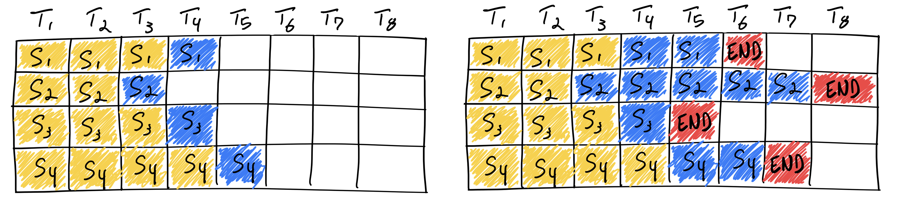

## LLM Inference Challenges

Why is LLM inference harder than standard neural network inference?

-   **Two distinct phases**: prefill (compute-intensive) vs decode (memory-intensive)
-   Two different compute characteristics -\> need different optimizations

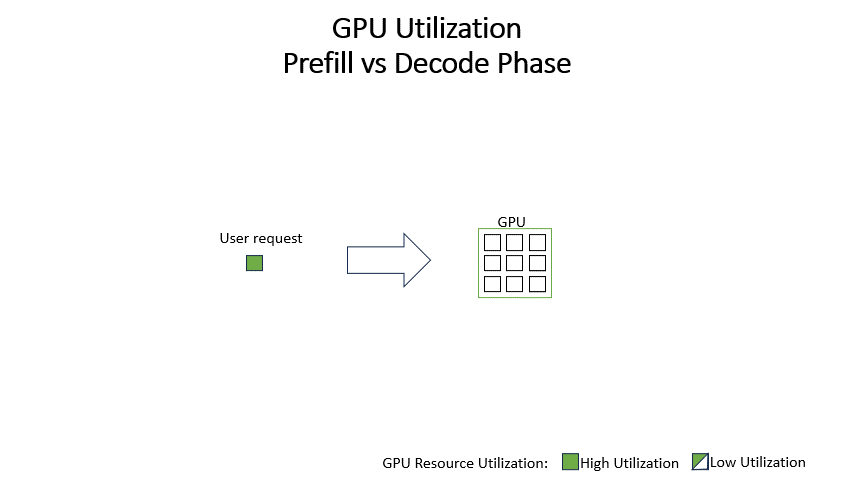

## LLM Inference Challenges

Why is LLM inference harder than standard neural network inference?

-   GPU memory management: KV caching, Prefix caching

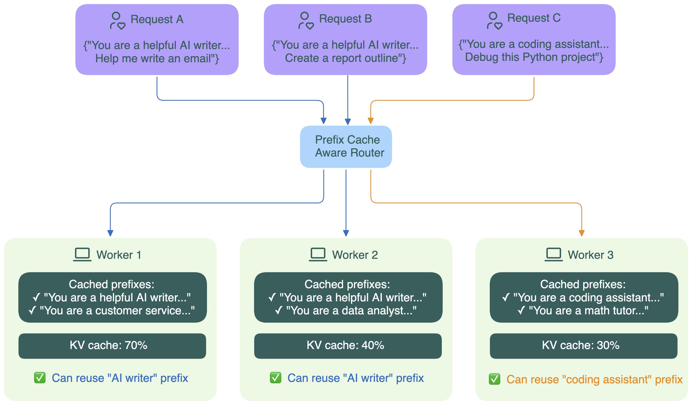

## LLM Inference Challenges

Why is LLM inference harder than standard neural network inference?

-   Routing is tricky : Lot of shared state (KV caching state, shared prefix)

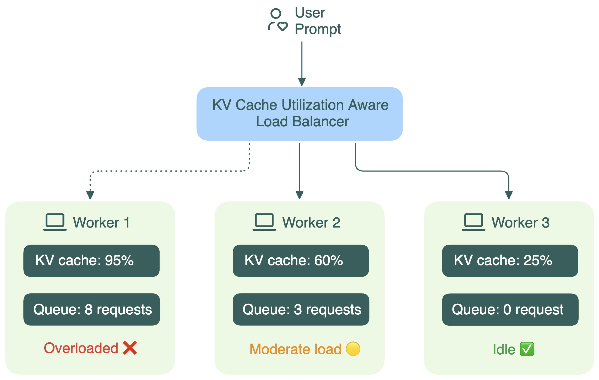

## LLM Inference Challenges

Why is LLM inference harder than standard neural network inference?

-   Complex model sharding : Large models split across GPUs, MoE routing

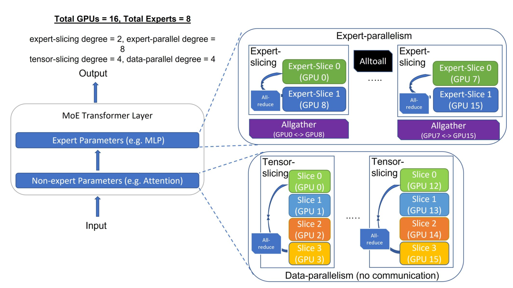{width="432"}

## Inference Solutions

-   Inference providers
    -   BaseTen, Groq, Cerebras, Togther etc
-   Inference Stack
    -   Unnderstand Inference workload
    -   Specialized inference engines — vLLM, SGLang, llama.cpp, TensorRT-LLM
    -   Model optimizations — quantization, pruning, distillation
    -   Efficient attention algorithms — FlashAttention, MQA/GQA, MLA

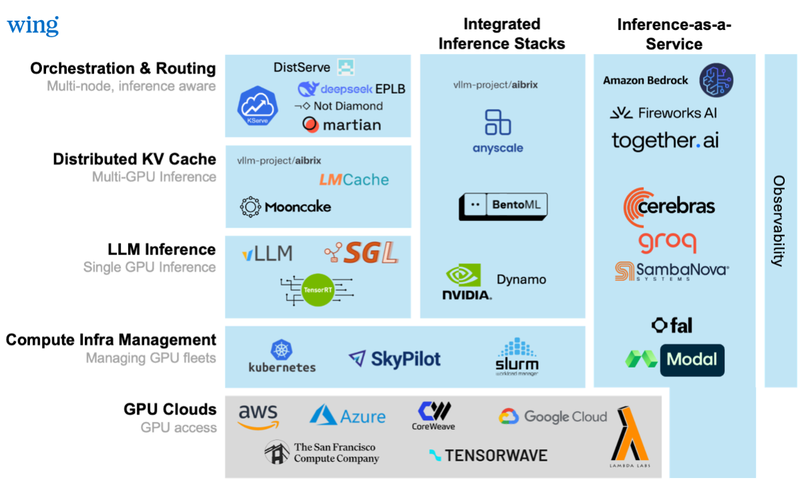

## Inference / Forward Pass Analysis

-   Forward pass is the core of inference. Backward pass is not used
-   No weight updates, but still lots of matrix multiplies and data movement
-   Key question: Given a model, how much **memory** we need? How many **FLOPs**?

::::: columns
::: {.column width="50%"}
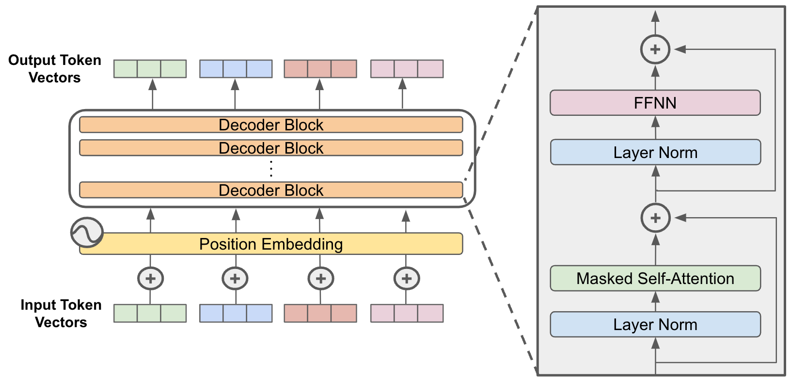
:::

::: {.column width="50%"}
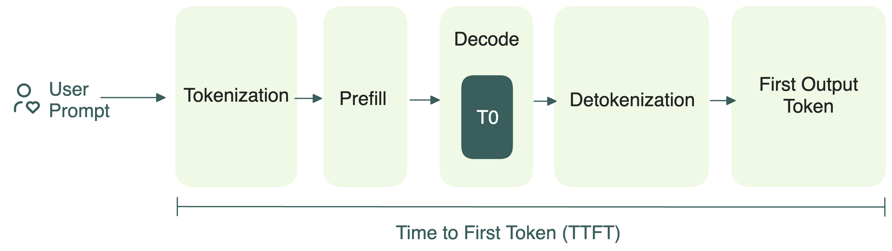

------------------------------------------------------------------------

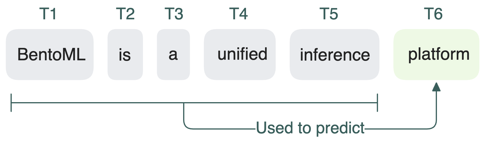
:::
:::::

## Transformer Dimensions

:::::: columns
::: {.column width="50%"}
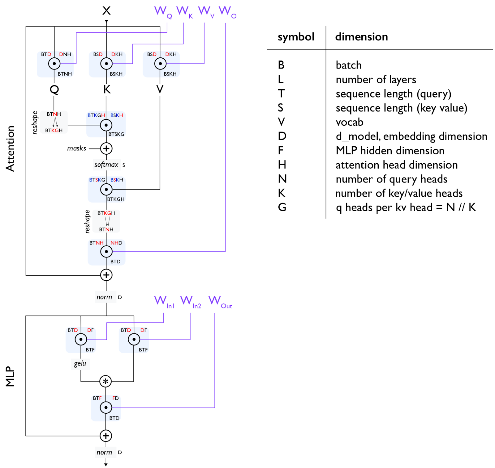
:::

:::: {.column width="50%" height="70%"}
::: {style="font-size: 0.75em; align: center;"}
LLaMA-2 13B dimensions:

| Dimension          | Value  |
|--------------------|--------|
| L (num_layers)     | 40     |
| D (d_model)        | 5,120  |
| F (ffw_dimension)  | 13,824 |
| N (num_q_heads)    | 40     |
| K (num_kv_heads)   | 40     |
| H (qkv_dim)        | 128    |
| V (num_embeddings) | 32,000 |

Conventions: F = 4\*D, D = N\*H, N = K\*G, S = T
:::
::::
::::::

## Memory : Model Parameters

Memory = Model Memory + KV Cache Memory + Activation Memory

:::: {style="font-size: 0.6em;"}
**Step 1: Count Parameters**

*Example: LLaMA-2 13B*

(D=5,120, F=13,824, N=40, K=40, H=128, L=40, V=32,000)

::: {style="font-size: 0.75em;"}
| Component  | Formula                            | Total     |
|------------|------------------------------------|-----------|
| Embeddings | $2 \times V \times D$              | 328M      |
| MLP        | $3 \times D \times F \times L$     | 8,488M    |
| Attention  | $(2D^2 + 2D(K \times H)) \times L$ | 4,196M    |
| **Total**  |                                    | **≈ 13B** |
:::

**Step 2: Compute Memory Size**

``` python
params_size = num_params × bytes_per_param
```

| Precision | Size       | Formula        |
|-----------|------------|----------------|
| BF16/FP16 | **26 GB**  | 13B × 2 bytes  |
| INT8      | **13 GB**  | 13B × 1 byte   |
| INT4      | **6.5 GB** | 13B × 0.5 byte |
::::

::: callout-tip
**Rule of thumb:** Memory (GB) $\approx$ num_params (B) $\times$ bytes_per_param

A 7B model in FP16 needs \~14 GB. A 70B model needs \~140 GB.
:::

## Memory : KV Cache

:::::: columns
:::: {.column width="50%"}
Multi-Head Attention Overview

::: {style="font-size: 0.6em;"}
$\text{Attention}(Q, K, V) = \text{softmax}\left(\frac{QK^T}{\sqrt{d_k}}\right)V$

$$
\text{MultiHead}(Q, K, V) = \text{Concat}(\text{head}_1, \dots, \text{head}_h)W^O
$$

**Scaled Dot-Product Attention**:

-   $Q, K, V$: Query, Key, and Value matrices derived from input embeddings
-   $d_k$: The dimensionality of the keys (and queries)
-   $W^O$: Output projection matrix that combines the outputs of all heads into a single vector.
-   $h$: The number of parallel attention heads.
:::
::::

::: {.column width="50%"}
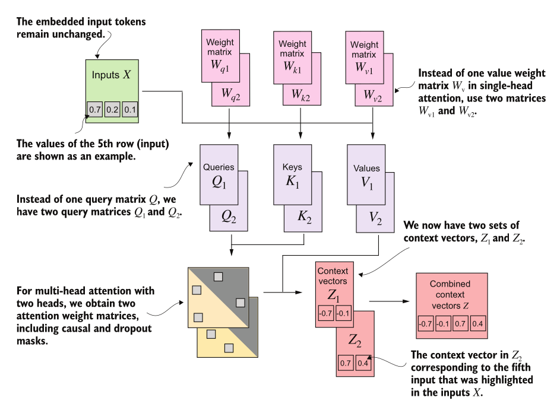 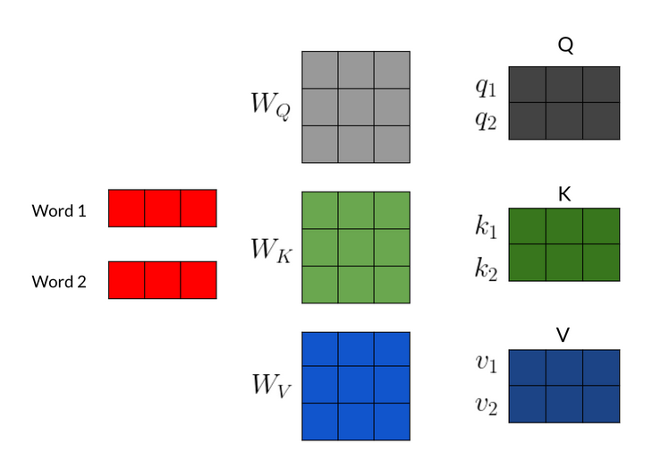{width="359"}
:::
::::::

## MHA - Generation Phase

**Generation Phase (Autoregressive Decoding):**

-   Generate tokens **one at a time** autoregressively
-   At each step, compute attention over **all previously generated tokens**
-   Keys and Values for past tokens **remain unchanged**
-   Only the new token's Query needs to attend to all previous Keys/Values


------------------------------------------------------------------------

## MHA - Generation Phase


::: {style="font-size: 0.6em;"}
**Problem:** Without caching, we recompute K and V for all previous tokens at every step!

-   Step 1: Compute K, V for token 1
-   Step 2: Recompute K, V for tokens 1, 2
-   Step 3: Recompute K, V for tokens 1, 2, 3
-   ...
-   Step N: Recompute K, V for all N tokens → **O(N²) redundant computation**
:::

**Solution: KV Cache** — Store computed K and V vectors and reuse them

## KV Cache

-   Reduced per-token compute from O(N) to O(1) by caching K and V for all past tokens
-   Reduced TTFT, increased throughput

:::::: columns
::: {.column width="33%"}
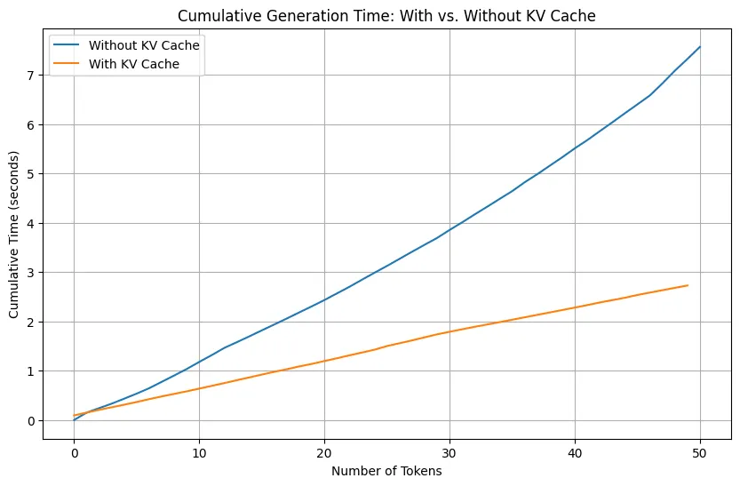
:::

::: {.column width="33%"}
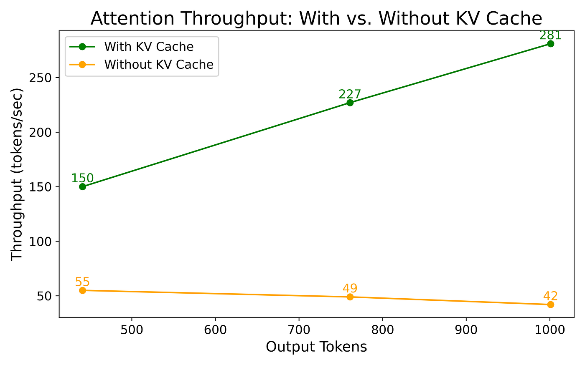
:::

::: {.column width="33%"}
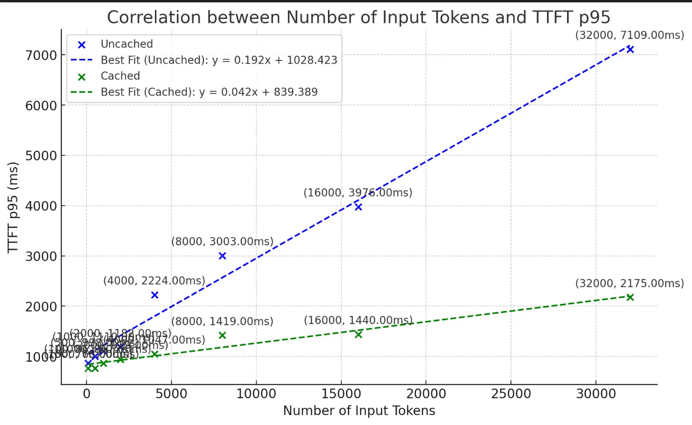
:::
::::::

<!-- end columns -->

## KV Cache Memory

:::::: columns
::: column
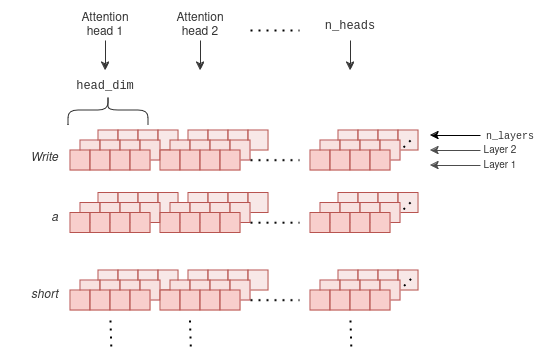
:::

:::: column
::: {style="font-size: 0.6em;"}
**KV Cache size needed for MHA:**

**DeepSeek V3 MHA baseline (before MLA):**

| Parameter       | Value  |
|-----------------|--------|
| KV head dim     | 128    |
| Sequence length | 32,768 |
| Num KV heads    | 128    |
| Layers          | 61     |

**Per-layer calculation:**

$$\text{KV cache} = \text{seq_len} \times \text{num_heads} \times \text{head_dim} \times 2 \times 2$$

$$= 32768 \times 128 \times 128 \times 2 \times 2 = \textbf{2.14 GB per layer}$$

**Total for 61 layers:** \~ 131 GB (\~ 4 MB per token)

| Attention Type | Memory per Token |
|----------------|------------------|
| **MHA**        | 4 MB             |
:::
::::
::::::

**Solution:** Reduce KV heads to 1 (MQA) or use more efficient attention variants (GQA, MLA)

## KV Cache Memory

$$
\text{KV Cache} = 2 \times P \times L \times K \times H \times S \times B
$$

:::::: columns
::: {.column width="30%"}
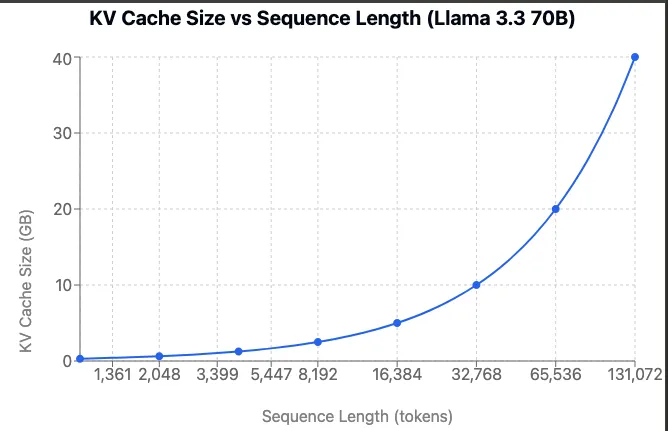
:::

:::: {.column width="70%"}
::: {style="font-size: 0.6em;"}
**LLaMA-2 13B** (40 layers, 40 KV heads, 128 head dimension, BF16):

$$
\text{KV Cache} = 2 \times 2 \times 40 \times 40 \times 128 \times S \times B = 819{,}200 \times S \times B \text{ bytes}
$$

| Context (S) | B=1     | B=16             | B=64             |
|-------------|---------|------------------|------------------|
| 1K          | 0.8 GB  | 12.5 GB          | 50 GB            |
| 4K          | 3.2 GB  | 51 GB            | **204 GB** (OOM) |
| 32K         | 25.6 GB | **410 GB** (OOM) | OOM              |
:::
::::
::::::

. . .

At long context, **KV cache exceeds model weights!**

## Multi-Query Attention (MQA)

::::: columns
::: {.column width="50%"}
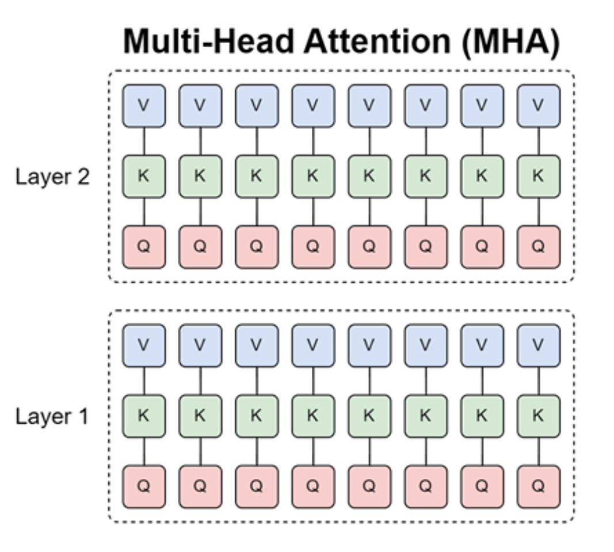{width="331"}
:::

::: {.column width="50%"}
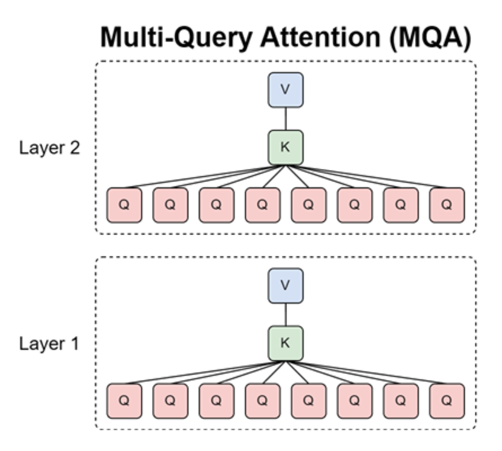{width="331"}
:::
:::::

**Key Insight:** Reduce number of KV heads to 1 = **MQA (Multi-Query Attention)**

::: {style="font-size: 0.6em;"}
$$\text{KV Cache} = 32768 \times 128 \times 1 \times 2 \times 2 = \textbf{16 MB per layer}$$

For all 61 layers: **\~1 GB total** (\~32 KB per token)

**128× reduction in KV cache memory!**

| Attention Type | Memory per Token |
|----------------|------------------|
| **MHA**        | 4 MB             |
| **MQA**        | 32 KB            |
:::

## Grouped-Query Attention (GQA)

::::: columns
::: {.column width="50%"}
{width="331"}
:::

::: {.column width="50%"}
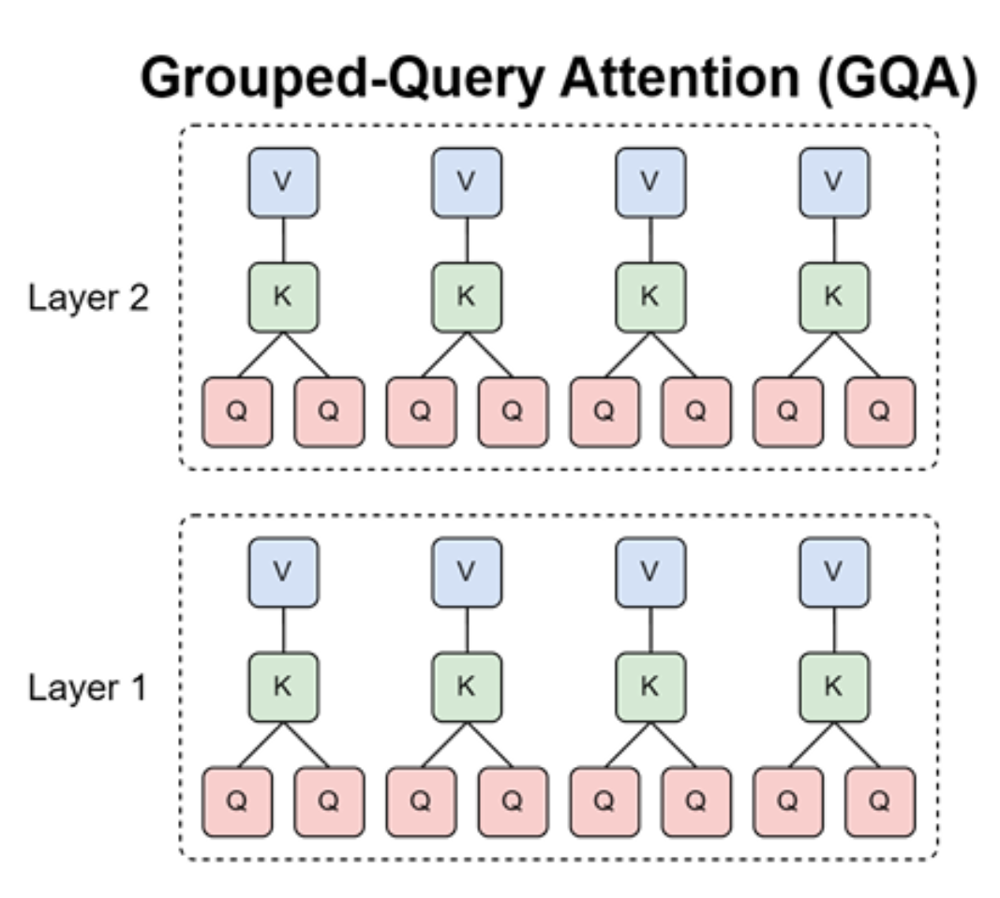{width="331"}
:::
:::::

**Key Insight:** Use 1 KV head for each group of query heads (e.g., 1 KV head for 8 query heads)

::: {style="font-size: 0.6em;"}
-   Balance between MHA (full expressivity) and MQA (maximum efficiency)
-   If 8 Query heads share 1 KV head

| Attention Type | Memory per Token |
|----------------|------------------|
| **MHA**        | 4 MB             |
| **MQA**        | 32 KB            |
| **GQA**        | 500 KB           |

**8× reduction compared to MHA, while preserving more expressivity than MQA**
:::

## Multi-head Latent Attention (MLA)

::::: columns
::: {.column width="50%"}
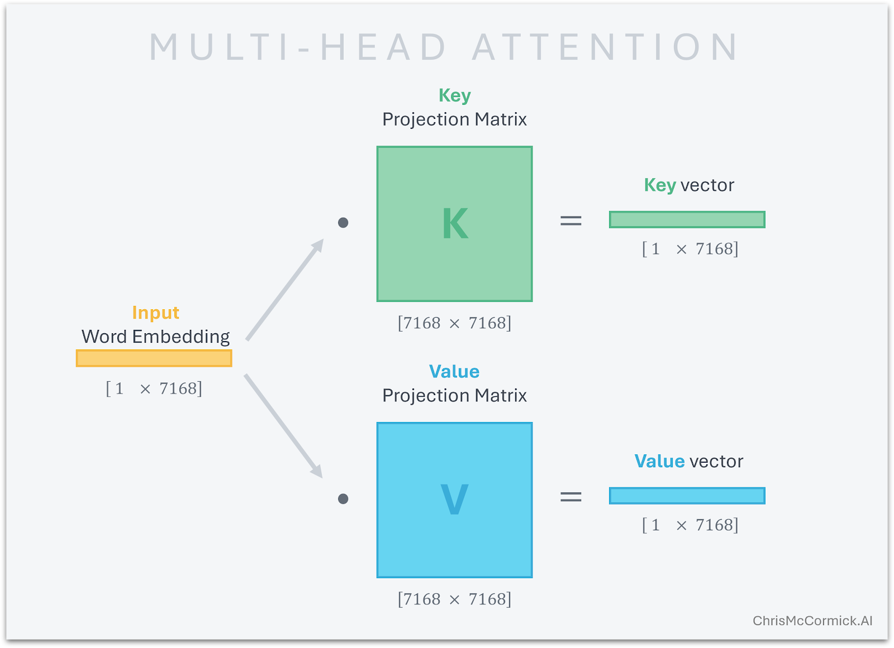{width="331"}
:::

::: {.column width="50%"}
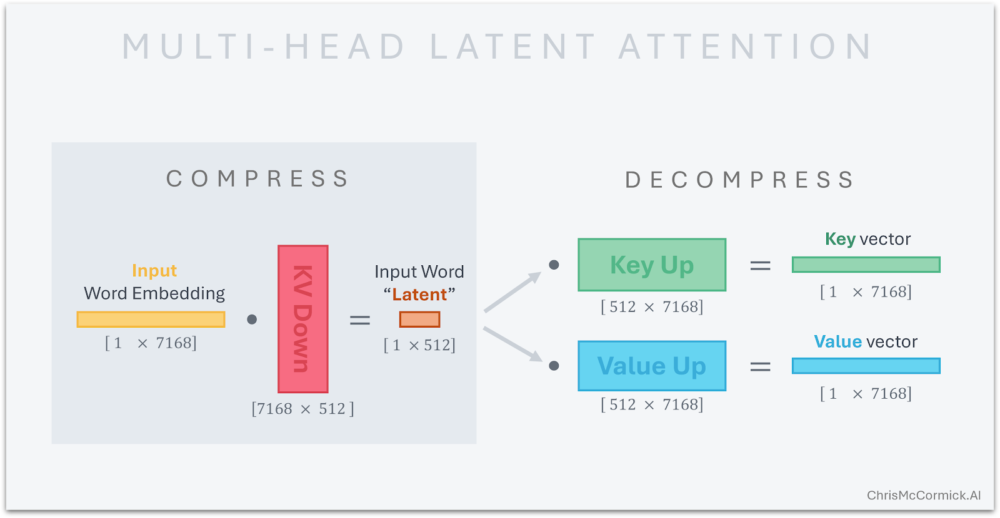{width="331"}
:::
:::::

**Key Insight:** Compress K and V into a low-dimensional **latent vector** before caching

::: {style="font-size: 0.6em;"}
-   Project hidden states into a compressed latent representation $c^{KV}$ (e.g., 512 dims)
-   Cache only the compressed latent, not full K and V
-   Reconstruct K and V from latent during attention computation
:::

## DeepSeek V3 MLA

:::::: columns
:::: {.column width="50%"}
**KV Cache size for MLA (DeepSeek V3):**

| Parameter                  | Value  |
|----------------------------|--------|
| KV compression dim ($d_c$) | 512    |
| RoPE dim ($d_r$)           | 64     |
| Sequence length            | 32,768 |

**Per-layer calculation:**

::: {style="font-size: 0.6em;"}
$$\text{MLA cache} = \text{seq_len} \times (d_c + d_r) \times 2$$

$$= 32768 \times (512 + 64) \times 2 = \textbf{37.7 MB per layer}$$

**Total for 61 layers:** \~ 2.3 GB (\~ 70 KB per token)

| Attention Type     | Memory per Token |
|--------------------|------------------|
| **MHA**            | 4 MB             |
| **MQA**            | 32 KB            |
| **GQA (8 groups)** | 500 KB           |
| **MLA**            | 70 KB            |
:::
::::

::: {.column width="50%"}
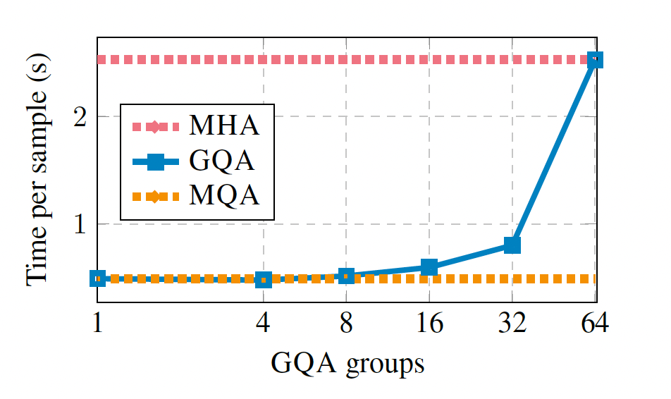{width="407"} 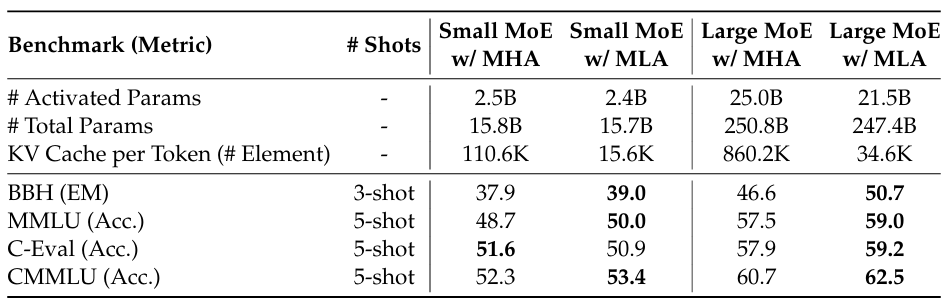{width="363" height="117"}
:::
::::::

**\~57× reduction compared to MHA, \~7× reduction compared to GQA**

## Total Inference Memory

```         
total_memory = model_weights + kv_cache + activations (small)
```

**LLaMA-2 7B, BF16, S=1024, B=1:**

$$13.4 \text{ GB} + 0.9 \text{ GB} \approx 14.3 \text{ GB}$$

==\> Fits on a single **RTX 4090** (24 GB) or **A100 40GB**

. . .

| Model        | Params | BF16 Size | KV Cache (S=4K, B=1) | GPUs Needed   |
|--------------|--------|-----------|----------------------|---------------|
| LLaMA-2 7B   | 6.7B   | 13.4 GB   | 2 GB                 | 1× A100 40GB  |
| LLaMA-2 13B  | 13B    | 26 GB     | 3.2 GB               | 1× A100 40GB  |
| LLaMA-2 70B  | 65B    | 130 GB    | 5 GB (GQA)           | 2× A100 80GB  |
| LLaMA-3 405B | 405B   | 810 GB    | \~30 GB              | 12× A100 80GB |

## Transformer FLOPs

:::: {style="font-size: 0.55em;"}

**Per-token FLOPs for a single decode step** (B=1, generating 1 token):

| Component (per layer)     | Formula                  | FLOPs          |
|---------------------------|--------------------------|----------------|
| QKV + O projections       | $8D^2$                   | 210M           |
| MLP (SwiGLU: gate+up+down)| $6DF$                   | 425M           |
| Attention (QK^T + attn·V) | $4SD$                    | depends on S   |
| **Per layer total**       | $8D^2 + 6DF + 4SD$      | **635M + 4SD** |

Over all layers + logit head:

$$\text{FLOPs}_{\text{decode}} = L(8D^2 + 6DF + 4SD) + 2DV$$

::::

. . .

:::: {style="font-size: 0.55em;"}

**LLaMA-2 13B** (L=40, D=5120, F=13824, V=32000):

| Term              | Value     |
|-------------------|-----------|
| $40 \times (8D^2 + 6DF)$ | 25.4 GFLOPs |
| Logit head $2DV$  | 0.3 GFLOPs |
| **Total (linear layers)** | **≈ 25.7 GFLOPs/token** |

::: callout-tip
**Rule of thumb:** Inference FLOPs/token $\approx 2P$ (2 × num_params). Here $2 \times 13\text{B} = 26\text{B}$ FLOPs $\approx$ 25.7 GFLOPs
:::
::::


## The Key Question

> **Is  GPU spending its time doing compute  or waiting for data?**

. . .

To answer this, we need to understand:

1.  **Arithmetic Intensity** - how much compute per byte of memory accessed
2.  **The Roofline Model** - what limits the GPU's performance
3.  **How prefill and decode differ** - why decode is memory bound

. . .

## Arithmetic Intensity

$$\text{Arithmetic Intensity} = \frac{\text{Compute FLOPs}}{\text{Memory Bytes}}$$

AI tells you whether the model is spending time *computing* (doing math) or *fetching* (moving data).

-   Low AI = GPU mostly waiting for data.
-   High AI = GPU mostly doing useful computation.

::: callout-tip
Intuition : "Imagine you're a cook. The fridge (HBM) is in the next room. Arithmetic intensity is how many dishes you can prepare per trip to the fridge.

-   If `AI=1`, you grab one ingredient, cook one dish, walk back. Terrible.
-   If `AI=100`, you grab one ingredient and cook 100 dishes. Great!"
:::

## Arithmetic Intensity

**Setup**: Matrix multiply in a linear layer : $Y = X \cdot W$

B : batch size, D : hidden dimension, F : feedforward dimension

::::: columns
::: {.column width="50%"}
$X$: B $\times$ D, $W$: D $\times$ F

*FLOPs =* $2 \cdot B \cdot D \cdot F$

Bytes transferred:

-   Read X: $B \cdot D \cdot 2$
-   Read W: $D \cdot F \cdot 2$
-   Write Y: $B \cdot F \cdot 2$

*Total Bytes =* $2(BD + DF + BF)$
:::

::: {.column width="50%"}
$$
\text{AI} = \frac{2 \cdot B \cdot D \cdot F}{2(BD + DF + BF)}
$$

$$
= \frac{B \cdot D \cdot F}{BD + DF + BF}
$$

If $B \ll D, F$:

$$
\text{AI} \approx \frac{B \cdot D \cdot F}{D \cdot F} = B
$$
:::
:::::

. . .

**Arithmetic intensity** $\approx$ batch size (when B is small relative to model dimensions)

## Arithmetic Intensity

Batch Size = 1 (single-stream decode)

$$
    \text{AI} = \frac{2 \cdot D \cdot F}{2 \cdot D \cdot F + 2 \cdot D + 2 \cdot F} \approx 1 \text{ FLOP/byte}
$$

. . .

::::: columns
::: {.column width="50%"}
You read the **entire** weight matrix ($D \times F$)...
:::

::: {.column width="50%"}
...but only do **one row's** worth of compute
:::
:::::

. . .

For A100 GPU (Capacity : 150-200 FLOPs/byte):

-   AI $\approx$ 1 $\ll$ 150-200
-   Peak-compute upper bound: **\< 1%** of peak FLOPs
-   The GPU is basically spending all its time waiting for data to arrive from memory, not doing math.

## The Roofline Model

:::::: columns
:::: {.column width="50%"}
Performance is bounded by:

1.  **Compute** : how fast GPU does math (FLOPs/s)
2.  **Bandwidth** : how fast data moves (GB/s)
3.  **Capacity** : whether weights + KV cache fit at all (GB)

::: {.callout-note style="font-size: 0.6em;"}
Knee point = bandwidth-bound to compute-bound transisiton -\> minimum AI needed to fully utilize GPU's compute.
:::
::::

::: {.column width="50%"}
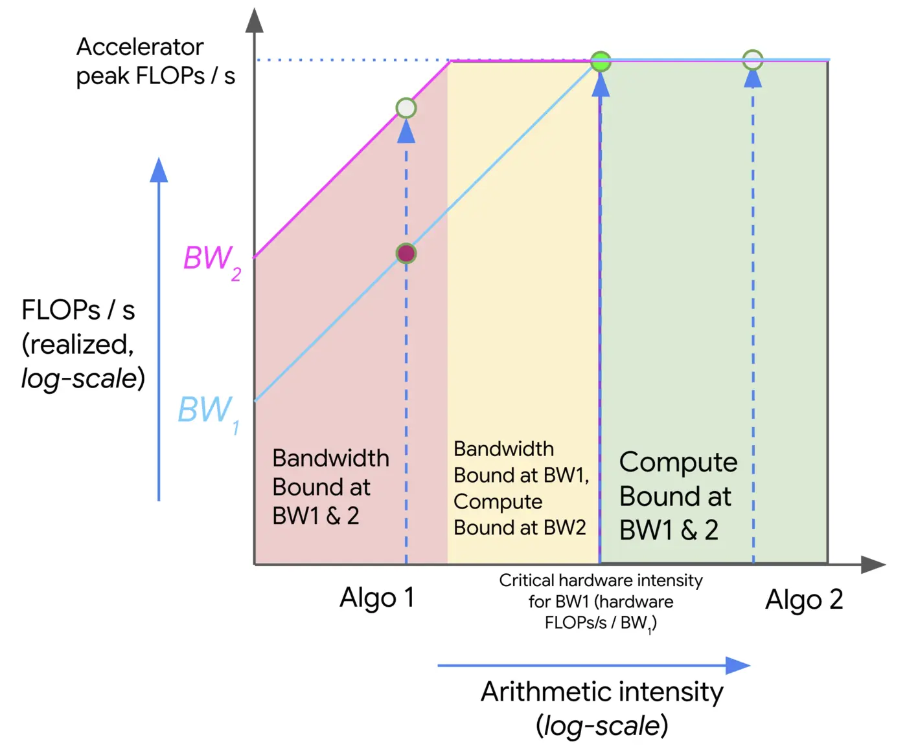

<p style="font-size: 0.4em; text-align: center;">
Figure: an example roofline plot showing two algorithms with different arithmetic intensities (Algo 1 and Algo 2) and their corresponding theoretical peak throughput under different bandwidths (BW1 and BW2). In the red area, an algorithm is bandwidth bound at both bandwidths and is wasting some fraction of the hardware's peak FLOPs/s. The yellow area is bandwidth-bound only at the lower bandwidth (BW1). The green area is compute-bound at all bandwidths.
</p>
:::
::::::

$$
\text{Performance} = \min(\text{Peak FLOPs}, \text{AI} \times \text{BW})
$$

## Roofline: A100 vs H100

::: {style="font-size: 0.6em;"}
| GPU            | Memory BW  | Peak FP16 (dense) | Knee Point       |
|----------------|------------|-------------------|------------------|
| RTX 4090 24 GB | 1,008 GB/s | 165 TFLOPs        | \~164 FLOPs/byte |
| A100 40GB PCIe | 1,555 GB/s | 312 TFLOPs        | \~200 FLOPs/byte |
| A100 80GB SXM  | 2,039 GB/s | 312 TFLOPs        | \~153 FLOPs/byte |
| H100 SXM 80GB  | 3,350 GB/s | 990 TFLOPs        | \~296 FLOPs/byte |
:::

. . .

::: callout-important
H100 has \~3x more FLOPs but only \~2x more bandwidth -\> knee point moves **right** -\> needs **even more batching** to saturate the H100.
:::

## Prefill vs Decode

::::: columns
::: {.column width="50%"}
### Prefill

-   Process **all** prompt tokens at once
-   T = S (hundreds/thousands)
-   **Parallelizable**
-   Compute-bound (high AI)
-   Fills the KV cache
-   Determines **TTFT**
:::

::: {.column width="50%"}
### Decode

-   Generate tokens **one at a time**
-   T = 1
-   **Sequential** (autoregressive)
-   Memory-bound (low AI)
-   Reads from & appends to KV cache
-   Determines **per-token latency** (ITL)
:::
:::::

::::: columns
::: {.column width="50%"}

:::

::: {.column width="50%"}

:::
:::::

## MLP Layer: Computing Arithmetic Intensity {.smaller}

$$Y = \left(\text{GeLU}(X \cdot W_{\text{up}}) \odot (X \cdot W_{\text{gate}})\right) \cdot W_{\text{down}}$$

::: {style="font-size: 0.75em;"}
| Step | Operation | FLOPs | Bytes |
|--------------|------------------------|--------------|---------------------|
| 1 | Read X (B×T×D) | — | $2 \cdot B \cdot T \cdot D$ |
| 2 | Read $W_{\text{up}}, W_{\text{gate}}, W_{\text{down}}$ | — | $3 \cdot 2 \cdot D \cdot F$ |
| 3 | $X \cdot W_{\text{up}}$ | $2BTDF$ | $2BTF$ |
| 4 | $X \cdot W_{\text{gate}}$ | $2BTDF$ | $2BTF$ |
| 5 | GeLU+element-wise+$W_{\text{down}}$ | $2BTDF$ | $2BTD$ |

**FLOPs** = $6 \cdot B \cdot T \cdot D \cdot F$

**Bytes** = $4BTD + 6DF + 4BTF$

$$\text{AI}_{\text{MLP}} = \frac{6BTDF}{4BTD + 6DF + 4BTF} \approx B \cdot T \quad \text{(when } BT \ll D, F\text{)}$$
:::

. . .

::: callout-important
Increase batch size (B) and sequence length (T) to increase AI and move from memory-bound to compute-bound regime for MLP layers.
:::

<!-- end columns -->

## MLP AI: Prefill vs Decode

::::: columns
::: {.column width="50%"}
### Prefill (T = S)

$$\text{AI}_{\text{MLP}} \approx B \cdot S$$

**Compute-bound**

-   S = 1024, B = 1 : AI ≈ **1024**
-   Well above knee point (\~200)
:::

::: {.column width="50%"}
### Decode (T = 1)

$$\text{AI}_{\text{MLP}} \approx B$$ 

**Memory-bound** (*BAD*)

-   B = 1 =\> AI ≈ **1**, B = 32 =\> AI ≈ **32**
-   Far below knee point
:::
:::::

. . .

::: callout-important
During decode, **ALL model weights** are read from HBM for every single output token, but only do one token's worth of matmuls. GPU utilization: **1-5%** of peak FLOPs.
:::

## Attention Layer: Arithmetic Intensity {.smaller}


| Step | Operation                       | FLOPs   | Bytes         |
|------|---------------------------------|---------|---------------|
| 1    | Read Q, K, V                    | —       | $2BTD + 4BSD$ |
| 2    | $A = Q \cdot K^T$               | $2BSTD$ | —             |
| 3    | $Y = \text{softmax}(A) \cdot V$ | $2BSTD$ | —             |
| 4    | Write Y                         | —       | $2BTD$        |

. . .

::::: columns
::: {.column width="50%"}
$$
\text{AI}_{\text{attn}} = \frac{4BSTD}{4BTD + 4BSD} = \frac{S \cdot T}{S + T}
$$
:::

::: {.column width="50%"}
**Prefill** (T = S):$$\text{AI} = \frac{S^2}{2S} = \frac{S}{2}$$ S=1024 => AI ≈ **512** 
:::
:::::

## Attention Layer: Arithmetic Intensity {.smaller}


| Step | Operation                       | FLOPs   | Bytes         |
|------|---------------------------------|---------|---------------|
| 1    | Read Q, K, V                    | —       | $2BTD + 4BSD$ |
| 2    | $A = Q \cdot K^T$               | $2BSTD$ | —             |
| 3    | $Y = \text{softmax}(A) \cdot V$ | $2BSTD$ | —             |
| 4    | Write Y                         | —       | $2BTD$        |


. . .

::::: columns
::: {.column width="50%"}
$$
\text{AI}_{\text{attn}} = \frac{4BSTD}{4BTD + 4BSD} = \frac{S \cdot T}{S + T}
$$

:::

::: {.column width="50%"}
**Decode** (T = 1): $$\text{AI} = \frac{S}{S+1} < 1$$ Always **\< 1** regardless of S!
:::
:::::


## Summary: Arithmetic Intensity 

::: {style="font-size: 0.75em;"}

| Stage | MLP AI | Attention AI | Regime |
|------------|--------|--------|---------|
| Prefill (S=1024, B=1) | \~1024 | \~512 | Compute-bound  |
| Prefill (S=4096, B=1) | \~4096 | \~2048 | Compute-bound  |
| Decode (T=1, B=1) | \~1 | \<1 | Memory-bound  |
| Decode (T=1, B=32) | \~32 | \<1 | MLP less bad, attn still memory-bound  |
| Decode (T=1, B=256) | \~256 | \<1 | MLP compute-bound, attn still bad  |

:::

. . .

-   **Prefill** is compute-limited; limited by GPU FLOPs
-   **Decode** is memory-limited ; limited by memory bandwidth
-   MLP intensity \~ $B \cdot T$, Attention intensity \~ $\frac{S \cdot T}{S + T}$

::: callout-important

To overcome this, large models are served in **Dis-aggregated** fashion. Prefill anbd Decode happens on separate chips or servers

:::

## Decode Throughput Estimate {.smaller}

**Decode throughput** $\approx$ memory bandwidth / model size

*(Short-context, single-GPU upper bound; long context adds KV overhead.)*

| GPU            | Bandwidth  | Latency/token       | Throughput      |
|----------------|------------|---------------------|-----------------|
| A100 80GB SXM  | 2,039 GB/s | 13.4/2039 ≈ 6.6 ms  | **\~152 tok/s** |
| A100 40GB PCIe | 1,555 GB/s | 13.4/1555 ≈ 8.6 ms  | **\~116 tok/s** |
| RTX 4090 24 GB | 1,008 GB/s | 13.4/1008 ≈ 13.3 ms | **\~75 tok/s**  |

. . .

**With INT4 quantization** (3.35 GB weights):

| GPU            | Latency/token      | Throughput      |
|----------------|--------------------|-----------------|
| RTX 4090 24 GB | 3.35/1008 ≈ 3.3 ms | **\~300 tok/s** |

4x smaller model → 4x faster decode!

**Faster compute doesn't help. Only faster memory or smaller models do.**


## Inference Metrics

**User-facing:** 

- TTFT  : Time to First Token - How long user waits for the first word to appear. Dominated by **prefill** time. 

- ITL : Inter-Token Latency - Streaming speed — how fast words appear after the first one (seconds/token).

**System-facing:** -

-   Throughput :  Total tokens the system can produce per second across all users (tokens/sec).

| Use Case          | TTFT | ITL | Throughput |
|-------------------|------|-----|-----|
| Chatbots          | ✓✓   | ✓✓✓ | ✓          |
| Agents            | ✓    | ✓✓  | ✓✓         |
| RLHF / Batch Jobs | —    | ✓   | ✓✓✓        |

TODO : Add example numbers

## Key Inference Optimizations

Most optimizations map to one of four strategies:

::: incremental
1.  **Read less data per token**
    -   Quantization (smaller weights), GQA/MLA (smaller KV cache), pruning
2.  **Do more useful work per data read**
    -   Batching (amortize weight reads), kernel fusion (fewer HBM round trips)
3.  **Generate more tokens per forward pass**
    -   Speculative decoding (verify N tokens in one pass instead of generating 1)
4.  **Schedule / place work better**

-   Continuous batching, prefix caching, prefill/decode disaggregation
:::

## The One Formula to Remember

$$
\text{Decode tokens/sec} \approx \frac{\text{Memory Bandwidth (GB/s)}}{\text{Model Size (GB)} + \text{KV Cache Overhead (GB)}}
$$

. . .

Three numbers determine decode performance:

1.  **Model size** in bytes (reduce with quantization)
2.  **KV cache size** (reduce with GQA, MLA, sliding window)
3.  **Memory bandwidth** of  GPU (more the better)


## References

-   [The Scaling Book - JAX team](https://jax-ml.github.io/scaling-book/)
-   [Transformer Inference Arithmetic](https://kipp.ly/transformer-inference-arithmetic/)
-   [GQA: Training Generalized Multi-Query Transformer Models from Multi-Head Checkpoints](https://arxiv.org/abs/2305.13245)
