## Motivation

<center>
<video autoplay muted loop width="100%" height="600">
  <source src="https://storage.googleapis.com/gweb-research2023-media/media/SpeculativeDecoding-0-AIO.mp4" type="video/mp4">
</video>
</center>


## The Memory Wall Problem

LLM inference is **memory-bound**, not compute-bound:


::: {.columns}
::: {.column}
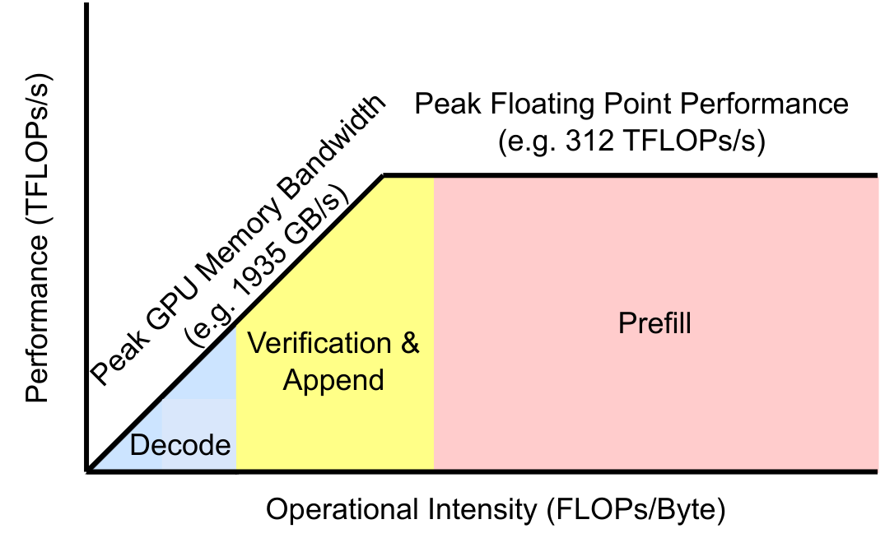
:::
::: {.column}
::: {.incremental}
- Each token requires full forward pass
- **KV-cache helps** avoid recomputation but still requires:
  - Reading all model parameters every step
  - Computing attention against growing KV-cache
  - Sampling one token... then repeating
:::
:::
:::
<!-- end columns -->


::: {.fragment .callout-tip}
## Key Observation
Many tokens are "easy" to predict (e.g., common words, code boilerplate, repetitive patterns). Verification of K candidate tokens costs approximately the same as generating 1 token!
:::

---

## The CPU Analogy: Speculative Execution

From CPU Architecture to LLMs:

::: {.columns}
::: {.column width="50%"}
 CPU Branch Prediction
- CPU guesses which branch will be taken
- Executes speculatively, rolls back if wrong
- Massive performance wins despite some wasted work
:::

::: {.column width="50%"}

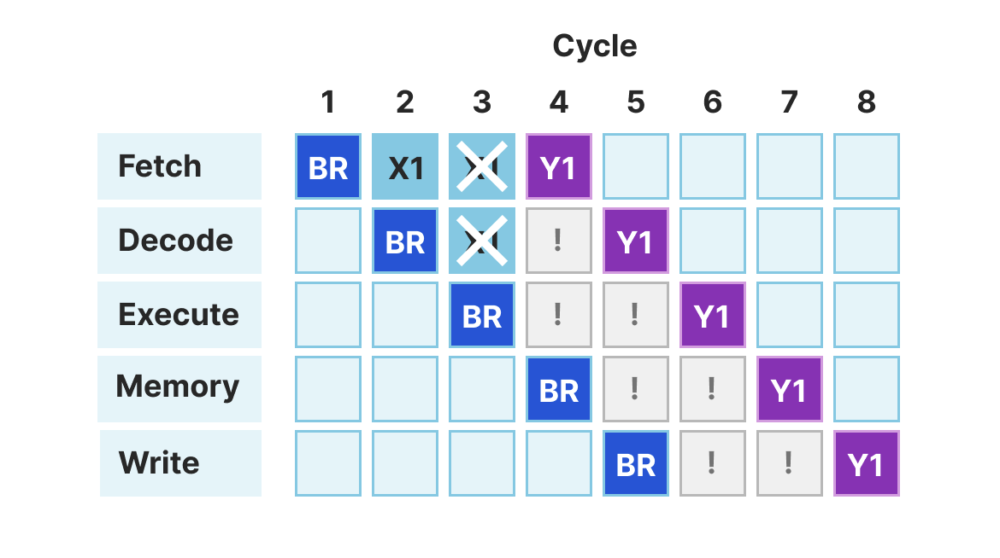
:::
:::


## LLM Speculative Decoding

- Small/fast **draft model** guesses next K tokens
- Large model **verifies** all K in parallel (one forward pass!)
- Accept correct prefix, resample from divergence point
- **Lossless**: Sample from the exact same distribution!

<center>
<video autoplay muted loop width="100%" height="600">
  <source src="https://storage.googleapis.com/gweb-research2023-media/media/SpeculativeDecoding-1-Illustration.mp4" type="video/mp4">
</video>
</center>


## LLM Speculative Decoding


. . . 

::: {.callout-note}
## Critical Insight
Scoring K tokens in parallel ≈ same latency as generating 1 token because:

- Memory bandwidth is the bottleneck
- GPU compute is underutilized in single-token generation
- Parallel verification exploits available FLOPs
:::

---


## The Universal Framework


### Draft -> Verify -> Accept/Reject

::: {.incremental}
1. **Draft**: Generate K candidate tokens cheaply via a draft mechanism
   - Methods differ in HOW they draft (separate model, heads, n-grams)

2. **Verify**: Run target model on all candidates in parallel
   - Get true probabilities for each position
   - Single forward pass for all K tokens

3. **Accept/Reject**: Use rejection sampling to maintain target distribution
   - Accept prefix of correct tokens
   - Resample at first rejection point using modified rejection sampling
:::

::: {.fragment}

$$\text{Speedup} = \frac{K \cdot \alpha}{1 + \frac{T_{\text{draft}}}{T_{\text{verify}}}}$$

Where $\alpha$ is the acceptance rate and $K$ is the draft length.
:::

---

## The Foundation (2022-2023)

Two concurrent Google papers established the field:


[Fast Inference from Transformers via Speculative Decoding](https://arxiv.org/abs/2211.17192) (Leviathan et al., 2022)

[Accelerating Large Language Model Decoding with Speculative Sampling](https://arxiv.org/abs/2302.01318) (Chen et al., 2023)

::: {.columns}
::: {.column}
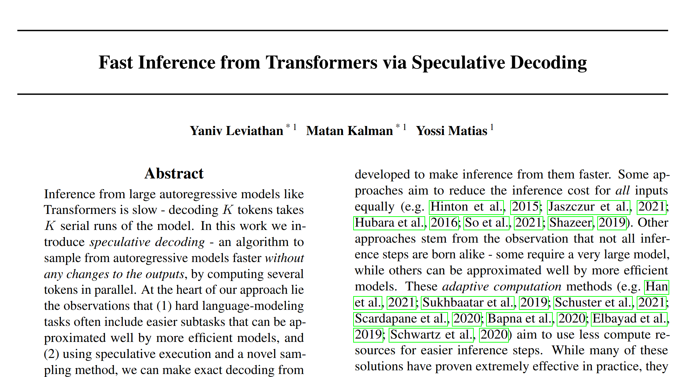
:::
::: {.column}
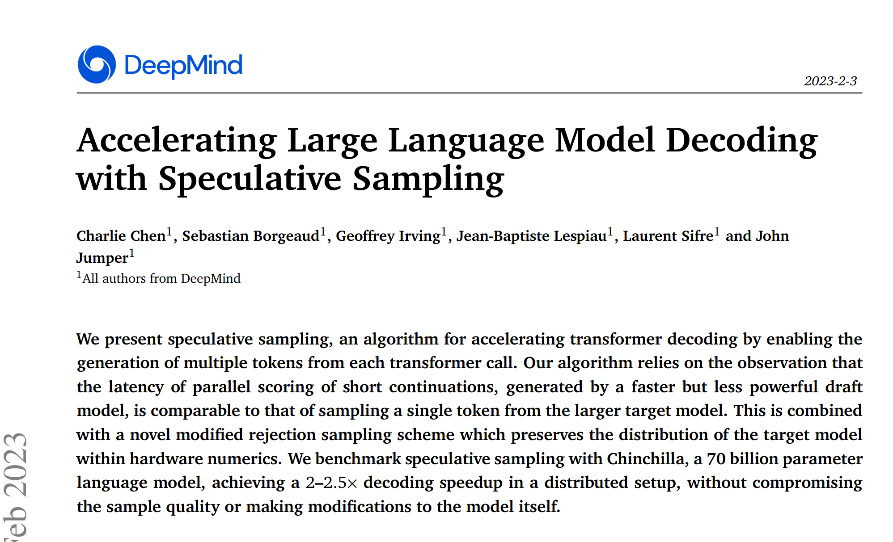
:::
:::
<!-- end columns -->

## Algorithm: Auto-regressive Sampling (ArS)


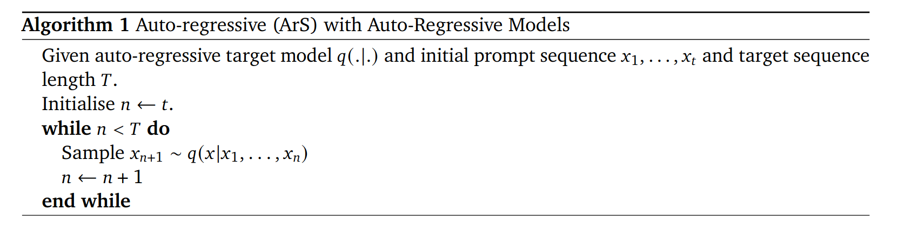

::: {.fragment}
**One token per forward pass. This is what we want to speed up.**
:::


## Algorithm: Speculative Sampling (SpS) 

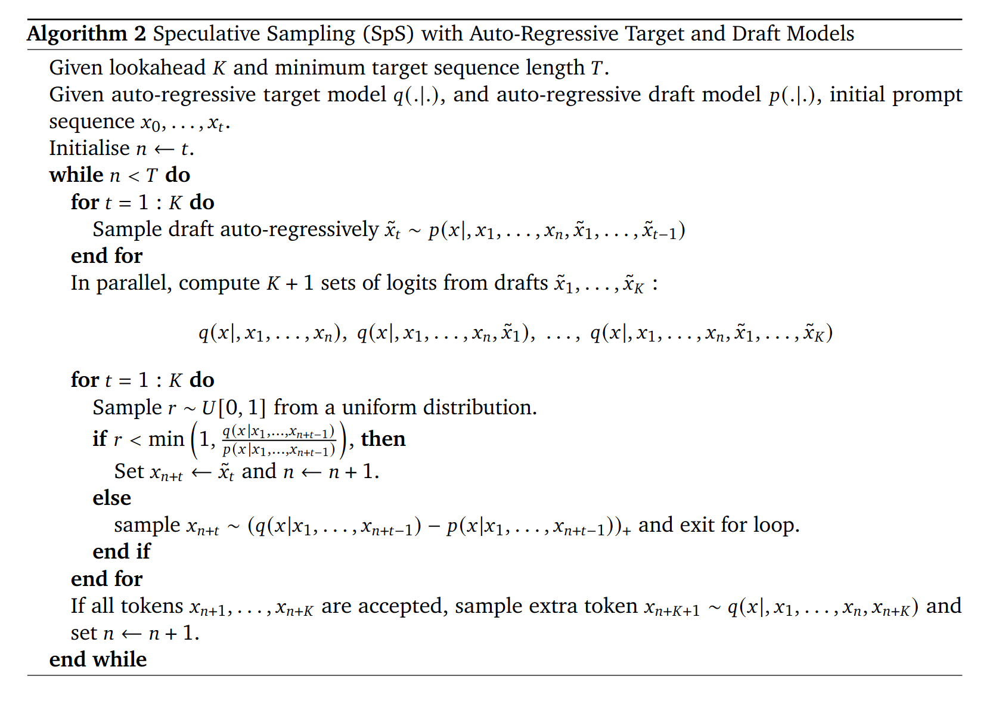

## Modified Rejection Sampling

Guarantees **lossless** sampling from target distribution:

::: {.columns}
::: {.column width="50%"}
**Case 1: Target prob >= Draft prob**
$$p_{\text{target}}(x) \geq p_{\text{draft}}(x)$$

 **Always accept** (target "likes" this token at least as much)
:::

::: {.column width="50%"}

**Case 2: Target prob < Draft prob**

$$p_{\text{target}}(x) < p_{\text{draft}}(x)$$

**Reject with probability** $\frac{p_{\text{draft}}(x) - p_{\text{target}}(x)}{p_{\text{draft}}(x)}$

If rejected, resample from the residual distribution.
:::
:::

. . .

::: {.callout-important}
## Theorem (Chen et al., 2023)
Modified rejection sampling guarantees that the final output distribution is **identical** to sampling from the target model alone. This is not an approximation—it's exact!
:::


## Modified Rejection Sampling: Illustrated

**Example**: Draft model proposes token "the" at position $t+1$

::: {.columns}
::: {.column width="45%"}

| Token | $p_{\text{draft}}$ | $p_{\text{target}}$ |
|-------|:---:|:---:|
| **the** | 0.50 | 0.30 |
| **a** | 0.20 | 0.35 |
| **this** | 0.15 | 0.25 |
| **an** | 0.10 | 0.05 |
| **that** | 0.05 | 0.05 |


::: {.fragment fragment-index=4}
::: {.callout-tip}
## Intuition
The residual distribution captures what the target model "wanted more of" than the draft. Tokens the draft **overestimated** (like "the") get zero residual probability. Tokens the target **preferred more** (like "a", "this") get the leftover mass — ensuring the combined process exactly matches the target distribution.
:::
:::

:::
::: {.column width="55%"}

::: {font-size="0.6em"}

::: {.fragment fragment-index=1}
**Step 1**: Draft sampled **"the"** ($p_d = 0.50$, $p_t = 0.30$)

$p_t < p_d$ → accept with prob $\frac{p_t}{p_d} = \frac{0.30}{0.50} = 0.60$
:::

::: {.fragment fragment-index=2}
**Step 2**: Coin flip says **reject!** → resample from residual
:::

::: {.fragment fragment-index=3}
**Step 3**: Compute residual $p'(x) = \text{norm}(\max(0,\; p_t - p_d))$

| Token | $p_t - p_d$ | $p'$ (residual) |
|-------|:---:|:---:|
| the | -0.20 → 0 | 0.00 |
| **a** | +0.15 | **0.43** |
| **this** | +0.10 | **0.29** |
| an | -0.05 → 0 | 0.00 |
| that | 0.00 → 0 | 0.00 |

Resample → picks **"a"** 
:::
:::
:::
:::


## Draft Model Options (Chen et al.)

- Smaller models, same family 
    - Easy to obtain, similar distribution,  Different serving topology needed
- Distilled model 
    - Optimized for speculation, Training cost is high
- N-gram 
    - Zero overhead, no training, Limited to simple patterns

---

## Results

::: {.columns}
::: {.column}
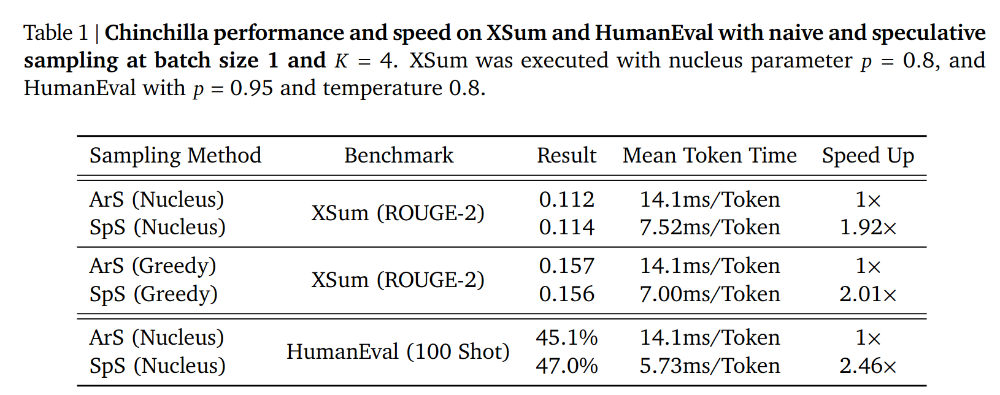

:::
::: {.column}
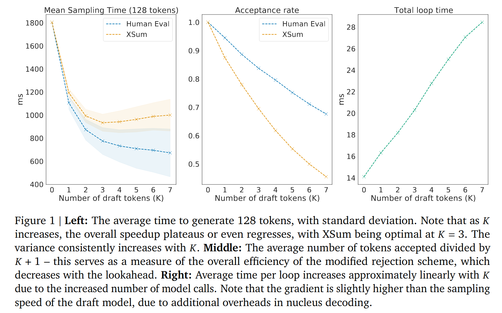
:::
:::
<!-- end columns -->


- **Setup**: 4B parameter draft model optimized for 16 TPU topology (matching 70B Chinchilla)
- **Performance**: 1.8ms/token vs 14.1ms/token for target (7.8x theoretical)
- **Real-world**: ~2-3x speedup depending on domain
- **Temperature effect**: Higher temperature → lower acceptance rate
    - Greedy decoding (temp=0) gives highest speedup


## Limitations

::: {.incremental}

- Draft Model Acquisition:
    - Need a separate, well-aligned draft model
    - Training cost can be significant 
    - Distribution shift between draft and target
- Serving Complexity
    - Two models to serve and maintain
    - Different optimal topologies for different model sizes
    - Memory overhead of second model
- Single Candidate
    - Only one draft sequence per iteration
    - Suboptimal use of parallel verification capacity
- Fixed Draft Length:
    - γ is static, but difficulty varies by context
    - Easy tokens waste draft capacity
    - Hard tokens might need more speculation
:::

## Medusa: No Separate Draft Model! 

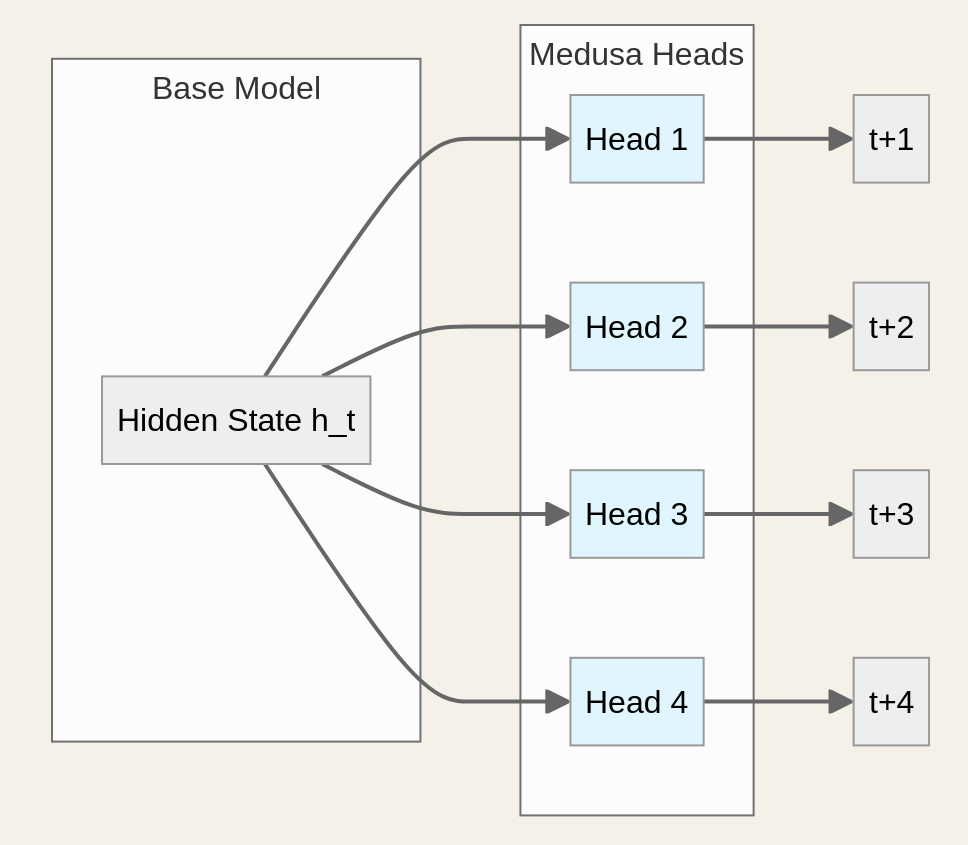

## Medusa Architecture (Cai et al., 2024)

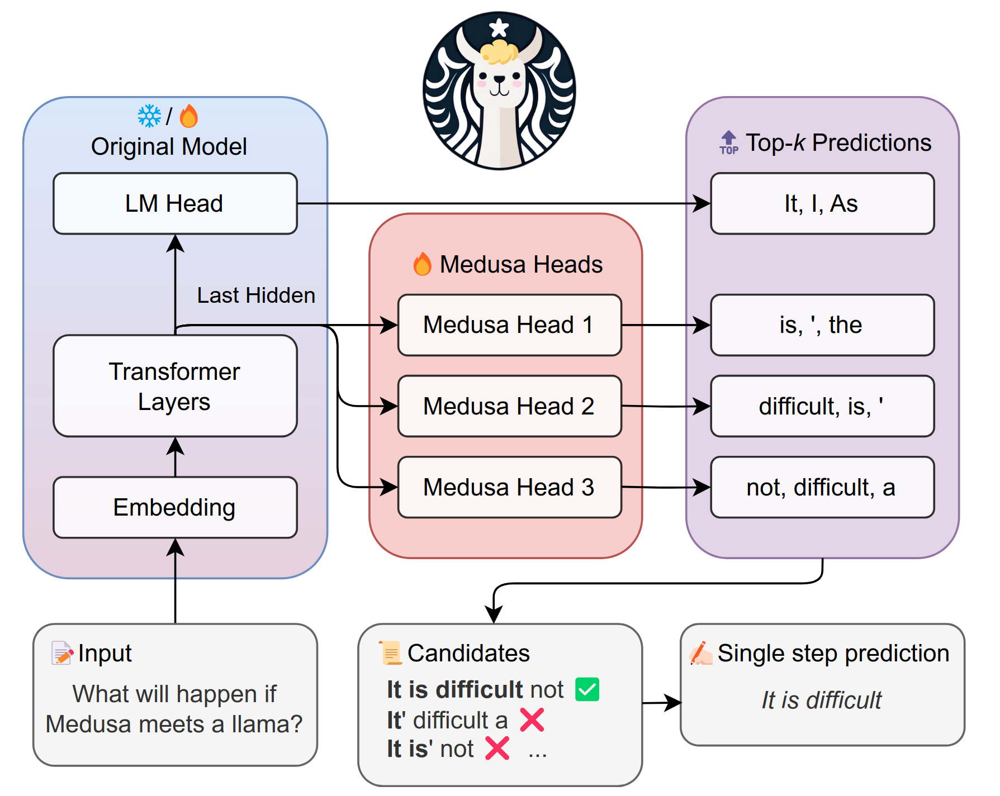

::: {.incremental}
- **Idea**: Add K small "Medusa heads" on top of target model's last hidden states
- **Head k**: Predicts token at position t+k+1
- **Parameters**: ~0.5% additional parameters per head
- **Training**: Freeze backbone, train heads with cross-entropy loss
:::

---

## Medusa: Tree Attention Verification

::: {.columns}
::: {.column}
1. Each head generates multiple top predictions:
   - Head 1: {a₁, a₂, ..., aₖ}
   - Head 2: {b₁, b₂, ..., bₖ}
   - Head 3: {c₁, c₂, ..., bₖ}

2. Construct sparse tree of candidate continuations

3. Custom attention mask: each token only attends to ancestors in tree

4. Use appropriate positional encoding for tree structure
:::
::: {.column}
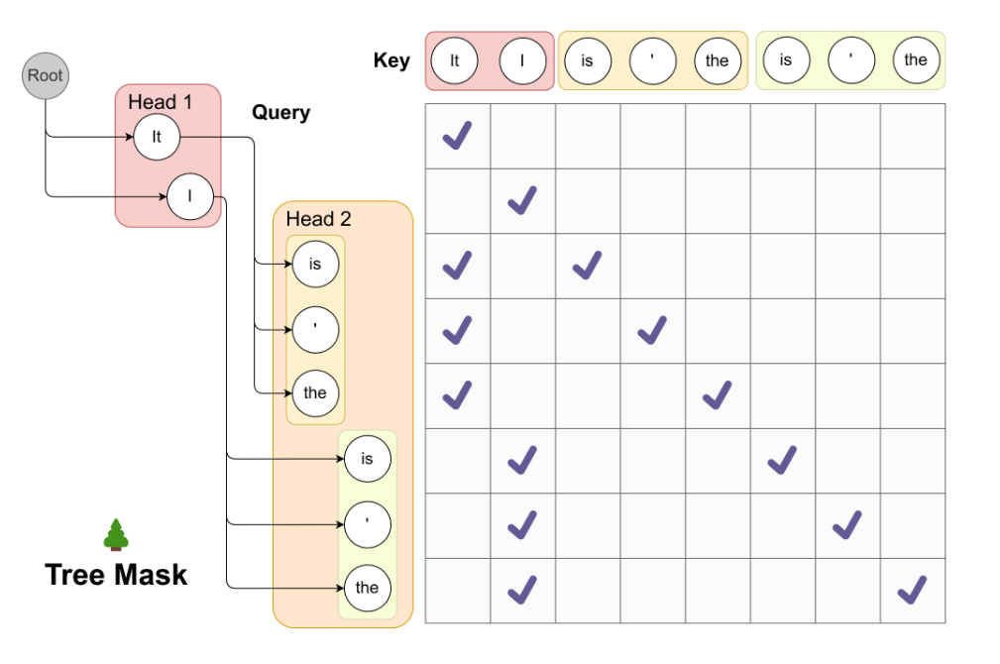
:::
:::
<!-- end columns -->

## Medusa: Tree Attention Verification

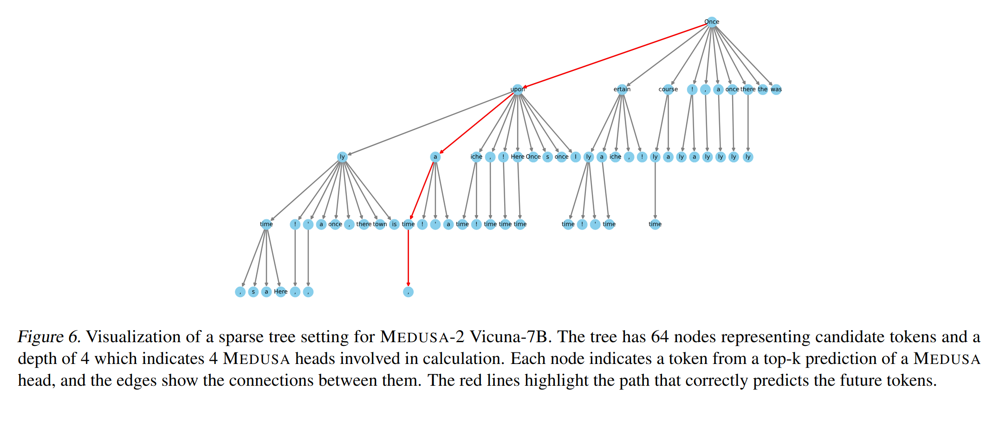

## Medusa Training : MEDUSA-1: Frozen Backbone


::: {.columns}
::: {.column font-size="0.6em"}
- **Cross-entropy loss** between MEDUSA head predictions and ground truth tokens
- For ground truth token $y_{t+k+1}$ at position $t + k + 1$:
  - Loss for k-th head: $L_k = -\log p_t^{(k)}(y_{t+k+1})$
  - $p_t^{(k)}(y)$ = probability of token y predicted by k-th head

  - Add weight $\lambda_k$ to balance loss across different heads

- **Total MEDUSA loss**:
$$L_{MEDUSA-1} = \sum_{k=1}^{K} -\lambda_k \log p_t^{(k)}(y_{t+k+1})$$
:::
::: {.column}
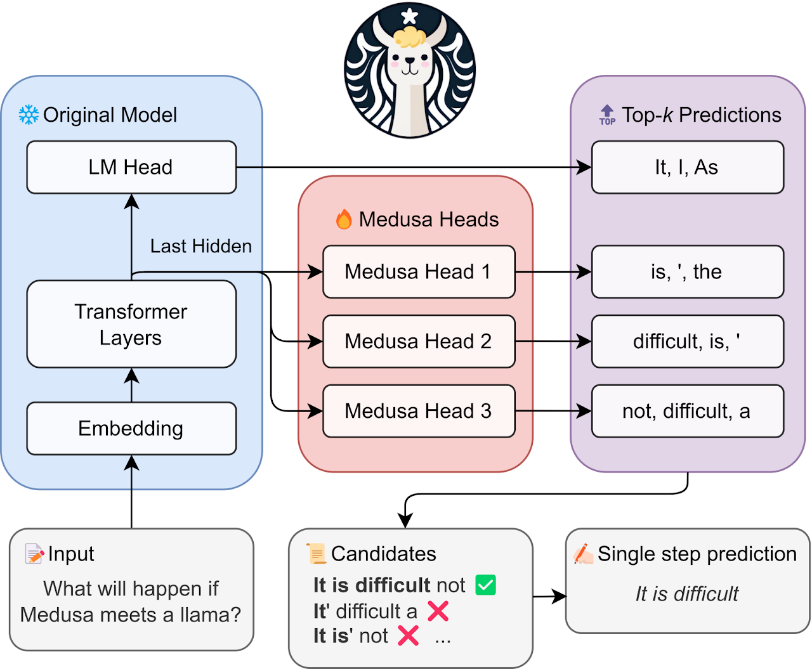
:::
:::
<!-- end columns -->


## Medusa Training : MEDUSA-2 : Joint Training

::: {.columns}
::: {.column width="60%"}
**Objective**: Maintain base model capability while training heads.

- **Combined Loss**: Add the backbone model's cross-entropy loss to the MEDUSA loss.
- **Backbone Loss**: 
  $$L_{\text{LLM}} = -\log p_t^{(0)}(y_{t+1})$$
- **Balance**: Use weight $\lambda_0$ to balance the base model and Medusa heads.

**Total MEDUSA-2 Loss**:
$$L_{\text{MEDUSA-2}} = L_{\text{LLM}} + \lambda_0 L_{\text{MEDUSA-1}}$$
:::

::: {.column width="40%"}

:::
:::


## Medusa: Results 

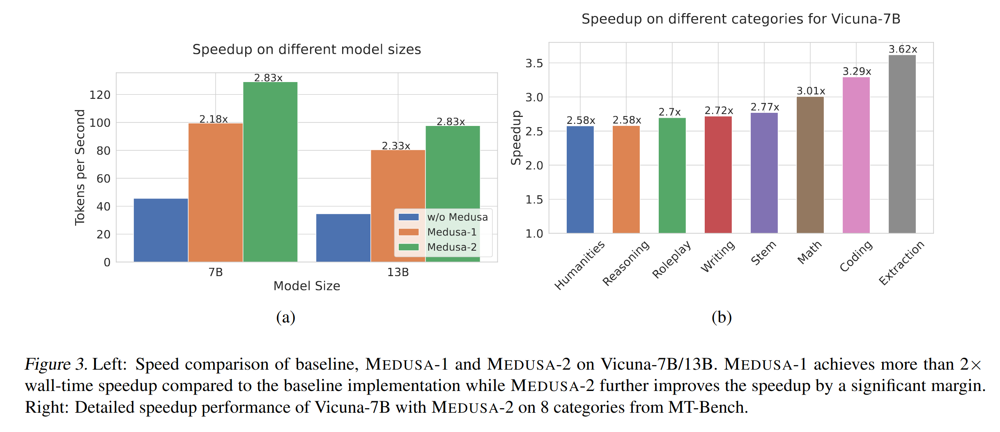

::: {.columns}
::: {.column width="50%"}
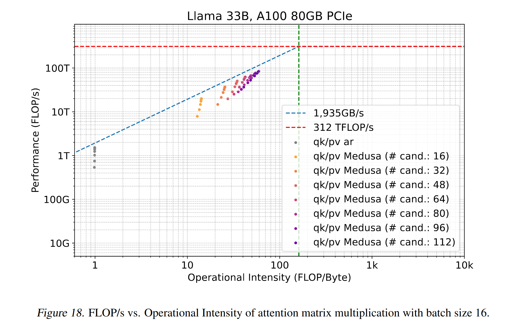
:::

::: {.column width="50%"}
**Results**
- **Speedup**: ~2-3× on average
- **Arithmetic Intensioty** : 41× operational intensity gain
:::

:::

## Medusa: Limitations

**Key Limitations**
1. **Position-Independent Prediction**: Head 2 doesn't know what Head 1 predicted
2. **Limited Information**: Only sees top-layer features
3. **No dependencies**: Can't model dependencies between draft tokens
4. **Speedup plateaus**: ~3× even with more heads

::: {.fragment .callout-warning}
## The Core Problem
Medusa heads predict position i+k independently of positions i+1, i+2, ..., i+k-1. Lower acceptance rates for later positions in the draft.
:::

---

##  EAGLE Series: Feature-Level Autoregression

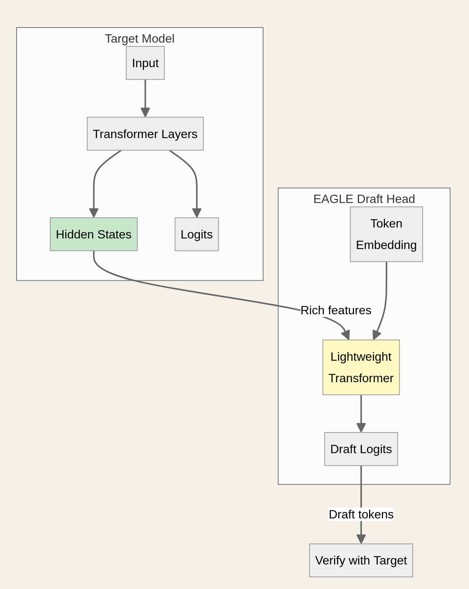

## EAGLE : Core Innovation

**Key Insight**: Autoregression at the **feature level** is simpler than at the token level.

::: {.incremental}
- Features contain richer information than just next-token logits
- predict next feature vector f_{n+1} instead of token t_{n+1}

:::

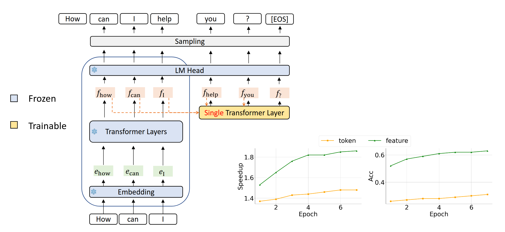

---

## EAGLE : Feature Uncertainty


::: {.columns}
::: {.column .fragment}

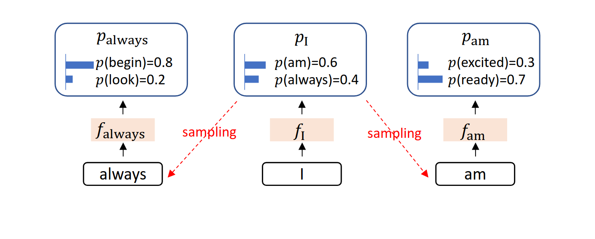

:::
::: {.column .fragment}
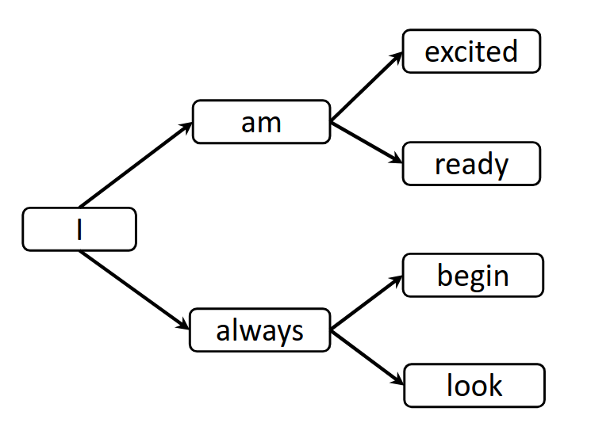
:::
:::
<!-- end columns -->

::: {.columns}
::: {.column .fragment}
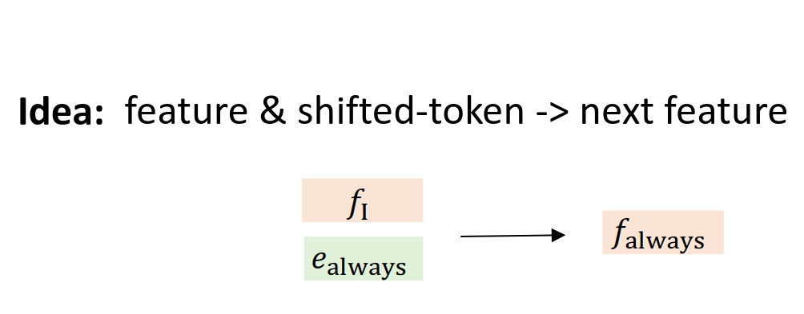


:::
::: {.column .fragment}
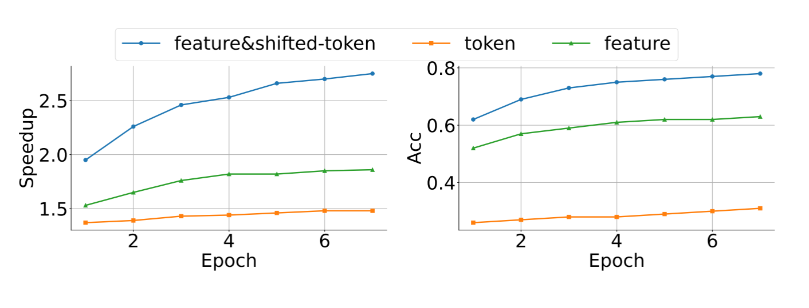
:::
:::
<!-- end columns -->

## EAGLE : Architecture

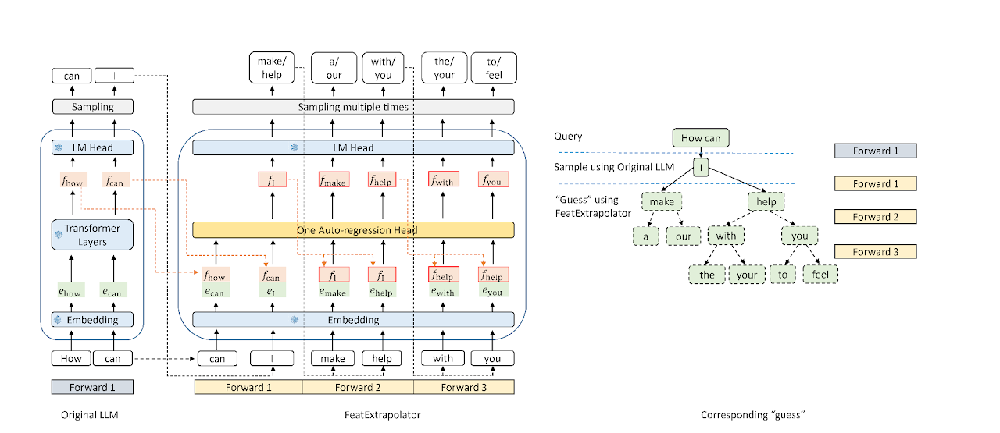


- Draft model predicts next feature vector f_{n+1} based on embedding of current token and previous features
- Use predicted feature to compute token probabilities for next token
- Tree structure allows multiple candidates to be verified in parallel


## EAGLE-1: Training


 **Training Loss**
$$L = L_{\text{fea}} + L_{\text{token}}$$

- **L_fea**: Regression loss for feature prediction
- **L_token**: Classification loss for token prediction

## Eagle-1 :  Verification
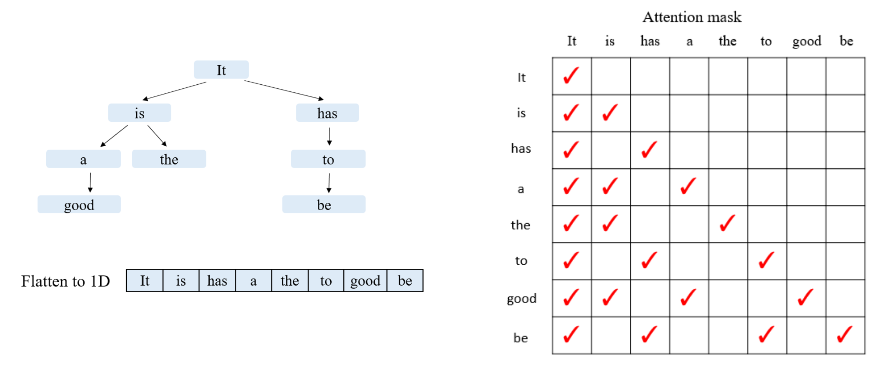

**Multi-Round Speculative Sampling**
For tree-structured drafts:

1. Try candidate 1 with original p
2. If rejected -> residual p₁ = norm(max(0, p - p̂₁))
3. Try candidate 2 against p₁ (not original p!)
4. Continue until acceptance or exhaustion

Maintains invariant: sampling from "remaining" probability mass.

---

## EAGLE-1: Results

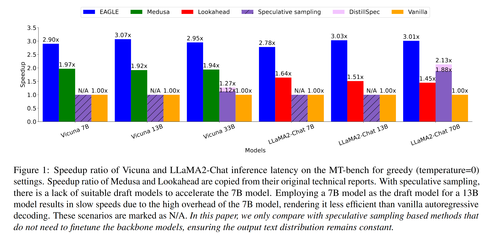

- Speedup: ~3× 
- Average acceptance length τ: 3-4 tokens
- Lossless: Provably maintains target distribution

## EAGLE-2: Context-Aware Speculation (2024)

**Problem**: Static tree structure wastes resources on "easy" vs "hard" tokens.

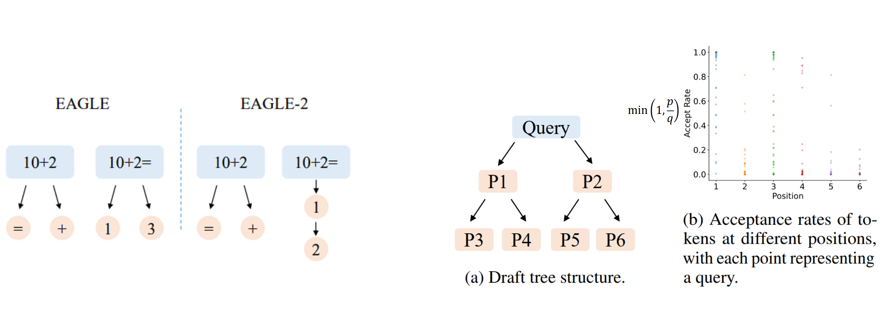

::: {.incremental}
- Acceptance rate is **context-dependent**, not just position-dependent
- "10+2" : next token uncertain (=, +, etc.)
- "10+2=" : next token almost certain ("1")

:::

::: {.fragment}
**Solution**: Dynamic tree construction using draft model confidence

- High confidence -> expand tree deeper
- Low confidence -> prune, keep tree shallow

:::

## EAGLE-2: Context-aware dynamic draft tree

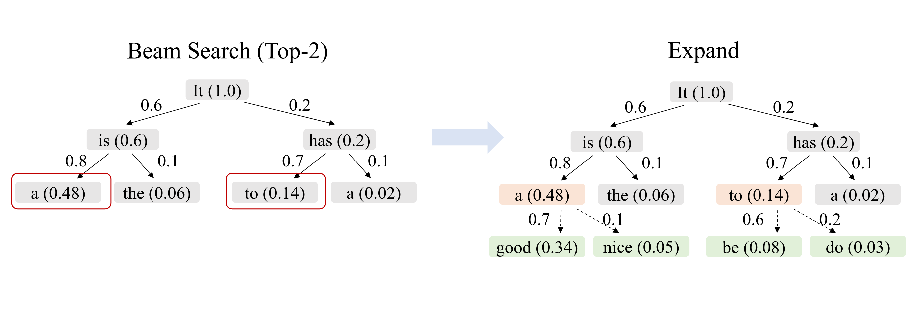


## EAGLE-2: Context-aware dynamic draft tree

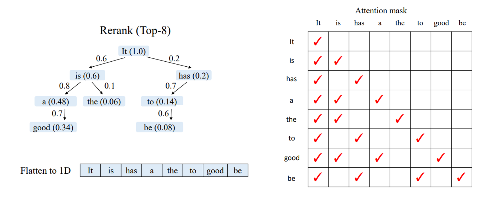


---

## EAGLE-2: Results

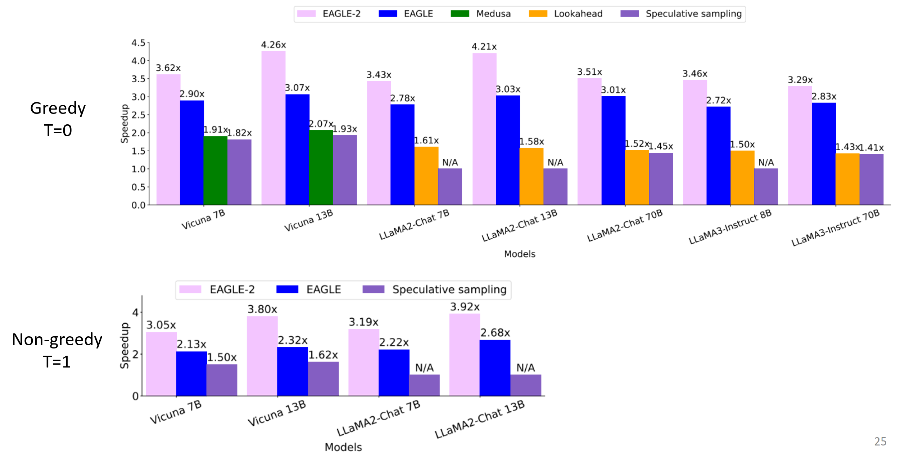

::: {.callout-important}
**Performance**

- **20-40% faster than EAGLE-1**
- No additional training required (completely lossless)
- Context-aware: Easy contexts (code boilerplate) get deeper trees
- Hard contexts (creative writing) get shallower, wider trees
:::


---

## Inference Framework Support

| Framework | Methods Supported |
|-----------|-------------------|
| **vLLM** | EAGLE-2, EAGLE-3, Medusa, N-gram, Suffix Decoding |
| **SGLang** | EAGLE-3, MTP (DeepSeek), Standalone, N-gram |
| **TensorRT-LLM** | Draft-target, EAGLE-3, MTP, User-provided |
| **Hugging Face Transformers** | Universal Assisted Generation (UAG), Dynamic Speculation |
| **llama.cpp** | Universal Assisted Decoding, Speculative stats |


## Demo 1: Hugging Face Transformers

::: {.callout-note}
## Setup
Using `assistant_model` parameter for automatic speculative decoding.
:::

```python
from transformers import AutoModelForCausalLM, AutoTokenizer
import torch
import time

# Target model (large)
model_name = "unsloth/Meta-Llama-3.1-8B-Instruct-bnb-4bit"
assistant_name = "double7/vicuna-68m"  # Tiny assistant

tokenizer = AutoTokenizer.from_pretrained(model_name)
model = AutoModelForCausalLM.from_pretrained(
    model_name, 
    torch_dtype=torch.bfloat16,
    device_map="auto"
)
assistant = AutoModelForCausalLM.from_pretrained(
    assistant_name,
    torch_dtype=torch.bfloat16,
    device_map="auto"
)

prompt = "Explain quantum computing in simple terms:"
inputs = tokenizer(prompt, return_tensors="pt").to(model.device)

# Baseline
start = time.time()
outputs = model.generate(**inputs, max_new_tokens=100)
baseline_time = time.time() - start
print(f"Baseline: {baseline_time:.2f}s")

# With speculative decoding
start = time.time()
outputs = model.generate(
    **inputs, 
    assistant_model=assistant,
    max_new_tokens=100
)
spec_time = time.time() - start
print(f"Speculative: {spec_time:.2f}s")
print(f"Speedup: {baseline_time/spec_time:.2f}x")
```

---

## Demo 2: vLLM with EAGLE-3


## When to Use Speculative Decoding?

::: {.columns}
::: {.column width="50%"}
 ✅ Best For
- **Low batch sizes (1-16)**: Memory-bound regime
- **Interactive applications**: Chatbots, coding assistants
- **Repetitive content**: Code generation, structured outputs
- **Latency-sensitive**: Real-time applications
- **Greedy decoding**: Highest acceptance rates
:::

::: {.column width="50%"}
 ❌ Avoid When
- **High batch sizes (32+)**: Compute-bound, benefits diminish
- **Very high temperature**: Acceptance rate drops
- **Creative writing**: Unpredictable tokens, low acceptance
- **Memory constrained**: Draft model adds overhead
:::
:::

::: {.callout-tip}
## Rule of Thumb
If your GPU utilization is <50% during decoding, speculative decoding will likely help. Check with `nvidia-smi` or profiling tools.
:::

---

## Temperature vs Acceptance Rate

| Temperature | Acceptance Rate | Speedup |
|-------------|-----------------|---------|
| 0.0 (Greedy) | 85-95% | 4-6× |
| 0.5 | 70-80% | 3-4× |
| 0.7 | 60-70% | 2.5-3× |
| 1.0 | 50-60% | 2-2.5× |
| >1.0 | <50% | 1.5-2× |

::: {.fragment}
 Dynamic Adjustment
Modern frameworks (vLLM, SGLang) automatically adjust draft length based on observed acceptance rates.
:::

---

## Integration with Other Optimizations

::: {.incremental}
Speculative decoding is **orthogonal** to other techniques:

- **Quantization**: Can quantize both draft and target (e.g., FP8, INT8)
- **FlashAttention**: Works seamlessly with tree attention
- **Continuous Batching**: Needs careful KV cache management for rejected branches
- **Prefix Caching**: Draft tokens can use cached prefixes
- **Disaggregated Serving**: EAGLE-3 works with prefill-decode disaggregation
:::

::: {.callout-warning}
## KV Cache Management
Naive approach: Discard all draft entries, recompute for accepted ones.

**Better**: Selective retention (EAGLE's approach)
- Keep KV for accepted path only
- Discard KV for rejected branches
- Track cache positions corresponding to tree nodes
:::


## Key Takeaways

::: {.incremental}
1. **Speculative decoding is lossless**: Exact same distribution as target model

2. **Speedup comes from parallel verification**: K tokens verified in ~same time as 1 generated

3. **Evolution**: 
   - Original: Separate draft models
   - Medusa: Added heads (position-independent)
   - EAGLE: Feature-level autoregression
   - EAGLE-3: Training-time test + multi-layer fusion

4. **Production ready**: vLLM, SGLang, TensorRT-LLM, Transformers all have native support

5. **Best for**: Low batch sizes, repetitive content, latency-sensitive applications
:::

---

## Performance Cheat Sheet

| Method | Max Speedup | Overhead | Training Required | Framework Support |
|--------|-------------|----------|-------------------|-------------------|
| Original (draft model) | 2-3× | Full draft model | Yes (separate model) | All |
| Medusa | ~2-3× | ~0.5% params | Yes (heads only) | vLLM, SGLang, MLC |
| EAGLE-1 | ~3× | ~2% params | Yes (feature head) | vLLM, SGLang, MLC |
| EAGLE-2 | ~4× | ~2% params | No (same as EAGLE-1) | vLLM, SGLang |
| EAGLE-3 | 3-6.5× | ~3% params | Yes (advanced) | vLLM, SGLang, TensorRT |
| DeepSeek MTP | ~1.8× | Built-in | Pre-trained | SGLang, TensorRT |

---

## Essential Papers

::: {.incremental}
1. **Leviathan et al.** (2022) - "Fast Inference from Transformers via Speculative Decoding" [arXiv:2211.17192]
2. **Chen et al.** (2023) - "Accelerating Large Language Model Decoding with Speculative Sampling" [arXiv:2302.01318]
3. **Cai et al.** (2024) - "Medusa: Simple LLM Inference Acceleration Framework" [arXiv:2401.10774]
4. **Li et al.** (2024) - "EAGLE: Speculative Sampling..." [arXiv:2401.15077]
5. **Li et al.** (2025) - "EAGLE-3: Scaling up Inference Acceleration via Training-Time Test" [arXiv:2503.01840]
6. **Xia et al.** (2024) - "Unlocking Efficiency: A Comprehensive Survey of Speculative Decoding" [arXiv:2401.07851]
:::

---

## Questions?
